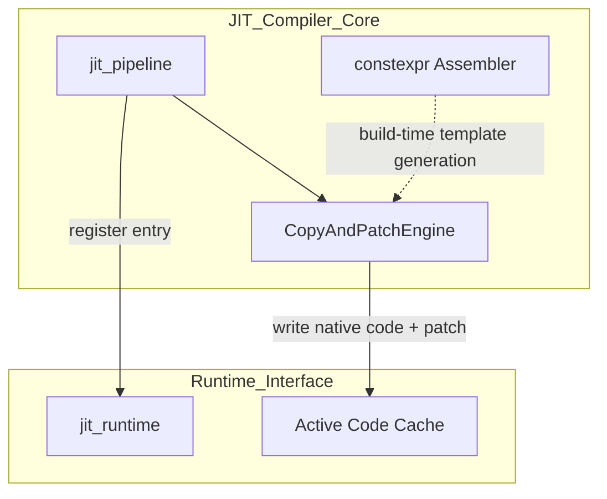
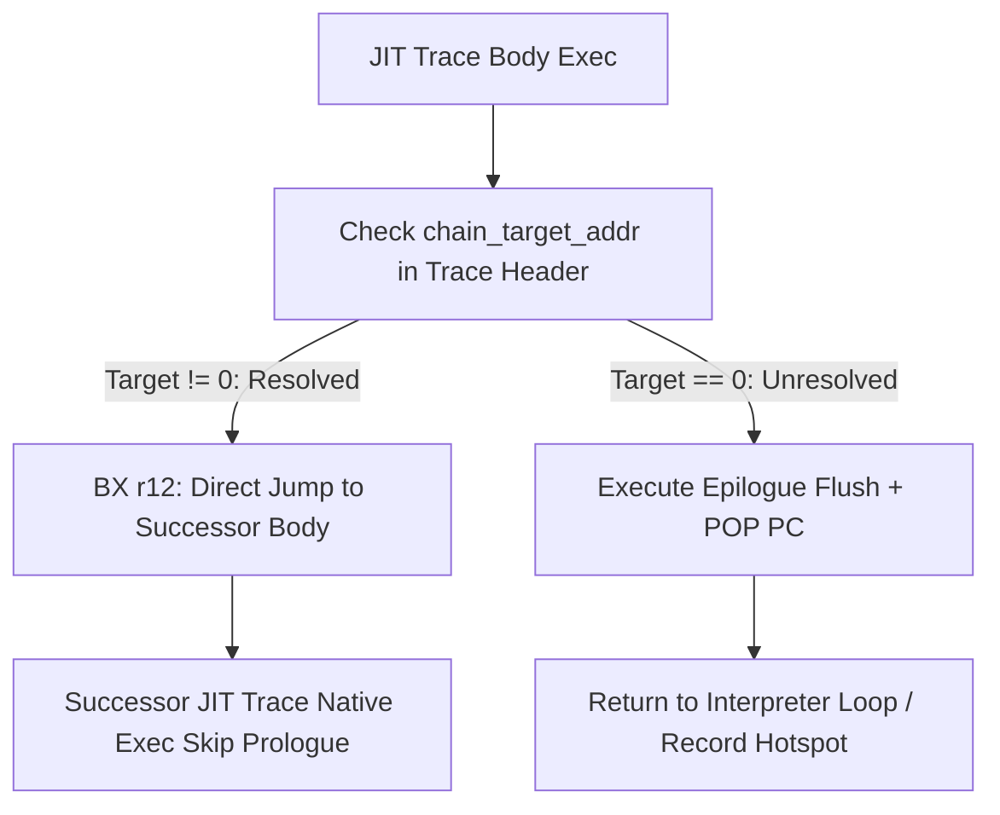
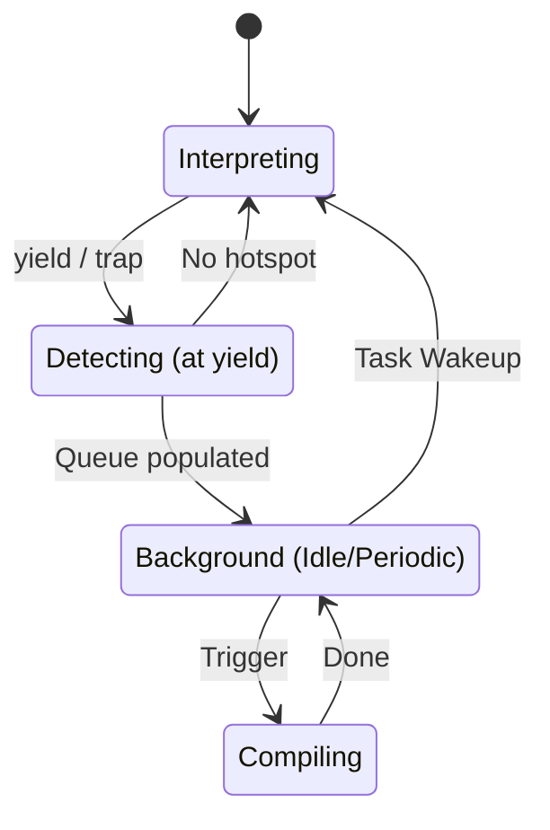
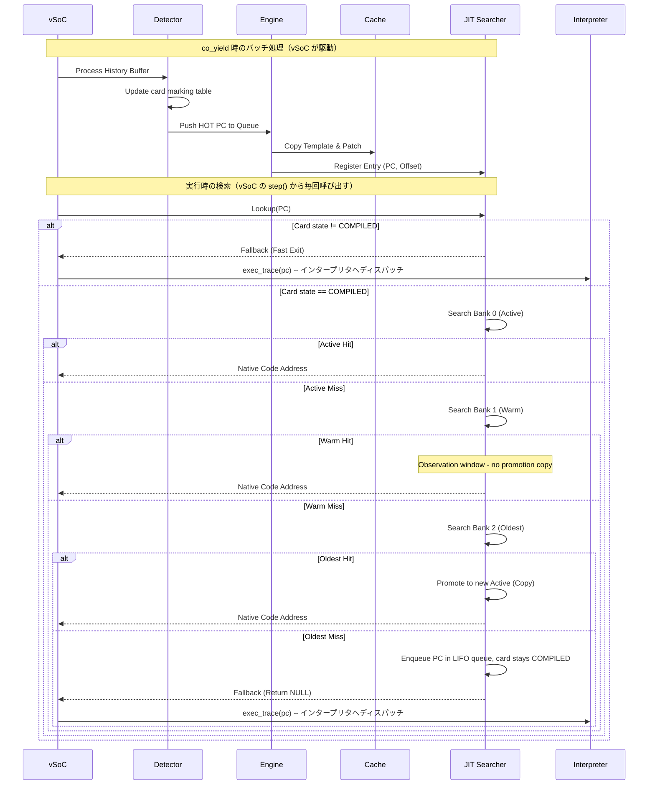

# JIT コンパイラ コンポーネント設計書 {VERIFY_FORMAL} {VERIFY_LLM} {VERIFY_BENCHMARK}
<!-- evidence:
     formal: formal/jit_cache_model.py
     benchmark: benchmarks/zero_runtime_overhead_bench.py
     concept: concepts/jit_copy_patch_concept.py
     test: tests/jit_compiler_test_spec.md
-->

## 1. コンセプト
<!-- traceability: {LowLatencyJIT} {JIT_CopyAndPatch} {JIT_ZeroCompileCostTheorem} {SimpleJITArchitecture} {JIT_Encoder} {PositionIndependentCode} {SinglePassCompilation} -->
JIT Compiler は、WASMバイトコードを実行時にネイティブコードへ変換し、実行速度を向上させる。Execution Engine (`executor`) の一部として、インタープリタと一対の実行エンジンとして機能する。極小リソース環境（RAM 32KB〜64KB）において、コンパイルコストを極小化する「Zero Compile Cost」方針に基づき、最適化を省いた高速な **Copy-and-Patch** 方式を採用する。命令テンプレートは C++ `constexpr` アセンブラによりビルド時に確定され、実行時は単純なメモリコピーと特定箇所への定数書き込み（パッチ）のみを行う。 `{LowLatencyJIT}` `{JIT_CopyAndPatch}` `{JIT_ZeroCompileCostTheorem}` `{SimpleJITArchitecture}` `{JIT_Encoder}` `{PositionIndependentCode}` `{SinglePassCompilation}`

## 2. アーキテクチャ分類
<!-- traceability: {META_3TierSeparation} {JIT_CopyAndPatch} -->
本コンポーネントは **Tier 3 (詳細リーフコンポーネント: Leaf Component)** に属し、vSoC (`runtime_vsoc.md`) から分解された JIT コンパイルパイプライン、事前生成テンプレートのコピー＆パッチ結合、および C++ `constexpr` 命令エンコードを担当する。ランタイム側のエントリ検索・キャッシュ管理・ホットスポット検出は [`jit_runtime.md`](docs/components/tier3_jit/jit_runtime.md) が担当する。 `{META_3TierSeparation}` `{JIT_CopyAndPatch}`

### 2.1 JIT サブシステムのデコンポジション
<!-- traceability: {JIT_Encoder} {JIT_CopyAndPatch} -->
JITサブシステムは、以下の2つの独立した設計書に責務を分離して構成される。

- **[jit_compiler.md](docs/components/tier3_jit/jit_compiler.md)**: 命令テンプレートを用いたネイティブコード生成（Copy-and-Patch Engine）および静的な命令エンコード DSL（constexpr Assembler）。 `{JIT_Encoder}` `{JIT_CopyAndPatch}`
- **[jit_runtime.md](docs/components/tier3_jit/jit_runtime.md)**: 実行履歴監視・ホットスポット判定（Hotspot Detector）、PC-アドレス変換検索（JIT Entry Index）、および 3面キャッシュローテーション。 `{SimpleJITArchitecture}` `{JIT_MultiBuffer_Cache}`

## 3. 静的モデル

### 3.1 データ構造
- **`CopyAndPatchEngine`**: WASM命令に対応するネイティブ命令テンプレートを選択・コピーし、即値・分岐先・APIポインタをパッチ適用するクラス。
- **`constexpr_assembler`**: C++の `constexpr` 機能を活用し、ビルド時に Thumb-2 / RISC-V 命令バイナリを型安全に静的生成する DSL。
- **命令テンプレート (`jit_template`)**: パッチスロットを含むネイティブ命令列の雛形（[jit_stencil_catalog.md](docs/specs/jit_stencil_catalog.md) 準拠）。
- **JIT トレースヘッダ (`jit_trace_header`)**: キャッシュに書き込まれる各ネイティブトレースの先頭（`+0x00`）に配置される 16 バイト固定長のメタデータ構造体。

### 3.2 内部ブロック図


### 3.3 主要なクラス・構造体・定数

#### コンパイル単位とインタープリタ協調方針
<!-- traceability: {LowLatencyJIT} {SimpleJITArchitecture} {PositionIndependentCode} -->
- **関数/モジュール一括コンパイルの完全禁止**: 極小リソース環境（RAM 32KB〜64KB）におけるコンパイル遅延とメモリ消費をゼロ化するため、関数全体やモジュール全体の事前一括コンパイルは一切行わない。
- **純粋ベーシックブロック/トレース単位コンパイル**: 2-bit カードテーブル（カードマーキング表）で HOT（`10`）に達した直線命令列（基本ブロック / トレース）のみを、スケジューラのアイドル時（`idle_hook` 等）に Copy-and-Patch により 1 トレースずつオンデマンド生成する。
- **制御フロー・スタック操作・演算の最適インライン展開方針 (`{JIT_RuntimeAPI_Fallback}`)**:
  - **JIT ネイティブ実行（インライン展開）対象（48命令）**:
    高頻度な直線演算（定数、変数、算術、論理、比較、リニアメモリアクセス）に加え、**構文デリミタ（0バイト消去・ヘッダ直結）**、および**スタック巻き戻し（即値定数SP更新）を伴う多段分岐（`br`, `br_if`）** を JIT ネイティブ命令としてインライン展開する。
  - **インタープリタ委譲・ランタイムヘルパー対象（真のJIT境界命令）**:
    1. 関数間コール・フレーム生成: `call`, `call_indirect` (別フレームアロケーション、シグネチャ照合、WASI/ホスト呼出)
    2. 動的間接ジャンプテーブル: `br_table` (可変長ターゲット探索)
    3. システム・OS連携: `memory.grow`, `memory.copy`, `memory.fill`
    4. ハードウェア非対応演算 (`{Libgcc_Runtime_Helper}`): FPU非搭載時の `f32`/`f64` 浮動小数点、64-bit 複雑除算（`libgcc` の `__divdi3` 等）
    これら制御境界・システムコール・ハードウェア非対応演算のみをインタープリタの命令ハンドラまたはランタイムヘルパーへ委譲する。
- **ハンドラ互換ディスパッチ**: JIT トレースエントリポイントは、インタープリタの命令ハンドラ（`opcode_handler`）と完全に同一の C/C++ 関数シグネチャを持ち、ディスパッチテーブルから直接呼び出しが可能である。

##### 3.3.1 制御フローおよびスタック巻き戻しの命令別処理モデル
<!-- traceability: {JIT_CopyAndPatch} {JIT_LazyChaining} {PositionIndependentCode} -->
WASM バイトコードにおける制御フロー命令は、その内部動作（スタック操作、フレーム遷移、ジャンプ先解決）の観点から以下の 3 つのモデルに厳密に仕分けられ、JIT ネイティブ展開される。

1. **構文デリミタ・ヘッダ埋め込みモデル（0バイト消去 & トレースヘッダ直結）**:
   - **対象命令**: `block` (`0x02`), `loop` (`0x03`), `else` (`0x05`), `end` (`0x0B`)
   - **処理モデル**: これらの命令は実行時の動的処理を一切持たない構文構造境界である。JIT コンパイル（基本ブロック抽出）時に後続の真の実行命令の PC（`fallthrough_head_pc`）を静的に解決し、**ネイティブ命令コードとしては 0 バイト消去（完全除去）** する。後続のフォールスルー先 PC はトレースヘッダ `jit_trace_header.chain_next_pc`（+0x08）に直接埋め込まれ、実行時の Radix 木（`control_skip_tree`）等の検索オーバーヘッドを完全撤廃する。
2. **スタック巻き戻し即値更新 & 直接ジャンプモデル（Inlined SP Adjustment & Relative Branch）**:
   - **対象命令**: `br` (`0x0C`), `br_if` (`0x0D`), `return` (`0x0F`)
   - **スタック巻き戻しの本質**: WASM は検証済み静的型付けバイトコードであり、任意の `br depth` / `br_if depth` における巻き戻し量 $\Delta$（スタック深さの差分: 現在のスタック深さ − 分岐先ラベルの期待スタック深さ）は、**JIT コンパイル時に即値定数として完全確定** している。
   - **ネイティブ展開コード**: スタック巻き戻しは単なるスタックポインタ（SP）の即値加算であり、インタープリタ委譲は不要である。
     - `br`: `add sp, #(Δ * 4); b.w <rel_target>` の 2 命令で完結。
     - `br_if`: `cmp r4, #0; it ne; addne sp, #(Δ * 4); bne.w <rel_target>` の 4 命令（多段脱出 `depth > 0` を含む）で完結。
     - `return`: トレース末尾エピローグ（`pop.w {r4-r6, r8-r11, pc}`）を直接インライン展開。
3. **境界トラップモデル（Trap Tail Emission）**:
   - **対象命令**: `unreachable` (`0x00`)
   - **処理モデル**: `bkpt #0x00` を直接展開し、ハードウェアフォールトまたはデバッガトラップへ直結させる。

##### 3.3.2 JIT コンパイル対象命令セット仕様台帳（JIT Supported Opcode Specification）
<!-- traceability: {JIT_CopyAndPatch} {JIT_ZeroCompileCostTheorem} {JIT_RegisterMapping} {PositionIndependentCode} -->
JIT コンパイラがフォールバックせずにネイティブバイナリとしてインライン展開・生成する命令セット（全 48 命令）の仕様台帳を以下に定める。

| カテゴリ | WASM Opcode (Hex) | 命令名 | JIT ネイティブ展開形式 (Thumb-2) | スタック/レジスタ効果 | 生成バイト数 |
| :--- | :--- | :--- | :--- | :--- | :--- |
| **制御・スタック** | `0x00` | `unreachable` | `bkpt #0x00` | トラップ | 2 Bytes |
| | `0x01` | `nop` | (0 Byte 消去) | なし | 0 Bytes |
| | `0x0C` | `br` | `add sp, #imm; b.w <target>` | SP巻き戻し + 相対分岐 | 6〜8 Bytes |
| | `0x0D` | `br_if` | `cmp r4, #0; it ne; addne sp, #imm; bne.w <target>` | 条件判定 + SP巻き戻し + 相対分岐 | 8〜10 Bytes |
| | `0x0F` | `return` | `pop.w {r4-r6, r8-r11, pc}` | エピローグ展開・復帰 | 4 Bytes |
| **構文デリミタ** | `0x02` | `block` | (0 Byte 消去・ヘッダ `chain_next_pc` 解決) | なし | 0 Bytes |
| | `0x03` | `loop` | (0 Byte 消去・ヘッダ `chain_next_pc` 解決) | なし | 0 Bytes |
| | `0x05` | `else` | (0 Byte 消去・ヘッダ `chain_next_pc` 解決) | なし | 0 Bytes |
| | `0x0B` | `end` | (0 Byte 消去・ヘッダ `chain_next_pc` 解決) | なし | 0 Bytes |
| **定数ロード** | `0x41` | `i32.const` | `movw r4, #imm16; movt r4, #imm16` | $\to$ R4 (TOS) | 8 Bytes |
| | `0x42` | `i64.const` | `movw/movt r4, #imm; movw/movt r5, #imm` | $\to$ R4:R5 (LO:HI) | 16 Bytes |
| **変数アクセス** | `0x20` | `local.get` | `ldr r4, [r2, #offset]` | $\to$ R4 (TOS) | 2 Bytes |
| | `0x21` | `local.set` | `str r4, [r2, #offset]` | R4 $\to$ Local | 2 Bytes |
| | `0x22` | `local.tee` | `str r4, [r2, #offset]` | R4 $\to$ Local (R4維持) | 2 Bytes |
| | `0x23` | `global.get`| `ldr.w r12, [r1, #0x28]; ldr.w r4, [r12, #offset]` | $\to$ R4 (TOS) | 8 Bytes |
| | `0x24` | `global.set`| `ldr.w r12, [r1, #0x28]; str.w r4, [r12, #offset]` | R4 $\to$ Global | 8 Bytes |
| **スタック・選択** | `0x1A` | `drop` | (レジスタキャッシュポインタ破棄 / `pop`) | スタック破棄 | 0〜2 Bytes |
| | `0x1B` | `select` | `cmp r4, #0; it ne; movne r5, r6; mov r4, r5` | 3値選択 $\to$ R4 | 8 Bytes |
| **32bit 算術・論理** | `0x6A` | `i32.add` | `adds r4, r5, r4` | R5 + R4 $\to$ R4 | 2 Bytes |
| | `0x6B` | `i32.sub` | `subs r4, r5, r4` | R5 - R4 $\to$ R4 | 2 Bytes |
| | `0x6C` | `i32.mul` | `mul r4, r5, r4` | R5 * R4 $\to$ R4 | 4 Bytes |
| | `0x6D` | `i32.div_s`| `cbz r4, <trap>; cmp r5, #0x80000000; it eq; cmpeq r4, #-1; beq <trap>; sdiv r4, r5, r4` | 符号付除算 | 14 Bytes |
| | `0x6E` | `i32.div_u`| `cbz r4, <trap>; udiv r4, r5, r4` | 符号無除算 | 6 Bytes |
| | `0x6F` | `i32.rem_s`| `cbz r4, <trap>; sdiv r12, r5, r4; mls r4, r12, r4, r5` | 符号付剰余 (`JITC-GOTCHA-06`) | 10 Bytes |
| | `0x70` | `i32.rem_u`| `cbz r4, <trap>; udiv r12, r5, r4; mls r4, r12, r4, r5` | 符号無剰余 (`JITC-GOTCHA-06`) | 10 Bytes |
| | `0x71` | `i32.and` | `ands r4, r5, r4` | R5 & R4 $\to$ R4 | 2 Bytes |
| | `0x72` | `i32.or` | `orrs r4, r5, r4` | R5 \| R4 $\to$ R4 | 2 Bytes |
| | `0x73` | `i32.xor` | `eors r4, r5, r4` | R5 ^ R4 $\to$ R4 | 2 Bytes |
| | `0x74` | `i32.shl` | `lsl.w r4, r5, r4` | R5 << R4 $\to$ R4 | 4 Bytes |
| | `0x75` | `i32.shr_s`| `asr.w r4, r5, r4` | R5 >> R4 (算術) $\to$ R4 | 4 Bytes |
| | `0x76` | `i32.shr_u`| `lsr.w r4, r5, r4` | R5 >> R4 (論理) $\to$ R4 | 4 Bytes |
| | `0x77` | `i32.rotl` | `rsb r12, r4, #32; ror.w r4, r5, r12` | 左循環シフト $\to$ R4 | 8 Bytes |
| | `0x78` | `i32.rotr` | `ror.w r4, r5, r4` | 右循環シフト $\to$ R4 | 4 Bytes |
| | `0x67` | `i32.clz` | `clz r4, r4` | 先頭ゼロカウント | 4 Bytes |
| | `0x68` | `i32.ctz` | `rbit r4, r4; clz r4, r4` | 末尾ゼロカウント | 8 Bytes |
| | `0x69` | `i32.popcnt`| `vmov s0, r4; vcnt.8 d0, d0; vpaddl.u8 d0, d0; vpaddl.u16 d0, d0; vmov r4, s0` (またはビット演算展開) | 立っているビット数 | 10〜16 Bytes |
| **32bit 比較演算** | `0x45` | `i32.eqz` | `cmp r4, #0; it eq; moveq r4, #1; it ne; movne r4, #0` | R4 == 0 | 10 Bytes |
| | `0x46` | `i32.eq` | `cmp r5, r4; it eq; moveq r4, #1; it ne; movne r4, #0` | R5 == R4 | 10 Bytes |
| | `0x47` | `i32.ne` | `cmp r5, r4; it ne; movne r4, #1; it eq; moveq r4, #0` | R5 != R4 | 10 Bytes |
| | `0x48` | `i32.lt_s` | `cmp r5, r4; it lt; movlt r4, #1; it ge; movge r4, #0` | R5 < R4 (符号付) | 10 Bytes |
| | `0x49` | `i32.lt_u` | `cmp r5, r4; it lo; movlo r4, #1; it hs; movhs r4, #0` | R5 < R4 (符号無) | 10 Bytes |
| | `0x4A` | `i32.gt_s` | `cmp r5, r4; it gt; movgt r4, #1; it le; movle r4, #0` | R5 > R4 (符号付) | 10 Bytes |
| | `0x4B` | `i32.gt_u` | `cmp r5, r4; it hi; movhi r4, #1; it ls; movls r4, #0` | R5 > R4 (符号無) | 10 Bytes |
| | `0x4C` | `i32.le_s` | `cmp r5, r4; it le; movle r4, #1; it gt; movgt r4, #0` | R5 <= R4 (符号付) | 10 Bytes |
| | `0x4D` | `i32.le_u` | `cmp r5, r4; it ls; movls r4, #1; it hi; movhi r4, #0` | R5 <= R4 (符号無) | 10 Bytes |
| | `0x4E` | `i32.ge_s` | `cmp r5, r4; it ge; movge r4, #1; it lt; movlt r4, #0` | R5 >= R4 (符号付) | 10 Bytes |
| | `0x4F` | `i32.ge_u` | `cmp r5, r4; it hs; movhs r4, #1; it lo; movlo r4, #0` | R5 >= R4 (符号無) | 10 Bytes |
| **リニアメモリアクセス** | `0x28` | `i32.load` | `cmp r4, r9; bhs.w <trap>; ldr.w r4, [r8, r4]` | 32bit ロード (`JITC-GOTCHA-04`) | 10 Bytes |
| | `0x2C` | `i32.load8_s` | `cmp r4, r9; bhs.w <trap>; ldrsb.w r4, [r8, r4]`| 8bit 符号付ロード | 10 Bytes |
| | `0x2D` | `i32.load8_u` | `cmp r4, r9; bhs.w <trap>; ldrb.w r4, [r8, r4]` | 8bit 符号無ロード | 10 Bytes |
| | `0x2E` | `i32.load16_s`| `cmp r4, r9; bhs.w <trap>; ldrsh.w r4, [r8, r4]`| 16bit 符号付ロード | 10 Bytes |
| | `0x2F` | `i32.load16_u`| `cmp r4, r9; bhs.w <trap>; ldrh.w r4, [r8, r4]` | 16bit 符号無ロード | 10 Bytes |
| | `0x36` | `i32.store` | `cmp r5, r9; bhs.w <trap>; str.w r4, [r8, r5]` | 32bit ストア (`JITC-GOTCHA-04`) | 10 Bytes |
| | `0x3A` | `i32.store8` | `cmp r5, r9; bhs.w <trap>; strb.w r4, [r8, r5]` | 8bit ストア | 10 Bytes |
| | `0x3B` | `i32.store16`| `cmp r5, r9; bhs.w <trap>; strh.w r4, [r8, r5]` | 16bit ストア | 10 Bytes |
| | `0x3F` | `memory.size`| `ldr.w r4, [r1, #0x24]` | ページ数取得 | 4 Bytes |

##### 3.3.3 インタープリタ委譲命令台帳（Delegated Opcode Specification）
<!-- traceability: {JIT_RuntimeAPI_Fallback} {Libgcc_Runtime_Helper} -->
JIT トレース内にインライン展開せず、トレース境界でインタープリタハンドラ（`_HANDLERS[opcode]`）またはランタイムヘルパーへフォールバックして実行を委譲する命令群を以下に定める。

| カテゴリ | WASM Opcode (Hex) | 命令名 | 委譲理由・処理モデル |
| :--- | :--- | :--- | :--- |
| **関数呼出・フレーム** | `0x10` | `call` | コールフレーム（`call_frame`）生成、スタック境界検査、引数受け渡しを伴うためインタープリタへ委譲 |
| | `0x11` | `call_indirect` | テーブル索引、型シグネチャ一致検査、動的ターゲット解決を伴うためインタープリタへ委譲 |
| **動的分岐** | `0x0E` | `br_table` | 可変長ジャンプターゲットテーブル（ベクトル）の動的インデックス検索を伴うため委譲 |
| **OS・メモリ管理** | `0x40` | `memory.grow` | ページテーブル再割り当て、MPU 領域再設定、vMMIO 更新を行うシステムサービス呼出のため委譲 |
| | `0xFC 0x0A` | `memory.copy` | バッファ重なり検査、メモリコピーランタイム呼び出しのため委譲 |
| | `0xFC 0x0B` | `memory.fill` | メモリフィルランタイム呼び出しのため委譲 |
| **ハードウェア非対応演算** | - | `f32.*`, `f64.*` | 浮動小数点演算ユニット（FPU）非搭載環境における `libgcc`（`__adddf3` 等）ソフトエミュレーション委譲 |
| | - | `i64.div_*`, `rem_*`| 64bit 整数除算・剰余における `libgcc`（`__divdi3`, `__moddi3` 等）ランタイムヘルパー委譲 |

**ABI 規約と境界チェック・バックパッチング (`JITC-GOTCHA-01`〜`05`)**:
- **レジスタ整合性 (`JITC-GOTCHA-01`, `02`, `03`)**: JIT トレースとインタープリタは `__fastcall`（R0=ctx, R1=SP, R2=local_base, R3=tos）により共通の物理レジスタ規約を保持する。基本ブロック末尾では、スタックがプッシュされた場合に `TOS, NOS, NNOS` をスタック（`[R1, #offset]`）へフラッシュし、コンテキスト `R0` の `ip`（+0x00）および `sp_offset`（+0x0C）を書き換える。トレース生成時はホストアーキテクチャ（ARM/x64）の不変条件（呼び出し側退避レジスタの保全、スタックアライメント境界）を厳格に維持する。
- **境界チェックとバックパッチング (`JITC-GOTCHA-04`, `05`)**: トレース末尾の直接ジャンプ（チェイニング）およびインタープリタへの脱出境界において、PC の境界検査を必ず先行させる。前方参照ブロックへのジャンプオフセットは、コード生成完了後にバックパッチングにより不可分に書き換えられ、未解決ジャンプによる迷走実行を完全に防止する。
- **ARM MLS 命令のオペランド配置順序 (`JITC-GOTCHA-06`)**: ARM Thumb-2 の積和減算命令 `MLS Rd, Rn, Rm, Ra`（$Rd = Ra - Rn \times Rm$）を生成する際、減算の引かれる数（アキュムレータ）が第4オペランド $Ra$ に配置されるハードウェア仕様を遵守し、通常の乗算命令（$Rn, Rm$）との取り違えによる計算誤りを防ぐ。

#### コピーアンドパッチエンジン（CopyAndPatchEngine）クラス
<!-- traceability: {JIT_RegisterMapping} {ContextPointerRegister} {EnvironmentPointer} {ADR_TosCacheAsymmetry} {PositionIndependentCode} -->
テンプレートの解決とバイナリ操作をカプセル化する。インタープリタの `opcode_handler` と完全整合する `__fastcall` CPS 4引数呼び出し規約（`R0: ctx`, `R1: sp`, `R2: local_base`, `R3: tos`）に基づいて設計される。`env`（`vsoc_runtime`）は独立引数レジスタとしては廃止され、`R0` が指す `execution_context` 内に完全内包される（ADR-INTERP-03）。

```c
// インタープリタ命令ハンドラおよび JIT トレース共通の C 呼び出し規約
// コメントは「実機 ARM AAPCS レジスタ / 実機 RISC-V ABI レジスタ / x86-64 ホストシミュレータ __fastcall レジスタ」の対応を示す。
// この4本は呼び出し境界でのみ使われ、jit_stencil_catalog.md のトレース本体内 assignable pool
// (ARM R4-R6, R8-R11 / RISC-V s1-s7) とは物理レジスタが重ならない別の割り当てである。
typedef int64_t (*opcode_handler_t)(
    execution_context* ctx,        // ARM R0 / RISC-V a0 / x86-64 RCX: 実行コンテキスト (60バイト 15フィールド)
    uint32_t*          sp,         // ARM R1 / RISC-V a1 / x86-64 RDX: オペランドスタックポインタ
    void*              local_base, // ARM R2 / RISC-V a2 / x86-64 R8:  ローカル変数配列基底ポインタ
    uint32_t           tos         // ARM R3 / RISC-V a3 / x86-64 R9:  スタックトップ値 (Top of Stack)
);
```

| 項目名 | 機能と役割 | 型分類 | サイズ・制約 |
| :--- | :--- | :--- | :--- |
| テンプレート辞書 | WASM命令に対応するJITテンプレートの検索索引 | アクセス辞書 | `jit_template_map` |
| 命令テンプレート | WASM命令に対応するネイティブバイナリの雛形 | バイナリビュー | ROM参照（[jit_stencil_catalog.md](docs/specs/jit_stencil_catalog.md) 準拠。Thumb-2 のみを収録し、RISC-V の物理ステンシルは別カタログとして今後定義する） |
| 位置独立性 (PIC) | 任意アドレス・キャッシュバンクで再コンパイル不要で動作 | 設計制約 | 絶対アドレス埋め込み禁止。`local_base` 相対、`R1(sp)` 相対、`rel32` 相対分岐のみ `{PositionIndependentCode}` |

##### 物理レジスタマッピング一覧表
<!-- traceability: {JIT_RegisterMapping} {AAPCS_FastCall} -->
JIT トレースとインタープリタは呼び出し境界において CPS 4引数規約を共有し、トレース内部では assignable pool を用いることで物理競合を防止する（`JITC-GOTCHA-01`）。

| アーキテクチャ | 物理レジスタ | 規約上の役割 / CPS引数 | トレース内部での用途 | 退避・保護責務 |
| :--- | :--- | :--- | :--- | :--- |
| **ARM (Thumb-2)** | `R0` | `ctx` (実行コンテキスト) | 呼び出し境界引数（`mem_base/size` ピン留め・基本ブロック末尾同期起点） | Caller-saved |
| | `R1` | `sp` (OperandStack SP) | 呼び出し境界引数（オペランドスタック頂点ポインタ） | Caller-saved |
| | `R2` | `local_base` (ローカル配列基底) | 呼び出し境界引数 | Caller-saved |
| | `R3` | `tos` (Top of Stack) | 呼び出し境界引数（CPS 第4引数）。スタック最上段オペランド値。基本ブロック末尾でプッシュされた場合は `[R1, #offset]` へフラッシュ | Caller-saved |
| | `R4` | - | `NOS` (Next on Stack 次段キャッシュ。基本ブロック末尾でプッシュされた場合は `[R1, #offset]` へフラッシュ) | Callee-saved |
| | `R5` | - | `NNOS` (Next Next on Stack 第3段キャッシュ。基本ブロック末尾でプッシュされた場合は `[R1, #offset]` へフラッシュ) | Callee-saved |
| | `R6` | - | 一時スクラッチ（トレース末尾でのコンテキストIP書き戻し等） | Callee-saved |
| | `R7` | `FP` (フレームポインタ) | 不可侵 | システム固定 |
| | `R8` | - | `mem_base` (ゲストリニアメモリ基底、`[R0, #0x28]` よりロード) | Callee-saved |
| | `R9` | - | `mem_size` (ゲストリニアメモリ長、`[R0, #0x2C]` よりロード) | Callee-saved |
| | `R10` | - | `safepoint` (ポーリングフラグ) | Callee-saved |
| | `R11` | - | 汎用アサイナブルレジスタ | Callee-saved |
| | `R12` | - | 一時スクラッチ (インタープリタ復帰 `BX r12`) | Caller-saved |
| **RISC-V** | `a0`〜`a3` | `ctx, sp, local_base, tos` | 呼び出し境界引数 (CPS 4引数) | Caller-saved |
| | `s1`〜`s7` | - | トレース内部アサイナブルプール (`s1: NOS`, `s4: mem_base`, `s5: mem_size`) | Callee-saved |
| | `s0/fp` | `FP` (フレームポインタ) | 不可侵 | システム固定 |

#### トレース境界不変条件とスタックフレーム整合性 (Trace Boundary Invariants)
<!-- traceability: {LowLatencyJIT} {PositionIndependentCode} {JIT_RuntimeAPI_Fallback} -->
JIT トレースとインタープリタが同一の UnifiedStack 上でシームレスに相互運用するため、以下の 3 つの不変条件を厳格に保持する：

1. **スタック自己完結性不変条件 (Stack Self-Containment Invariant)**:
   - JIT コンパイル対象とする BasicBlock は、**命令走査中の累積スタック深さが 0 未満（`stack_depth < 0`）に落ちない自己完結ブロックのみ**とする。
   - 先頭で `local.set` や二項演算が先行し、呼び出し元のオペランドスタック上の値を前提とするブロックは JIT 化せず、インタープリタがスタック整合性を保持して安全に実行する。
2. **トレース境界でのメモリ同期不変条件 (Memory Synchronization at Trace Boundary)**:
   - 基本ブロック末尾（トレース終了時、分岐時、ハンドラ呼び出し時、Safepoint 到達時）では、スタックがプッシュされた場合に `TOS, NOS, NNOS`（`R3, R4, R5`）をスタック（`[R1, #offset]`）へフラッシュし、コンテキスト `R0` の `ip`（`+0x00`）および `sp_offset`（`+0x0C`）を書き換えて状態を完全同期する。未確定のレジスタ状態を次のブロックやインタープリタへ持ち越さない。
3. **制御フロー・コール境界のインタープリタ委譲不変条件 (Control & Call Delegation Invariant)**:
   - スタック巻き戻し（SP即値加算）を伴う多段分岐（`BR`, `BR_IF`）、構文デリミタ（`BLOCK`, `LOOP`, `ELSE`, `END`）、および復帰（`RETURN`）は JIT トレース内にインライン展開する。
   - 一方、新しいコールフレーム生成や動的解決を伴う `CALL`, `CALL_INDIRECT`, `BR_TABLE` に遭遇した場合は、その直前で BasicBlock を終端し、インタープリタまたは専用ランタイムハンドラに委譲する。

#### JIT トレース物理メモリレイアウト (`jit_trace_header`)
<!-- traceability: {JIT_LazyChaining} {SimpleJITArchitecture} {PositionIndependentCode} -->
JIT キャッシュ内に書き込まれる各トレースは、**先頭に 16 バイト固定長のメタデータヘッダを持ち、直後（`+0x10`）からネイティブ命令列（PIC Code Stream）が展開される**。エントリポイントは `trace_base + 0x10`。

| オフセット | フィールド名 | 型 | 説明 |
| :--- | :--- | :--- | :--- |
| `+0x00` | `head_wasm_pc` | `uint32_t` | トレース開始 UnifiedPC（`(func_index << 16) \| bytecode_offset`） |
| `+0x04` | `trace_byte_size` | `uint16_t` | ヘッダ含むトレース全体の総物理バイトサイズ |
| `+0x06` | `flags` | `uint8_t` | 状態フラグ（`0x01: PROMOTED`, `0x02: LOOP_HEADER`） |
| `+0x07` | `variant_id` | `uint8_t` | ステンシルバリアント／TOSレジスタ割り当て状態 ID |
| `+0x08` | `chain_next_pc` | `uint32_t` | 直結チェイン先 UnifiedPC |
| `+0x0C` | `chain_target_addr` | `uint32_t` | チェイン先ネイティブアドレス（初期値: 復帰スタブ） |
| `+0x10` | コードストリーム | 可変長 | ネイティブ Thumb-2 / RISC-V 命令列（PIC Code Stream） |

#### `constexpr_assembler` (DSL)
<!-- traceability: {JIT_Encoder} {META_ZeroCostAbstraction} -->
ビルド時に Thumb-2 / RISC-V 命令バイナリを静的エンコードし、実行時の命令生成オーバーヘッドを完全排除する。

| 構造体 | 機能 | ビット幅 |
| :--- | :--- | :--- |
| `fireball::arm::add_imm` | Thumb-2 即値加算命令エンコーダ | 32bit |
| `fireball::arm::ldr_imm` | Thumb-2 即値ロード命令エンコーダ | 32bit |
| `fireball::riscv::i_type`| RISC-V I-Type 命令エンコーダ | 32bit |

## 4. 動的モデル

### 4.1 アルゴリズム
<!-- traceability: {JIT_CopyAndPatch} {JIT_RuntimeAPI_Fallback} {SinglePassCompilation} -->
1. **トレース解析 & テンプレート選択**: WASM PC から始まる基本ブロックを 1 パス走査し、対応する事前生成ステンシルテンプレートを選択する。
2. **メモリコピー & パッチ適用**: アクティブキャッシュへテンプレート命令列をコピーし、即値オペランドや相対分岐オフセットをインプレースでパッチする。
3. **AAPCS 境界フォールバック**: 複雑な命令やホスト関数呼び出しはランタイム API 呼び出しスタブを生成してフォールバックする。 `{JIT_RuntimeAPI_Fallback}`
4. **命令キャッシュ同期**: パッチ完了後、`__DSB()` および `__ISB()` バリアを発行して命令キャッシュを同期する。
5. **インタープリタ連携とハンドラ直接呼び出し (Low-Overhead Interop & Direct Handler Call)**:
   - JIT トレースとインタープリタの命令ハンドラ（`opcode_handler`）は完全に同一の CPS 4引数呼び出し規約（`R0: ip, R1: stack_bot, R2: local_base, R3: tos`）を共有する。
   - JIT トレースは直線的な算術・ローカル変数演算、構文デリミタ消去、および SP 即値巻き戻しを伴う多段分岐（`br`, `br_if`）をネイティブインライン展開する。
   - コールフレーム生成や動的解決が必要な真の境界命令（`call`, `call_indirect`, `br_table`）やホストシステムコールに達した際は、直接インタープリタのハンドラテーブル（`handler_table[opcode]`）へ末尾ジャンプ（Tail Jump / `BX`）するか、戻り値 `next_ip` を返却してインタープリタへ即座にフォールバックする。
   - レジスタ規約が完全一致しているためコンテキスト再構築コストはゼロであり、JIT の軽量性（Zero Compile Cost）と完全な制御フロー安全性を両立する。 `{JIT_RuntimeAPI_Fallback}` `{ADR_TosCacheAsymmetry}`

#### JIT トレース検索 & 3面キャッシュ代謝オーケストレーション
<!-- traceability: {JIT_MultiBuffer_Cache} {JIT_OldestOnly_Promote} -->
3段直接 JIT 検索および 3面キャッシュローテーションの詳細は、ランタイム管理の正本である `{JIT_MultiBuffer_Cache}` を参照すること。コンパイラコアは生成されたネイティブトレースの登録と命令同期を `{JIT_MultiBuffer_Cache}` に委譲する。

#### トレース・チェイニング（連鎖実行）と専用分岐ハンドラ分離
<!-- traceability: {JIT_LazyChaining} -->
検索オーバーヘッドを排除し、ネイティブコード同士を直接接続（チェイニング）するため、**純粋インタープリタ用のジャンプハンドラと、JIT トレースから呼び出される専用チェイニングハンドラ（`jit_chain_branch_handler`）を明確に分離**する。



1. **ハンドラの責務分離とヘッダ参照分岐**:
   - **純粋インタープリタ用ハンドラ (`_h_br` 等)**: 単純にスタックを巻き戻して次の WASM PC を算出し、ディスパッチループへ戻る（JIT 探索やパッチのオーバーヘッドが完全ゼロ）。
   - **JIT トレース末尾のヘッダ参照分岐 (`STENCIL_DYNAMIC_CHAIN_EXIT`)**: トレース末尾ではコード自体の書き換え（インプレースパッチ）を行わず、自身のトレースヘッダ内のデータフィールド `chain_target_addr`（+0x0C）をロードして `CMP` 判定する。
2. **ヘッダ直接リンク（Header-Driven Chaining without Code Patching）**:
   - **初期コンパイル時**: トレースヘッダの `chain_target_addr` は `0`（未解決）で初期化される。トレース末尾では `chain_target_addr == 0` を検知してエピローグ（Flush + POP）を実行し、安全にインタープリタへ復帰する。
   - **後続トレースコンパイル時**: 後続トレースがキャッシュ（Active/Warm）に生成された瞬間、ランタイムは先行トレースのヘッダデータスロット `chain_target_addr` に、後続トレースのプロローグ直後（チェイン入口アドレス）を不可分に書き込む。命令コードキャッシュの MPU W^X 属性切り替えや `__ISB()` 命令同期バリアを発行することなく、完全ゼロオーバーヘッドで直接チェインが確立される。
   - **チェイン実行時**: 次回先行トレース実行時、`chain_target_addr != 0` が成立するため、エピローグ（Flush/POP）をスキップし、`BX r12` により後続トレースの本体（プロローグスキップ位置）へ直接ジャンプする。
3. **未コンパイル時の遅延昇格**:
   - 分岐先が未コンパイル（`chain_target_addr == 0`）の場合のみ、HistoryRing に分岐先 PC を記録した上でエピローグ経由でインタープリタへ戻る。次回以降ホット化してコンパイルされた際にヘッダが書き換えられてチェイニングが確立される。
4. **局所再チェイニングとアンリンク（O(k) Bounded Re-chaining & Unlinking）**: チェイニング確立時にターゲットの属するバンクの **被チェイン逆引きテーブル（`inbound_chains`）** にソースの JIT エントリインデックスを登録する。ターゲットが Active $\to$ Warm $\to$ Oldest へ推移する間はキャッシュ内のコードは依然として有効に常駐しているため、チェイニングは維持され JIT 実行が継続する。**Oldest バンクがパージされ新 Active へローテートするまさにその瞬間**、破棄される Oldest バンクの `inbound_chains` に登録された被チェインエントリ（$k$ 件）のみを直接参照する。
    - **ターゲットが Oldest-Only Promotion 等により Active/Warm へ昇格（Promote）している場合**: 先行トレースヘッダの `chain_target_addr` を昇格先のアドレスへ書き換え、昇格先バンクの `inbound_chains` へ登録を移譲する（インタープリタへフォールバックさせず、ネイティブ直接チェイン実行を維持）。
    - **ターゲットが昇格せず完全にキャッシュアウト（Evict）する場合のみ**: 先行トレースヘッダの `chain_target_addr` を `0` にリセットする（コード変更なし）。次回実行時は自動的にエピローグ経路へ分岐しインタープリタへ安全にフォールバックする。
    これにより、全走査オーバーヘッド $O(N)$ およびコード領域 W^X 切り替えコストを完全排除しつつ、生存トレース間のネイティブ実行効率を最大化する。 `{JIT_LazyChaining}`
5. **構文デリミタのトレースヘッダ直接埋め込みと直接チェイニング連携**:
   - **制御構文デリミタの読み飛ばし**: WASM 基本ブロック末尾の制御命令（`BLOCK`, `LOOP`, `ELSE`, `END` 等）は、先行ブロックの実行完了と後続ブロックの先頭命令の間に位置する。JIT ネイティブ実行同士を直接チェイニング（`chain_next`）する際、先行ブロック終端 PC（delimiter PC）から制御構文を読み飛ばしたフォールスルー先（fallthrough head PC）を解決する必要がある。
   - **ヘッダ直接埋め込み（Inlined Chaining Header）**: JIT コンパイル（基本ブロック抽出）時に後続のフォールスルー先 PC を静的に先読み解決し、トレースヘッダの `chain_next_pc`（+0x08）に直接埋め込む。これにより、外部の Radix 表（`control_skip_tree`）等の検索データ構造を一切介さず、メモリオーバーヘッドおよび解決レイテンシを完全ゼロ（$O(1)$）で直接チェイニングを確立する。
   - **双方向チェイニング解決フロー**:
     - **後方チェイニング (Backward Chaining)**: 新規トレース登録時、トレースヘッダに埋め込まれた `succ = trace.chain_next_pc` を参照し、スキップ先が Active/Warm に常駐していれば `trace.chain_target_addr = succ_native_addr` を即座に接続する。
     - **前方チェイニング (Forward Chaining)**: キャッシュ常駐トレース `resident_t` の `resident_t.chain_next_pc` が新登録トレースの `head_wasm_pc` と一致すれば、`resident_t` の分岐先スロットを新トレースのチェインエントリへインプレースパッチする。

#### 統合 Tiered ランタイムエンジン・コンセプトコード (`../tier2_runtime/concepts/runtime_engine_concept.py`)
インタープリタ実行、2-bit Hotspot 検出、Copy-and-Patch JIT コンパイル、3面マルチバッファキャッシュ（Active/Warm/Oldest）、および MPU W^X 保護プロトコルを統合した自己完結実行シミュレーションは [`runtime_engine_concept.py`](docs/components/tier2_runtime/concepts/runtime_engine_concept.py) を参照。

#### ホットスポット判定 (yield 時)
<!-- traceability: {JIT_LazyChaining} -->
1. **履歴走査**: インタープリタの実行サイクル中に記録、蓄積された「実行履歴バッファ」を走査する。
2. **状態更新**: カードマーキング表の状態が「頻出」に達した命令オフセットを「コンパイル待ち列」（固定容量 LIFO キュー、`{JIT_ReverseCompilationOrder}`）に投入する。容量に達した時点でバッチコンパイル（下記）を即座に実行して空にするため、この固定容量を上回ることはない。 `{GLOBAL_Policy_Memory}`
3. **遅延チェイニング制御**: ホットスポットと判定されてコンパイルキューへ投入されたトレースは、JITコードの末尾においてインタープリタ実行環境へ正しく復帰（遷移制御）するためのディスパッチャ・スタブが初期値としてチェイニング（連結）され、遅延チェイニングを実現する。 `{JIT_LazyChaining}`

#### バッチコンパイル (周期実行またはアイドル時)
<!-- traceability: {JIT_ReverseCompilationOrder} {GLOBAL_PeriodicTask} {GLOBAL_IdleDetection} -->
1. **キューの取得**: 「コンパイル待ち列」から対象の命令オフセットを**逆順（LIFO）**で取り出す。 `{JIT_ReverseCompilationOrder}`
2. **コンパイル実行**: 後続のトレースを先にコンパイルすることで、先行するトレースのリンク時（Patching 時）にターゲットが既にキャッシュ内に存在する確率を上げ、即時チェイニングを実現する。
3. **補足**: COOSの `register_periodic_callback` または `set_idle_hook` により実行される。これにより、実行スレッドのブロッキング時間を抑える。 `{GLOBAL_PeriodicTask}` `{GLOBAL_IdleDetection}`


#### Copy-and-Patch ステンシル結合 & バックパッチング手順（手順アクティビティ図）
<!-- traceability: {JITC-GOTCHA-01} {JITC-GOTCHA-02} {JITC-GOTCHA-05} {JIT_CopyAndPatch} -->
BasicBlock 走査、事前コンパイル済みステンシルのコピー、即値・レジスタパッチ、およびトレース末尾バックパッチングの決定論的手順を示す。


### 4.2 状態遷移図
<!-- traceability: {JIT_LazyChaining} {JIT_ReverseCompilationOrder} {GLOBAL_PeriodicTask} {GLOBAL_IdleDetection} -->


### 4.3 内部シーケンス
<!-- traceability: {JIT_LazyChaining} {JIT_ReverseCompilationOrder} {GLOBAL_PeriodicTask} {GLOBAL_IdleDetection} -->
#### JITコンパイルおよび検索シーケンス
サイクル全体を駆動するのは常に vSoC (V) であり、Interpreter (I) はディスパッチされた側の実行エンジンとして現れるだけで、履歴処理やキャッシュ検索を自ら開始することはない（`{Interpreter_LazyJITSwitch}`）。


## 5. インターフェース定義

### 5.1 公開API
外部から利用可能なオブジェクト指向APIを定義する。

#### 初期化（initialize）
<!-- traceability: {META_ConfigurableSystem} -->

| 項目 | 内容 |
| :--- | :--- |
| 機能概要 | コードキャッシュ領域、管理テーブル、およびカードマーキング表の初期化を行う。 |
| シグネチャ | `initialize(ctx: 可変参照, config: const参照) -> 結果型` |
| 引数 | `ctx`: JITコンテキスト (`jit_context`) への可変参照<br>`config`: JIT構成 (`jit_config`) への読取専用参照 |
| 戻り値 | 結果型 (成功時は空、エラー時はエラーコード) |
| 事前条件 | 設定パラメータが一貫しており、静的に確保されたメモリの範囲を超えていないこと。 |
| 事後条件 | カードマーキング表がクリアされ、キャッシュが空の状態になる。 |
| 不変条件 | 実行中に `config` の値を変更してはならない。 |
| エラー時の挙動 | メモリ割り当ての不備がある場合はエラーを返す。 |
| 補足 | `{META_ConfigurableSystem}` の方針に基づき、基本的にはブート時に一度だけ呼び出される。 |

#### トレース検索（lookup_trace）
<!-- traceability: {META_ConfigurableSystem} -->

| 項目 | 内容 |
| :--- | :--- |
| 機能概要 | 指定されたWASMプログラムカウンタ(PC)に対応する、コンパイル済みのネイティブコードの実行アドレスを高速に検索する。 |
| シグネチャ | `lookup_trace(pc: address) -> result<address, bool>` |
| 補足 | カードマーキング表の状態が `COMPILED` でない場合は即座に失敗を返す。その後、`harness` 経由でエントリ索引を検索する。本機能は、ヘッダファイルで定義されたマクロ（`FB_CONF_JIT_CACHE_SIZE`等）に基づき、システムのメモリマップや検索範囲等のパラメータが固定された状態で動作する。 `{META_ConfigurableSystem}` |

#### カード状態取得（get_card_state）
<!-- traceability: {META_ConfigurableSystem} -->

| 項目 | 内容 |
| :--- | :--- |
| 機能概要 | 指定したPCが属するカードの状態（2-bit）を取得する。 |
| シグネチャ | `get_card_state(pc: address) -> u8` |
| 補足 | 本機能は、コンパイル時に固定されたカード境界シフト値（`FB_CONF_JIT_CARD_SHIFT`等）のマクロ定義に基づき、PC値からカードインデックスへの変換を高速に行う。 `{META_ConfigurableSystem}` |

#### 検索範囲取得（get_search_range）
<!-- traceability: {META_ConfigurableSystem} {FlatViewNarrowing} {META_BinarySearch} -->

| 項目 | 内容 |
| :--- | :--- |
| 機能概要 | JITエントリグループインデックスを用いて、指定されたWASM PCに対応する探索区間を $O(1)$ で `fireball::flat_map_view` へ絞り込む。生の添字対ではなくビューを返すことで、呼び出し側が区間を誤った配列と組み合わせる余地をなくす（`{FlatViewNarrowing}` を参照）。該当グループが存在しない場合は空ビューを返す。 `{FlatViewNarrowing}` `{META_BinarySearch}` |
| シグネチャ | `get_search_range(bank_idx: u8, pc: address) -> flat_map_view<u32, code_offset>` |
| 補足 | 本機能は、ヘッダファイルで定義されたJITエントリグループサイズおよび最大登録件数のマクロ定数（`FB_CONF_JIT_ENTRY_GROUP_SHIFT`等）に基づき、二分探索範囲をコンパイル時に静的に制限して計算する。 `{META_ConfigurableSystem}` |

#### バッチコンパイル処理（process_batch_compile）
<!-- traceability: {META_ConfigurableSystem} -->

| 項目 | 内容 |
| :--- | :--- |
| 機能概要 | vSoC が収集した履歴を基にコンパイルを実行する。 |
| シグネチャ | `process_batch_compile(ctx: 可変参照, harness: 構造体への参照) -> void` |
| 引数 | `ctx`: JITコンテキスト への可変参照<br>`harness`: JITハーネス への参照 |
| 戻り値 | void |
| 補足 | vSoC が `co_yield` を発行する際に呼び出され、アイドル時間等を活用して処理される（`co_yield` の判定・発行はインタープリタや `executor` 自身ではなく vSoC が行う）。 |

### 5.2 URI/IPCインターフェース
<!-- traceability: {META_ConfigurableSystem} -->
本コンポーネントは vSoC の内部ライブラリであり、直接のIPCインターフェースは持たない。

## 6. 制約達成の方策

### 6.1 性能制約と方策
<!-- traceability: {JIT_CopyAndPatch} {JIT_RegisterMapping} -->
- **目標**: コンパイルレイテンシを最小化し、WAMRインタープリタを上回る実行速度を実現。
- **方策**:
    - `{JIT_CopyAndPatch}`: 複雑な最適化を省き、テンプレートコピーのみでコンパイルを完了。
    - `{JIT_RegisterMapping}`: `Context`, `StackTop`, `WASM_PC` を物理レジスタに固定し、メモリアクセスを削減。
    - `Card Marking (O(1)) + Binary Search`: カードマーキング表による $O(1)$ 事前フィルタと二分探索により、高速な検索を実現。

### 6.2 安全性制約と方策
<!-- traceability: {PositionIndependentCode} {MemoryBoundaryCheck} {FastAddressCheck} {SimpleJITArchitecture} -->
- **目標**: 不正なコード実行および W^X 違反の防止。
- **方策**:
    - `{PositionIndependentCode}`: 生成コードを位置独立とし、配置場所の自由度を確保。
    - `Cache Capacity Check`: コード生成時にキャッシュ溢れを厳密にチェックし、溢れた場合は 3面リングローテーションにより Oldest バンクを破棄して再利用する。これはキャッシュ容量管理であり、`{MemoryBoundaryCheck}`（ゲストメモリアクセスの隔離）とは別の関心事である。 `{SimpleJITArchitecture}`
    - `{MemoryBoundaryCheck}`: 生成コードに埋め込むゲストメモリアクセスの境界チェック。`FastAddressCheck` のサイズ比較命令（`CMP addr, mem_size; BHS.W <trap>`、マスクは使わない）により、ゲストリニアメモリ範囲外へのロード/ストアを検出した時点でインタープリタへのフォールバックへトラップする（境界外アドレスを黙って折り畳んで継続することはない）。 `{MemoryBoundaryCheck}` `{FastAddressCheck}`
    - `MPU W^X 保護`: Cortex-M33 PMSAv8 MPU を用い、JIT パッチ書き込み時は `RW+XN`、ネイティブ実行時は `RO+X` に切り替え、`__DSB(); __ISB();` メモリ・命令同期バリアを発行する。書き込みと実行の同時許可（RWX）を物理的に排除する。`formal/jit_cache_model.py` により変異検査付き形式モデルとして検証。

## 7. 形式検証・テスト仕様との対応

### 7.1 検証対象の不変条件
- **位置独立性 (PIC)**: 生成された Thumb-2 / RISC-V バイナリが絶対アドレスに依存せず、任意のキャッシュバンクで再コンパイル不要で動作すること（`INT-40`, `JITC-40`）。
- **トレース境界メモリ同期**: トレースの真の脱出（後続の常駐トレースへ直接チェインしない場合）時に、キャッシュ中のスタックトップ（`R4: TOS`）・次段（`R5: NOS`）およびローカル変数がメモリへ確実に同期されること。直接チェイン分岐（`{JIT_LazyChaining}`）ではレジスタ状態がそのまま後続トレースへ引き継がれるため、この同期は発生しない（`INT-41`, `JITC-52`）。
- **W^X メモリ保護**: JIT パッチ書き込み時の `RW+XN` と実行時の `RO+X` の分離（`jit_cache_model.py`, `JITC-42`）。

### 7.2 テスト仕様書との連携
本コンポーネントの単体テストケース（JITC-01〜JITC-53, JITC-GOTCHA-01〜06）は、[`jit_compiler_test_spec.md`](docs/components/tier3_jit/tests/jit_compiler_test_spec.md) を正本として定義する。なお、3面キャッシュの検索・昇格・代謝の組み合わせ直交表は、ランタイム管理のテスト仕様書 [`jit_runtime_test_spec.md`](docs/components/tier3_jit/tests/jit_runtime_test_spec.md) を正本とする。

## 8. 設計判断 (ADR)
<!-- traceability: {ADR_ScalableCodeOffset} {ADR_SafeQueuingOnHotMiss} {ADR_TosCacheAsymmetry} {JIT_LazyChaining} {JITC-GOTCHA-07} -->

- **決定事項**: `{ADR_TosCacheAsymmetry}`
  - **背景**: JIT トレースはスタックマシンである WASM のオペランドを `R3`/`R4`/`R5` に TOS/NOS/NNOS としてキャッシュするが、インタープリタのオプコードハンドラは AAPCS 引数レジスタ `R0`〜`R3` を CPS 境界の呼び出し引数 `(ctx, sp, local_base, tos)` で使用している。両者は `__fastcall` CPS シグネチャを共有するため、トレース境界での状態同期を決定論的に定義する必要がある。
  - **選択肢と評価**:
    - 案1: CPS を 4 引数化しつつ、インタープリタ側も TOS をレジスタ保持する。
    - 案2: JIT からもレジスタキャッシュを廃し、両者ともオペランドをメモリ上でのみ扱う。スタックマシンに対する最大最適化を捨てることになり、低レイテンシ目標の達成が困難になる。
    - 案3: JIT トレース内部で `R3`/`R4`/`R5` を TOS/NOS/NNOS として使用し、基本ブロック末尾でプッシュされたダーティ値をオペランドスタック（`[R1, #offset]`）へフラッシュし、コンテキスト `R0` の `ip`（`+0x00`）および `sp_offset`（`+0x0C`）を書き換える。
  - **結論**: 案3を採用する。
  - **評価**: 基本ブロック末尾でプッシュされたスタックキャッシュ（`TOS, NOS, NNOS`）をスタック（`[R1, #offset]`）へフラッシュし、コンテキスト `R0` の `ip`（+0x00）および `sp_offset`（+0x0C）を書き換えて状態を完全同期する。JIT トレースは複数 WASM 命令にまたがるため、この同期命令はトレース長で償却され、トレース内部で得られるレジスタキャッシュの利得を下回る。
  - **トレース境界の2種類のエントリと2種類のエグジット**: 境界の性質は「真の脱出/新規進入」と「直接チェイン」の2系統に分かれ、混同してはならない（[`jit_stencil_catalog.md`](docs/specs/jit_stencil_catalog.md) 3.1）。
    - **新規エントリ / 真の脱出**: インタープリタ・ディスパッチャから初めて呼び出される場合は Callee-saved 全域退避のプロローグを通過する。真の脱出（後続の常駐トレースが存在しない、またはこのトレースがチェインの終端）では、基本ブロック末尾でダーティなスタックキャッシュ（`R3/R4/R5`）をスタックメモリ（`[R1, #offset]`）へフラッシュし、`sp_offset`（`[R0, #0x0C]`）および `ip`（`[R0, #0x00]`）を同期した上で、Callee-saved レジスタを `POP` 復元してリターン（または `BX r12` でインタープリタへジャンプ）する。呼び出し規約上の戻り値レジスタは一切経由しない——VM のオペランドスタック状態と C/AAPCS の戻り値には何の関係もない（`{JITC-GOTCHA-07}`）。
    - **チェイン・エントリ / 直接チェイン分岐**: `{JIT_LazyChaining}` によって後続トレースが常駐と解決済みの場合、真の脱出の代わりに後続トレースのチェイン・エントリ（後続トレース自身のプロローグ直後のオフセット）への直接分岐（`B.W`、バックパッチ）を配置する。フラッシュも `POP` も発生せず、レジスタ状態（`R3-R5` のキャッシュ値を含む）は分岐を跨いでそのまま生き続ける。後続側もチェイン・エントリではプロローグを経由しないため、両者を合わせても Callee-saved の退避・復元は連結全体でちょうど1回ずつしか発生しない。
  - **ローカル変数アクセスの静的オフセット畳み込み (`ContextPointerRegister`)**: 各関数フレームにおけるローカル変数のアドレスは、カレントコールフレームのローカル変数基底レジスタ `R2 = local_base` 起点として `[R2, #offset]` でアクセスされる。これにより、余計なベースアドレス再計算なしに1命令で直接アクセスできる。

- **決定事項**: `{ADR_ScalableCodeOffset}`
  - **背景**: 16ビットの `code_offset` をそのまま使用すると、コードキャッシュが64KBに制限される。将来的に外部メモリ等を活用してキャッシュを拡張（例：512KB）する場合、このビット幅がボトルネックとなる。
  - **選択肢**:
    - 案1: `code_offset` を32ビットにする。エントリは `flat_map_view<u32, code_offset>`（キー: PC 4バイト + 値: `code_offset`）であるため、値が16ビット(2バイト)から32ビット(4バイト)になるとエントリ1件は6バイトから8バイトへ増加し、エントリテーブルのメモリ消費は約33%増加する。
    - 案2: 命令アライメント (`code_align_shift`) を利用してビットシフトして保持する。
  - **結論**: 案2を採用。 `actual_offset >> code_align_shift` を保持する。
  - **評価**: これにより、エントリテーブルのサイズを維持したまま、アライメントに応じたスケーラビリティを確保できる。最大キャッシュサイズは `65535 << code_align_shift` となる。
- **決定事項**: `{ADR_SafeQueuingOnHotMiss}`
  - **背景**: `COMPILED` 状態のカードで検索ミスが発生した場合、その場で同期コンパイルを行うか、キューイングするか。
  - **結論**: `Compile Queue` にプッシュし、インタープリタへフォールバックする。
  - **理由**: 同期コンパイルは実行ループ内での予測不可能なレイテンシ（ジッタ）の原因となるため。
