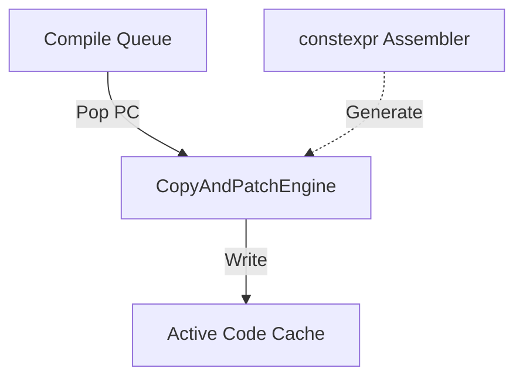
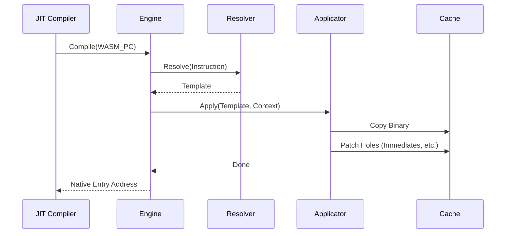

# Copy-and-Patch Engine コンポーネント設計書

## 1. コンセプト
<!-- traceability: {JIT_CopyAndPatch} {JIT_ZeroCompileCostTheorem} {LowLatencyJIT} {SinglePassCompilation} -->
Copy-and-Patch Engine は、WASM 命令に対応する事前生成されたネイティブコードテンプレートを結合・修正することで、ネイティブ実行バイナリを高速に生成する JIT コンパイラの核心部である。レジスタ割り当てや命令選択などの計算コストの高い最適化をビルド時にオフロードし、実行時は単純なメモリコピーと特定箇所への定数書き込み（パッチ）のみを行うことで、「Zero Compile Cost」を目指す。 `{JIT_CopyAndPatch}` `{JIT_ZeroCompileCostTheorem}` `{LowLatencyJIT}` `{SinglePassCompilation}`

## 2. アーキテクチャ分類
<!-- traceability: {META_3TierSeparation} {JIT_CopyAndPatch} -->
本コンポーネントは **Tier 3 (詳細リーフコンポーネント: Leaf Component)** に属し、JIT コンパイラ (`jit_compiler.md`) から分解された事前生成ネイティブ命令テンプレートのコピー＆パッチ結合エンジンを担当する。 `{META_3TierSeparation}` `{JIT_CopyAndPatch}`

## 3. 静的モデル

### 3.1 データ構造
- **`CopyAndPatchEngine`**: テンプレートの選択、コピー、およびパッチ適用を一括して行う主要クラス。
- **命令テンプレート**: パッチ用の「穴」を含むネイティブ命令列の雛形。
- **パッチ定義**: テンプレート内の修正箇所のメタデータ。

### 3.2 内部ブロック図


### 3.3 主要なクラス・構造体・配列・定数


#### コピーアンドパッチエンジン（CopyAndPatchEngine）クラス
テンプレートの解決とバイナリ操作をカプセル化する。

| 項目名 | 機能と役割 | 型分類 | サイズ・制約 |
| :--- | :--- | :--- | :--- |
| テンプレート辞書 | WASM命令に対応するJITテンプレートの検索索引 | アクセス辞書 | `jit_template_map` |
| アセンブラ参照 | 実行時に補助的な命令生成を行う場合のインターフェイス | 構造体への参照 | [`constexpr_assembler`](jit_assembler_constexpr.md) (非所有) |

#### 命令テンプレート（jit_template）
<!-- traceability: {JIT_RegisterMapping} {ContextPointerRegister} {EnvironmentPointer} {ADR_TosCacheAsymmetry} -->
WASM命令に対応するネイティブバイナリの雛形。インタープリタの `opcode_handler` と完全整合する `__fastcall` CPS 3引数呼び出し規約（`R0`: `ip`, `R1`: `stack_bot`, `R2`: `env`）に基づいて設計される。スタックボトム渡しにより `R3`（Caller-saved）および `R4-R6, R8-R11`（Callee-saved 計7本）をトレース単位の任意割当プール（スタックトップキャッシュ TOS/NOS/NNOS、コンテキストスピル mem_base/local_base、ローカル変数スロット、ループカウンタ）として活用できる。`local_base` は呼び出し元ごとに絶対位置が異なる実行時値であるためトレース入口で毎回ロードされるが、`sp_offset`（オペランドスタック深さ）はそこからの静的既知オフセットとしてパッチ適用時に即値化されるため、独立したレジスタ役割は持たない。JIT コンパイラはトレース解析結果に応じて最適なテンプレートバリアントを選択・結合する。 `{JIT_RegisterMapping}` `{ContextPointerRegister}` `{EnvironmentPointer}` `{ADR_TosCacheAsymmetry}`

| 項目名 | 機能と役割 | 型分類 | サイズ・制約 |
| :--- | :--- | :--- | :--- |
| 命令バイナリ | ネイティブ命令列の実体 | バイナリビュー | ROM参照 |
| パッチ箇所数 | テンプレート内で修正（パッチ）が必要なスロットの数 | エントリ数 | 8/16bit |
| パッチ情報 | 各パッチ位置のオフセットと修正方法（「絶対アドレスへの書き込み」「相対オフセットの加算」「レジスタ番号の置換」等の具体的なパッチ適用方法）を定義する情報の配列 | バイナリビュー | - |
| レジスタ規約 | JIT トレースとインタープリタ間で**共有される**物理レジスタ規約 | 規約定義 | `R0`: `ip`<br>`R1`: `stack_bot`<br>`R2`: `env`<br>`R3`: **`Spill / Scratch`（任意ピン留め / スクラッチ）** |
| トレース内レジスタ | JIT トレース内部に**閉じた** Callee-saved 任意割当プール | 規約定義 | `R4-R6, R8-R11` (計7本): TOS/NOS/NNOS、mem_base、local_base、local変数、ループカウンタ<br>（トレース先頭で `PUSH`、脱出時にダーティ書き戻し＋ `POP`） `{ADR_TosCacheAsymmetry}` |

## 4. 動的モデル

### 4.1 アルゴリズム
<!-- traceability: {LowLatencyJIT} {JIT_CopyAndPatch} {JIT_RuntimeAPI_Fallback} {ContextPointerRegister} {VERIFY_FORMAL} -->

#### トレースコンパイル手順
1. **トレース解析とレジスタ役割バインディング決定**: トレース内の命令構成（メモリ/ローカル/スタック/ループ）に基づき、`R3` および Callee-saved レジスタ群（`R4-R6, R8-R11`）への最適な役割バインディング（TOS/NOS/NNOS, mem_base, local_base, local変数, ループカウンタ）を決定する。
2. **テンプレート・バリアント選択**: 命令およびレジスタバインディング状態に対応する `jit_template`（Stencil Variant）を取得する。
3. **コードコピー & プロローグ生成**: キャッシュの空き領域に使用する Callee-saved レジスタの `PUSH` および初期値ロード（`LDR`）を配置し、テンプレートの命令列をコピーする。
4. **パッチ適用 & AAPCS 外部関数呼び出し境界**:
    - 命令内に含まれる即値（定数）をテンプレートの指定位置に書き込む。
    - ランタイムAPIのアドレスをパッチする。
    - 分岐命令の相対オフセットを計算してパッチする。
    - **外部 AAPCS 関数（WASI/vMMIO等）呼び出し**: Caller-saved レジスタ `(R0-R3, R12, LR)` を退避し、SP を 8 バイト境界に整列して `BL` 発行、復帰後に Caller-saved を復元するスタブをインライン展開。Callee-saved レジスタ（`R4-R11`）は AAPCS により安全に保全される。
5. **インタープリタ継続渡し整合 (CPS / __fastcall Tail Call & AAPCS Callee-saved 保全)**:
    - JIT トレースの出口やフォールバック箇所では、レジスタ R0〜R2 に最新の `(ip, stack_bot, env)` を載せ、ダーティなレジスタ（TOS/NOS、ローカル変数）を統合スタックへ書き戻した上で Callee-saved レジスタを `POP` 復元し、インタープリタの次命令ハンドラへ直接末尾ジャンプ（`BX`）する。コンテキストの再構築は発生しない。 `{JIT_RuntimeAPI_Fallback}` `{ADR_TosCacheAsymmetry}`
    - **トレース入口**では逆に、プロローグで Callee-saved レジスタを `PUSH` 退避し、統合スタック上の値をレジスタへロードしてからトレース本体に入る。Callee-saved レジスタの生存区間は単一トレース内部に閉じており、呼び出し元の値は AAPCS 規約通り完全に保全される。 `{ADR_TosCacheAsymmetry}`
6. **ポインタ更新**: キャッシュの使用済みサイズを更新する。

#### Copy-and-Patch JIT フルセット・コンセプトコード (`concepts/jit_copy_patch_concept.py`)
```python
class MPUAttribute:
    RO_X = "RO_X"      # Read-Only + Executable (Native Execution)
    RW_XN = "RW_XN"    # Read-Write + Non-Executable (Patching)


class MPUFault(Exception):
    pass


class CopyPatchJITEngine:
    def __init__(self, cache_size: int = 1024):
        self.code_cache = ["NOP"] * cache_size
        self.mpu_attr = MPUAttribute.RO_X
        self.barrier_flushes = 0
        self.current_write_pos = 0

        # R0=ip, R1=stack_bot, R2=env are shared with the interpreter and are never
        # written by a trace. R3=scratch. R4=TOS / R5=NOS are trace-local: the prologue
        # fills them from the unified stack, the epilogue flushes them back.
        # SP is never touched (no C stack frame).
        self.stencils = {
            "prologue": ["LDR R4, [R1, #__TOS_OFF__]", "LDR R5, [R1, #__NOS_OFF__]"],
            "i32_const": ["STR R5, [R1, #__SPILL_OFF__]", "MOV R5, R4",
                          "MOVW R4, #__IMM_LO__", "MOVT R4, #__IMM_HI__"],
            "i32_add": ["ADD R4, R5, R4", "LDR R5, [R1, #__FILL_OFF__]"],
            "epilogue": ["STR R4, [R1, #__TOS_OFF__]", "STR R5, [R1, #__NOS_OFF__]", "BX R3"],
        }

    def begin_jit_patch(self):
        """Switches JIT Code Cache MPU attribute to RW + XN (W^X Protection)."""
        self.mpu_attr = MPUAttribute.RW_XN

    def commit_jit_patch(self):
        """Restores MPU attribute to RO + X and issues __DSB(); __ISB(); barriers."""
        assert self.mpu_attr == MPUAttribute.RW_XN
        self.mpu_attr = MPUAttribute.RO_X
        self.barrier_flushes += 1  # Hardware barrier sync

    def write_instruction(self, offset: int, instruction: str):
        if self.mpu_attr != MPUAttribute.RW_XN:
            raise MPUFault("W^X VIOLATION: Attempted write to non-writable code memory")
        self.code_cache[offset] = instruction

    def compile_basic_block(self, wasm_ops: list[tuple[str, object]]) -> tuple[int, int]:
        """Batches Stencil copy & relocation patching inside a single W^X transaction."""
        start_offset = self.current_write_pos

        # 1. Begin W^X Transaction (RW + XN)
        self.begin_jit_patch()

        # 2. Emit Prologue
        for inst in self.stencils["prologue"]:
            self.write_instruction(self.current_write_pos, inst)
            self.current_write_pos += 1

        # 3. Emit WASM Ops with Relocation Patching
        for op, arg in wasm_ops:
            if op == "i32.const":
                imm = int(arg)
                self.write_instruction(self.current_write_pos, f"MOVW R0, #{imm & 0xFFFF}")
                self.write_instruction(self.current_write_pos + 1, f"MOVT R0, #{(imm >> 16) & 0xFFFF}")
                self.write_instruction(self.current_write_pos + 2, "STR R0, [SP, #0]")
                self.current_write_pos += 3
            elif op == "i32.add":
                for inst in self.stencils["i32_add"]:
                    self.write_instruction(self.current_write_pos, inst)
                    self.current_write_pos += 1

        # 4. Emit Epilogue
        for inst in self.stencils["epilogue"]:
            self.write_instruction(self.current_write_pos, inst)
            self.current_write_pos += 1

        # 5. Commit W^X Transaction (RO + X + Barriers)
        self.commit_jit_patch()

        return (start_offset, self.current_write_pos - start_offset)
```

### 4.2 状態遷移図
本コンポーネントはステートレスなプロセッサとして動作するため、状態遷移は省略する。

### 4.3 内部シーケンス


## 5. インターフェイス定義

### 5.1 公開API


#### トレースコンパイル（compile_trace）

| 項目 | 内容 |
| :--- | :--- |
| 機能概要 | WASM命令列をネイティブコードへ変換し、キャッシュへ書き込む。 |
| シグネチャ | `auto compile_trace(uint32_t pc, uint8_t* dest, size_t dest_size, const RuntimeContext* runtime) noexcept -> int32_t` |
| 引数 | `pc`: コンパイル開始位置を示す WASM PC<br>`dest`: ネイティブコードの書き込み先バッファの先頭ポインタ<br>`dest_size`: 書き込み先バッファの最大サイズ（バイト単位。バッファオーバーランを防止）<br>`runtime`: 実行環境ポインタ（WASM実行時のメモリ配置やコンテキスト情報を保持） |
| 戻り値 | `int32_t`（成功時は生成・書き込みしたネイティブコードの総 `バイト数`（正の値）を返し、バッファ不足や非対応命令などの失敗時は負のエラーコード（例：`-1` = バッファ不足、`-2` = 未サポート命令）を返す） |

## 6. 制約達成の方策

### 6.1 性能制約と最優先設計方針
<!-- traceability: {LowLatencyJIT} {JIT_CopyAndPatch} {JIT_RuntimeAPI_Fallback} -->
- **最優先設計方針**: 本コンパイラは、コンパイルレイテンシの最小化を最優先の設計目標とする。最適化のほとんどはビルド時に事前に行われており、実行時のオーバーヘッドを極限まで低減させる。 `{LowLatencyJIT}`
- **Copy-and-Patchによる時間短縮**: `{JIT_CopyAndPatch}` により、コンパイル時にレジスタ割り当てやアセンブル処理を実行せず、事前アセンブルされた命令テンプレートを単純コピー・穴埋め（パッチ）するだけにすることで、コンパイル時間を理論上の最速値まで圧縮する。 `{JIT_CopyAndPatch}`
- **複雑なエッジケースのオフロード**: ランタイムAPIフォールバック `{JIT_RuntimeAPI_Fallback}` により、JITエンジン自体のロジックを肥大化させず、複雑な浮動小数点演算や例外エミュレーションなどをヘルパー関数呼び出しに落とし込み、コンパイルパスを単一（Single-Pass）で超高速に完結させる。 `{JIT_RuntimeAPI_Fallback}`

### 6.2 3層分離設計 (3-Tier Separation)
<!-- traceability: {META_3TierSeparation} -->
- **3層構造における役割**: 本コンポーネントは、システムアーキテクチャにおける「Tier 3 (実装ドメイン)」として位置付けられる。上位の「Tier 2 (サブシステムドメイン)」である `jit_compiler` が定義する抽象インターフェイスと、「Tier 1」に属する全体的なシステムコンフィグから、完全に独立した具体的なマシンコード生成・バイナリ操作の実装に特化する。 `{META_3TierSeparation}`
- **依存性管理**: 上位レイヤー（スケジューラやランタイム）の構造体や内部状態に直接依存することはせず、依存関係はすべて引数ポインタやシステムハーネスなどのインターフェイス層を経由して疎結合に管理される。 `{META_3TierSeparation}`
