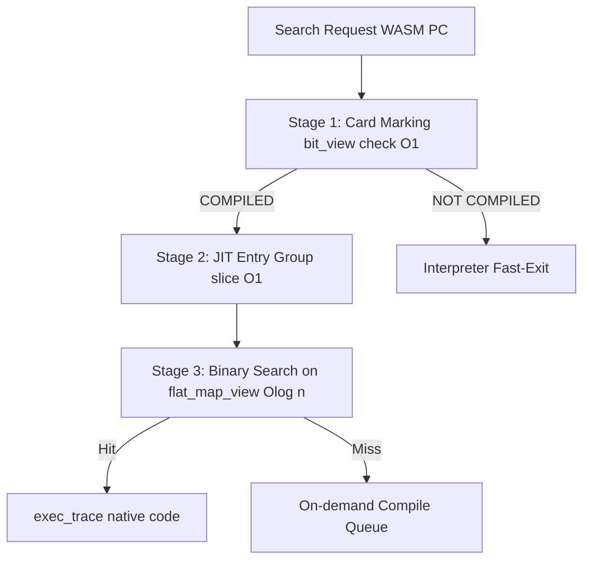
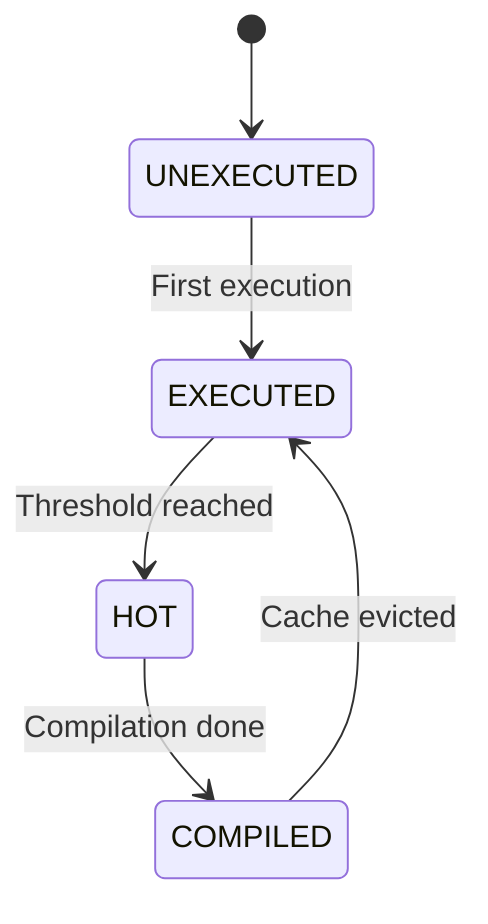

# JIT ランタイム管理 コンポーネント設計書 {VERIFY_FORMAL} {VERIFY_LLM} {VERIFY_BENCHMARK}
<!-- evidence:
     formal: formal/jit_cache_model.py
     benchmark: benchmarks/jit_zero_compile_cost_bench.py
     concept: concepts/stack_cache_concept.py
     test: tests/jit_runtime_test_spec.md
-->

## 1. コンセプト
<!-- traceability: {SimpleJITArchitecture} {JIT_MultiBuffer_Cache} {JIT_OldestOnly_Promote} {META_FlatMapIndexed} {META_BinarySearch} {LowLatencyJIT} {HistoryBuffer} {GLOBAL_PeriodicTask} -->
JIT ランタイム管理は、WASM PC とネイティブコードの紐付け検索、3面世代交代コードキャッシュのローテーション、およびホットスポット検出を一括して担う。インタープリタ実行ループ内の超高頻度パスにおいて、**カードマーキング表 (`bit_view<2>`)** による $O(1)$ 事前判定、**JITエントリグループインデックス** による $O(1)$ 探索区間絞り込み、およびソート済みエントリ配列に対する二分探索（`fireball::flat_map_view`）を組み合わせた 3 段パイプラインにより、動的キャッシュ代謝と低遅延検索を両立する。 `{SimpleJITArchitecture}` `{JIT_MultiBuffer_Cache}` `{JIT_OldestOnly_Promote}` `{META_FlatMapIndexed}` `{META_BinarySearch}` `{LowLatencyJIT}` `{HistoryBuffer}` `{GLOBAL_PeriodicTask}`

## 2. アーキテクチャ分類
<!-- traceability: {META_3TierSeparation} {SimpleJITArchitecture} -->
本コンポーネントは **Tier 3 (詳細リーフコンポーネント: Leaf Component)** に属し、JIT サブシステムのうち実行時検索、3面コードキャッシュ管理、局所アンリンク、およびホットスポット検出を担当する。コード生成コアは [`jit_compiler.md`](jit_compiler.md) が担当する。 `{META_3TierSeparation}` `{SimpleJITArchitecture}`

## 3. 静的モデル

### 3.1 データ構造
- **統一プログラムカウンタ (`UnifiedPC` / `wasm_pc_t`)**: モジュール全体の全関数・全命令を一意に識別する 32-bit 整数。
  - **構造**: `(func_index << 16) | (bytecode_offset & 0xFFFF)`
    - **上位 16-bit (`func_index`)**: モジュール内の関数インデックス（0 〜 65,535）。
    - **下位 16-bit (`bytecode_offset`)**: 当該関数のバイトコード内オフセット（0 〜 65,535 バイト）。
  - **役割**: 複数関数を含む WASM モジュールにおいて、HotspotBitmap、HistoryRing、JITTraceHeader、JITCacheLookup、Trace Chaining 全域で関数間の PC 衝突を防止し、一意な追跡とディスパッチを保証する。
- **`JitEntryIndex`**: WASMオフセットとネイティブコードの対応付け、および 3 段高速検索ロジックをカプセル化した主要クラス。
- **カードマーキング表 (Card Marking Table)**: 関数ごとのコード領域を 8 バイト単位のカードで分割管理する 2 ビット状態表。密ビュー `fireball::bit_view<2>` として参照（1 バイトあたり 4 カード = 32 バイト分のコード領域）。`card_idx = bytecode_offset >> FB_CONF_JIT_CARD_SHIFT`（デフォルト: `3`）。
  - `0: UNEXECUTED` (未実行)
  - `1: EXECUTED` (実行済み)
  - `2: HOT` (コンパイル要求中)
  - `3: COMPILED` (コンパイル済み / オンデマンド許可)
- **JITエントリグループインデックス**: 二分探索の範囲を $O(1)$ で絞り込むための粗索引配列（固定長配列）。
- **JITエントリ表**: ソート済みの `jit_entry` 配列。非所有ビュー `fireball::flat_map_view` として参照される。
- **JITコードキャッシュ (3面)**: `Bank 0 (Active)`, `Bank 1 (Warm)`, `Bank 2 (Oldest)` の 3 バンク循環バッファ（2KB x 3 = 6KB）。
- **バンク別被チェイン逆引きテーブル (Inbound Chain Index Table)**: 各キャッシュバンクへ向けた直接チェインリンク元（ソース）の JIT エントリインデックスを保持する固定長配列。
- **実行履歴バッファ**: 短期間の実行履歴を一時的に保持するリングバッファ。 `{HistoryBuffer}`

### 3.2 内部ブロック図

### 3.3 主要なクラス・構造体・配列・定数

#### JITエントリインデックス（JitEntryIndex）クラス
| 項目名 | 機能と役割 | 型分類 | サイズ・制約 |
| :--- | :--- | :--- | :--- |
| エントリ配列 | ソート済みの `jit_entry` 群を保持する | ソート済み配列 | `radix_binary_tree_view` で参照 |
| エントリグループ索引 | JITエントリグループごとの開始・終了インデックス（Radix Table） | 固定長配列 | $O(1)$ 直接参照 |
| カードマーキング表 | カードごとの 2-bit 状態表 | 密ビュー | `fireball::bit_view<2>` |
| 被チェイン逆引きテーブル | バンクごとの被チェイン元 JIT エントリインデックス配列 | 固定長配列の配列 | `FB_CONF_JIT_MAX_INBOUND_CHAINS_PER_BANK` |
| 履歴バッファ | 判定契機までの一時的な実行記録 | リングバッファ | `offset` の配列 `{HistoryBuffer}` |

## 4. 動的モデル

### 4.1 アルゴリズム
1. **カードマーキング確認 ($O(1)$)**: カードマーキング表 (`bit_view<2>`) を $O(1)$ で確認し、状態が `COMPILED` でなければ即座に終了。
2. **Radix Table 絞り込み ($O(1)$)**:
   - `UnifiedPC`（`(func_index << 16) | bytecode_offset`）の最下位バイト（最も変動頻度が高い `bytecode_offset` 下位ビット）を最上位へ投影するため、**32-bit バイトオーダー逆転（`bswap32(pc)`）** を適用する。
   - `radix_key = bswap32(pc)` に対し基数シフト（`prefix = radix_key >> radix_shift`）を行い、コンパクトな開始インデックス配列から `first = radix_table[prefix]`, `last = radix_table[prefix + 1]` を $O(1)$ で取得（ペア保持が不要でメモリフットプリント半減）。全バケットへの完全一様分散（バケット利用率 100%）を実現する。
3. **有界二分探索 ($O(\log n)$)**: `radix_binary_tree_view` 内の有界区間から対象の命令オフセットを二分探索し、ヒットした場合はネイティブコードのアドレス（`exec_trace`）を返す。
4. **ホットスポット昇格判定**: yield 時等に履歴バッファを走査し、実行頻度が閾値に達したカードを `HOT` $\to$ `COMPILED` に遷移させてコンパイル待ち列へ登録。
5. **3面世代交代ローテーション＆局所アンリンク ($O(k)$)**: Active バンク満杯時、`Oldest` バンクをパージして新 `Active` に再利用する直前に、該当バンクの被チェイン逆引きテーブルに登録されたソースエントリ（$k$ 件）のみを参照し、昇格済みなら再チェイニング、完全破棄なら復帰スタブへアンパッチする。全件走査を行わない。 `{JIT_MultiBuffer_Cache}` `{JIT_OldestOnly_Promote}`

### 4.2 状態遷移図

## 5. インターフェイス定義

### 5.1 公開API

#### 検索（lookup）
| 項目 | 内容 |
| :--- | :--- |
| 機能概要 | 命令オフセットに対応するネイティブコードアドレス（`exec_trace` 型）を返す。 |
| シグネチャ | `lookup(pc: オフセット) -> result<exec_trace, jit_lookup_result_t>` |
| 戻り値 | 成功時はネイティブ実行エントリ、失敗時は `ERR_NOT_COMPILED` 等のステータス |

#### エントリ登録（register_entry）
| 項目 | 内容 |
| :--- | :--- |
| 機能概要 | 新しい命令オフセットとコードアドレスのペアを登録し、エントリグループ索引を更新する。 |
| シグネチャ | `register_entry(pc: オフセット, offset: オフセット) -> void` |

## 6. 制約達成の方策

### 6.1 性能制約
- **方策**: カードマーキング表 (`bit_view<2>`) による $O(1)$ 事前判定、JITエントリグループインデックスによる $O(1)$ 範囲絞り込み、およびソート済みエントリ配列（`flat_map_view`）の二分探索（$O(\log n)$）の多段合成により、極めて高速な検索を維持する。

### 6.2 メモリ制約
<!-- traceability: {JIT_MultiBuffer_Cache} -->
- **方策**: `{JIT_MultiBuffer_Cache}` による 3面循環バッファと最古限定昇格により、断片化を防ぎつつ、実行頻度の低いコードを自然に破棄（代謝）させる。

