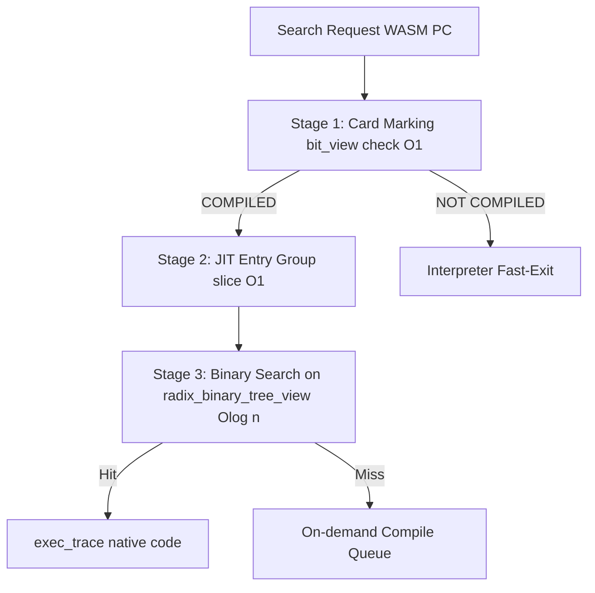
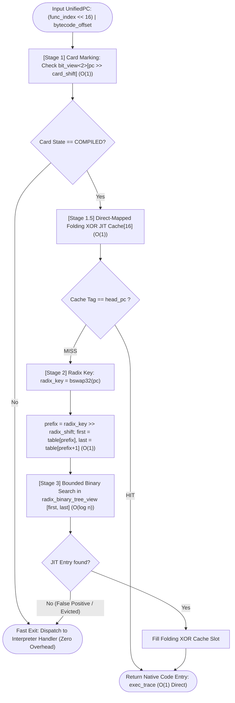
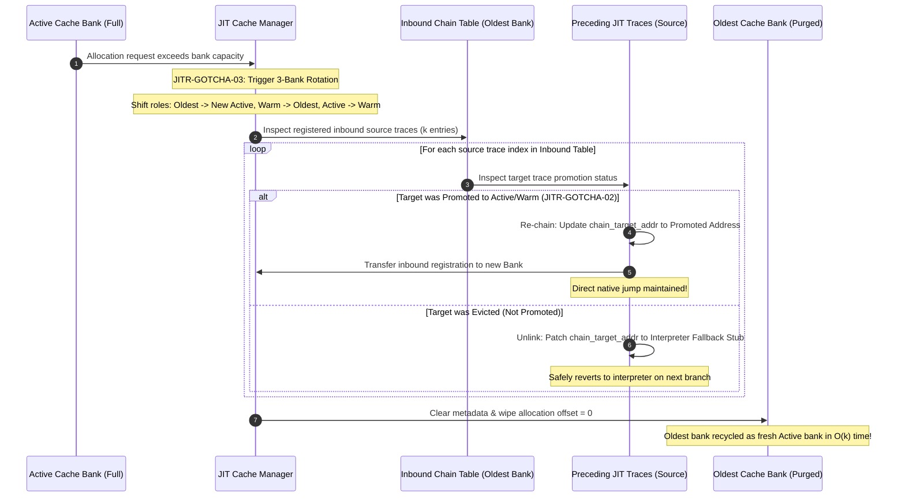
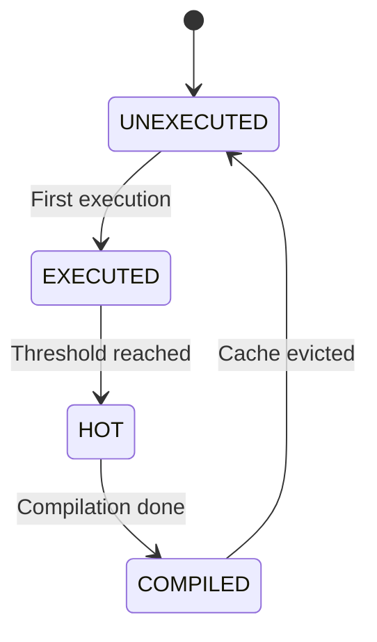
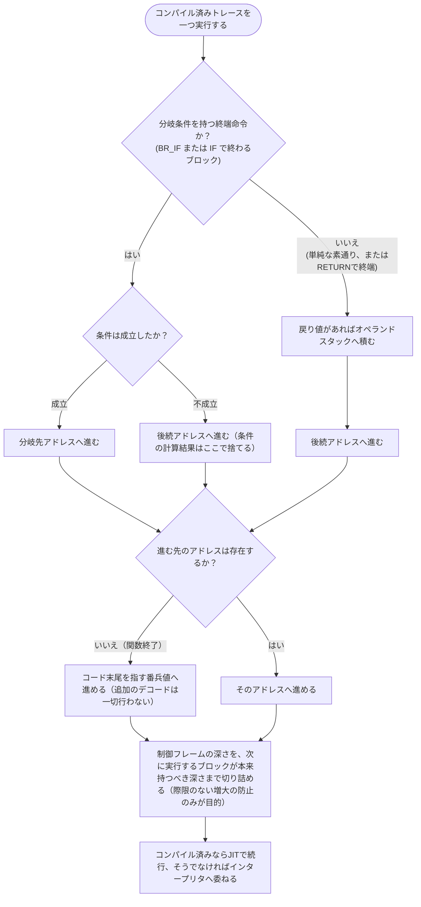

# JIT ランタイム管理 コンポーネント設計書 {VERIFY_FORMAL} {VERIFY_LLM} {VERIFY_BENCHMARK}
<!-- evidence:
     formal: formal/jit_cache_model.py
     benchmark: benchmarks/jit_zero_compile_cost_bench.py
     concept: concepts/stack_cache_concept.py
     test: tests/jit_runtime_test_spec.md
-->

## 1. コンセプト
<!-- traceability: {SimpleJITArchitecture} {JIT_MultiBuffer_Cache} {JIT_OldestOnly_Promote} {META_AccessDictionary} {META_BinarySearch} {LowLatencyJIT} {HistoryBuffer} {GLOBAL_PeriodicTask} -->
JIT ランタイム管理は、WASM PC とネイティブコードの紐付け検索、3面世代交代コードキャッシュのローテーション、およびホットスポット検出を一括して担う。インタープリタ実行ループ内の超高頻度パスにおいて、**カードマーキング表 (`bit_view<2>`)** による $O(1)$ 事前判定、**JITエントリグループインデックス** による $O(1)$ 探索区間絞り込み、およびソート済みエントリ配列に対する有界二分探索（`fireball::radix_binary_tree_view`）を組み合わせた 3 段パイプラインにより、動的キャッシュ代謝と低遅延検索を両立する。 `{SimpleJITArchitecture}` `{JIT_MultiBuffer_Cache}` `{JIT_OldestOnly_Promote}` `{META_AccessDictionary}` `{META_BinarySearch}` `{LowLatencyJIT}` `{HistoryBuffer}` `{GLOBAL_PeriodicTask}`

## 2. アーキテクチャ分類
<!-- traceability: {META_3TierSeparation} {SimpleJITArchitecture} -->
本コンポーネントは **Tier 3 (詳細リーフコンポーネント: Leaf Component)** に属し、JIT サブシステムのうち実行時検索、3面コードキャッシュ管理、局所アンリンク、およびホットスポット検出を担当する。コード生成コアは [`jit_compiler.md`](jit_compiler.md) が担当する。 `{META_3TierSeparation}` `{SimpleJITArchitecture}`

## 3. 静的モデル

### 3.1 データ構造
- **統一プログラムカウンタ (`UnifiedPC` / `wasm_pc_t`)**: モジュール全体の全関数・全命令を一意に識別する 32-bit 整数。
  - **構造**: `(func_index << 16) | (bytecode_offset & 0xFFFF)`
    - **上位 16-bit (`func_index`)**: モジュール内の関数インデックス（0 〜 65,535）。
    - **下位 16-bit (`bytecode_offset`)**: 当該関数のバイトコード内オフセット（0 〜 65,535 バイト）。
  - **役割**: 複数関数を含む WASM モジュールにおいて、HotspotBitmap、HistoryRing、JITTraceHeader、JITCacheLookup、Trace Chaining 全域で関数間の PC 衝突を防止し、一意な追跡とディスパッチを保証する。
- **`JitEntryIndex`**: WASMオフセットとネイティブコードの対応付け、および 3 段高速検索ロジックをカプセル化した主要クラス。
- **カードマーキング表 (Card Marking Table)**: 関数ごとのコード領域を 8 バイト単位のカードで分割管理する 2 ビット状態表。密ビュー `fireball::bit_view<2>` として参照（1 バイトあたり 4 カード = 32 バイト分のコード領域）。`card_idx = bytecode_offset >> FB_CONF_JIT_CARD_SHIFT`（デフォルト値: `3`）。
  - `0: UNEXECUTED` (未実行)
  - `1: EXECUTED` (実行済み)
  - `2: HOT` (コンパイル要求中)
  - `3: COMPILED` (コンパイル済み / オンデマンド許可)
- **コンパイル対象可否マスク (Trackable Mask)**: `next_pc` を持ち、かつバイト長が `min_trace_bytes` 以上のブロックだけをロード時に一度マークする 1 ビット状態表。密ビュー `fireball::bit_view<1>` として、カードマーキング表とは別の固定長バッファで参照する。実行時のディスパッチはこの 1 ビットを引くだけでカードマーキング表の更新対象か判定でき、ブロックの静的メタデータ（`next_pc`・バイト長）をディスパッチのたびに参照し直す必要がない。 `{TrackableBlockMask}`
- **JITエントリグループインデックス**: 二分探索の範囲を $O(1)$ で絞り込むための粗索引配列（固定長配列）。
- **JITエントリ表**: ソート済みの `jit_entry` 配列。非所有基数木ビュー `fireball::radix_binary_tree_view` として参照される。
- **JITコードキャッシュ (3面)**: `Bank 0 (Active)`, `Bank 1 (Warm)`, `Bank 2 (Oldest)` の 3 バンク循環バッファ（2KB x 3 = 6KB）。
- **オンデマンドコンパイルキュー (On-demand Compile Queue)**: `HOT` に達した命令オフセットを保持する固定容量 LIFO キュー（`fireball::static_vector` 相当）。容量に達した時点で §4.1 のバッチコンパイルが即座に実行されて空になるため、この固定容量を上回ることはない。 `{JIT_ReverseCompilationOrder}` `{GLOBAL_Policy_Memory}`
- **バンク別被チェイン逆引きテーブル (Inbound Chain Index Table)**: 各キャッシュバンクへ向けた直接チェインリンク元（ソース）の JIT エントリインデックスを保持する固定長配列。
- **実行履歴バッファ**: 短期間の実行履歴を一時的に保持するリングバッファ。 `{HistoryBuffer}`

### 3.2 内部ブロック図

### 3.3 主要なクラス・構造体・配列・定数

#### JITエントリインデックス（JitEntryIndex）クラス
| 項目名 | 機能と役割 | 型分類 | サイズ・制約 |
| :--- | :--- | :--- | :--- |
| 高速スロット配列 | 4-bit Folding XOR Hash による Direct-Mapped キャッシュ | 固定長配列 | 16スロット (`{DirectMappedJIT16}`) |
| エントリ配列 | ソート済みの `jit_entry` 群を保持する | ソート済み配列 | `radix_binary_tree_view` で参照 |
| エントリグループ索引 | JITエントリグループごとの開始・終了インデックス（Radix Table） | 固定長配列 | $O(1)$ 直接参照 |
| カードマーキング表 | カードごとの 2-bit 状態表 | 密ビュー | `fireball::bit_view<2>` |
| 被チェイン逆引きテーブル | バンクごとの被チェイン元 JIT エントリインデックス配列 | 固定長配列の配列 | `FB_CONF_JIT_MAX_INBOUND_CHAINS_PER_BANK` |
| 履歴バッファ | 判定契機までの一時的な実行記録 | リングバッファ | `offset` の配列 `{HistoryBuffer}` |

## 4. 動的モデル

### 4.1 アルゴリズム
1. **カードマーキング確認 ($O(1)$)**: カードマーキング表 (`bit_view<2>`) を $O(1)$ で確認し、状態が `COMPILED` でなければ即座に終了。
2. **Direct-Mapped Folding XOR キャッシュ確認 ($O(1)$, `{DirectMappedJIT16}`)**:
   - `UnifiedPC` に対し 4-bit Folding XOR Hash `slot = ((pc >> 24) ^ (pc >> 16) ^ (pc >> 8) ^ pc) & 0x0F` を計算し、16 スロットの高速テーブルを照合。
   - スロットのタグが `head_pc` と一致（Hit）した場合、Radix Table および二分探索を完全バイパスし、$O(1)$ でトレースを即時返却。
3. **Radix Table 絞り込み ($O(1)$)**:
   - キャッシュミス時、`UnifiedPC`（`(func_index << 16) | bytecode_offset`）の最下位バイト（最も変動頻度が高い `bytecode_offset` 下位ビット）を最上位へ投影するため、**32-bit バイトオーダー逆転（`bswap32(pc)`）** を適用する。
   - `radix_key = bswap32(pc)` に対し基数シフト（`prefix = radix_key >> radix_shift`）を行い、コンパクトな開始インデックス配列から `first = radix_table[prefix]`, `last = radix_table[prefix + 1]` を $O(1)$ で取得（ペア保持が不要でメモリフットプリント半減）。下位ビットの分散により偏りを抑えた区間検索を実現する。
4. **有界二分探索 ($O(\log n)$)**: `radix_binary_tree_view` 内の有界区間から対象の命令オフセットを二分探索し、ヒットした場合はネイティブコードのアドレス（`exec_trace`）を返し、高速スロットへ次回用として格納（Fill）。
5. **ホットスポット昇格判定**: yield 時等に履歴バッファを走査し、実行頻度が閾値に達したカードを `HOT` $\to$ `COMPILED` に遷移させてコンパイル待ち列へ登録。
6. **最小トレース長フィルタ**: 推定コンパイル後サイズが 1 カード分（`1 << card_shift`）未満のベーシックブロックは、履歴記録・`touch`・コンパイル待ち列登録のいずれの対象にもしない（`jit_runtime_test_spec.md` JITR-06）。
7. **3面世代交代ローテーション＆局所アンリンク (`JITR-GOTCHA-03`, `{JIT_MultiBuffer_Cache}`, `{JIT_OldestOnly_Promote}`)**:
   Active バンク満杯時、`Oldest` バンクをパージして新 `Active` に再利用する直前に、該当バンクの被チェイン逆引きテーブルに登録されたソースエントリ（$k$ 件）のみを参照し、昇格済みなら再チェイニング、完全破棄なら復帰スタブへアンパッチする。全件走査を行わない。また、`rotate()` および `flush_all()` 実行時には 16 スロットの Folding XOR 高速キャッシュを無効化（クリア）し、古いバンクへの誤参照やダングリングを防止する（`JITR-GOTCHA-05`）。
   **設計理由と不変条件**: 3 面キャッシュの全エントリを線形走査してリンクを解除すると、GC（ガベージコレクション）と同様の実行停止レイテンシ（Stop-the-World）が発生する。被チェイン逆引きテーブルにより影響範囲を定数 $k$ 件に局所化することで、決定論的 $O(k)$ 時間での世代交代を保証する。
8. **トレース昇格時のインバウンドソース付け替え (`JITR-GOTCHA-02`)**:
   Oldest バンクのトレースが再実行されて新 Active バンクへ昇格（Promotion）した際、当該トレースを指していた先行ブロックのチェインリンク先アドレスを新バンクのアドレスへ不可分に更新し、かつ逆引きテーブルの登録先も新バンクへ確実に付け替える。これにより、古い Oldest バンクがパージされた後に先行ブロックが解放済み領域へ飛び込むダングリングジャンプを完全に防止する。
9. **キュー処理時のキャッシュ再確認と二重コンパイル抑止 (`JITR-GOTCHA-01`)**:
   コンパイル待ち列から取り出した PC が、既に 3 面キャッシュ（Active / Warm / Oldest）のいずれかに常駐済みであれば再コンパイルを行わず、カード状態のみ `COMPILED` へ同期する。
   **設計理由と不変条件**: 複数回のアイドル走査や非同期イベントにより同一 PC に対するコンパイル要求が重複してエンキューされた場合でも、二重コンパイルによる貴重なキャッシュ容量の浪費と CPU 時間の損失を完全に防止する。

#### 3段高速検索パイプライン手順（手順アクティビティ図）
<!-- traceability: {JIT_MultiBuffer_Cache} {LowLatencyJIT} {DirectMappedJIT16} {META_BinarySearch} -->
実行時 PC からネイティブ `exec_trace` アドレスを極小オーバーヘッドで特定する探索パイプラインを示す。

#### 3面世代交代ローテーションと被チェイン局所アンリンク（責務シーケンス図）
<!-- traceability: {JITR-GOTCHA-02} {JITR-GOTCHA-03} {JIT_MultiBuffer_Cache} {JIT_LazyChaining} -->
Active バンク満杯時の世代交代において、Oldest バンクをパージし新 Active として再利用する際の、JIT Runtime、Inbound Table、Source Traces 間の局所アンリンク・再チェイニング連携を示す。

### 4.2 状態遷移図

Eviction resets to `UNEXECUTED`, not `EXECUTED`（`jit_runtime_test_spec.md` JITR-04）。

### 4.3 トレース実行時の分岐解決とインタープリタ復帰（pysim参照実装）
<!-- traceability: {JIT_RuntimeAPI_Fallback} {DirectBytecodeExecution} -->
`jit_compiler.md` §3.3 の「制御フロー・コール境界のインタープリタ委譲不変条件」を、pysim 参照実装がどのように満たしているかを示す。モジュールロード時に一度だけ行う静的解析で、各基本ブロックに次の付帯情報を持たせておくことで、実行時の分岐解決を定数時間で行える。

| 付帯情報 | 意味 |
| :--- | :--- |
| 後続アドレス | 分岐条件が不成立（素通り）だった場合に続くブロックの先頭。関数の終わりで戻る場合は「存在しない」を表す特別な値になる |
| 分岐先アドレス | 分岐条件が成立した場合に実際に飛ぶ先。ループの継続であれば当該ループの先頭、ループやブロックからの脱出であれば、それを囲む構文の終わりの直後 |
| フレーム深さ | このブロックの先頭に到達した時点で、周囲を囲む `block`/`loop`/`if` 由来の制御フレームがいくつ積まれているべきかという個数。静的解析の一回きりの走査でこの時点の入れ子の深さがそのまま確定する |
| 命令列長 | このブロック自身が実際に占める命令バイト数。コンパイルする価値があるかどうかの足切り判定にのみ用いる |

命令列長は、後続アドレスから自分自身の先頭アドレスを引いて求めては**ならない**。ループ本体の末尾から自分自身より前のアドレスへ戻る後方分岐を持つブロックでは、この引き算が負の値になってしまい、「短すぎる」と誤判定されてコンパイル対象から永久に除外されてしまう。命令列長は、そのブロックが持つ命令バイト数そのものから独立に求める。

#### コンパイル済みトレースを一つ実行した後の遷移手順（アクティビティ図）

- **分岐条件の扱い**: 分岐条件を持つ終端命令（`BR_IF`・`IF`）で終わっていたブロックでは、その条件の計算結果を WASM のオペランドスタックへ絶対に積まない。積んでしまうと、後続の演算が本来存在しないはずのその値を誤って消費してしまう。
- **関数終了の定数時間解決 (`JITR-GOTCHA-08`)**: `RETURN` で終わるブロックのように進む先のアドレスが存在しない場合、命令列を読み直して終端位置を割り出すことは絶対にしない。実行時に命令を事前デコードしたり命令オブジェクトを生成したりすることは一切許されない設計方針（`{DirectBytecodeExecution}`、`runtime_interpreter_test_spec.md` INTP-GOTCHA-05）があるため、コード全体の長さという一つの数値だけで「関数の終わり」を表し、その後の復帰処理（呼び出し元への戻りなど）はインタープリタ側の既存ロジックに委ねる。
- **制御フレームの整合 (`JITR-GOTCHA-06`)**: JITトレースの実行は、ブロック・ループ・if の開始や終了に対応するインタープリタ側のフレーム操作を一切経由しない。そのため、以前インタープリタが直接その構文を実行していた際に積まれた制御フレームが、JIT側でその構文を抜けた後も回収されずに残ってしまうことがある。この残留は深さが「多すぎる」方向にしか起こらないとは限らず、逆に「本来もっと積まれているべき」場面もあり得るため、制御フレームを本来の深さまで巻き戻すだけでは正しさは保証できない。そこで、実行がインタープリタに戻ったとき、分岐命令（`BR`・`BR_IF`・`ELSE`）の飛び先解決は制御フレームの中身を一切参照せず、そのブロックの「後続アドレス」「分岐先アドレス」（本節冒頭の付帯情報、静的解析で解決済み）を直接使う。制御フレームの深さ切り詰め自体は行うが、これは正しさのためではなく、JIT がフレーム操作を代行し続けることでスタックが際限なく伸びるのを防ぐ安全策としてのみ残す。
- **短小判定の符号 (`JITR-GOTCHA-07`)**: 「短すぎてコンパイルする価値がない」というブロックの足切り判定は、そのブロック自身の命令バイト数で行う。後続アドレスとの差分で代用すると、ループ本体末尾のような後方分岐ブロックでは差分が負になり、関数中で最も実行頻度の高いブロックが二度とコンパイルされないまま取り残されてしまう。

## 5. インターフェース定義

### 5.1 公開API

#### 検索（lookup）
| 項目 | 内容 |
| :--- | :--- |
| 機能概要 | 命令オフセットに対応するネイティブコードアドレス（`exec_trace` 型）を返す。 |
| シグネチャ | `lookup(pc: wasm_pc_t) -> result<exec_trace, jit_lookup_result_t>` |
| 戻り値 | 成功時はネイティブ実行エントリ、失敗時は `ERR_NOT_COMPILED` 等のステータス |

#### エントリ登録（register_entry）
| 項目 | 内容 |
| :--- | :--- |
| 機能概要 | 新しい命令オフセットとネイティブ実行コードアドレスのペアを登録し、エントリグループ索引を更新する。 |
| シグネチャ | `register_entry(pc: wasm_pc_t, native_entry: exec_trace) -> void` |

## 6. 制約達成の方策

### 6.1 性能制約
- **方策**: カードマーキング表 (`bit_view<2>`) による $O(1)$ 事前判定、JITエントリグループインデックスによる $O(1)$ 範囲絞り込み、およびソート済みエントリ配列（`radix_binary_tree_view`）の二分探索（$O(\log n)$）の多段合成により、極めて高速な検索を維持する。

### 6.2 メモリ制約
<!-- traceability: {JIT_MultiBuffer_Cache} {JIT_OldestOnly_Promote} -->
- **方策**: `{JIT_MultiBuffer_Cache}` `{JIT_OldestOnly_Promote}` 3面循環バッファと Oldest 限定昇格により、断片化を防ぎつつ、実行頻度の低いコードを自然に破棄（代謝）させる。

## 7. 形式検証・テスト仕様との対応

### 7.1 検証対象の不変条件
- **3面キャッシュ代謝の有界性**: 循環ローテーションによる Oldest パージと新 Active 再利用。
- **局所アンリンク安全性**: パージされるバンクに登録された被チェインソース（$k$ 件）のみを $O(k)$ でアンパッチ・再チェイン。
- **カード状態単調性**: `UNEXECUTED` $\to$ `EXECUTED` $\to$ `HOT` $\to$ `COMPILED`、パージ時のみ `UNEXECUTED` へのリセット。

### 7.2 テスト仕様書との連携
本コンポーネントのテストケースおよび検索・昇格・代謝の組み合わせ直交表は、[`tests/jit_runtime_test_spec.md`](tests/jit_runtime_test_spec.md) を正本として定義する。形式検証モデルは `formal/jit_cache_model.py` を参照。
