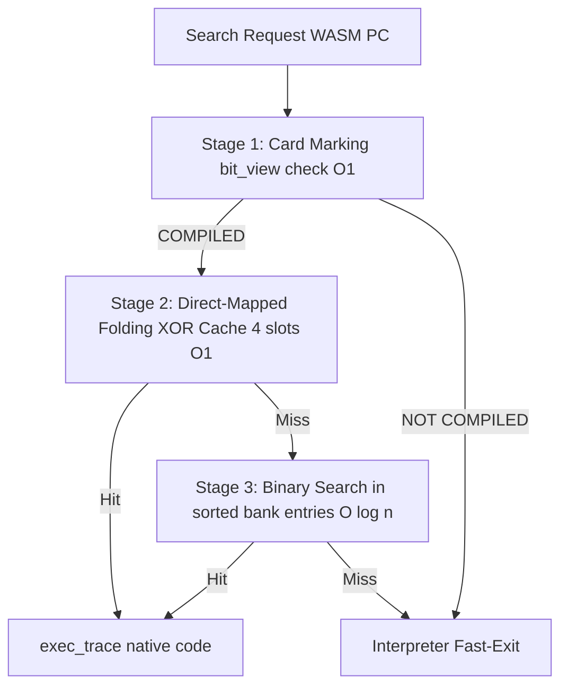
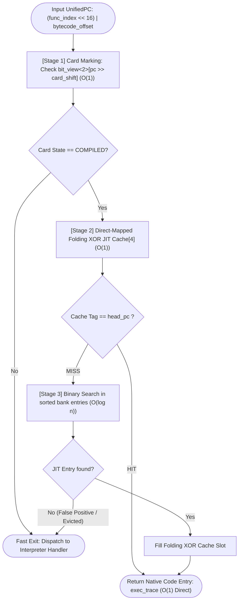
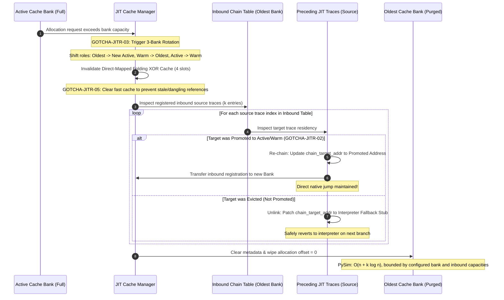
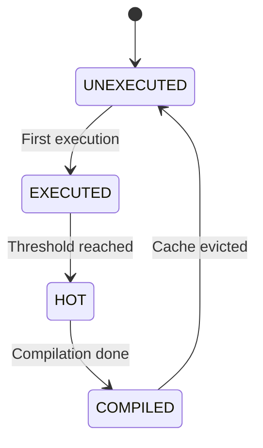
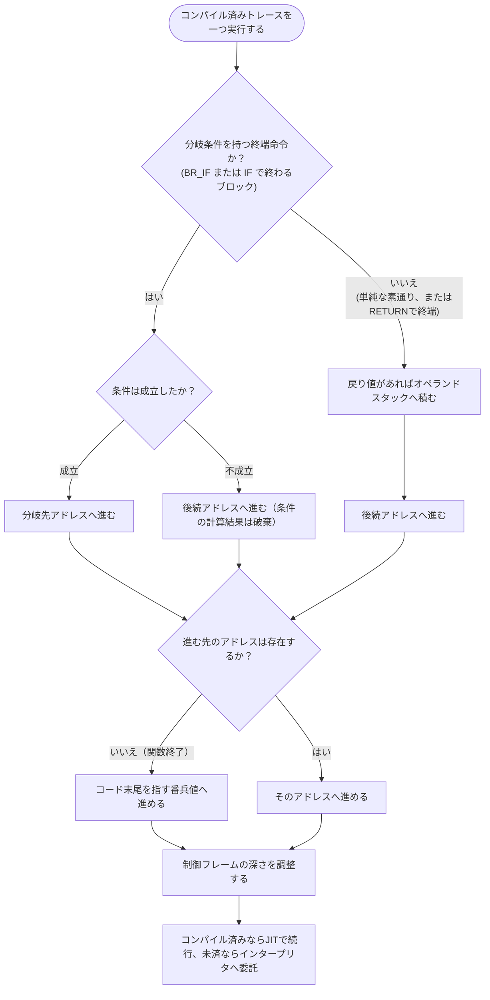

# JIT ランタイム管理 コンポーネント設計書 {VERIFY_FORMAL} {VERIFY_LLM} {VERIFY_BENCHMARK}
<!-- evidence:
     formal: formal/jit_cache_model.py
     benchmark: benchmarks/jit_zero_compile_cost_bench.py
     concept: ../tier2_runtime/concepts/runtime_engine_concept.py
     test: docs/qa/tier3_jit/jit_runtime_test_spec.md
-->

## 1. コンセプト
<!-- traceability: {SimpleJITArchitecture} {JIT_MultiBuffer_Cache} {JIT_OldestOnly_Promote} {META_AccessDictionary} {META_BinarySearch} {LowLatencyJIT} {HistoryBuffer} {GLOBAL_PeriodicTask} {DirectMappedJIT4} {Runtime_BumpAllocator} -->
JIT ランタイム管理は、WASM PC とネイティブコードの紐付け検索を担当する。3面世代交代コードキャッシュのローテーションも担当する。ホットスポット検出も一括して担う。

インタープリタ実行ループ内の検索は3段で構成する。第1段はカードマーキング表 (`bit_view<2>`) による $O(1)$ 事前判定、第2段はDirect-Mapped Folding XORキャッシュ（4スロット）による $O(1)$ 検索、第3段は各バンクのソート済みJITエントリ配列に対する二分探索である。エントリ数が少ないためRadix表は設けず、補助索引のメモリと更新処理を持たない。

3面コードキャッシュはデータ用バンプアロケータ（）とは異なる。データRAM（`RW + XN`）とは分離されている。MPU W^X 制御された専用実行可能セクションから確保される。専用コードアロケータによりハードウェア保護境界が厳格に保たれる。

## 2. アーキテクチャ分類
<!-- traceability: {META_3TierSeparation} {SimpleJITArchitecture} -->
本コンポーネントは **Tier 3 (詳細リーフコンポーネント: Leaf Component)** に属する。JIT サブシステムのうち実行時検索、3面コードキャッシュ管理、局所アンリンク、ホットスポット検出を担当する。コード生成コアは [`jit_compiler.md`](docs/components/tier3_jit/jit_compiler.md) が担当する。

### 2.1 JIT サブシステムのデコンポジション
<!-- traceability: {JIT_Encoder} {JIT_CopyAndPatch} -->
JITサブシステムは、以下の2つの独立した設計書に責務を分離して構成される。
- **[jit_compiler.md](docs/components/tier3_jit/jit_compiler.md)**: 命令テンプレートを用いたネイティブコード生成および静的命令エンコードを担当する。
- **[jit_runtime.md](docs/components/tier3_jit/jit_runtime.md)**: 実行履歴監視、ホットスポット判定、PC-アドレス変換検索、3面キャッシュローテーションを担当する。 `{SimpleJITArchitecture}` `{JIT_MultiBuffer_Cache}`

## 3. 静的モデル

### 3.1 データ構造
- **統一プログラムカウンタ (`UnifiedPC` / `wasm_pc_t`)**: モジュール全体の全関数・全命令を一意に識別する 32ビット整数である。
  - **構造**: `(func_index << 16) | (bytecode_offset & 0xFFFF)`
    - **上位 16ビット (`func_index`)**: モジュール内の関数インデックス（0 〜 65,535）。
    - **下位 16ビット (`bytecode_offset`)**: 当該関数のバイトコード内オフセット（0 〜 65,535 バイト）。
  - **役割**: 複数関数を含む WASM モジュールにおいて、関数間の PC 衝突を防止する。一意な追跡とディスパッチを保証する。
- **`JitEntryIndex`**: WASMオフセットとネイティブコードの対応付け、および 4 段高速検索ロジックをカプセル化した主要クラスである。
- **カードマーキング表 (Card Marking Table)**: 関数ごとのコード領域を 4 バイト単位のカードで分割管理する 2 ビット状態表である。密ビュー `fireball::bit_view<2>` として参照する。
  - `0: UNEXECUTED` (未実行)
  - `1: EXECUTED` (実行済み)
  - `2: HOT` (コンパイル要求中)
  - `3: COMPILED` (コンパイル済み / オンデマンド許可)
- **コンパイル対象可否マスク (Trackable Mask)**: ブロックの静的適格性を管理する 1 ビット状態表である。ロード時に一度だけマークされる。`next_pc` を持ち、かつバイト長が `min_trace_bytes` 以上のブロックを対象とする。密ビュー `fireball::bit_view<1>` として独立バッファで参照する。実行時のディスパッチはこの 1 ビットのみを参照する。ブロックの静的メタデータを再走査する必要がない。 `{TrackableBlockMask}`
- **JITエントリ表**: 各バンクの `head_pc` 順に並ぶ固定容量配列である。検索は二分探索（$O(\log n)$）とし、削除済み枠はtombstoneとして扱う。エントリが少ないためRadix索引を設けない。PySimも同じキー順と`bisect_left`による検索を用いる。
- **JITコード領域 (8KB)**: 4KBページ2枚分の連続領域である。先頭2KBはAPCCS開始プロローグ、終了エピローグ、Cヘルパー遷移、および絶対アドレスプールを置く非エビクション領域とし、残る2KBずつを`Bank 0 (Active)`, `Bank 1 (Warm)`, `Bank 2 (Oldest)`に割り当てる。各48バイトのトレースヘッダが共通領域オフセットを持ち、エントリ・終了ジャンプ先を決める。MPUの`W^X`制御対象であり、共通コード領域はflushやバンクローテーションでも維持する。
  共通領域内の固定オフセットは次のとおりである。オフセットはコード領域先頭からの値であり、トレースヘッダのフィールド位置とは別の値である。

  | 共通領域オフセット | 配置物 | 容量・用途 |
  | :--- | :--- | :--- |
  | `0x000` | APCCS開始プロローグ | CPS 4引数を受けてトレース本体へ移行する |
  | `0x020` | APCCS終了エピローグ | 共有状態を同期して呼び出し元へ復帰する |
  | `0x030` | Cヘルパー遷移 | トレースヘッダの関数ポインタへ末尾遷移する |
  | `0x050` | 絶対アドレスプール | 256バイトの共通アドレス領域 |

  共通領域の参照値は各トレースヘッダへ格納する。トレースの入口・出口・Cヘルパー遷移は、この参照値を用いて相対分岐先を決定する。
- **オンデマンドコンパイルキュー (On-demand Compile Queue)**: `HOT` に達した命令オフセットを保持する固定容量 LIFO キューである。容量到達時にバッチコンパイルが即座に実行される。固定容量を上回ることはない。 `{JIT_ReverseCompilationOrder}` `{GLOBAL_Policy_Memory}`
- **バンク別被チェイン逆引きテーブル (Inbound Chain Index Table)**: 各キャッシュバンクへ向けた直接チェインリンク元の JIT エントリインデックスを保持する固定長配列である。
- **実行履歴バッファ**: 短期間の実行履歴を一時的に保持するリングバッファである。 `{HistoryBuffer}`

### 3.2 内部ブロック図

### 3.3 主要なクラス・構造体・配列・定数

#### JITエントリインデックス（JitEntryIndex）クラス
| 項目名 | 機能と役割 | 型分類 | サイズ・制約 |
| :--- | :--- | :--- | :--- |
| 高速スロット配列 | 2-bit スロット選択を行う Folding XOR Hash による Direct-Mapped キャッシュ | 固定長配列 | 4スロット (`{DirectMappedJIT4}`) |
| エントリ配列 | `head_pc` 昇順のJITエントリを保持する | 固定長ソート配列 | 二分探索 $O(\log n)$。Radix索引なし |
| カードマーキング表 | カードごとの 2-bit 状態表 | 密ビュー | `fireball::bit_view<2>` |
| 被チェイン逆引きテーブル | バンクごとの被チェイン元 JIT エントリインデックス配列 | 固定長配列の配列 | `FB_CONF_JIT_MAX_INBOUND_CHAINS_PER_BANK` |
| 履歴バッファ | 判定契機までの一時的な実行記録 | リングバッファ | `offset` の配列 `{HistoryBuffer}` |

## 4. 動的モデル

### 4.1 アルゴリズム
1. **カードマーキング確認 ($O(1)$)**: カードマーキング表 (`bit_view<2>`) を $O(1)$ で確認する。状態が `COMPILED` でなければ即座に終了する。
2. **Direct-Mapped Folding XOR キャッシュ確認 ($O(1)$, `{DirectMappedJIT4}`)**:
   - `UnifiedPC` を 32→16→8→4 ビットと3回の XOR で折りたたむ。
   - さらに `temp = temp ^ (temp >> 2)` を行い、`slot = temp & 0x03` を計算して4スロットの高速テーブルを照合する。
   - スロットのタグが `head_pc` と一致（Hit）した場合、バンク検索をバイパスして $O(1)$ でトレースを返す。
3. **バンク内二分探索 ($O(\log n)$)**:
   - キャッシュミス時、Active / Warm / Oldest の順に各バンクの `head_pc` 昇順配列を二分探索する。JITエントリ数が少ないためRadix表は持たない。
   - 固定容量配列内のキーに一致するlive entryがあればトレースを得る。tombstoneまたはキー不一致なら次のバンクを検索する。
   - ヒットした場合はネイティブコードアドレス（`exec_trace`）を返す。
   - 次回用として高速スロットへ格納する。
5. **ホットスポット昇格判定**:
   - yield 時等に履歴バッファを走査する。
   - 実行頻度が閾値に達したカードを`HOT`のままコンパイル待ち列へ登録する。コンパイルとcache挿入の両方が成功した場合にのみ`COMPILED`へ遷移する。
   - コンパイル失敗時は対象bitを解除し、そのブロックを再履歴・再コンパイル対象にしない。cache evictionまたは明示flushでは、対象bitを維持したままカードを`UNEXECUTED`へ戻し、次の閾値までhotnessを再計測する。
6. **最小トレース長フィルタ**:
   - 推定サイズが 1 カード分未満のブロックは、履歴記録やコンパイル登録の対象外とする（TEST-JITR-06）。
7. **3面世代交代ローテーションと局所アンリンク (`{GOTCHA-JITR-03}`, `{JIT_MultiBuffer_Cache}`, `{JIT_OldestOnly_Promote}`)**:
   - Active バンク満杯時、`Oldest` バンクをパージして新 `Active` に再利用する。
   - パージ直前に、被チェイン逆引きテーブルに登録されたソースエントリ（$k$ 件）のみを参照する。
   - 昇格済みなら再チェイニングし、完全破棄なら復帰スタブへアンパッチする。全件走査は行わない。
   - `rotate()` および `flush_all()` 実行時には Folding XOR 高速キャッシュを無効化する。古いバンクへの誤参照を防止する（`{GOTCHA-JITR-05}`）。
   - PySimの`JITCacheBank.clear()`はbankの$n$スロットを走査し、被チェイン元$k$件はbank別二分探索で照合する。実際の処理量は$O(n + k\log n)$である。固定容量$n_max$と被チェイン件数上限$k_max$により停止量は上限化されるが、$O(k)$とは表現しない。ターゲット実装はbank purgeの方法を別途定義する。
8. **トレース昇格時のインバウンドソース付け替え (`{GOTCHA-JITR-02}`)**:
   - Oldest バンクのトレースが再実行されて新 Active バンクへ昇格した際、チェイン先アドレスを新バンクへ更新する。
   - 逆引きテーブルの登録先も新バンクへ付け替える。古いバンクがパージされた後のダングリングジャンプを防止する。
9. **キュー処理時のキャッシュ再確認と二重コンパイル抑止 (`{GOTCHA-JITR-01}`)**:
   - コンパイル待ち列から取り出した PC が、既に 3 面キャッシュに常駐済みであれば再コンパイルを行わない。カード状態のみ `COMPILED` へ同期する。
   - **設計理由**: 二重コンパイルによるキャッシュ容量の浪費と CPU 時間の損失を完全に防止する。

#### 3段高速検索パイプライン手順（手順アクティビティ図）
<!-- traceability: {JIT_MultiBuffer_Cache} {LowLatencyJIT} {DirectMappedJIT4} {META_BinarySearch} -->
実行時 PC からネイティブ `exec_trace` アドレスを特定する3段探索パイプラインを示す。

#### 3面世代交代ローテーションと被チェイン局所アンリンク（責務シーケンス図）
<!-- traceability: {GOTCHA-JITR-02} {GOTCHA-JITR-03} {JIT_MultiBuffer_Cache} {JIT_LazyChaining} -->
Active バンク満杯時の世代交代において、局所アンリンクと再チェイニングの連携シーケンスを示す。

### 4.2 状態遷移図

キャッシュ破棄（Eviction）時は `EXECUTED` ではなく `UNEXECUTED` へリセットする（TEST-JITR-04）。

コンパイル失敗時はカードを`COMPILED`にせず、独立したTrackable Maskの対象bitを解除する。これはカード状態の遷移ではなく再試行対象の除外であり、eviction後に候補性を保ったままhotnessを取り直す動作とは異なる。

### 4.3 トレース実行時の分岐解決とインタープリタ復帰
<!-- traceability: {JIT_RuntimeAPI_Fallback} {DirectBytecodeExecution} -->
制御フロー・コール境界のインタープリタ委譲不変条件を示す。ロード時の静的解析で各基本ブロックに付帯情報を持たせる。これにより実行時の分岐解決を定数時間で行う。

| 付帯情報 | 意味 |
| :--- | :--- |
| 後続アドレス | 分岐条件が不成立だった場合に続くブロックの先頭アドレス |
| 分岐先アドレス | 分岐条件が成立した場合に実際にジャンプする先のアドレス |
| フレーム深さ | 当該ブロック到達時に積まれているべき制御フレームの深さ |
| 命令列長 | 当該ブロック自身が占める命令バイト数（足切り判定用） |

命令列長は、後続アドレスから自分自身の先頭アドレスを引いて求めてはならない。後方分岐ブロックでは差分が負になる。その結果「短すぎる」と誤判定される。命令列長はブロック自身の命令バイト数から直接求める。

#### コンパイル済みトレース実行後の遷移手順（アクティビティ図）

- **分岐条件の扱い**: 分岐条件を持つ終端命令（`BR_IF`, `IF`）の計算結果は、オペランドスタックへ積まない。積むと後続演算が誤って消費してしまう。
- **関数終了の定数時間解決 (`{GOTCHA-JITR-08}`)**: `RETURN` で終わるブロックでは命令列を再走査しない。実行時の命令デコードやオブジェクト生成は一切禁止されている（`{DirectBytecodeExecution}`）。コード長という単一の数値で関数の終わりを表す。復帰処理はインタープリタへ委ねる。
- **制御フレームの整合 (`{GOTCHA-JITR-06}`)**: JITトレース実行は制御フレーム操作を経由しない。そのためインタープリタ実行時に積まれたフレームが残留することがある。フレーム深さの巻き戻しだけでは正しさを保証できない。したがってインタープリタ復帰時の分岐解決は、フレームスタックの中身を参照しない。静的解析済みの後続アドレスや分岐先アドレスを直接使用する。フレーム深さの切り詰めはスタック肥大化防止の安全策としてのみ機能させる。
- **短小判定の符号 (`{GOTCHA-JITR-07}`)**: ブロックの足切り判定は自身の命令バイト数で行う。後続アドレスとの差分で代用すると、後方分岐ブロックで差分が負になり、高頻度ブロックが永久に除外されてしまう。

## 5. インターフェース定義

### 5.1 公開API

#### 検索（lookup）
| 項目 | 内容 |
| :--- | :--- |
| 機能概要 | 命令オフセットに対応するネイティブコードアドレス（`exec_trace` 型）を返す。 |
| シグネチャ | `lookup(pc: wasm_pc_t) -> result<exec_trace, jit_lookup_result_t>` |
| 戻り値 | 成功時はネイティブ実行エントリ、失敗時はエラーコードを返す。 |

#### エントリ登録（register_entry）
| 項目 | 内容 |
| :--- | :--- |
| 機能概要 | 命令オフセットとネイティブ実行コードアドレスを登録し、索引を更新する。 |
| シグネチャ | `register_entry(pc: wasm_pc_t, native_entry: exec_trace) -> void` |

## 6. 制約達成の方策

### 6.1 性能制約
- **方策**: カードマーキング表と4スロットFolding XORキャッシュの $O(1)$ 事前検索後、キャッシュミス時に少数のソート済みJITエントリを二分探索する（$O(\log n)$）。Radix索引は設けず、PySimと同じ検索構造にする。

### 6.2 メモリ制約
<!-- traceability: {JIT_MultiBuffer_Cache} {JIT_OldestOnly_Promote} -->
- **方策**: 3面循環バッファと Oldest ヒット限定昇格を採用する。Oldestのlookup hitは即時にActiveへ昇格し、Warmのhitは昇格させない。断片化を防ぎつつ、低頻度コードを自然に破棄させる。

## 7. 形式検証・テスト仕様との対応

### 7.1 検証対象の不変条件
- **3面キャッシュ代謝の有界性**: 循環ローテーションによる Oldest パージと新 Active 再利用を検証する。
- **局所アンリンク安全性**: 被チェインソース$k$件だけを逆引き表から処理する。PySimのbank再利用は全$n$スロットのclearとbank検索を伴い、$O(n + k\log n)$である。固定容量により有界だが$O(k)$のみとは主張しない。
- **カード状態単調性**: `UNEXECUTED` から `COMPILED` への単調遷移を保証する。パージ時のみ `UNEXECUTED` へリセットする。

### 7.2 テスト仕様書との連携
本コンポーネントのテストケースおよび直交表は、[`jit_runtime_test_spec.md`](docs/qa/tier3_jit/jit_runtime_test_spec.md) を正本として定義する。形式検証モデルは `formal/jit_cache_model.py` を参照する。
