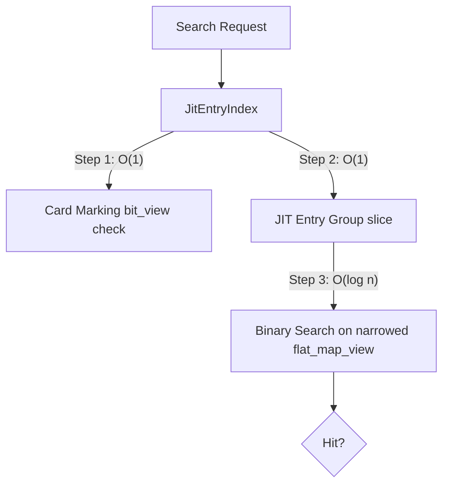
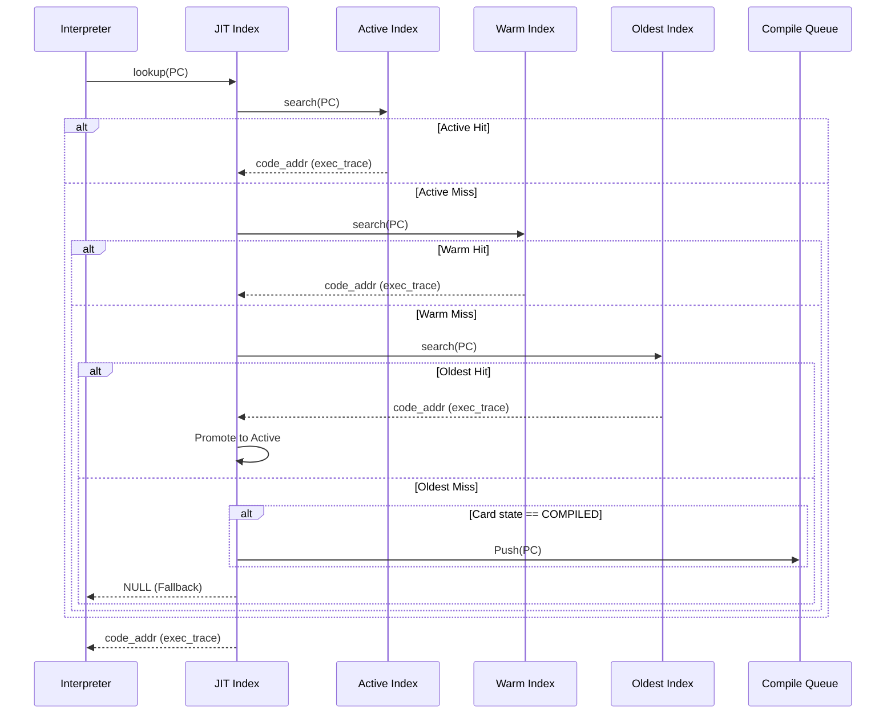

# JIT Entry Index コンポーネント設計書

## 1. コンセプト
<!-- traceability: {SimpleJITArchitecture} {JIT_MultiBuffer_Cache} {META_FlatMapIndexed} {META_BinarySearch} -->
JIT Entry Index は、WASM 命令オフセット とそれに対応するネイティブコードのアドレスの紐付けを管理する。
インタープリタの実行ループ内という極めてクリティカルなパスで呼び出されるため、**カードマーキング表 (`bit_view<2>`)** による $O(1)$ 事前判定、**JITエントリグループインデックス** による $O(1)$ 探索区間絞り込み、およびソート済みエントリ配列に対する二分探索（`fireball::flat_map_view`）を組み合わせた高速な検索アルゴリズムを提供する。限られたメモリ内での動的キャッシュ代謝と低レイテンシ検索を両立する。 `{SimpleJITArchitecture}` `{JIT_MultiBuffer_Cache}` `{META_FlatMapIndexed}` `{META_BinarySearch}`

## 2. アーキテクチャ分類
<!-- traceability: {META_3TierSeparation} {SimpleJITArchitecture} -->
本コンポーネントは **Tier 3 (詳細リーフコンポーネント: Leaf Component)** に属し、JIT コンパイラ (`jit_compiler.md`) から分解された JIT エントリインデックス管理およびエントリグループ二分探索を担当する。 `{META_3TierSeparation}` `{SimpleJITArchitecture}`

## 3. 静的モデル

### 3.1 データ構造
- **`JitEntryIndex`**: WASMオフセットとネイティブコードの対応付け、および高速な検索ロジックをカプセル化した主要クラス。
- **JITエントリ表**: 命令オフセットと生成コード位置のペアをソート順で管理する内部配列（プライベートメンバ）。`fireball::flat_map_view` として参照される。
- **JITエントリグループインデックス**: 二分探索の範囲を $O(1)$ で絞り込むための粗索引配列（プライベートメンバ）。

### 3.2 内部ブロック図

#### JITエントリインデックス（JitEntryIndex）クラス
検索最適化のためのデータ構造とアルゴリズムをカプセル化する。

| 項目名 | 機能と役割 | 型分類 | サイズ・制約 |
| :--- | :--- | :--- | :--- |
| エントリ配列 | ソート済みの `jit_entry` 群を保持する | ソート済み配列 | `flat_map_view` で参照 |
| エントリグループ索引 | JITエントリグループごとの開始・終了インデックス | 固定長配列 | $O(1)$ 直接参照 |
| エントリ数 | 現在登録されているエントリ数 | エントリ数 | - |

## 4. 動的モデル

### 4.1 アルゴリズム

#### 高速検索
1. **カードマーキング確認 ($O(1)$)**: [`hotspot_detector`](jit_runtime_hotspot.md) のカードマーキング表 (`bit_view<2>`) を $O(1)$ で確認し、状態が `COMPILED` でなければ即座に終了する。
2. **エントリグループ絞り込み ($O(1)$)**: 検索対象の命令オフセットを右シフト（`pc >> entry_group_shift`）し、対応する JIT エントリグループ索引から探索区間 `[first, last]` を取得して `flat_map_view` をスライスする。
3. **二分探索 ($O(\log n)$)**: 絞り込まれた `flat_map_view` から対象の命令オフセットを二分探索し、ヒットした場合はネイティブコードのアドレス（`exec_trace`）を返す。
4. **オンデマンド・キューイング**: Active / Warm / Oldest の全3バンクでミスし、かつカードマーキング表の状態が `COMPILED` である場合は、対象の命令オフセットを「コンパイル待ち列」へ登録し、インタープリタ実行を継続する。

### 4.2 状態遷移図
本コンポーネントは管理情報の更新と検索を行うため、明確な内部状態（ステートマシン）は持たないが、エントリの `Valid/Invalid` を管理する。

### 4.3 内部シーケンス

## 5. インターフェイス定義

### 5.1 公開API

#### 検索（lookup）

| 項目 | 内容 |
| :--- | :--- |
| 機能概要 | 命令オフセットに対応するネイティブコードアドレス（`exec_trace` 型）を返す。 |
| シグネチャ | `lookup(pc: オフセット) -> result<exec_trace, jit_lookup_result_t>` |
| 引数 | `pc`: WASM 命令オフセット |
| 戻り値 | 成功時はネイティブ実行エントリ（`void (__fastcall *)(const uint8_t* ip, execution_context* stack_bot, vsoc_runtime* env) noexcept` 型）、失敗時は `ERR_NOT_COMPILED` などのステータス |

#### エントリ登録（register_entry）

| 項目 | 内容 |
| :--- | :--- |
| 機能概要 | 新しい命令オフセットとコードアドレスのペアを登録し、エントリグループ索引を更新する。 |
| シグネチャ | `register_entry(pc: オフセット, offset: オフセット) -> void` |
| 引数 | `pc`: WASM 命令オフセット (Key) `offset`: コードキャッシュ内の相対位置 (Value) |
| 戻り値 | void |

## 6. 制約達成の方策

### 6.1 性能制約
- **方策**: カードマーキング表 (`bit_view<2>`) による $O(1)$ 事前判定、JITエントリグループインデックスによる $O(1)$ 範囲絞り込み、およびソート済みエントリ配列（`flat_map_view`）の二分探索（$O(\log n)$）の多段合成により、極めて高速な検索を維持する。

### 6.2 メモリ制約
<!-- traceability: {JIT_MultiBuffer_Cache} -->
- **方策**: `{JIT_MultiBuffer_Cache}` による Copy-GC 方式により、断片化を防ぎつつ、実行頻度の低いコードを自然に破棄（代謝）させる。
