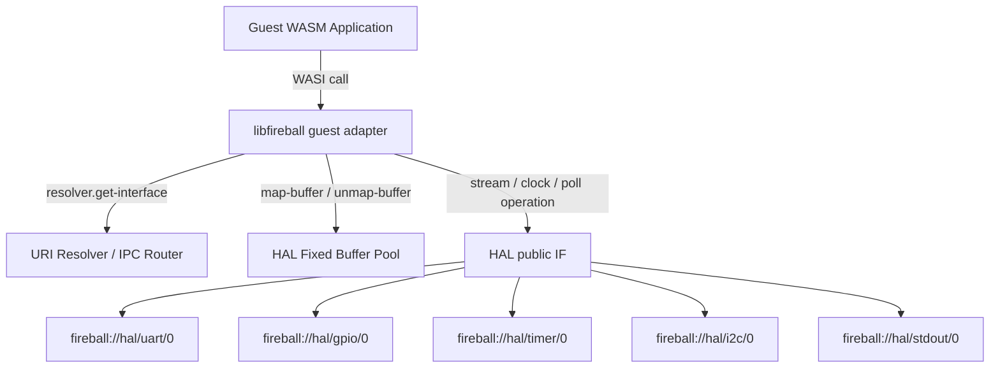

# WIT インターフェース仕様書 (WASI 準拠版) {VERIFY_WIT} {VERIFY_LLM} {VERIFY_FORMAL}
<!-- evidence:
     wit: docs/components/tier3_platform/wit
     formal: formal/wit_resource_lifecycle_model.py
     test: docs/qa/tier3_platform/interface_wit_test_spec.md
-->

## 1. 目的

<!-- traceability: {WIT_Interface_Purpose} {WIT_First} {WIT_Common_Types} {URIAbstraction} -->
本ドキュメントは、Fireballプロジェクトにおいてゲスト（WASM）環境に公開されるシステムコールおよびハードウェア抽象化層（HAL）のインターフェース仕様を定義する。ゲスト側のWASI互換アダプタはTier 3に属し、本書はその依存先となる公開WIT契約を定義する。WITは、低レベルホストコールを [`fireball_hostcall_contract.wit`](docs/components/tier3_platform/wit/fireball_hostcall_contract.wit)、HALの型とURI Resolverを [`fireball_hal_contract.wit`](docs/components/tier3_platform/wit/fireball_hal_contract.wit) に分割して定義する。

**HAL は WASI 0.3 Preview（WASI 0.3p / Component Model）と親和性のある抽象 IF である。** 個別の GPIO、タイマー、バス通信、ストリーム、コンソール出力用に専用の WIT リソース型を定義しない。

ゲストは2つの汎用機構を使う。1つは階層型 URI から対象を動的に解決する **URI Resolver** である。もう1つはゼロコピー転送用の **HAL バッファプール** である。これらを介して、WASI 0.3p 相当の読み書き、バス転送、非同期通知を行う。

デバイスや HAL ごとの振る舞いは IPC コマンド ID で決定する。URI 命名規則とコマンド仕様の正本は [`hal_dispatch.md`](docs/components/tier2_runtime/hal_dispatch.md) である。レガシーな WASI 0.1p（`wasi_snapshot_preview1`）ABI は、これらの公開 IF を呼び出す Tier 3 ゲストアダプタとして提供する。

## 2. アーキテクチャ原則

<!-- traceability: {CleanArchitecture} {META_SpecificationFirst} {META_Risk_Tiering} {URIAbstraction} -->
- **URI Resolver メソッド**: `resolver.get-interface(uri: string)` により、URI 文字列からインターフェースハンドルを取得可能とする。個別デバイスの WIT リソース型は存在しない——ハンドルに対する操作はすべて IPC コマンドID経由で行う。
- **HALバッファプール（vMMIO/DYNAMIC）ゼロコピー I/O**: デバイス通信のデータ送受信は、ゲストがI/O開始時に`map-buffer`で選択し、完了時に`unmap-buffer`で解除する固定スロット（vMMIO/DYNAMIC 領域の `hal-buffer-slice`）を通じてゼロコピー／極低レイテンシで実行される。 `{META_RestrictedPhysicalAccess}`
- **IPC 宛先 URI と階層命名規則**: URI は、`fireball://hal/<type>/<instance>`（例: `fireball://hal/uart/0`, `fireball://hal/gpio/0`, `fireball://hal/timer/0`, `fireball://hal/i2c/0`, `fireball://hal/stdout/0`）の**階層型 URI 命名規則**に従い、**IPC ルータ（`ipc_router`）でHALサブシステムと通信するための宛先 URI** として機能する。
- **WASI 0.1p 互換ラッパー (Adapter Pattern)**: WASI Preview 1 の標準出力とログ出力は、Tier 3ゲストアダプタが上記の URI Resolver + HALバッファプール機構へ変換する。その他の Preview 1 操作は Tier 3 の uvwasi ドライバへ委譲し、`proc_exit` は Fireball host call でランタイムへ通知する。
- **Stateless Interface**: リソースハンドルを通じた操作を行い、ホスト側で状態を管理する。

## 3. 共通データ構造

### 3.1 基礎インターフェース & IPC URI Resolver
<!-- traceability: {CooperativeMultitasking} {Asynchronous_Notification} {URIAbstraction} {META_RestrictedPhysicalAccess} -->
以下の基礎コンポーネントのみを提供する。個別デバイス/HAL向けの WIT リソース型は定義しない。

- `resolver`: 階層型 IPC 宛先 URI（`fireball://hal/<type>/<instance>`）から通信ハンドルを取得し、HALが常時保持する固定バッファスロットのビューを提供するリゾルバ。

```wit
/// WASI 0.3p / IPC 動的インターフェース取得・HALバッファ解決 (URI Resolver)
interface resolver {
    use types.{hal-buffer-slice, operation-result, recovery-strategy-category};

    /// IPC 宛先 URI から通信チャネルハンドルを取得
    get-interface: func(uri: string) -> result<u32, recovery-strategy-category>;
    /// HALが保持する固定バッファスロットを今回のI/Oだけマップ
    map-buffer: func(slot-index: u32) -> result<hal-buffer-slice, recovery-strategy-category>;
    /// 今回のI/Oを終了し、DYNAMIC領域のマッピングを解除
    unmap-buffer: func(handle: u32) -> operation-result;
    /// ストリームからHALバッファへ読み込む
    stream-read: func(handle: u32, buffer: hal-buffer-slice) -> operation-result;
    /// HALバッファからストリームへ書き込む
    stream-write: func(handle: u32, buffer: hal-buffer-slice) -> operation-result;
    /// ストリームの保留データを送出する
    stream-flush: func(handle: u32) -> operation-result;
    /// ストリームハンドルを閉じる
    stream-close: func(handle: u32) -> operation-result;
    /// 単調クロックの現在値を取得する
    clock-get-now: func(handle: u32) -> result<u64, recovery-strategy-category>;
    /// クロック分解能を取得する
    clock-get-resolution: func(handle: u32) -> result<u64, recovery-strategy-category>;
    /// 操作完了または入力準備の状態を確認する
    poll-check: func(handle: u32) -> result<bool, recovery-strategy-category>;
    /// 準備完了まで待機する
    poll-wait: func(handle: u32) -> operation-result;
}
```

非同期通知（GPIOエッジ、タイマー満了等の待機）は、専用の `pollable` リソース型を設けず、IPCコマンドID（`POLL_CHECK` / `POLL_WAIT`、`hal_dispatch.md` を正本とする）による汎用ポーリングとして表現する（後述の非同期通知メカニズムを参照）。



### 3.2 リカバリー戦略とエラーハンドリング
<!-- traceability: {META_RecoveryStrategy} {Errorcode_To_Strategy} -->

本プロジェクトでは、エラーコードではなくリカバリー戦略を返すことで、呼び出し側が具体的なアクション（リトライ/諦める）を取れるようにする。低レイヤー（Syscall）の `errno` は、ゲスト側の `libfireball` でこの戦略に変換される。
※なお、ホスト内部で各デバイスドライバと通信する低レイヤーの IPC コマンドプロトコルおよび RSP デバッグ仕様は、Tier 2/3 の HAL コンポーネント設計書（[`hal_dispatch.md`](docs/components/tier2_runtime/hal_dispatch.md) / [`platform_driver.md`](docs/components/tier3_platform/platform_driver.md)）を正本とする。

```wit
/// Recovery strategy for operation failures.
enum recovery-strategy-category {
    /// Error can be ignored, continue operation.
    ignore,
    /// Retry with same parameters may succeed.
    retry,
    /// Module or system needs to be re-initialized.
    restart,
    /// Fatal error, halt the system and dump state.
    panic
}

// Domain-specific result types
type operation-result = result<_, recovery-strategy-category>;
type load-result = result<_, recovery-strategy-category>;
type registration-result = result<_, recovery-strategy-category>;
type routing-result = result<_, recovery-strategy-category>;
```

#### リカバリー戦略の事前・事後条件と不変条件
<!-- traceability: {META_RecoveryStrategy} {Errorcode_To_Strategy} -->

| 戦略カテゴリ | 選択基準（事前条件） | 事後条件 / システム状態 | 不変条件 |
| :--- | :--- | :--- | :--- |
| `ignore` | 一時的なバッファ空/満杯通知など、データ喪失を伴わず無視可能な事象 | 状態変化なし。呼び出し元は継続実行 | システム整合性は完全に維持される |
| `retry` | 一時的なリソース競合やタイムアウト。再試行により回復可能な場合 | 引数状態は維持。`FB_CONF_RETRY_BACKOFF_MS` のバックオフ後に再実行 | 再試行上限回数（3回）を超えないこと |
| `restart` | サービスコンテキストやメモリ破損の疑い。モジュール単体の自己修復が必要な場合 | 該当タスク/サービスのTCB・ヒープを初期化し再起動 | 他サービスおよびカーネルのメモリ空間は隔離され保護される |
| `panic` | MPU違反、二重解放、デッドロック検知など、安全な継続が不可能な致命的障害 | 全タスク停止、クラッシュダンプを出力しフェイルセーフ停止 | ハードウェアおよび不揮発性領域への不正書き込みを即時遮断 |

#### 設計判断
<!-- traceability: {META_RecoveryStrategy} {Errorcode_To_Strategy} -->
- **実装詳細の分離**: `hardware-error`や`timeout`は実装の内部状態であり、クリーンアーキテクチャの内側が知るべきではない。
- **アクション指向**: リカバリー戦略により、呼び出し側は具体的なアクション（リトライ/エラーログ出力して諦める）を決定できる。
- **リトライ上限到達時の段階的エスカレーション (Retry Exhaustion Escalation)**: `retry` 戦略で `RETRY_MAX_ATTEMPTS`（3回）を超過した場合、呼び出し元は自動的に `restart`（タスクコンテキスト再初期化・再起動）へエスカレーションする。再起動後もエラーが回復不能な場合は最終的に `panic` へエスカレーションし、システム安全性を担保する。
- **IPC は所有権ロールバックを必要としない**: IPC ルータ（`ipc_router.md`）はバッファなし同期 CSP チャネル（`{ADR_RendezvousChannel}`）であり、宛先ごとの有界キューを持たない。したがって `ERR_QUEUE_FULL` のような一時的な資源競合は原理的に発生せず、`Revoke` 後の所有権ロールバックという回復処理も存在しない——送信は相手タスクの到達を待つのみで、失敗して差し戻る経路がない。
- **デバッグ情報の分離**: 失敗の詳細理由はログシステムで確認する。インターフェースには含めない。

## 4. 低レベル・ホストコール・インターフェース
<!-- traceability: {Syscall_Mapping} -->
WASI標準には存在しない、Fireball固有の高速 host call である。実体は `../tier2_runtime/runtime_syscall.md` で定義される `fireball::fireball_call` である。WASM import がこの host call を直接ホストディスパッチへ接続し、SYSCTL／VDMAの vMMIO レジスタは経由しない。

### 4.1. `fireball:host/trap` の定義
<!-- traceability: {Syscall_Mapping} -->
WIT内では `fireball-call` という kebab-case 名で定義されるが、C++バインディングおよび公開APIとしては名前空間 `fireball` 内に `fireball_call`（snake_case）としてマッピングされ、host call として公開される。

- `fireball-call(id: u32, arg0: u32, arg1: u32, arg2: u32, arg3: u32, arg4: u32, arg5: u32) -> u32`

### 4.2. vIRQ / vDMA 専用ホストコール
<!-- traceability: {GLOBAL_InterruptWakeup} {VDMA} -->

vIRQの登録・解除とvDMA転送は、汎用 `fireball-call` のIDディスパッチへ統合しない。WITの [`fireball_hostcall_contract.wit`](docs/components/tier3_platform/wit/fireball_hostcall_contract.wit) が公開する専用importを直接呼び出す。

| WIT interface | 操作 | 役割 |
| :--- | :--- | :--- |
| `fireball:host/virq` | `register` / `unregister` | 静的vIRQノードへの登録変更を保留し、次のCOOS協調境界で反映する |
| `fireball:host/vdma` | `start` | 転送元・転送先・転送長を指定してvDMA転送を開始する |

専用ホストコールはWASM importから対応ハンドラへ同期接続するが、SYSCTL／VDMAのvMMIOレジスタや汎用 `fireball_call` のID空間は使用しない。vIRQのイベント本体はISR → COOS FIFO → COOS協調境界 → vSoC → vIRQ階層の非同期経路で配送する。

FireballのC ABIアダプタをCore Wasmへ静的リンクする場合、WIT名を次のmodule／field名へ写像する。この対応は、ゲスト側アダプタとホスト側import resolverの共通契約である。

この写像は、Component ModelのCanonical ABI名を置き換える規則ではない。`libfireball`が提供するCore Wasm向けの明示的なアダプタ規約である。

| WIT操作 | Core Wasm module | Core Wasm field |
| :--- | :--- | :--- |
| `trap.fireball-call` | `fireball` | `fireball_call` |
| `virq.register` | `fireball` | `virq_register` |
| `virq.unregister` | `fireball` | `virq_unregister` |
| `vdma.start` | `fireball` | `vdma_start` |

各操作の戻り値は`u32`であり、`0`は成功、非0はWASI errno互換の失敗を表す。

### 4.3. 高応答トリガーインターフェース
<!-- traceability: {Syscall_Mapping} -->
GPIO のような割り込み応答性・ビットバンギング等の要求から、URI Resolver 経由のハンドルルックアップを介さず、`fireball-call` に直接マッピングされた ID を通じて操作するものとする。ゲスト側の呼び出しラッパーはTier 3で定義し、本書では raw host-call 契約だけを扱う。

- **理由**: ハンドルルックアップのオーバーヘッド排除、レジスタ直結に近いレイテンシの確保。
- **ID**: `FB_SYSCALL_TRIGGER_SET_PIN`。

## 5. `console-output` の位置づけ
<!-- traceability: {DictionaryBasedIPC} -->
ゲストの `print`/`eprint` が書き込む文字列は実行時に組み立てられる任意長データである。一方、`runtime_logging.md` の内部ロガーはビルド時登録の辞書オフセットと固定4引数のみを扱い、実行時に辞書を追加できない。そのため、コンソール出力は内部ロガーとは独立した経路として扱う。

専用の `console-output` リソース型は設けない。ゲストは `resolver.get-interface("fireball://hal/stdout/0")` で標準入出力HALを解決し、HALが用意した固定スロットの `hal-buffer-slice` に任意長の生バイト列を書き込んだ上で、`CMD_STREAM_WRITE_BUFFER` コマンドを発行する。辞書変換もリングバッファへの構造化格納も行わず、物理トランスポートへそのまま渡される。

標準入出力の物理出力はHALドライバが担当する。ドライバはHAL固定スロットを読み取り、注入された物理トランスポートへ出力する。内部ロガーとは辞書・リングバッファを経由しない別経路であり、両者は排他的に出力順序が保証されるわけではない（インターリーブし得る）。

ゲスト側アダプタが `fireball_call(WASI_FD_WRITE, ...)`（`runtime_syscall.md` 正本）を発行し、ゲストの `print` 呼び出しをこの `fireball://hal/stdout/0` 経路へ変換する。`eprint` は Fireball logger sink へ分離する。`fd_read`、`fd_close`、`clock_time_get`、`random_get` および標準出力・ログ以外の `fd_write` は uvwasi ドライバへ委譲する。ホスト側のディスパッチとHAL操作は、それぞれ `runtime_syscall.md` と `hal_dispatch.md` の契約に従う。

## 6. 非同期通知メカニズム

<!-- traceability: {Asynchronous_Notification} {WASI_Async_Bridge} -->
WASIでは割り込みベクタを直接扱わず、汎用ポーリングコマンドによる操作完了待機としてモデル化する。専用の `pollable` リソース型は設けず、`resolver.get-interface`/IPCコマンド発行が返す `u32` ハンドルに対して `POLL_CHECK` / `POLL_WAIT`（`hal_dispatch.md` を正本とする）コマンドIDを発行することで、ready 状態を確認する。vMMIOのvIRQ原因付き階層ディスパッチは、COOSの汎用割り込みイベント契約とCOOS協調境界での配送で処理し、WASI契約には追加しない。

- **操作完了通知**: 物理デバイスの完了状態は、GPIOエッジ購読、タイマー満了購読、バス受信購読等のIPCコマンドが返す`u32`ポーリングハンドルに対する`POLL_CHECK`/`POLL_WAIT`で確認する。これはvIRQの原因レコード配送とは別の経路である。

## 7. フィードバック：WASI 準拠における制約事項
WASI仕様と HAL の乖離および考慮点は以下の通り：

1. **GPIO/Bus の不在**: WASI (CLI/Cloud) には GPIO や I2C/SPI の標準インターフェースがない。これらは専用 WIT リソース型を設けず、URI Resolver + HALバッファプール + IPCコマンドIDの汎用機構上で「Fireball 独自プロポーザル」として実現する。
2. **リアルタイム性**: WASI 0.3p のポーリングモデルは非同期イベントの集約に利用できるが、極めて高速なリアルタイム応答が必要な場合、`fireball_call` (Trap) を併用する方が効率的である可能性がある。
3. **リソース管理のオーバーヘッド**: 専用 WIT リソース型（ハンドル管理）を廃したことで、単純な `u32` ID渡しとIPCコマンドIDを使う構成となり、ホスト側の管理状態を抑える。

## 8. 命名規則 (Naming Conventions)

WIT識別子は WASI 標準および `wasm-tools` の制約により `kebab-case` (ハイフン区切り) が必須である。プロジェクトでは以下のセマンティクス規約を適用する。

| 対象カテゴリ | 命名規則 (Semantic) | 例 |
| :--- | :--- | :--- |
| **Object** (Record, Resource) | `性質-責務名` | `hal-buffer-slice`, `ipc-message` |
| **Enum** (Type) | `性質-カテゴリ` | `sys-log-level`, `recovery-strategy-category` |
| **Method** (Function) | `動詞` または `動詞-機能` | `get-interface`, `map-buffer`, `unmap-buffer` |
| **Field / Enum Case** | `kebab-case` | `max-latency`, `retry` |

### 8.1 設計上の留意点
- **Kebab-Case Mandatory**: WIT定義内で `snake_case` (アンダースコア) は使用禁止。
- **C++ へのマッピング**: 生成される C++ コードではプロジェクト標準規約に従い、自動的に `snake_case` へ変換される。
- **名前の衝突回避**: ドメインプレフィックスを積極的に活用し、グローバルな名前空間での衝突を避ける。
