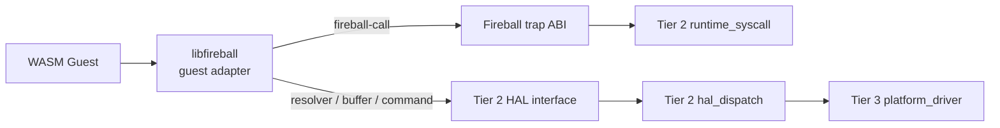
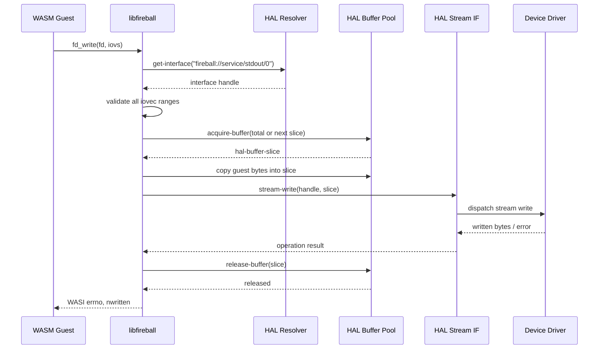
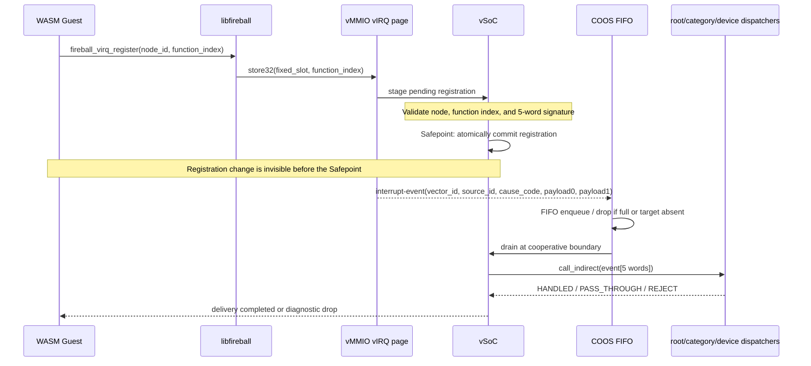

# libfireball ゲストアダプタ コンポーネント設計書
<!-- evidence:
     test: tests/libfireball_test_spec.md
-->

`libfireball` は、WASM ゲストへ静的に組み込むゲスト側アダプタライブラリである。ゲストの WASI Preview1 呼び出しと Fireball の公開 ABI を、Tier 2 が定義する `fireball_call` および HAL 抽象 IF へ変換する。ホスト側のシステムコールディスパッチ、HAL タスク、物理ドライバは実装しない。

## 1. アーキテクチャ分類
<!-- traceability: {META_3TierSeparation} -->

本コンポーネントは **Tier 3（プラットフォーム／リーフコンポーネント）** に属する。WASM バイナリへ組み込まれる ABI アダプタであり、WASM 上で常駐するサービスでも、COOS 上で常駐するサブシステムでもない。ホスト側の契約は [`runtime_syscall.md`](docs/components/tier2_runtime/runtime_syscall.md) と [`hal_dispatch.md`](docs/components/tier2_runtime/hal_dispatch.md) が定義する。

## 2. 責務と依存方向

1. `fireball-call0`〜`fireball-call6` を呼び出すゲスト側バインディングを提供する。
2. WASI Preview1 の `fd_write`、`fd_read`、`fd_close`、`clock_time_get`、`proc_exit`、`random_get` を Fireball の公開 ABI へ変換する。
3. ストリーム、クロック、ポーリング、GPIO、バス操作は、Tier 2 HAL の URI 解決・バッファ・コマンド境界を利用する。
4. vIRQの固定スロットへゲスト関数インデックスを登録する薄いラッパーを提供する。ただし、原因源表・親子関係・シグネチャ検証・Safepoint反映はTier 2に委譲する。
5. 物理レジスタ、IPC ロール、COOS タスク、HAL ドライバの内部構造を知らない。

依存方向は `libfireball` → `runtime_syscall` / `hal_dispatch` → COOS・IPC Router・`platform_driver` とする。Tier 2 の仕様書は、`libfireball` の内部実装や Preview1 の呼び出し順序を定義しない。

## 3. 静的モデル

`libfireball` はゲストアドレス空間に配置されるライブラリであり、サービスレジストリや COOS のタスクスロットには登録しない。

## 4. インターフェース

### 4.1 Fireball trap バインディング

| ゲスト側関数 | 呼び出し先 | 役割 |
| :--- | :--- | :--- |
| `fireball_call0`〜`fireball_call6` | `fireball:host/trap` | システムコール ID と最大 6 個の `u32` 引数を渡す |

引数の型、ゲストメモリの相対オフセット、エラーコードは `runtime_syscall.md` の契約に従う。

### 4.2 WASI Preview1 アダプタ
<!-- traceability: {WASI_ScatteredIO} {WASI_InMemVFS} -->

| Preview1 関数 | 公開 Fireball IF | 変換方針 |
| :--- | :--- | :--- |
| `fd_write` | `get-interface` + `acquire-buffer` + `stream-write` + `release-buffer` | iovec を順に処理し、全要素を先に検証する |
| `fd_read` | `get-interface` + `acquire-buffer` + `stream-read` + `release-buffer` | 読み出し結果をゲストの iovec へ反映する |
| `fd_close` | `stream-close` | 解決済みストリームを閉じる |
| `fd_seek` | ゲスト側の仮想FD状態 | 仮想ファイル位置を更新する |
| `clock_time_get` | `clock-get-now` | WASI の時刻表現へ変換する |
| `proc_exit` | `fireball_call` の終了操作 | ゲストの終了状態を通知する |
| `random_get` | HAL の URI 解決とストリーム操作 | 乱数デバイスからバッファへ取得する |

Preview1 の errno と Fireball の戻り値の対応は `runtime_syscall.md` の契約に従う。HAL のデバイス固有コマンドや物理ドライバ型は、このライブラリの公開 API に含めない。

### 4.3 WASI／HAL プロトコル変換シーケンス

`libfireball` はゲスト側の同期的な WASI 呼び出しを、Tier 2 HAL のハンドル・バッファ・ストリーム操作へ変換する。HAL の内部コマンド ID、IPC ロール、物理ドライバ呼び出しはこのシーケンスの外部契約である。

`fd_read` は同じ境界を逆方向に通り、`clock_time_get` は `get-interface` 後に `clock-get-now` を呼び出す。非同期操作は `poll-check` または `poll-wait` の完了結果を WASI 側の待機 APIへ変換する。

### 4.4 非同期操作

ポーリング可能な操作は `get-interface` で得たハンドルに対し、Tier 2 HAL の `poll-check` / `poll-wait` を発行する。`libfireball` は待機処理をゲスト側の同期 API として包むが、COOS のスケジューリングや HAL タスクの待機状態を直接操作しない。

### 4.5 vIRQ登録ラッパー
<!-- traceability: {GLOBAL_InterruptWakeup} {META_ConfigurableSystem} -->

`libfireball` は、ゲストが静的な vIRQ ノードへ WASM 関数インデックスを登録するための薄いラッパーを提供する。登録先は [`runtime_vmmio.md`](docs/components/tier2_runtime/runtime_vmmio.md) の vIRQ ページと固定スロットであり、`fireball.wit` のリソースや WASI の `pollable` 型には追加しない。

| ゲスト側関数 | 動作 | エラー処理 |
| :--- | :--- | :--- |
| `fireball_virq_register(node_id, function_index)` | vIRQ 固定スロットへ2つの`u32`を検証付きで書き込み、登録を保留状態にする | 静的ノード外、無効な関数インデックス、期待シグネチャ不一致は拒否 |
| `fireball_virq_unregister(node_id)` | 対象スロットへ未登録値を書き込み、次のSafepointで無効化する | 静的ノード外は拒否 |

期待するゲスト関数シグネチャは、原因レコード5ワードを受けて `HANDLED`、`PASS_THROUGH`、`REJECT` のいずれかを返す `(u32, u32, u32, u32, u32) -> u32` である。`libfireball` は関数テーブルの妥当性や親子関係を判定せず、vSoCの検証結果を受け取るだけとする。

#### 登録から原因配送までのシーケンス

このシーケンスで、ISRは`R`を直接呼び出さない。`HANDLED`はそのノードで終了し、`PASS_THROUGH`だけが静的な子ノードへ進み、`REJECT`は診断処理で終了する。REJECTからFAULTノードへ再帰的に配送することも、WASIポーリングを起動することもない。

## 5. 制約

- ゲスト側ライブラリはスケジューラタスク、サブシステム、物理ドライバとして振る舞わない。
- ゲストの生ポインタをホスト IF の引数として渡さず、相対オフセットまたは HAL バッファスライスを使う。
- Tier 2 の契約にない URI、コマンド ID、物理アドレスを独自に定義しない。
- vIRQのアドレス、原因源表、親子関係、関数シグネチャ検証を独自に再実装しない。
- 実装言語や生成方式は固定せず、将来の C/C++ ゲストライブラリ実装へ移植可能な境界だけを仕様化する。

## 6. 検証と実装時期

本コンポーネントはゲスト側アダプタの境界仕様を先に定義する。実装本体と実行テストは、ゲストライブラリの C/C++ 実装を開始する段階で追加する。現在の `experiments/pysim` はホスト側の参照実装・実行ハーネスであり、本コンポーネントの実装とはみなさない。
