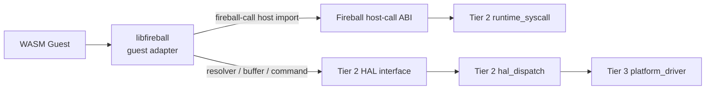
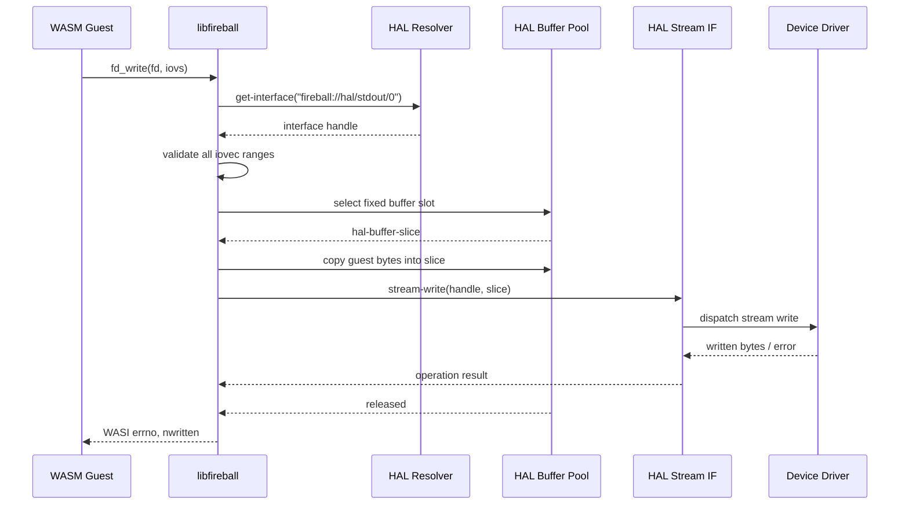
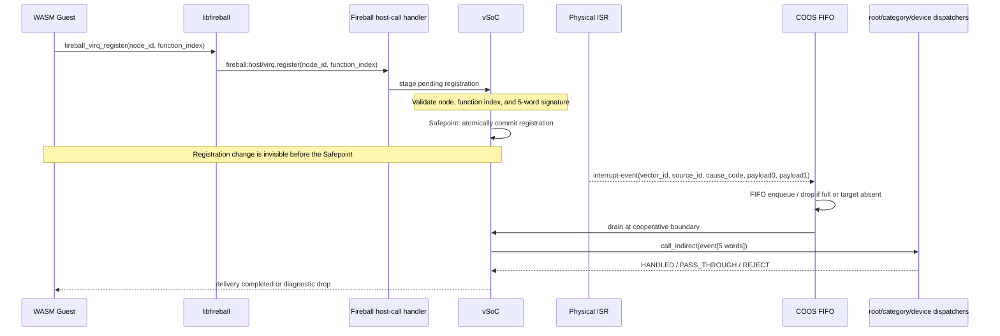

# libfireball ゲストアダプタ コンポーネント設計書
<!-- evidence:
     test: docs/qa/tier3_platform/libfireball_test_spec.md
-->

`libfireball` は、WASM ゲストへ静的に組み込むゲスト側アダプタライブラリである。ゲストの WASI Preview1 呼び出しと Fireball の公開 ABI を、汎用WASM import host callである `fireball_call`、vIRQ/vDMA専用host call、およびHAL抽象IFへ変換する。SYSCTL／VDMA の vMMIO レジスタ操作は行わない。

## 1. アーキテクチャ分類
<!-- traceability: {META_3TierSeparation} -->

本コンポーネントは **Tier 3（プラットフォーム／リーフコンポーネント）** に属する。WASM バイナリへ組み込まれる ABI アダプタであり、WASM 上で常駐するサービスでも、COOS 上で常駐するサブシステムでもない。ホスト側の契約は [`runtime_syscall.md`](docs/components/tier2_runtime/runtime_syscall.md) と [`hal_dispatch.md`](docs/components/tier2_runtime/hal_dispatch.md) が定義する。

## 2. 責務と依存方向

1. `fireball-call0`〜`fireball-call6` を呼び出すゲスト側バインディングを提供する。
2. WASI Preview1 の標準出力とログ出力を Fireball の公開 ABI へ変換する。
3. 標準出力とログ出力以外の WASI Preview1 操作は、Tier 3 の uvwasi ドライバへ委譲する。
4. `fireball:host/virq` の `register` / `unregister` を発行するvIRQ登録・解除ラッパーを提供する。ただし、原因源表・親子関係・シグネチャ検証・Safepoint反映はTier 2に委譲する。
5. `fireball:host/vdma` の `start` を発行するvDMA転送ラッパーを提供する。ただし、転送先権限・所有権・完了通知はTier 2に委譲する。
6. 物理レジスタ、IPC ロール、COOS タスク、HAL ドライバの内部構造を知らない。

依存方向は `libfireball` → `runtime_syscall` / `hal_dispatch` → COOS・IPC Router・`platform_driver` とする。Tier 2 の仕様書は、`libfireball` の内部実装や Preview1 の呼び出し順序を定義しない。

## 3. 静的モデル

`libfireball` はゲストアドレス空間に配置されるライブラリであり、サービスレジストリや COOS のタスクスロットには登録しない。

## 4. インターフェース

### 4.1 Fireball host-call バインディング

| ゲスト側関数 | 呼び出し先 | 役割 |
| :--- | :--- | :--- |
| `fireball_call0`〜`fireball_call6` | `fireball:host/trap` | システムコール ID と最大 6 個の `u32` 引数を host call で渡す |
| `fireball_virq_register` | `fireball:host/virq.register(node_id, function_index)` | vIRQ登録要求をvSoCへ渡す |
| `fireball_virq_unregister` | `fireball:host/virq.unregister(node_id)` | vIRQ登録解除要求をvSoCへ渡す |
| `fireball_vdma_start` | `fireball:host/vdma.start(source, destination, byte_count)` | vDMA転送要求をvSoCへ渡す |

引数の型、ゲストメモリの相対オフセット、エラーコードは `runtime_syscall.md` の契約に従う。

`fireball_call` は実行エンジンの import 解決からホストハンドラへ直接接続する。ホスト側で引数を SYSCTL レジスタへ複写したり、戻り値を vMMIO レジスタから読み出したりしない。

`fireball_vdma_start` は `fireball:host/vdma.start(source, destination, byte_count)` として発行する。VDMA の開始要求に VDMA レジスタページを使用しない。

### 4.2 WASI Preview1 アダプタ
<!-- traceability: {WASI_ScatteredIO} {WASI_InMemVFS} -->

| Preview1 関数 | 公開 Fireball IF | 変換方針 |
| :--- | :--- | :--- |
| `fd_write(fd=1)` | `get-interface` + 固定バッファスロット + `stream-write` | iovec を全要素検証後に標準出力へ送る |
| `fd_write(fd=2)` | Fireball logger sink | iovec を全要素検証後にログへ送る |
| `fd_write(fd≠1,2)` | `WasiPreview1Backend.fd_write` | uvwasiへ委譲する |
| `fd_read` | `WasiPreview1Backend.fd_read` | uvwasiへ委譲する |
| `fd_close` | `WasiPreview1Backend.fd_close` | uvwasiへ委譲する |
| `clock_time_get` | `WasiPreview1Backend.clock_time_get` | uvwasiへ委譲する |
| `proc_exit` | `fireball_call` host call の終了操作 | ゲストの終了状態を通知する |
| `random_get` | `WasiPreview1Backend.random_get` | uvwasiへ委譲する |

Preview1 の errno と Fireball の戻り値の対応は `runtime_syscall.md` の契約に従う。HAL のデバイス固有コマンドや物理ドライバ型は、このライブラリの公開 API に含めない。

### 4.3 WASI／HAL プロトコル変換シーケンス

`libfireball` はゲスト側の同期的な標準出力・ログ呼び出しを、Tier 2 HAL のハンドル・バッファ・ストリーム操作へ変換する。その他の Preview 1 呼び出しは uvwasi ドライバへ委譲する。HAL の内部コマンド ID、IPC ロール、物理ドライバ呼び出しはこのシーケンスの外部契約である。

`fd_read`、`fd_close`、`clock_time_get`、`random_get` および標準出力・ログ以外の
`fd_write` は、ゲストメモリの境界を確認したうえで uvwasi ドライバへ委譲する。
`proc_exit` だけはゲスト終了状態をランタイムへ伝える Fireball host call とする。

### 4.4 非同期操作

ポーリング可能な操作は `get-interface` で得たハンドルに対し、Tier 2 HAL の `poll-check` / `poll-wait` を発行する。`libfireball` は待機処理をゲスト側の同期 API として包むが、COOS のスケジューリングや HAL タスクの待機状態を直接操作しない。

### 4.5 vIRQ登録ラッパー
<!-- traceability: {GLOBAL_InterruptWakeup} {META_ConfigurableSystem} -->

`libfireball` は、ゲストが静的なvIRQノードへWASM関数インデックスを登録・解除するための薄いラッパーを提供する。ラッパーは [`fireball_hostcall_contract.wit`](docs/components/tier3_platform/wit/fireball_hostcall_contract.wit) の `fireball:host/virq` 専用host callを発行する。vMMIOのvIRQページは原因源表と有効登録の参照スナップショットであり、ゲストの登録制御には使用しない。WASIの `pollable` 型にも追加しない。

| ゲスト側関数 | 動作 | エラー処理 |
| :--- | :--- | :--- |
| `fireball_virq_register(node_id, function_index)` | `fireball:host/virq.register(node_id, function_index)` を発行し、登録を保留状態にする | 静的ノード外、無効な関数インデックス、期待シグネチャ不一致は拒否 |
| `fireball_virq_unregister(node_id)` | `fireball:host/virq.unregister(node_id)` を発行し、次のSafepointで無効化する | 静的ノード外は拒否 |

期待するゲスト関数シグネチャは、原因レコード5ワードを受けて `HANDLED`、`PASS_THROUGH`、`REJECT` のいずれかを返す `(u32, u32, u32, u32, u32) -> u32` である。`libfireball` は関数テーブルの妥当性や親子関係を判定せず、vSoCの検証結果を受け取るだけとする。

#### 登録から原因配送までのシーケンス

このシーケンスで、ISRは`R`を直接呼び出さない。`HANDLED`はそのノードで終了し、`PASS_THROUGH`だけが静的な子ノードへ進み、`REJECT`は診断処理で終了する。REJECTからFAULTノードへ再帰的に配送することも、WASIポーリングを起動することもない。

## 5. 制約

- ゲスト側ライブラリはスケジューラタスク、サブシステム、物理ドライバとして振る舞わない。
- ゲストの生ポインタをホスト IF の引数として渡さず、相対オフセットまたは HAL バッファスライスを使う。
- Tier 2 の契約にない URI、コマンド ID、物理アドレスを独自に定義しない。
- vIRQページのアドレス、原因源表、親子関係、関数シグネチャ検証を独自に再実装しない。ゲストからvMMIO固定スロットへ直接storeしてはならない。
- 実装言語や生成方式は固定せず、将来の C/C++ ゲストライブラリ実装へ移植可能な境界だけを仕様化する。

## 6. 検証と実装時期

ゲストライブラリはWIT import集合を表す単一のTier 2 host-call portだけに依存する。個々の関数参照は重複保持しない。

汎用システムコールは固定7引数のhost-call関数へ接続する。`fireball_call0`〜`fireball_call6`は不足引数を`0`で埋めて直接呼び出す。vIRQ/vDMAラッパーは専用host-call importへ接続する。

登録・解除・転送の検証はTier 2の`runtime_syscall` / `runtime_vsoc`テストで行う。ゲスト側の結線は [`libfireball_test_spec.md`](docs/qa/tier3_platform/libfireball_test_spec.md) で検証する。

実機向けC/C++ゲストライブラリは実行時portを保持しない。各WIT importの静的リンクシンボルをinline wrapperから直接呼び出す。
