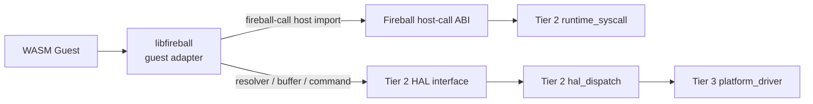
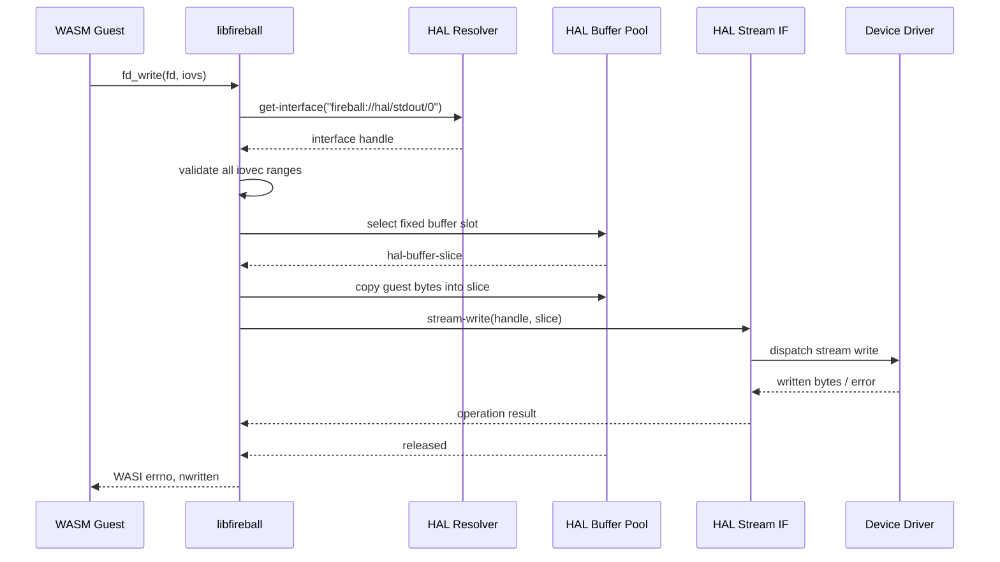
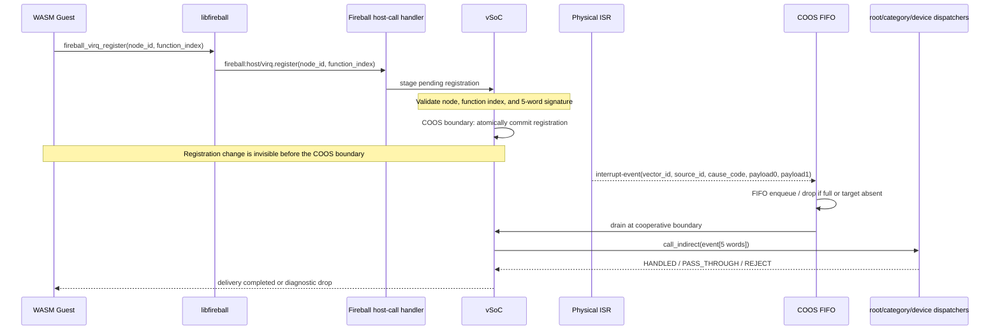

# libfireball ゲストアダプタ コンポーネント設計書
<!-- evidence:
     implementation: experiments/pysim/tier3_platform/libfireball.py
     test: docs/qa/tier3_platform/libfireball_test_spec.md
-->

本書はゲスト側 `libfireball` の設計目標を定義する。Python参照実装 [`libfireball.py`](experiments/pysim/tier3_platform/libfireball.py) は汎用host-call引数の詰め替えと専用vIRQ/vDMA port転送をモデル化する。raw 4 importにはC++参照wrapperがあり、WIT生成bindingの静的リンクと実Interpreter実行を第8節の範囲で検証する。WASI Preview1変換、URI Resolver、HALバッファ処理はゲスト側ライブラリに未実装である。

## 1. コンセプト

### 1.1 責務と依存方向

1. `fireball-call0`〜`fireball-call6` を呼び出すゲスト側バインディングを提供する。
2. WASI Preview1 の標準出力とログ出力を Fireball の公開 ABI へ変換する。
3. 標準出力とログ出力以外の WASI Preview1 操作は、Tier 3 の uvwasi ドライバへ委譲する。
4. `fireball:host/virq` の `register` / `unregister` を発行するvIRQ登録・解除ラッパーを提供する。ただし、原因源表・親子関係・シグネチャ検証・COOS協調境界での反映はTier 2に委譲する。
5. `fireball:host/vdma` の `start` を発行するvDMA転送ラッパーを提供する。ただし、転送先権限・所有権・完了通知はTier 2に委譲する。
6. 物理レジスタ、IPC ロール、COOS タスク、HAL ドライバの内部構造を知らない。

依存方向は `libfireball` → `runtime_syscall` / `hal_dispatch` → COOS・IPC Router・`platform_driver` とする。Tier 2 の仕様書は、`libfireball` の内部実装や Preview1 の呼び出し順序を定義しない。

## 2. アーキテクチャ分類

### 2.1 アーキテクチャ分類
<!-- traceability: {META_3TierSeparation} -->

本コンポーネントは **Tier 3（プラットフォーム／リーフコンポーネント）** に属する。WASM バイナリへ組み込まれる ABI アダプタであり、WASM 上で常駐するサービスでも、COOS 上で常駐するサブシステムでもない。ホスト側の契約は [`runtime_syscall.md`](docs/components/tier2_runtime/runtime_syscall.md) と [`hal_dispatch.md`](docs/components/tier2_runtime/hal_dispatch.md) が定義する。

## 3. 静的モデル

```mermaid
graph LR
    Guest[WASM Guest] --> Lib[libfireball<br/>guest adapter]
    Lib -->|fireball-call host import| HostCall[Fireball host-call ABI]
    Lib -->|resolver / buffer / command| HalIF[Tier 2 HAL interface]
    HostCall --> Syscall[Tier 2 runtime_syscall]
    HalIF --> HAL[Tier 2 hal_dispatch]
    HAL --> Driver[Tier 3 platform_driver]
```

`libfireball` はゲストアドレス空間に配置されるライブラリであり、サービスレジストリや COOS のタスクスロットには登録しない。

## 4. 動的モデル

本コンポーネントはゲスト側のABI変換契約を定義し、独立した常駐状態や非同期状態機械を持たない。処理手順の正本は [runtime_syscall.md](docs/components/tier2_runtime/runtime_syscall.md) とWASI ABI仕様である。

## 5. インターフェース定義

### 5.1 インターフェース

#### 5.1.1 Fireball host-call バインディング

| ゲスト側関数 | 呼び出し先 | 役割 |
| :--- | :--- | :--- |
| `fireball_call0`〜`fireball_call6` | `fireball:host/trap` | システムコール ID と最大 6 個の `u32` 引数を host call で渡す |
| `fireball_virq_register` | `fireball:host/virq.register(node_id, function_index)` | vIRQ登録要求をvSoCへ渡す |
| `fireball_virq_unregister` | `fireball:host/virq.unregister(node_id)` | vIRQ登録解除要求をvSoCへ渡す |
| `fireball_vdma_start` | `fireball:host/vdma.start(source, destination, byte_count)` | vDMA転送要求をvSoCへ渡す |

引数の型、ゲストメモリの相対オフセット、エラーコードは `runtime_syscall.md` の契約に従う。`fireball_call0`〜`fireball_call6`の戻り値はWASI errno専用である。MMIO値、IPCハンドル、IPC受信長などのデータは、契約で指定するゲストメモリ出力領域から読む。

`fireball_call` は実行エンジンの import 解決からホストハンドラへ直接接続する。ホスト側で引数を SYSCTL レジスタへ複写したり、戻り値を vMMIO レジスタから読み出したりしない。

`fireball_vdma_start` は `fireball:host/vdma.start(source, destination, byte_count)` として発行する。VDMA の開始要求に VDMA レジスタページを使用しない。

#### 5.1.2 WASI Preview1 アダプタ設計目標
| Preview1 関数 | 公開 Fireball IF | 変換方針 |
| :--- | :--- | :--- |
| `fd_write(fd=1)` | `get-interface` + 固定バッファスロット + `stream-write` | iovec を全要素検証後に標準出力へ送る |
| `fd_write(fd=2)` | Fireball logger sink | iovec を全要素検証後にログへ送る |
| `fd_write(fd≠1,2)` | `WasiPreview1Backend.fd_write` | uvwasiへ委譲する |
| `fd_read` | `WasiPreview1Backend.fd_read` | uvwasiへ委譲する |
| `fd_close` | `WasiPreview1Backend.fd_close` | uvwasiへ委譲する |
| `clock_time_get` | `WasiPreview1Backend.clock_time_get` | uvwasiへ委譲する |
| `proc_exit` | `fireball_call` host call の終了操作 | ゲストの終了状態を通知する |
| `random_get` | `WasiPreview1Backend.random_get` | uvwasiへ委譲する |

標準ストリームの`fd_write`は複数iovecを全件検証して順に転送する散在I/O契約（{WASI_ScatteredIO}）に従う。 <!-- definition: {WASI_ScatteredIO} --> ファイル記述子、クロック、乱数等のインメモリWASI機能はuvwasiバックエンドへ委譲する（{WASI_InMemVFS}）。 <!-- definition: {WASI_InMemVFS} -->

Preview1 の errno と Fireball の戻り値の対応は `runtime_syscall.md` の契約に従う。HAL のデバイス固有コマンドや物理ドライバ型は、このライブラリの公開 API に含めない。

#### 5.1.3 WASI／HAL プロトコル変換シーケンス設計目標

`libfireball` はゲスト側の同期的な標準出力・ログ呼び出しを、Tier 2 HAL のハンドル・バッファ・ストリーム操作へ変換する。その他の Preview 1 呼び出しは uvwasi ドライバへ委譲する。HAL の内部コマンド ID、IPC ロール、物理ドライバ呼び出しはこのシーケンスの外部契約である。

```mermaid
sequenceDiagram
    participant G as WASM Guest
    participant L as libfireball
    participant R as HAL Resolver
    participant B as HAL Buffer Pool
    participant H as HAL Stream IF
    participant D as Device Driver

    G->>L: fd_write(fd, iovs)
    L->>R: get-interface("fireball://hal/stdout/0")
    R-->>L: interface handle
    L->>L: validate all iovec ranges
    L->>B: select fixed buffer slot
    B-->>L: hal-buffer-slice
    L->>B: copy guest bytes into slice
    L->>H: stream-write(handle, slice)
    H->>D: dispatch stream write
    D-->>H: written bytes / error
    H-->>L: operation result
    B-->>L: released
    L-->>G: WASI errno, nwritten
```

`fd_read`、`fd_close`、`clock_time_get`、`random_get` および標準出力・ログ以外の
`fd_write` は、ゲストメモリの境界を確認したうえで uvwasi ドライバへ委譲する。
`proc_exit` だけはゲスト終了状態をランタイムへ伝える Fireball host call とする。

#### 5.1.4 非同期操作設計目標

ポーリング可能な操作は `get-interface` で得たハンドルに対し、Tier 2 HAL の `poll-check` / `poll-wait` を発行する。`libfireball` は待機処理をゲスト側の同期 API として包むが、COOS のスケジューリングや HAL タスクの待機状態を直接操作しない。

#### 5.1.5 vIRQ登録ラッパー
<!-- traceability: {GLOBAL_InterruptWakeup} {META_ConfigurableSystem} -->

`libfireball` は、ゲストが静的なvIRQノードへWASM関数インデックスを登録・解除するための薄いラッパーを提供する。ラッパーは [`fireball_hostcall_contract.wit`](docs/components/tier3_platform/wit/fireball_hostcall_contract.wit) の `fireball:host/virq` 専用host callを発行する。vMMIOのvIRQページは原因源表と有効登録の参照スナップショットであり、ゲストの登録制御には使用しない。WASIの `pollable` 型にも追加しない。

| ゲスト側関数 | 動作 | エラー処理 |
| :--- | :--- | :--- |
| `fireball_virq_register(node_id, function_index)` | `fireball:host/virq.register(node_id, function_index)` を発行し、登録を保留状態にする | 静的ノード外、無効な関数インデックス、期待シグネチャ不一致は拒否 |
| `fireball_virq_unregister(node_id)` | `fireball:host/virq.unregister(node_id)` を発行し、次のCOOS協調境界で無効化する | 静的ノード外は拒否 |

期待するゲスト関数シグネチャは、原因レコード5ワードを受けて `HANDLED`、`PASS_THROUGH`、`REJECT` のいずれかを返す `(u32, u32, u32, u32, u32) -> u32` である。`libfireball` は関数テーブルの妥当性や親子関係を判定せず、vSoCの検証結果を受け取るだけとする。

##### 5.1.5.1 登録から原因配送までの設計シーケンス

```mermaid
sequenceDiagram
    participant G as WASM Guest
    participant L as libfireball
    participant H as Fireball host-call handler
    participant S as vSoC
    participant I as Physical ISR
    participant C as COOS FIFO
    participant R as root/category/device dispatchers

    G->>L: fireball_virq_register(node_id, function_index)
    L->>H: fireball:host/virq.register(node_id, function_index)
    H->>S: stage pending registration
    Note over S: Validate node, function index, and 5-word signature
    S->>S: COOS boundary: atomically commit registration
    Note over G,S: Registration change is invisible before the COOS boundary
    I-->>C: interrupt-event(vector_id, source_id, cause_code, payload0, payload1)
    C->>C: FIFO enqueue / drop if full or target absent
    C->>S: drain at cooperative boundary
    S->>R: call_indirect(event[5 words])
    R-->>S: HANDLED / PASS_THROUGH / REJECT
    S-->>G: delivery completed or diagnostic drop
```

このシーケンスで、ISRは`R`を直接呼び出さない。`HANDLED`はそのノードで終了し、`PASS_THROUGH`だけが静的な子ノードへ進み、`REJECT`は診断処理で終了する。REJECTからFAULTノードへ再帰的に配送することも、WASIポーリングを起動することもない。

## 6. 制約達成の方策

### 6.1 制約

- ゲスト側ライブラリはスケジューラタスク、サブシステム、物理ドライバとして振る舞わない。
- ゲストの生ポインタをホスト IF の引数として渡さず、相対オフセットまたは HAL バッファスライスを使う。
- Tier 2 の契約にない URI、コマンド ID、物理アドレスを独自に定義しない。
- vIRQページのアドレス、原因源表、親子関係、関数シグネチャ検証を独自に再実装しない。ゲストからvMMIO固定スロットへ直接storeしてはならない。
- 実機のbinding生成方式は固定しない。raw Core Wasm参照実装の生成器は明示的な4 import写像を対象とする。

## 7. 形式検証・テスト仕様との対応

### 7.1 検証と実装時期

現行参照実装はWIT import集合の一部を表す単一のTier 2 host-call portだけに依存する。個々の関数参照は重複保持しない。

汎用システムコールは固定7引数のhost-call関数へ接続する。`fireball_call0`〜`fireball_call6`は不足引数を`0`で埋めて直接呼び出す。vIRQ/vDMAラッパーは専用host-call importへ接続する。

参照実装の引数配置と専用port転送は [`libfireball_test_spec.md`](docs/qa/tier3_platform/libfireball_test_spec.md) の4ケースで検証する。WASI adapterとHAL loweringは未実装であり、この参照wrapperテストでは検証しない。raw guest ABIの生成・静的リンク・実Interpreter実行は同じテスト仕様の統合ケースで検査する。ホスト側登録・解除・転送はTier 2の`runtime_syscall` / `runtime_vsoc`テストで行う。

目標とする実機向けC/C++ゲストライブラリは実行時portを保持しない。各WIT importの静的リンクシンボルをinline wrapperから直接呼び出す。raw 4 importの参照実装を本節末尾に示す。実機プラットフォームとの統合は対象外である。

## 8. 設計判断と参考実装

特記すべき独立したADRはない。採用方針は本書の各契約節に記載する。

### raw host-call参照実装
<!-- traceability: {WIT_Interface_Spec} -->
[`libfireball.hxx`](experiments/pysim/native/tier3_platform/libfireball/libfireball.hxx) は汎用host-callの0〜6引数を固定7引数へ配置するinline wrapperである。
専用vIRQ/vDMA入口はWITから生成したbindingを使用する。
[`build_guest.py`](tools/guest_bindings/build_guest.py) が生成bindingを静的archiveへ格納し、guestへリンクする。
この実装範囲はraw 4 importである。
WASI Preview1とHAL loweringは本実装の対象外である。
