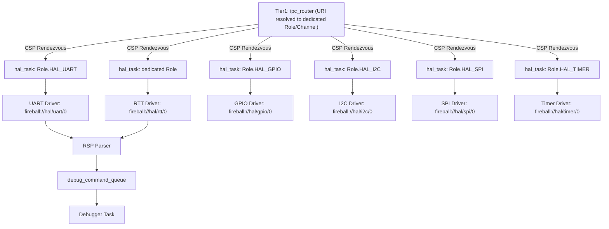
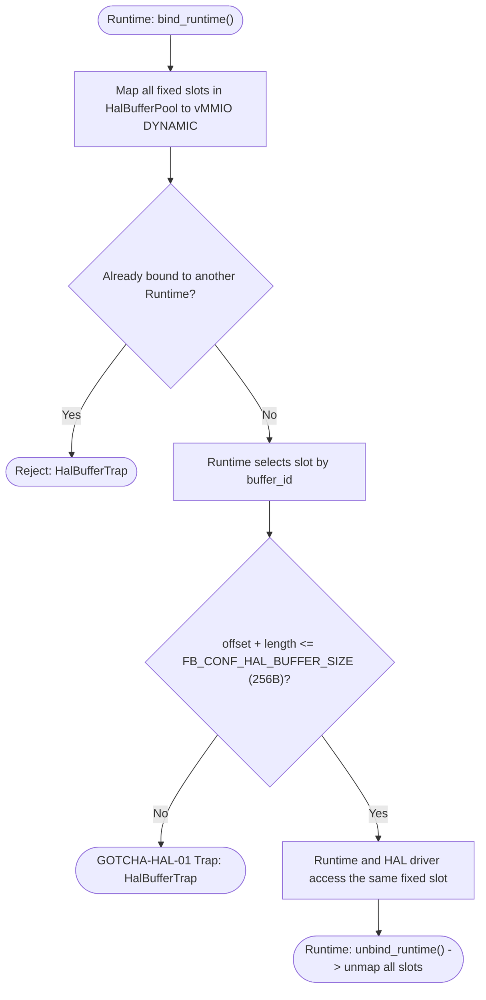
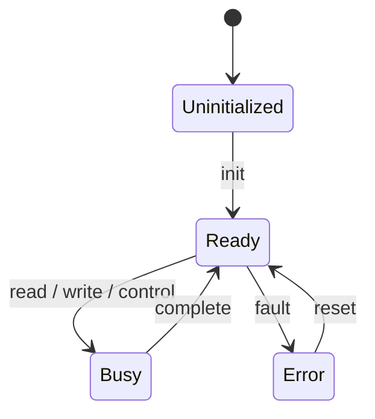
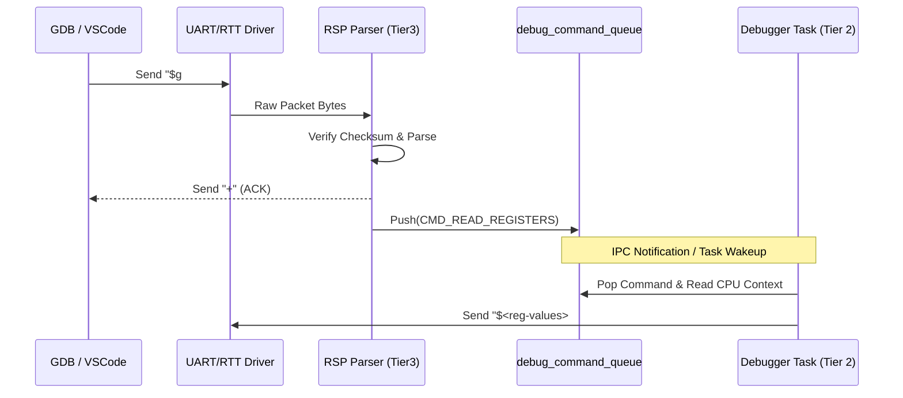

# HAL ドライバ実装（UART/SEGGER RTT/GPIO/I2C/SPI/Timer 物理層） コンポーネント設計書 {VERIFY_FORMAL} {VERIFY_LLM}
<!-- evidence:
     formal: formal/interrupt_boundary_model.py
     concept: concepts/platform_driver_concept.py
     test: docs/qa/tier3_platform/platform_driver_test_spec.md
-->

本コンポーネントは、Tier 2 の抽象契約 [`hal_dispatch.md`](docs/components/tier2_runtime/hal_dispatch.md)（URI Resolver、コマンドプロトコル、ゼロコピー転送インターフェース）の物理ドライバ実装である。契約と実装の記述に食い違いがあれば `hal_dispatch.md` を正とする（`{META_ContractImplSplit}` 契約/実装分割パターン）。

## 1. コンセプト
<!-- traceability: {Challenge_InterruptSafety} {TaskPollInterruptEvent} {RSPMinimalSet} {Fast_Path_GPIO} -->
[`hal_dispatch.md`](docs/components/tier2_runtime/hal_dispatch.md) が定義する `hal_task` コマンドディスパッチ契約を実現するため、UART・SEGGER RTT・GPIO・I2C・SPI・Timer の物理レジスタ操作ドライバ群を実装する。物理割り込みは原因付きイベントの通知とタスクウェイクアップによって安全に処理される。また、デバッグ用の GDB Remote Serial Protocol (RSP) のパケット物理エンコード/デコード（RSP Parser）を担い、解析済みデバッグコマンドを `debug_command_queue` へ供給する。

## 2. アーキテクチャ分類
<!-- traceability: {META_3TierSeparation} -->
本コンポーネントは **Tier 3 (プラットフォーム / リーフコンポーネント: Leaf Component)** に属し、ハードウェアとハイパーバイザの物理境界を抽象化する物理ドライバ実装を担当する。抽象化層（URI Resolver、コマンドプロトコル）は Tier 2 の [hal_dispatch.md](docs/components/tier2_runtime/hal_dispatch.md) が担う。

### 2.1 WASI-HAL結線設定

WASIアダプタとHALドライバのURI結線は、物理ドライバ実装とは別のTier 3設定ファイル [wasi_hal_bindings.py](experiments/pysim/tier3_platform/wasi_hal_bindings.py) で選択する。Tier 2はURIをハードコードせず、Tier 1の `WasiHalBindings` 契約を通じて注入された値だけを利用する。

| 結線 | 既定URI |
| :--- | :--- |
| `stdout_uri` | `fireball://hal/stdout/0` |
| `timer_uri` | `fireball://hal/timer/0` |
| `uart_uri` | `fireball://hal/uart/0` |
| `logger_uri` | `fireball://hal/logger/0` |

`logger_uri` は WASI/IPC のログ要求を識別する契約値として保持する。pysim のホストファイル出力は HAL ドライバではなく、`System` に `FileLogSink` を直接注入して `Logger.flush()` から出力する。

## 3. 静的モデル

### 3.1 データ構造
- **デバイスレジストリ（物理実体）**: 管理対象のデバイス情報を保持する静的配列。
- **HALバッファプール（物理実体）**: デバイス通信用に使用する、HALが管理する固定長バッファプール。**vMMIOの DYNAMIC 領域（コンパイル時に事前予約された専用ページプール）に配置され、安全かつ有界に管理される。バッファは共有メモリの所有権を持たず、`bind_runtime`した単一RuntimeとHALドライバがアクセスする。**
- **RSPパケットバッファ**: RSPパケットの送受信に使用する固定長バッファ。

### 3.2 内部ブロック図

各 `hal_task` インスタンスは Tier 2 [`hal_dispatch.md`](docs/components/tier2_runtime/hal_dispatch.md) が定義する契約に従い、1 インスタンスにつき 1 物理ドライバのみを専有する（1 タスクが複数デバイスの URI を見て振り分けることはない）。ドライバは起動前に受け付けるコマンドIDとコールバックを登録し、自身の `hal_task` を起動する。HAL共通層によるデバイス列挙・代理起動は行わない。RTT はデバッグトランスポートの代替経路であり、UART 同様 RSP Parser へ接続される（`{RSP_Transport_Selectable}`）。

### 3.3 主要なクラス・構造体・配列・定数

#### デバイス情報（device）
個別のデバイスの属性と状態を管理する。

| 項目名 | 機能と役割 | 型分類 | サイズ・制約 |
| :--- | :--- | :--- | :--- |
| デバイス識別子 | システム全体で重複しない、デバイスごとの管理番号 | ID値 | `device_id` |
| デバイス名 | 人間が識別可能なデバイスの名称 | 固定長配列 | 16bytes |
| 階層URI | IPC ルータに登録される正規化 URI | 文字列 | `fireball://hal/<type>/<instance>` |
| デバイス種別 | 入出力の特性（ブロック/ストリーム等）を識別する | 列挙型 | - |
| 転送単位 | デバイスが扱う最小のデータブロックサイズ | バイト数 | - |
| 予約ページ数 | vMMIO DYNAMIC領域に確保するページ数 (`reserved_pages`) | ページ数 | デフォルト0 |

#### HAL構成（hal_config、物理値）
<!-- traceability: {META_ConfigurableSystem} -->
`hal_dispatch.md` の契約上限を物理的な既定値として確定する。

| 項目名 | 機能と役割 | 型分類 | サイズ・制約 |
| :--- | :--- | :--- | :--- |
| 最大登録デバイス数 | システムが同時に管理可能なデバイスの総数。ビルド時定数 `FB_CONF_HAL_MAX_DEVICES`（現行値 `8`）で設定する | エントリ数 | 1-255 (許容範囲) |
| 最大バッファ数 | 通信に使用する内部バッファの予約数。ビルド時定数 `FB_CONF_HAL_MAX_BUFFERS`（現行値 `4`）で設定する | エントリ数 | 1-255 (許容範囲) |
| `buffer_size` | 単一バッファに割り当てられる固定バイト数。ビルド時定数 `FB_CONF_HAL_BUFFER_SIZE`（現行値 `256`）で設定する | バイト数 | - |

---

## 4. 動的モデル

### 4.1 割り込み処理の物理実装
<!-- traceability: {RSP_Transport_Selectable} {TaskPollInterruptEvent} {GLOBAL_InterruptWakeup} -->
- **割り込み通知（push）**: 物理割り込み発生時、ISRは原因情報を固定5ワードの`interrupt-event`へ変換し、COOSの`notify_interrupt(event)`で固定長FIFOへ投函するのみとする。物理デバイスの複数原因は、上位のイベント源マッピングで同じデバイス系統へ集約する。**ISRがタスク状態を直接書き換えることはない。**実際のREADY遷移は、スケジューラが協調境界でFIFOをドレインする際に行われる（を正本とする）。この非同期境界の分離は、[`interrupt_boundary_model.py`](docs/components/tier3_platform/formal/interrupt_boundary_model.py) に定義されたCTL検証項目 `isr_does_not_update_task_state_directly` および `interrupt_event_reaches_scheduler_boundary` として証明されている性質である。
- **割り込み配送**: COOSから渡された`interrupt-event`は、vSoCがSafepointで受け取り、ゲスト配送またはドロップを行う。vIRQの分類・デバイスノード・ゲスト関数登録はvSoCとvMMIOの契約に従い、物理ドライバはゲスト関数を直接呼び出さない。

#### HalBufferPool 固定スロット・境界検査手順（手順アクティビティ図）
<!-- traceability: {GOTCHA-HAL-01} {HAL_Interface} {IPC_ZeroCopy} -->
デバイス通信用固定スロットの境界検証、Runtimeバインド、および不正アクセス防御手順を示す。

### 4.2 状態遷移図（物理デバイス状態）
<!-- traceability: {RSP_Transport_Selectable} {TaskPollInterruptEvent} {GLOBAL_InterruptWakeup} -->

### 4.3 内部シーケンス (RSP パーサとデバッグキュー)
<!-- traceability: {RSPMinimalSet} {RSP_Transport_Selectable} -->
本コンポーネントは、ホスト PC 上の GDB / LLDB / VSCode デバッガと通信するための GDB RSP パケット物理処理を担当する：

1. **RSP パケット受信**: UART または RTT ドライバ経由でシリアルデータ（`$<packet-data>#<checksum>`）を受信する。
2. **パケット検証 & ACK**: 2桁の 16進チェックサムを検証し、一致すれば `+`（ACK）、不一致なら `-`（NACK）を即座に応答する。
3. **コマンド解析 (RSP Parser)**:
   - `$g` / `$G`: レジスタ一括読み出し / 書き込み
   - `$m<addr>,<len>` / `$M<addr>,<len>:<data>`: ゲストメモリ読み出し / 書き込み
   - `$s` / `$c`: シングルステップ実行 / 実行再開（Continue）
   - `$Z0,<addr>,<kind>` / `$z0,<addr>,<kind>`: ソフトウェアブレークポイント設定 / 解除
   - `$?`: 停止理由問い合わせ (Stop Reply)
4. **デバッグコマンドキュー投入**: 解析済みコマンドを `debug_command` 構造体に変換し、`debug_command_queue` へ Push。デバッガタスクがこれを Pop して vSoC / インタープリタ / JIT の実行を制御する。

## 5. インターフェース定義

### 5.1 物理実装の勘所・不変条件
<!-- traceability: {HAL_Interface} {IPC_ZeroCopy} {BufferedLogging} {GOTCHA-HAL-02} {GOTCHA-HAL-03} -->
[`hal_dispatch.md`](docs/components/tier2_runtime/hal_dispatch.md) の で定義された契約API（`read`, `write`, `transfer`, `get-buffer`）を、以下の物理不変条件に従って実装する。

**静的固定長バッファプールの境界厳格検査 (`GOTCHA-HAL-01`)**:
`HalBufferPool` は、`FB_CONF_HAL_MAX_BUFFERS` 個の固定サイズスロット（`FB_CONF_HAL_BUFFER_SIZE` = 256 バイト）を保持する。Runtimeの`bind_runtime`で全スロットをvMMIO DYNAMICへマップし、`get-buffer(buffer_id)`でスロットを選択する。HALは常に全スロットへアクセスでき、Runtimeは一度に一つだけバインドできる。`unbind_runtime`は全スロットのマッピングを解除する。
**設計理由と不変条件**: 固定スロットは共有メモリの所有権を持たず、HALの`acquire`/`release`も存在しない。Runtime以外のゲストがDYNAMICマッピングを取得すること、また`offset + length`がスロット境界を越えることは`HalBufferTrap`で即時停止させる。

`stream-read` / `stream-write` を処理するHALドライバは、コマンドに含まれる `hal_buf_id` を使って所有ゲストのバッファスロットへHALサブシステム権限でアクセスする。ゲスト所有権の検査はゲスト側の公開ビューで行い、ドライバ側は同じ固定スロットの境界検査だけを通過して読み書きする。したがって、標準入出力のストリーミングにドライバ専用の複製バッファや生ポインタは存在しない。

**ロガー出力の分離**:
ロガーは `Logger.flush()` が注入された `FileLogSink` へ直接書き込む。`FileLogSink` は HAL ドライバでも標準出力用ドライバのバッファでもない。
ログ行は、ゲストの標準出力へ混入しない。
ホスト実行では、出力先の実体をホストファイルとする。出力先は `System` の生成時に呼び出し側が渡す。
**設計理由**: 標準出力とログが同じ固定長バッファを共有すると、システムの警告ログがゲスト出力の途中に割り込む。この混入は、ゲスト出力の完全性検証を困難にする。

**UART トランスポートの双方向独立性 (`GOTCHA-HAL-02`)**:
UART デバイスドライバにおける送信リングバッファと受信リングバッファは、メモリ領域・ポインタ共に完全に独立したデータ構造として管理される。送受信でバッファや状態変数を不用意に共有・使い回すことを禁止し、全二重シリアル通信時における送受信ポインタ競合やデータ化けを防止する。

**単調増加タイマーの差分計算安全性 (`GOTCHA-HAL-03`)**:
32-bit ハードウェアカウンタ（SysTick / タイマー）による経過時間計測は、絶対時刻比較（`t2 > t1`）ではなく、必ず符号なし差分減算（`elapsed = t2 - t1`）により評価する。32-bit カウンタが 0xFFFFFFFF から 0x00000000 へラップアラウンドした場合であっても、2の補数演算のモジュロ代数によりアンダーフロー減算が正しく正確な経過時間を導出し、タイマーの単調増加性を保証する。

### 5.4 RSP デバッグトランスポート仕様
<!-- traceability: {RSP_Transport_Selectable} -->
UART および SEGGER RTT の双方において同一の RSP パケットエンコード/デコード処理を提供し、デバッガタスク（Tier 2）との間で透過的なリモートデバッグを実現する。

## 6. 制約達成の方策

### 6.1 メモリ制約と方策
<!-- traceability: {META_ConfigurableSystem} -->
- **目標**: 通信バッファによるメモリ圧迫を防止する。
- **方策**: バッファ数とサイズをコンパイル時に固定し、**vMMIOの動的領域 (`DYNAMIC`)** に配置する。

### 6.2 安全性制約と方策
<!-- traceability: {Challenge_InterruptSafety} -->
- **目標**: 割り込みによる実行コンテキストの破壊を防止する。
- **方策**: 割り込みハンドラ内ではフラグセットのみを行い、実際のデータ処理はタスクのコンテキストで実行する。

## 7. 形式検証・テスト仕様との対応

### 7.1 検証対象の不変条件
- **非同期割り込み境界分離**: ISR からタスク状態を直接変更せずキュー経由で安全にディスパッチすること（`interrupt_boundary_model.py` の `isr_does_not_update_task_state_directly` および `interrupt_event_reaches_scheduler_boundary`）。
- **固定長スロット境界保護**: 要求サイズが 256 バイトを超える場合の即時拒絶（`GOTCHA-HAL-01`）。

### 7.2 テスト仕様書との連携
本コンポーネントの物理実装テストケース（TEST-HAL-03, TEST-HAL-05〜TEST-HAL-08, TEST-HAL-15, GOTCHA-HAL-01〜03）は、[`platform_driver_test_spec.md`](docs/qa/tier3_platform/platform_driver_test_spec.md) を正本として定義する。HAL契約レベルのテストケース（TEST-HAL-01, TEST-HAL-02, TEST-HAL-04, TEST-HAL-09〜TEST-HAL-13）は [`hal_dispatch_test_spec.md`](docs/qa/tier2_runtime/hal_dispatch_test_spec.md) を参照する。TEST-HAL-15 は物理HALドライバの起動ではなく、ホスト側ファイルSinkの直接注入と標準出力分離を確認する。
