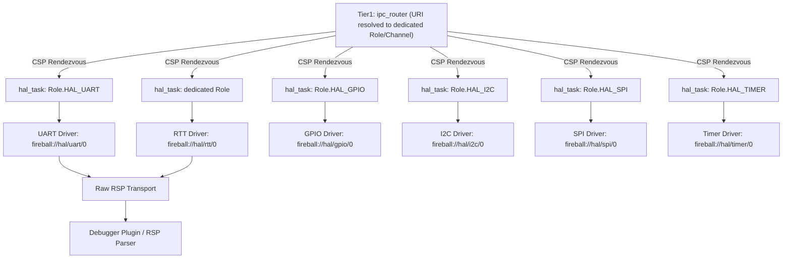
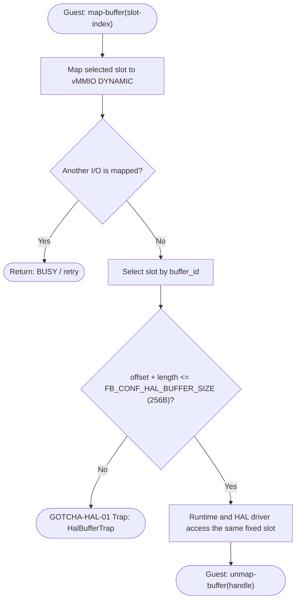
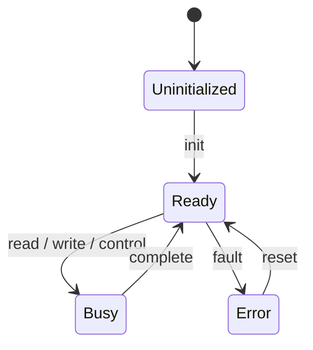
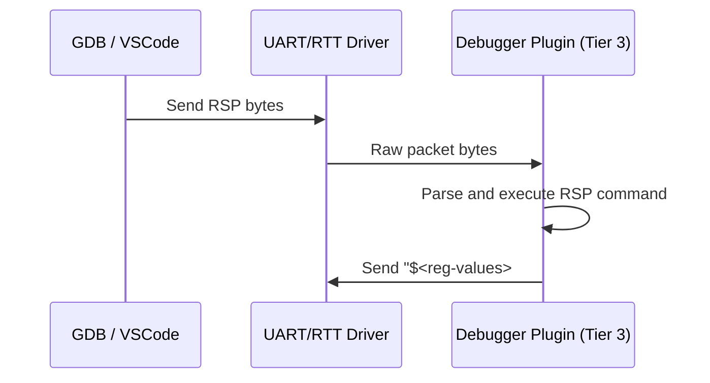

# HAL ドライバ実装（UART/SEGGER RTT/GPIO/I2C/SPI/Timer 物理層） コンポーネント設計書 {VERIFY_FORMAL} {VERIFY_LLM}
<!-- evidence:
     formal: formal/interrupt_boundary_model.py
     concept: concepts/platform_driver_concept.py
     test: docs/qa/tier3_platform/platform_driver_test_spec.md
-->

本コンポーネントは、Tier 2 の抽象契約 [`hal_dispatch.md`](docs/components/tier2_runtime/hal_dispatch.md)（URI Resolver、コマンドプロトコル、ゼロコピー転送インターフェース）の物理ドライバ実装である。RSP Parserは含めず、UARTやSEGGER RTTなどの物理トランスポートだけを提供する。契約と実装の記述に食い違いがあれば `hal_dispatch.md` を正とする（`{META_ContractImplSplit}` 契約/実装分割パターン）。

## 1. コンセプト
<!-- traceability: {Challenge_InterruptSafety} {TaskPollInterruptEvent} {RSPMinimalSet} {Fast_Path_GPIO} -->
[`hal_dispatch.md`](docs/components/tier2_runtime/hal_dispatch.md) が定義する `hal_task` コマンドディスパッチ契約を実現するため、UART・SEGGER RTT・GPIO・I2C・SPI・Timer の物理レジスタ操作ドライバ群を実装する。物理割り込み発生時、ISRは原因情報を固定5ワードの`interrupt-event`へ変換し、COOSの`notify_interrupt(event)`で固定長ロックフリーFIFOへ投函する。GDB Remote Serial Protocol (RSP) のパケット解析とデバッグコマンド生成は Tier 3 debugger が担当する。

## 2. アーキテクチャ分類
<!-- traceability: {META_3TierSeparation} -->
本コンポーネントは **Tier 3 (プラットフォーム / リーフコンポーネント: Leaf Component)** に属し、ハードウェアとハイパーバイザの物理境界を抽象化する物理ドライバ実装を担当する。抽象化層（URI Resolver、コマンドプロトコル）は Tier 2 の [hal_dispatch.md](docs/components/tier2_runtime/hal_dispatch.md) が担う。

### 2.1 WASIドライバ結線設定

WASIアダプタとHALドライバのURI結線は、物理ドライバ実装とは別のTier 3設定ファイル [`bindings.py`](experiments/pysim/tier3_platform/drivers/hal/bindings.py) で選択する。Tier 2はURIをハードコードせず、Tier 1の `WasiHalBindings` 契約を通じて注入された値だけを利用する。WASI Preview 1 の標準出力とFireballログ以外の操作は、[`uvwasi.py`](experiments/pysim/tier3_platform/drivers/wasi/uvwasi.py) を通じてuvwasiへ委譲する。

ドライバ構成の合成は [`platform_config.py`](experiments/pysim/tier3_platform/drivers/platform_config.py) が担う。`PlatformDriverConfiguration` は標準出力、ロガー、WASIバックエンドを一つの静的構成として保持する。

| 結線 | 既定URI |
| :--- | :--- |
| `stdout_uri` | `fireball://hal/stdout/0` |

WASIの結線設定は標準出力とログだけを対象とする。WASI Preview 1 の
`fd_read`、`fd_close`、`clock_time_get`、`random_get` および標準出力・ログ以外の
`fd_write` は、[`uvwasi.py`](experiments/pysim/tier3_platform/drivers/wasi/uvwasi.py) の
`WasiPreview1Backend` へ委譲する。
タイマーやUARTのURIをWASI結線へ追加してはならない。

診断ログはHAL URIを経由せず、`System`へ注入する専用Sinkへ`Logger.flush()`から直接出力する。既定構成は標準出力SinkをログSinkとして再利用しない。デバッガのRSP物理通信も、`DebuggerSink`契約を満たす専用Sinkとして`PlatformDriverConfiguration`へ注入する。既定実装はホスト評価用TCP Sinkであり、UART、J-Link、テスト用メモリSinkなどへ差し替えられる。RSPのフレーミング解析とコマンド解釈はDebuggerプラグインが担当し、Sinkはバイト転送だけを担当する。

## 3. 静的モデル

### 3.1 データ構造
- **デバイスレジストリ（物理実体）**: 管理対象のデバイス情報を保持する静的配列。
- **HALバッファプール（物理実体）**: デバイス通信用に使用する、HALが管理する固定長バッファプール。**vMMIOの DYNAMIC 領域へI/O操作中だけ対象スロットをマップし、安全かつ有界に管理する。バッファは共有メモリの所有権を持たず、マッピング中のゲストとHALドライバがアクセスする。**
- **RSPパケットバッファ**: RSPパケットの送受信に使用する固定長バッファ。

### 3.2 内部ブロック図
<!-- traceability: {RSP_Transport_Selectable} -->

各 `hal_task` インスタンスは Tier 2 [`hal_dispatch.md`](docs/components/tier2_runtime/hal_dispatch.md) が定義する契約に従い、1 インスタンスにつき 1 物理ドライバのみを専有する（1 タスクが複数デバイスの URI を見て振り分けることはない）。ドライバは起動前に受け付けるコマンドIDとコールバックを登録し、自身の `hal_task` を起動する。HAL共通層によるデバイス列挙・代理起動は行わない。RTT はUARTと同じRaw RSPトランスポート契約へ接続し、RSPの解析はDebugger Pluginへ渡す（`RSP_Transport_Selectable`）。

### 3.3 主要なクラス・構造体・配列・定数

#### デバイス情報（device）
個別のデバイスの属性と状態を管理する。

| 項目名 | 機能と役割 | 型分類 | サイズ・制約 |
| :--- | :--- | :--- | :--- |
| デバイス識別子 | システム全体で重複しない、デバイスごとの管理番号 | ID値 | `device_id` |
| デバイス名 | 人間が識別可能なデバイスの名称 | 固定長配列 | 16bytes |
| 階層URI | IPC ルータに登録される正規化 URI | 文字列 | `fireball://hal/<type>/<instance>` |
| デバイス種別 | 入出力の特性（ブロック/ストリーム等）を識別する | 列挙型 | - |
| 転送単位 | デバイスが扱う最小のデータブロックサイズ | バイト数 | - |
| 予約ページ数 | vMMIO DYNAMIC領域に確保するページ数 (`reserved_pages`) | ページ数 | デフォルト0 |

#### HAL構成（hal_config、物理値）
<!-- traceability: {META_ConfigurableSystem} -->
`hal_dispatch.md` の契約上限を物理的な既定値として確定する。

| 項目名 | 機能と役割 | 型分類 | サイズ・制約 |
| :--- | :--- | :--- | :--- |
| 最大登録デバイス数 | システムが同時に管理可能なデバイスの総数。ビルド時定数 `FB_CONF_HAL_MAX_DEVICES`（現行値 `8`）で設定する | エントリ数 | 1-255 (許容範囲) |
| 最大バッファ数 | 通信に使用する内部バッファの予約数。ビルド時定数 `FB_CONF_HAL_MAX_BUFFERS`（現行値 `4`）で設定する | エントリ数 | 1-255 (許容範囲) |
| `buffer_size` | 単一バッファに割り当てられる固定バイト数。ビルド時定数 `FB_CONF_HAL_BUFFER_SIZE`（現行値 `256`）で設定する | バイト数 | - |

---

## 4. 動的モデル

### 4.1 割り込み処理の物理実装
<!-- traceability: {RSP_Transport_Selectable} {TaskPollInterruptEvent} {GLOBAL_InterruptWakeup} -->
- **割り込み通知（event）**: 物理割り込み発生時、ISRは原因情報を固定5ワードの`interrupt-event`へ変換し、COOSの`notify_interrupt(event)`で固定長ロックフリーFIFOへ投函する。**ISRはイベント投函以外のタスク状態変更を行わない。**実際のREADY遷移は、スケジューラが協調境界でFIFOをドレインする際に行われる。この非同期境界の分離は、[`interrupt_boundary_model.py`](docs/components/tier3_platform/formal/interrupt_boundary_model.py) に定義されたCTL検証項目 `isr_does_not_update_task_state_directly` および `interrupt_event_reaches_scheduler_boundary` として証明されている性質である。
- **割り込み配送**: COOSから渡された`interrupt-event`は、COOS協調境界でvSoCが受け取り、ゲスト配送またはドロップを行う。vIRQの分類・デバイスノード・ゲスト関数登録はvSoCとvMMIOの契約に従い、物理ドライバはゲスト関数を直接呼び出さない。

#### HalBufferPool 固定スロット・境界検査手順（手順アクティビティ図）
<!-- traceability: {GOTCHA-HAL-01} {HAL_Interface} {IPC_ZeroCopy} -->
デバイス通信用固定スロットの境界検証、Runtimeバインド、および不正アクセス防御手順を示す。

### 4.2 状態遷移図（物理デバイス状態）
<!-- traceability: {RSP_Transport_Selectable} {TaskPollInterruptEvent} {GLOBAL_InterruptWakeup} -->

### 4.3 物理デバッグトランスポート
<!-- traceability: {RSP_Transport_Selectable} -->
本コンポーネントは、UARTまたはSEGGER RTTから受信したRSPバイト列をDebugger Pluginへ渡し、Pluginが生成したRSP応答バイト列を物理媒体へ送信する。チェックサム検証、ACK/NACK、コマンド解析、およびデバッグコマンドキューの管理は本コンポーネントの責務ではない。

## 5. インターフェース定義

### 5.1 物理実装の勘所・不変条件
<!-- traceability: {HAL_Interface} {IPC_ZeroCopy} {BufferedLogging} {GOTCHA-HAL-02} {GOTCHA-HAL-03} -->
[`hal_dispatch.md`](docs/components/tier2_runtime/hal_dispatch.md) で定義された契約API（`stream-read`, `stream-write`, `map-buffer`, `unmap-buffer`）を、以下の物理不変条件に従って実装する。

**静的固定長バッファプールの境界厳格検査 (`GOTCHA-HAL-01`)**:
`HalBufferPool` は、`FB_CONF_HAL_MAX_BUFFERS` 個の固定サイズスロット（`FB_CONF_HAL_BUFFER_SIZE` = 256 バイト）を保持する。ゲストの`map-buffer(buffer_id)`が選択した1スロットだけをvMMIO DYNAMICへマップし、I/O完了時の`unmap-buffer(handle)`で解除する。マッピング競合は`BUSY`を返し、境界超過や不正なハンドルだけを`HalBufferTrap`で即時停止させる。
**設計理由と不変条件**: 固定スロットは共有メモリの所有権を持たず、HALの`acquire`/`release`も存在しない。HALドライバは専用Sinkとしてマッピング中のスロットだけを参照する。

`stream-read` / `stream-write` を処理するHALドライバは、コマンドに含まれる `hal-buffer-id` を使って現在のI/Oでマップされたバッファスロットへ専用Sink経由でアクセスする。ゲスト側のマッピングは操作完了時に解除し、ドライバ側は同じ固定スロットの境界検査だけを通過して読み書きする。したがって、標準入出力のストリーミングにドライバ専用の複製バッファや生ポインタは存在しない。

**ロガー出力の分離**:
ロガーは `Logger.flush()` が注入された `FileLogSink` へ直接書き込む。`FileLogSink` は HAL ドライバでも標準出力用ドライバのバッファでもない。
ログ行は、ゲストの標準出力へ混入しない。
ホスト実行では、出力先の実体をホストファイルとする。出力先は `System` の生成時に呼び出し側が渡す。
**設計理由**: 標準出力とログが同じ固定長バッファを共有すると、システムの警告ログがゲスト出力の途中に割り込む。この混入は、ゲスト出力の完全性検証を困難にする。

**UART トランスポートの双方向独立性 (`GOTCHA-HAL-02`)**:
UART デバイスドライバにおける送信リングバッファと受信リングバッファは、メモリ領域・ポインタ共に完全に独立したデータ構造として管理される。送受信でバッファや状態変数を不用意に共有・使い回すことを禁止し、全二重シリアル通信時における送受信ポインタ競合やデータ化けを防止する。

**単調増加タイマーの差分計算安全性 (`GOTCHA-HAL-03`)**:
32ビットハードウェアカウンタ（SysTick / タイマー）の経過時間は、符号なし差分減算（`elapsed = t2 - t1`）で求める。絶対時刻（`t2 > t1`）を比較してはならない。

32ビットカウンタが `0xFFFFFFFF` から `0x00000000` へ折り返しても、2の補数演算のモジュロ代数により差分は正しい経過時間を示す。この方式はタイマーの単調増加性を保つ。

### 5.4 RSP 物理トランスポート仕様
<!-- traceability: {RSP_Transport_Selectable} -->
UART および SEGGER RTT は同一のRaw RSPバイトトランスポート契約を提供する。RSPパケットのエンコード、デコード、解析、およびデバッガ状態の管理は Tier 3 debugger の正本とする。

## 6. 制約達成の方策

### 6.1 メモリ制約と方策
<!-- traceability: {META_ConfigurableSystem} -->
- **目標**: 通信バッファによるメモリ圧迫を防止する。
- **方策**: バッファ数とサイズをコンパイル時に固定し、**vMMIOの動的領域 (`DYNAMIC`)** に配置する。

### 6.2 安全性制約と方策
<!-- traceability: {Challenge_InterruptSafety} -->
- **目標**: 割り込みによる実行コンテキストの破壊を防止する。
- **方策**: 割り込みハンドラ内ではフラグセットのみを行い、実際のデータ処理はタスクのコンテキストで実行する。

## 7. 形式検証・テスト仕様との対応

### 7.1 検証対象の不変条件
- **非同期割り込み境界分離**: ISR からタスク状態を直接変更せずキュー経由で安全にディスパッチすること（`interrupt_boundary_model.py` の `isr_does_not_update_task_state_directly` および `interrupt_event_reaches_scheduler_boundary`）。
- **固定長スロット境界保護**: 要求サイズが 256 バイトを超える場合の即時拒絶（`GOTCHA-HAL-01`）。

### 7.2 テスト仕様書との連携
本コンポーネントの物理実装テストケース（TEST-HAL-03, TEST-HAL-05〜TEST-HAL-08, TEST-HAL-15, GOTCHA-HAL-01〜03）は、[`platform_driver_test_spec.md`](docs/qa/tier3_platform/platform_driver_test_spec.md) を正本として定義する。HAL契約レベルのテストケース（TEST-HAL-01, TEST-HAL-02, TEST-HAL-04, TEST-HAL-09〜TEST-HAL-13）は [`hal_dispatch_test_spec.md`](docs/qa/tier2_runtime/hal_dispatch_test_spec.md) を参照する。TEST-HAL-15 は物理HALドライバの起動ではなく、ホスト側ファイルSinkの直接注入と標準出力分離を確認する。
