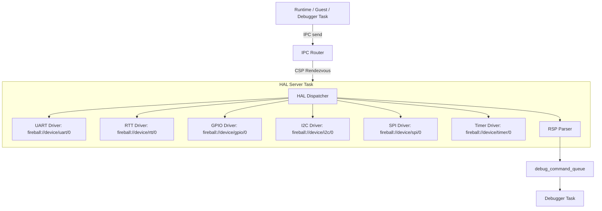
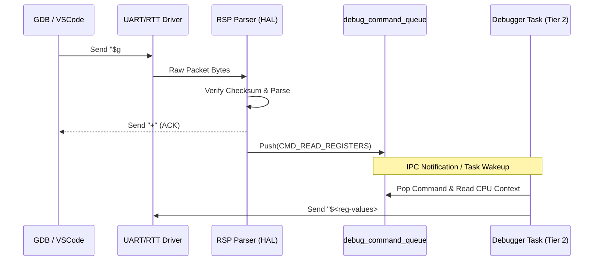
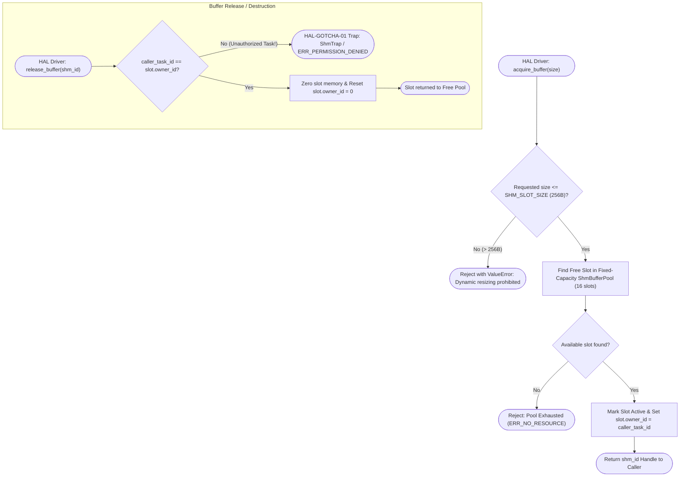
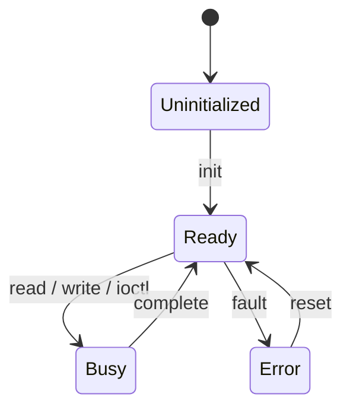

# HAL コンポーネント設計書 {VERIFY_FORMAL} {VERIFY_LLM}
<!-- evidence:
     formal: ../tier2_runtime/formal/vsoc_state_model.py
     test: tests/platform_hal_test_spec.md
-->

## 1. コンセプト
<!-- traceability: {IPCRouter} {Challenge_InterruptSafety} {TaskPollInterruptFlag} {RSPMinimalSet} {Fast_Path_GPIO} {URIAbstraction} {TypeSafeMessaging} {IPC_ZeroCopy} -->
HAL (Hardware Abstraction Layer) は、COOS 上で稼働する独立したタスク（`hal_task`）として常駐し、物理ハードウェアおよび仮想ペリフェラルへのアクセスを抽象化して提供する。上位層（Runtime, Debugger, Guest 等）からの直接関数呼び出しは行わず、通信はすべて IPC ルータ（`ipc_router`）を介した CSP rendezvous メッセージパッシングによって行われる。ペリフェラル・ストリーム・GPIO 等は階層型 URI（`fireball://device/<driver-type>/<instance-id>`）経由で動的にバインド・解決される。
HAL タスクは IPC ルータ（`ipc_router`）から WASI 0.3p ドライバ通信コマンド（`CMD_STREAM_*`, `CMD_CLOCK_*`, `CMD_GPIO_*`, `CMD_BUS_*`）を受信し、vMMIO FC=14 の共有メモリ（`shm-slice`）を介してゼロコピーで高速データ転送を実行する。また、デバッグ用の GDB Remote Serial Protocol (RSP) のパケット解析（RSP Parser）を担い、解析済みデバッグコマンドを `debug_command_queue` へ供給する。割り込みはフラグ通知とタスクウェイクアップによって安全に処理される。 `{IPCRouter}` `{Challenge_InterruptSafety}` `{TaskPollInterruptFlag}` `{RSPMinimalSet}` `{Fast_Path_GPIO}` `{URIAbstraction}` `{TypeSafeMessaging}` `{IPC_ZeroCopy}`

## 2. アーキテクチャ分類
<!-- traceability: {META_3TierSeparation} {IPCRouter} {URIAbstraction} {META_StaticDI} -->
本コンポーネントは **Tier 3 (プラットフォーム / リーフコンポーネント: Leaf Component)** に属し、ハードウェアとハイパーバイザの物理境界を抽象化して WASI 0.3p / HAL インターフェースとして上位層に対するデバイスアクセスプリミティブを提供する。 `{META_3TierSeparation}` `{IPCRouter}` `{URIAbstraction}` `{META_StaticDI}`

## 3. 静的モデル

### 3.1 データ構造
- **デバイスレジストリ**: 管理対象のデバイス情報を保持する静的配列。
- **HALバッファプール**: デバイス通信用に使用する、ドライバ側で管理される静的固定長バッファプール。**vMMIOの DYNAMIC 領域（コンパイル時に事前予約された静的ページプール）に配置され、動的メモリ確保（`malloc` / `new`）は一切行わない。**
- **RSPパケットバッファ**: RSPパケットの送受信に使用する固定長バッファ。

### 3.2 内部ブロック図

### 3.3 主要なクラス・構造体・配列・定数

#### HAL サーバタスク（hal_task）
<!-- traceability: {META_3TierSeparation} {IPCRouter} -->
COOS 上で独立して実行される協調タスク。上位層からの直接関数呼び出しを禁止し、IPC ルータ（`fireball://device/...`）経由で CSP rendezvous 受信ループ（`ipc.recv`）を実行してコマンドをディスパッチする。

| 項目名 | 機能と役割 | 型分類 | サイズ・制約 |
| :--- | :--- | :--- | :--- |
| タスクコルーチン | COOS スケジューラ上で IPC 受信を待機・処理する実行体 | コルーチン | 単一タスクスロット |
| ドライバマップ | 階層 URI に対応するドライバインスタンス | 配列/FlatMap | 固定長 |
| セキュリティロール | IPC ルータで検証される権限ロール | ロール | `Role.PLATFORM_HAL` |

#### デバイス情報（device）
個別のデバイスの属性と状態を管理する。

| 項目名 | 機能と役割 | 型分類 | サイズ・制約 |
| :--- | :--- | :--- | :--- |
| デバイス識別子 | システム全体で重複しない、デバイスごとの管理番号 | ID値 | `device_id` |
| デバイス名 | 人間が識別可能なデバイスの名称 | 固定長配列 | 16bytes |
| 階層URI | IPC ルータに登録される正規化 URI | 文字列 | `fireball://device/<type>/<instance>` |
| デバイス種別 | 入出力の特性（ブロック/ストリーム等）を識別する | 列挙型 | - |
| 転送単位 | デバイスが扱う最小のデータブロックサイズ | バイト数 | - |
| 予約ページ数 | vMMIO DYNAMIC領域に確保するページ数 (`reserved_pages`) | ページ数 | デフォルト0 |

#### HAL構成（hal_config）
<!-- traceability: {META_ConfigurableSystem} -->
HAL全体の制限値を定義する。 `{META_ConfigurableSystem}`

| 項目名 | 機能と役割 | 型分類 | サイズ・制約 |
| :--- | :--- | :--- | :--- |
| 最大登録デバイス数 | システムが同時に管理可能なデバイスの総数 | エントリ数 | 1-255 |
| 最大バッファ数 | 通信に使用する内部バッファの予約数 | エントリ数 | 1-255 |
| `buffer_size` | 単一バッファに割り当てられる固定バイト数 | バイト数 | - |

---

## 4. IPC 通信仕様 (IPC Driver & RSP Protocol)

### 4.1 階層型 URI 命名規則 (Hierarchical URI Scheme)
<!-- traceability: {URIAbstraction} {IPCRouter} -->
HAL が管轄するすべてのハードウェアドライバおよびコンソール出力は、以下の階層型 URI で IPC レジストリへ登録される：

- `fireball://device/uart/0`: UART シリアル入出力ドライバ（ストリーム）
- `fireball://device/gpio/0`: GPIO ポートドライバ（ピン入出力・エッジトリガ）
- `fireball://device/timer/0`: ハードウェアタイマードライバ（単調増加時刻・非同期イベント）
- `fireball://device/i2c/0`: I2C バスマスタ／スレーブドライバ
- `fireball://device/spi/0`: SPI バスマスタ／スレーブドライバ
- `fireball://device/rtt/0`: SEGGER RTT デバッグ通信ドライバ
- `fireball://service/stdout/0`: 標準出力コンソールストリーム

### 4.2 WASI 0.3p IPC ドライバ通信コマンド仕様
<!-- traceability: {TypeSafeMessaging} {IPC_ZeroCopy} {HAL_Interface} -->
各ドライバは IPC ルータ経由で以下の `kv_pair` コマンドを受信し、共有メモリ（`shm-slice`）と連携してハードウェア処理を実行する：

| 分類 | コマンド名 | コマンド ID | 引数 (`kv_pair` / SHM) | 戻り値 | 説明 |
| :--- | :--- | :--- | :--- | :--- | :--- |
| **共通 (Capability)** | `CMD_QUERY_CAPS` | `0x00` | `query_cmd_id` (16bit) | `is_supported` (1=対応, 0=非対応) | ドライバが指定コマンドをサポートしているか確認 |
| **Stream (UART/Stdout)** | `CMD_STREAM_WRITE_SHM` | `0x01` | `shm_handle`, `offset`, `len` | `written_bytes` | 共有メモリ（FC=14）上のデータをデバイスへ送信 |
| | `CMD_STREAM_READ_SHM` | `0x02` | `shm_handle`, `offset`, `max_len` | `read_bytes` | デバイスから共有メモリへデータを読み込み |
| | `CMD_STREAM_FLUSH` | `0x03` | なし | `0` (SUCCESS) | デバイス送信バッファのフラッシュ |
| | `CMD_STREAM_CLOSE` | `0x04` | なし | `0` (SUCCESS) | ストリームチャネルのクローズ |
| **Clock/Timer** | `CMD_CLOCK_GET_NOW` | `0x10` | なし | `now_ns` (64bit) | 単調増加時刻（SysTick/Timer ナノ秒）を取得 |
| | `CMD_CLOCK_SUBSCRIBE` | `0x11` | `nanos` (64bit) | `pollable_handle` | 指定ナノ秒後に発火する非同期イベントを予約 |
| | `CMD_CLOCK_GET_RES` | `0x12` | なし | `resolution_ns` | クロック分解能（ナノ秒）を取得 |
| **GPIO/Trigger** | `CMD_GPIO_SET_PIN` | `0x20` | `pin_no`, `val` (0/1) | `0` (SUCCESS) | GPIO ピンの出力レベルを設定 |
| | `CMD_GPIO_GET_PIN` | `0x21` | `pin_no` | `pin_val` (0/1) | GPIO ピンの入力レベルを取得 |
| | `CMD_GPIO_CONFIG_PIN`| `0x22` | `pin_no`, `mode` (In/Out/Pull) | `0` (SUCCESS) | GPIO ピンの方向・プル構成を設定 |
| | `CMD_GPIO_SUBSCRIBE_EDGE` | `0x23` | `pin_no`, `edge_type` | `pollable_handle` | エッジ検出時に発火するイベントを登録 |
| **Bus (I2C/SPI)** | `CMD_BUS_TRANSFER_SHM` | `0x30` | `tx_shm_handle`, `rx_shm_handle`, `len` | `transferred_bytes` | TX/RX 共有メモリ間の全二重/半二重転送 |
| | `CMD_BUS_CONFIG` | `0x31` | `clock_hz`, `slave_addr`, `mode` | `0` (SUCCESS) | 通信速度・スレーブアドレス・転送モード設定 |

### 4.3 RSP (Remote Serial Protocol) パーサとデバッグキュー仕様
<!-- traceability: {RSPMinimalSet} {RSP_Transport_Selectable} -->
HAL は、ホスト PC 上の GDB / LLDB / VSCode デバッガと通信するための GDB RSP パケット処理を担当する：

1. **RSP パケット受信**: UART または RTT ドライバ経由でシリアルデータ（`$<packet-data>#<checksum>`）を受信する。 `{RSP_Transport_Selectable}`
2. **パケット検証 & ACK**: 2桁の 16進チェックサムを検証し、一致すれば `+`（ACK）、不一致なら `-`（NACK）を即座に応答する。
3. **コマンド解析 (RSP Parser)**:
   - `$g` / `$G`: レジスタ一括読み出し / 書き込み
   - `$m<addr>,<len>` / `$M<addr>,<len>:<data>`: ゲストメモリ読み出し / 書き込み
   - `$s` / `$c`: シングルステップ実行 / 実行再開（Continue）
   - `$Z0,<addr>,<kind>` / `$z0,<addr>,<kind>`: ソフトウェアブレークポイント設定 / 解除
   - `$?`: 停止理由問い合わせ (Stop Reply)
4. **デバッグコマンドキュー投入**: 解析済みコマンドを `debug_command` 構造体に変換し、`debug_command_queue` へ Push。デバッガタスクがこれを Pop して vSoC / インタープリタ / JIT の実行を制御する。 `{RSPMinimalSet}`

---

## 5. WASI サポート体系 (WASI 0.3p Core & 0.1p Wrapper)

### 5.1 「HAL ＝ WASI 0.3p」統合アーキテクチャ
<!-- traceability: {WASI_Implementation} {URIAbstraction} -->
Fireball ではハードウェア制御のプリミティブを WASI 0.3p のリソース・ストリーム体系として直接実装する：

- **動的インターフェース解決 (`resolver.get-interface`)**:
  ゲスト WASM アプリケーションは、`resolver.get-interface("fireball://device/uart/0")` 等を呼び出すことで、対応するデバイスへの IPC チャネルハンドルを動的に取得できる。
- **共有メモリベースのデータ転送**:
  WASI 0.3p の `streaming` / `bus` インターフェースは、`acquire-shm` で取得した共有メモリハンドル（`shm-slice`）を受け渡しすることで、生ポインタ dereference を完全に排除した安全・ゼロコピーな転送を行う。

### 5.2 WASI 0.1p (`wasi_snapshot_preview1`) 互換ラッパー
<!-- traceability: {TypeSafeMessaging} {META_ZeroCostAbstraction} -->
既存の WASI Preview 1 向けコンパイル済みバイナリとの互換性をゼロコストで提供するため、以下の Preview 1 ABI を WASI 0.3p / HAL リソースへのアダプタとしてルーティングする：

- **`fd_write`**:
  - `fd=1` (stdout) / `fd=2` (stderr): `wasi:cli/stdout` または `fireball://device/uart/0` の `CMD_STREAM_WRITE_SHM` へ委譲。
  - `fd>=3`: IPC チャネル経由のパケット送信へ委譲。
- **`fd_read`**:
  - `fd=0` (stdin): `fireball://device/uart/0` の `CMD_STREAM_READ_SHM` へ委譲。
  - `fd>=3`: IPC チャネルからのパケット受信へ委譲。
- **`clock_time_get`**:
  - `fireball://device/timer/0` の `CMD_CLOCK_GET_NOW`（単調ナノ秒時刻）へ委譲。
- **`proc_exit`**:
  - ハイパーバイザのシステム停止・終了コード設定へ委譲。
- **`random_get`**:
  - ハードウェア TRNG（True Random Number Generator）ドライバへ委譲。

---

## 6. 動的モデル

### 6.1 アルゴリズム
<!-- traceability: {RSP_Transport_Selectable} {TaskPollInterruptFlag} {GLOBAL_InterruptWakeup} -->
- **コマンドルーティング**: IPCで受信したコマンド（read/write/control）を、デバイスIDに基づいて適切なドライバへ振り分ける。
- **割り込み通知（push）**: 物理割り込み発生時、ISR は COOS の `notify_interrupt(irq_id)` を呼び、INT イベントを有界キューへ投函するのみとする。**ISR がタスク状態を直接書き換えることはない。**実際の READY 遷移は、スケジューラが yield 点でキューをドレインする際に行われる（`{GLOBAL_InterruptWakeup}` を正本とする）。この非同期境界の分離が vSoC 実行状態モデルの安全性検証項目 `irq_jit_race_freedom_proof`（形式検証モデルの CTL 安全性検証 `AG(Not(handling_irq & jit_mode))` として証明されている）性質である。
- **割り込み確認（pull）**: `{TaskPollInterruptFlag}` が定義するもう一方の経路として、ゲスト実行エンジン（JIT/インタープリタ）は Safepoint で `vsoc_context.interrupt_flags` を自ら確認する。この pull 側の実装（Safepoint 埋め込み位置、フラグ構造）は HAL の管轄外であり、`{TaskPollInterruptFlag}` を正本とする。 `{TaskPollInterruptFlag}` `{GLOBAL_InterruptWakeup}`

#### ShmBufferPool バッファ確保・境界検査手順（手順アクティビティ図）
<!-- traceability: {HAL-GOTCHA-01} {HAL_Interface} {IPC_ZeroCopy} -->
デバイス通信用バッファスロットの固定長境界検証、タスク所有権照合、および不正アクセス防御手順を示す。

### 6.2 状態遷移図
<!-- traceability: {RSP_Transport_Selectable} {TaskPollInterruptFlag} {GLOBAL_InterruptWakeup} -->

---

## 7. インターフェース定義

### 7.1 公開 API
<!-- traceability: {HAL_Interface} {IPC_ZeroCopy} -->

#### データの読み出し (`read`)
- **シグネチャ**: `read(id: device-id, dst: shm-id) -> operation-result`
- **機能**: 指定された物理デバイスからデータを取得し、共有バッファ（`shm-id`）へ格納する。生ポインタ渡しは行わない。

#### データの書き込み (`write`)
- **シグネチャ**: `write(id: device-id, src: shm-id) -> operation-result`
- **機能**: 共有バッファ（`shm-id`）内のデータを指定された物理デバイスへ送信する。

#### ゼロコピー転送 (`transfer`)
<!-- traceability: {PhysicalPassthrough} -->
- **シグネチャ**: `transfer(tx_buffer: shm_id, rx_buffer: shm_id) -> operation-result`
- **機能**: アプリケーションの共有メモリバッファを直接DMAエンジン等へ渡し、CPUコピーなしで高速転送する。 `{PhysicalPassthrough}`

#### バッファの確保 (`acquire_buffer`)
<!-- traceability: {HAL_Interface} {IPC_ZeroCopy} -->
- **シグネチャ**: `acquire_buffer(size: uint32) -> result<shm-id, recovery-strategy>`
- **機能**: vMMIO の共有メモリ領域（SHM領域: `0xE000_0000`〜）から固定長バッファスロットを確保する。 `{OwnerMismatchTrap}`

**静的固定長バッファプールの境界厳格検査 (`HAL-GOTCHA-01`)**:
`acquire_buffer`（`ShmBufferPool`）は、固定サイズスロット（`FB_CONF_HAL_BUFFER_SIZE` = 256 バイト）の静的プールからバッファを切り出す。
**設計理由と不変条件**: 要求サイズが 256 バイトを超過した場合（`size > FB_CONF_HAL_BUFFER_SIZE`）は即座に `ValueError` で拒絶する。また、バッファ解放時（`release_buffer`）は呼び出し元タスク ID が割り当て時の所有タスク ID と一致することを厳格に検査し、不一致時は `ShmTrap` により即時停止させる。これにより、隣接する固定長スロットの汚染や不正解放を完全に防止する。

**UART トランスポートの双方向独立性 (`HAL-GOTCHA-02`)**:
UART デバイスドライバにおける送信リングバッファと受信リングバッファは、メモリ領域・ポインタ共に完全に独立したデータ構造として管理される。送受信でバッファや状態変数を不用意に共有・使い回すことを禁止し、全二重シリアル通信時における送受信ポインタ競合やデータ化けを防止する。

**単調増加タイマーの差分計算安全性 (`HAL-GOTCHA-03`)**:
32-bit ハードウェアカウンタ（SysTick / タイマー）による経過時間計測は、絶対時刻比較（`t2 > t1`）ではなく、必ず符号なし差分減算（`elapsed = t2 - t1`）により評価する。32-bit カウンタが 0xFFFFFFFF から 0x00000000 へラップアラウンドした場合であっても、2の補数演算のモジュロ代数によりアンダーフロー減算が正しく正確な経過時間を導出し、タイマーの単調増加性を保証する。

---

## 8. 制約達成の方策

### 8.1 性能制約と方策
<!-- traceability: {META_ConfigurableSystem} -->
- **目標**: ハードウェアアクセスのレイテンシを最小化する。
- **方策**: `{META_ConfigurableSystem}` デバイス構成をコンパイル時に固定し、実行時の動的な探索オーバーヘッドを排除する。

### 8.2 メモリ制約と方策
<!-- traceability: {META_ConfigurableSystem} -->
- **目標**: 通信バッファによるメモリ圧迫を防止する。
- **方策**: `{META_ConfigurableSystem}` バッファ数とサイズをコンパイル時に固定し、**vMMIOの動的領域 (`DYNAMIC`)** に配置する。

### 8.3 安全性制約と方策
<!-- traceability: {Challenge_InterruptSafety} -->
- **目標**: 割り込みによる実行コンテキストの破壊を防止する。
- **方策**: `{Challenge_InterruptSafety}` 割り込みハンドラ内ではフラグセットのみを行い、実際のデータ処理はタスクのコンテキストで実行する。
