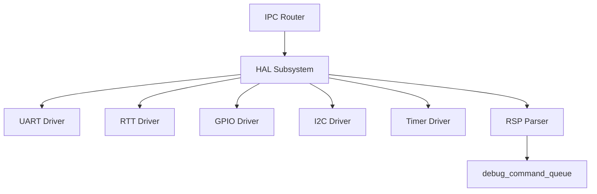
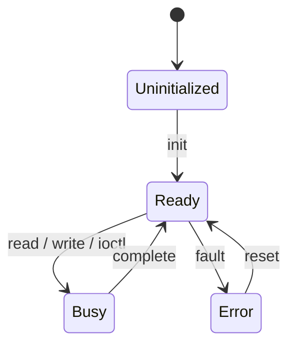
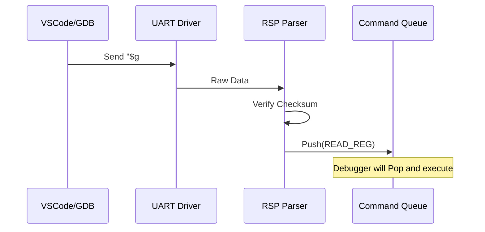

# HAL コンポーネント設計書 {VERIFY_FORMAL} {VERIFY_LLM}
<!-- evidence:
     formal: ../tier2_runtime/formal/vsoc_state_model.py
     test: tests/platform_hal_test_spec.md
-->

## 1. コンセプト
<!-- traceability: {IPCRouter} {Challenge_InterruptSafety} {TaskPollInterruptFlag} {RSPMinimalSet} {Fast_Path_GPIO} -->
HAL (Hardware Abstraction Layer) は、ハードウェアへのアクセスを抽象化し、vSoCやサービスに対して統一されたインターフェイスを提供する。また、デバッグ用のGDB Remote Serial Protocol (RSP) のパケット解析（RSP Parser）を担い、解析済みコマンドをデバッガへ供給する。すべてのアクセスはIPCルータを経由し、割り込みはフラグ通知とタスクウェイクアップによって安全に処理される。 `{IPCRouter}` `{Challenge_InterruptSafety}` `{TaskPollInterruptFlag}` `{RSPMinimalSet}` `{Fast_Path_GPIO}`

## 2. アーキテクチャ分類
<!-- traceability: {META_3TierSeparation} {IPCRouter} {URIAbstraction} {META_StaticDI} -->
本コンポーネントは **Tier 3 (プラットフォーム / リーフコンポーネント: Leaf Component)** に属し、ハードウェアとハイパーバイザの物理境界を抽象化して上位層に対するデバイスアクセスプリミティブを提供する。 `{META_3TierSeparation}` `{IPCRouter}` `{URIAbstraction}` `{META_StaticDI}`

## 3. 静的モデル

### 3.1 データ構造
- **デバイスレジストリ**: 管理対象のデバイス情報を保持する静的配列。
- **HALバッファプール**: デバイス通信用に使用する、ドライバ側で管理されるバッファプール。**vMMIOの動的領域に配置される。**
- **RSPパケットバッファ**: RSPパケットの送受信に使用する固定長バッファ。

### 3.2 内部ブロック図

### 3.3 主要なクラス・構造体・配列・定数

#### デバイス情報（device）
個別のデバイスの属性と状態を管理する。

| 項目名 | 機能と役割 | 型分類 | サイズ・制約 |
| :--- | :--- | :--- | :--- |
| デバイス識別子 | システム全体で重複しない、デバイスごとの管理番号 | ID値 | `device_id` |
| デバイス名 | 人間が識別可能なデバイスの名称 | 固定長配列 | 16bytes |
| デバイス種別 | 入出力の特性（ブロック/ストリーム等）を識別する | 列挙型 | - |
| 転送単位 | デバイスが扱う最小のデータブロックサイズ | バイト数 | - |
| 予約ページ数 | vMMIO DYNAMIC領域に確保するページ数 (`reserved_pages`) | ページ数 | デフォルト0 |

#### HAL構成（hal_config）
<!-- traceability: {META_ConfigurableSystem} -->
HAL全体の制限値を定義する。 `{META_ConfigurableSystem}`

| 項目名 | 機能と役割 | 型分類 | サイズ・制約 |
| :--- | :--- | :--- | :--- |
| 最大登録デバイス数 | システムが同時に管理可能なデバイスの総数 | エントリ数 | 1-255 |
| 最大バッファ数 | 通信に使用する内部バッファの予約数 | エントリ数 | 1-255 |
| `buffer_size` | 単一バッファに割り当てられる固定バイト数 | バイト数 | - |

## 4. 動的モデル

### 4.1 アルゴリズム
<!-- traceability: {RSP_Transport_Selectable} {TaskPollInterruptFlag} {GLOBAL_InterruptWakeup} -->
- **コマンドルーティング**: IPCで受信したコマンド（read/write等）を、デバイスIDに基づいて適切なドライバへ振り分ける。
- **RSPパケット解析**: UARTまたはRTTから受信したRSPパケットを解析し、`debug_command` 構造体へ変換してコマンドキューへ投入する。 `{RSP_Transport_Selectable}`
- **割り込み通知（push）**: 物理割り込み発生時、ISR は COOS の `notify_interrupt(irq_id)` を呼び、INT イベントを有界キューへ投函するのみとする。**ISR がタスク状態を直接書き換えることはない。**実際の READY 遷移は、スケジューラが yield 点でキューをドレインする際に行われる（`{GLOBAL_InterruptWakeup}` を正本とする）。この非同期境界の分離が vSoC 実行状態モデルの安全性検証項目 `irq_jit_race_freedom_proof`（形式検証モデルの CTL 安全性検証 `AG(Not(handling_irq & jit_mode))` として証明されている）性質である。
- **割り込み確認（pull）**: `{TaskPollInterruptFlag}` が定義するもう一方の経路として、ゲスト実行エンジン（JIT/インタープリタ）は Safepoint で `vsoc_context.interrupt_flags` を自ら確認する。この pull 側の実装（Safepoint 埋め込み位置、フラグ構造）は HAL の管轄外であり、`{TaskPollInterruptFlag}` を正本とする。 `{TaskPollInterruptFlag}` `{GLOBAL_InterruptWakeup}`

### 4.2 状態遷移図
<!-- traceability: {RSP_Transport_Selectable} {TaskPollInterruptFlag} {GLOBAL_InterruptWakeup} -->

### 4.3 内部シーケンス
<!-- traceability: {RSP_Transport_Selectable} {TaskPollInterruptFlag} {GLOBAL_InterruptWakeup} -->
#### RSPパケット受信とコマンド供給シーケンス

## 5. インターフェイス定義

### 5.1 公開API
外部から利用可能なオブジェクト指向APIを定義する。

#### データの読み出し

<!-- traceability: {HAL_Interface} -->

| 項目 | 内容 |
| :--- | :--- |
| 機能概要 | 指定された物理デバイスからデータを取得し、共有バッファ（`shm-id`）へ格納する。`write` と同一のバッファ機構を用い、生ポインタ渡しは行わない。 |
| シグネチャ | `read(id: device-id, dst: shm-id) -> operation-result` |
| 引数 | `id`: 対象デバイスID `dst`: 読み出し先の共有メモリハンドル（`acquire_buffer` で確保） |
| 戻り値 | 操作結果（成功時は読み出しバイト数、失敗時は `recovery-strategy`） |
| 期待する結果 | 正常系：バッファに要求したデータが書き込まれる。 |

#### データの書き込み (write)

<!-- traceability: {HAL_Interface} -->

| 項目 | 内容 |
| :--- | :--- |
| 機能概要 | 共有バッファ（`shm-id`）内のデータを指定された物理デバイスへ送信する。 |
| シグネチャ | `write(id: device-id, src: shm-id) -> operation-result` |
| 引数 | `id`: 対象デバイスID `src`: 送信データが格納された共有メモリハンドル |

#### ゼロコピー転送 (bus_master/streaming)
<!-- traceability: {PhysicalPassthrough} -->

| 項目 | 内容 |
| :--- | :--- |
| 機能概要 | アプリケーションの共有メモリバッファを直接DMAエンジン等へ渡し、コピーなしでの高速転送を実現する。 |
| シグネチャ | `transfer(tx_buffer: shm_id, rx_buffer: shm_id) -> operation-result` |
| 期待する結果 | 正常：CPUを介さずバッファ間のデータ移動が完了する。 `{PhysicalPassthrough}` |

#### 非標準制御 (control)
<!-- traceability: {HAL_Interface} {TypeSafeMessaging} -->

| 項目 | 内容 |
| :--- | :--- |
| 機能概要 | read/write で表現できないデバイス固有の操作（ボーレート設定、ピン制御等）を行う。 |
| シグネチャ | `control(id: device-id, cmd: command-id, params: ipc-message) -> operation-result` |
| 引数 | `id`: デバイスID `cmd`: コマンド識別子 `params`: コマンド固有引数(Key-Valueメッセージ) |
| 戻り値 | 操作結果 |
| 補足 | 本APIは `ipc-message` を経由するため IPC のオーバーヘッドを伴い、`{PhysicalPassthrough}` の高速パスではない。レイテンシに敏感なピン操作は `{Fast_Path_GPIO}` の経路を用いること。 `{HAL_Interface}` |

#### バッファの確保
<!-- traceability: {HAL_Interface} {IPC_ZeroCopy} -->

| 項目 | 内容 |
| :--- | :--- |
| 機能概要 | デバイス通信に使用する静的固定長バッファプールからスロットを一つ確保する。**確保されたバッファは vMMIO の共有メモリ領域（SHM領域: `0xE000_0000`〜、静的アロケーション）のスロットにマッピングされる。** このアドレス範囲・ページ単位のレイアウトは `{OwnerMismatchTrap}` を正本とする。 |
| シグネチャ | `acquire_buffer(size: バイト数) -> result<shm-id, recovery-strategy>` |
| 引数 | `size`: 必要なバイト数 |
| 戻り値 | 成功時は共有メモリアイデンティファイア (`shm-id`) `{IPC_ZeroCopy}` |

### 5.2 Tier 3 リソースインターフェイス
<!-- traceability: {PhysicalPassthrough} -->

#### `gpio-controller` (物理GPIO制御)
| プロトタイプ | 内容 |
| :--- | :--- |
| `set-pin(pin, value)` | ピンの出力レベルを設定する。 |
| `get-pin(pin)` | ピンの入力レベルを取得する。 |

#### `periodic-timer` (時刻とタイマー)
| プロトタイプ | 内容 |
| :--- | :--- |
| `get-now()` | システム時間（ナノ秒）を取得する。 |
| `subscribe-timer(nanos)` | 指定時刻に割り込みを予約する。 |

#### `bus-master` / `bus-slave` (I2C/SPI通信)
| プロトタイプ | 内容 |
| :--- | :--- |
| `transfer(tx, rx)` | 共有メモリを用いたゼロコピー通信を行う。 |

#### `debug-server` (GDB RSP サーバ)
| プロトタイプ | 内容 |
| :--- | :--- |
| `poll-packet()` | RSPパケットの受信確認を行う。 |
| `get-parsed-command()` | 解析済みコマンドの取得を行う。 |

### 5.3 URI/IPCインターフェイス
<!-- traceability: {HAL_Interface} {URIAbstraction} -->
- **URI**: `fireball://hal/<device_name>/<instance_id>`
- **`device-id` との対応**: `device-id` は HAL 自身のデバイスレジストリ（3.1「デバイス識別子」）が静的に払い出す管理番号であり、初期化時に各デバイスドライバがその `device-id` を `channel` として `fireball://hal/<device_name>/<instance_id>` の URI で IPC ルータへ `register_service`（`{ThreeStageRouting}` を正本とする）する。以後の `read`/`write`/`control` 呼び出しは、URI 文字列ではなくこの `device-id` を渡すが、これは Stage 1（URI 文字列の二分探索）を省略するためのキャッシュ済み参照キーに過ぎない。1章「すべてのアクセスはIPCルータを経由し」の通り、呼び出しは必ず IPC ルータの `role_matrix[sender_role][target_role]` 照合（`{ThreeStageRouting}` を正本とする）を経由する設計であり、**`device-id` へのキャッシュはこの照合を代替・省略しない**。

### 5.4 RSPトランスポート構成
<!-- traceability: {RSP_Transport_Selectable} -->
RSPパケットの送受信に使用する物理層を選択可能とする。 `{RSP_Transport_Selectable}`

| 項目名 | 機能と役割 | 備考（制約、型など） |
| :--- | :--- | :--- |
| **UART** | 標準的な非同期シリアル通信によるRSPパケット伝送 | 汎用性が高く、安価なアダプタで利用可能 |
| **RTT** | J-Link の RTT 技術を用いた高速なパケット伝送 | ピンを専有せず、J-Link 経由でデバッグ中に併用可能 |

### 5.5 メッセージ形式
<!-- traceability: {TypeSafeMessaging} -->
Key-Valueプロトコル。 `device_id`, `command`, `shared_mem_id` 等を含む。 `{TypeSafeMessaging}`

## 6. 制約達成の方策

### 6.1 性能制約と方策
<!-- traceability: {META_ConfigurableSystem} -->
- **目標**: ハードウェアアクセスのレイテンシを最小化する。
- **方策**: `{META_ConfigurableSystem}` デバイス構成をコンパイル時に固定し、実行時の動的な探索オーバーヘッドを排除する。

### 6.2 メモリ制約と方策
<!-- traceability: {META_ConfigurableSystem} -->
- **目標**: 通信バッファによるメモリ圧迫を防止する。
- **方策**: `{META_ConfigurableSystem}` バッファ数とサイズをコンパイル時に固定し、**vMMIOの動的領域 (`DYNAMIC`)** に配置する。

### 6.3 安全性制約と方策
<!-- traceability: {Challenge_InterruptSafety} -->
- **目標**: 割り込みによる実行コンテキストの破壊を防止する。
- **方策**: `{Challenge_InterruptSafety}` 割り込みハンドラ内ではフラグセットのみを行い、実際のデータ処理はタスクのコンテキストで実行する。
