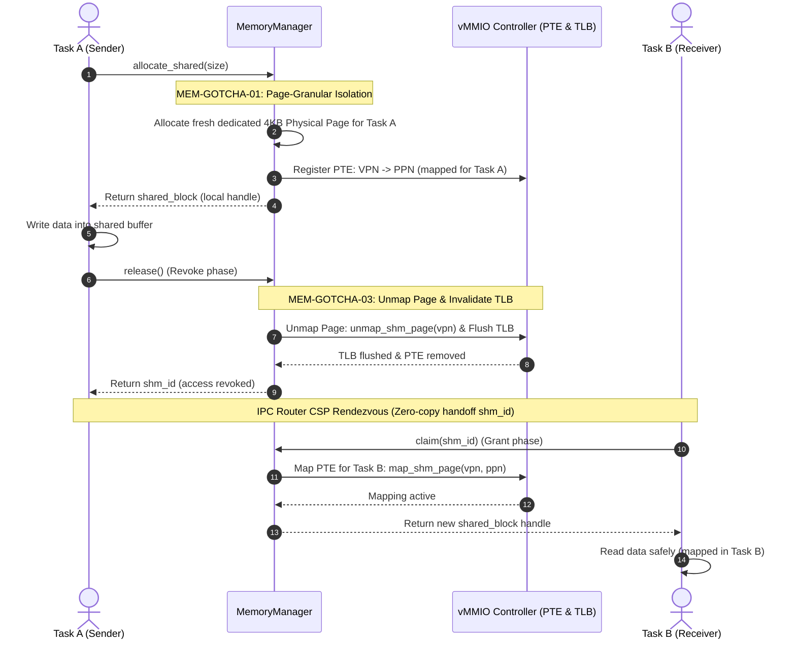
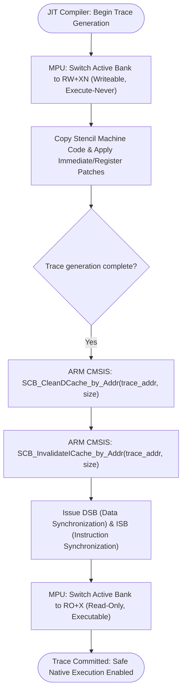

# COOS メモリマネージャ コンポーネント設計書 {VERIFY_FORMAL} {VERIFY_LLM}
<!-- evidence:
     formal: ../tier3_jit/formal/jit_cache_model.py
     test: tests/platform_memory_test_spec.md
     concept: concepts/platform_memory_concept.py
-->

## 1. コンセプト
<!-- traceability: {META_3TierSeparation} {GLOBAL_Policy_Memory} {ConsolidatedHeap} {GLOBAL_IndependentHeap} -->
メモリマネージャ（`memory-manager`）は、システム全体の統合物理メモリプール（`ConsolidatedHeap`）を基礎とし、そこからホスト（WASMランタイム）用のヒープ、および各VM/タスク用のヒープを、それぞれ物理的・領域的に完全に独立した別個のヒープ（`GLOBAL_IndependentHeap`）として切り出して管理する。これにより、特定のVMでのメモリ不足が他のVMやホストランタイムを道連れにしてクラッシュすることを防止する。 `{META_3TierSeparation}` `{GLOBAL_Policy_Memory}` `{ConsolidatedHeap}` `{GLOBAL_IndependentHeap}`

## 2. アーキテクチャ分類
<!-- traceability: {META_3TierSeparation} {WasmPageAlignment} -->
本コンポーネントは **Tier 3 (プラットフォーム / リーフコンポーネント: Leaf Component)** に属し、システム統合物理メモリプールおよび独立ヒープパーティションの静的アロケーション管理を担当する。 `{META_3TierSeparation}` `{WasmPageAlignment}`

## 3. 静的モデル

### 3.1 データ構造
- **`MemoryManager`**: パーティション管理とアロケーションロジックをカプセル化。
- **`partition_info`**: パーティションの境界と使用状況の可視化。

### 3.2 依存関係 (Zero-cost DI)
- `initialize` メソッドにより、管理対象の物理メモリプールの基点アドレスとサイズを受け取る。

## 4. インターフェース設計

<!-- traceability: {GLOBAL_Policy_Memory} -->
本コンポーネントの公開APIは、`{META_StaticDI}` が定義する `co_mem` インターフェース契約の物理的な実現である。上位の契約を詳細化（Refine）するにとどまる。契約自体（メソッド名・引数・戻り値の意味）に食い違いがあれば上位を正とし、本節を修正する。

WITインターフェース名は kebab-case で定義されるが、C++の公開APIバインディングにおいては、`fireball` 名前空間の下に `snake_case`（例: `fireball::init_manager`）として実装・公開される。

#### 初期化

<!-- traceability: {GLOBAL_Policy_Memory} {GLOBAL_StrictMemoryLimit} {Size_15KLOC} -->

| 項目 | 内容 |
| :--- | :--- |
| 機能概要 | メモリマネージャを初期化する。 |
| シグネチャ | `init-manager(pool-base: address, pool-size: byte-count) -> operation-result` (C++マッピング: `fireball::init_manager`) |
| 引数 | `pool-base`: 物理メモリプールの基点アドレス `pool-size`: プールのバイトサイズ |
| 戻り値 | 操作結果 |

#### パーティションの貸与（acquire-partition）

<!-- traceability: {GLOBAL_Policy_Memory} -->

| 項目 | 内容 |
| :--- | :--- |
| 機能概要 | タスク固有の静的メモリパーティションを貸与する。**汎用ヒープAPIではない**: `{CooperativeMultitasking}`が明示するとおり、`size_t`指定の任意サイズ確保も`void*`の返却も提供せず、コンパイル時に確定した固定長パーティションのみを貸し出す。 |
| シグネチャ | `acquire-partition(owner: task-id) -> result<partition-view, memory-error>` (C++マッピング: `fireball::co_mem::acquire_partition`) |
| 引数 | `owner`: パーティションの貸与先タスクID |
| 戻り値 | 成功時は `partition-view`（`std::span<std::byte>` 相当の非所有ビュー）。失敗時は `memory-error` |
| 事後条件 | 返却された `partition-view` の範囲は他タスクのパーティションと重複しない |

#### パーティションの返却（release-partition）

| 項目 | 内容 |
| :--- | :--- |
| 機能概要 | `acquire-partition` で貸与されたパーティションを返却する。 |
| シグネチャ | `release-partition(owner: task-id) -> void` (C++マッピング: `fireball::co_mem::release_partition`) |
| 引数 | `owner`: 返却元タスクID |
| 不変条件 | 所有者以外からの呼び出しは無効（返却されない） |

#### 型付きプールスロットの貸与・返却（acquire-slot / release-slot）

| 項目 | 内容 |
| :--- | :--- |
| 機能概要 | 静的プール内の型付きスロットを貸与・返却する。`partition-view`同様、動的サイズ指定は行わない。 |
| シグネチャ | `acquire-slot<T>() -> result<pool-ref<T>, memory-error>` `release-slot<T>(ref: pool-ref<T>) -> void` (C++マッピング: `fireball::co_mem::acquire_slot<T>` / `release_slot<T>`) |
| 戻り値 | 成功時は `pool-ref<T>`（静的プール内スロットへの型付きハンドル） |

##### `allocate-shared` (IPC転送データ専用)
<!-- traceability: {OwnershipTransfer} -->
IPC転送のための共有メモリブロック確保は、上記の `acquire-partition`/`acquire-slot` とは別のライフサイクルを持つ。所有権の移動が `{ThreeStageRouting}` の Revoke → Rendezvous → Grant と連動し、`shared-block` はこの上位仕様が管理する状態を物理メモリ側で保持するRAIIラッパーであり、独自の所有権管理を並行して持つものではない。`release()`/`claim()` の呼び出しは、`{ThreeStageRouting}` のRevoke/Grantフェーズおよび対応する vMMIO PTE のアンマップ／再マッピング（および TLB フラッシュ）と連動する。 `{OwnershipTransfer}`

| 項目 | 内容 |
| :--- | :--- |
| 機能概要 | IPC転送用の共有メモリブロックを割り当て、RAII所有権を持つリソースを返す。 |
| シグネチャ | `allocate-shared(size: byte-count) -> result<shared-block, recovery-strategy>` |
| 引数 | `size`: 割り当てサイズ |
| 戻り値 | 成功時は `shared-block` リソース |
| 事後条件 | 対応する vMMIO FC=14 ページが呼び出し元タスクの仮想アドレス空間にマッピング登録される（`map_shm_page` 相当） |
| 補足 | `{HAL_Interface}` が公開する`acquire_buffer(size)`は、本APIの上にHALのデバイス通信用途を薄くラップしたものである（同じTier 3内の兄弟コンポーネント。両者が別々にSHMページを確保することはない）。 |

#### 所有権要求（claim）
| 項目 | 内容 |
| :--- | :--- |
| 機能概要 | IPC経由で受け取った共有メモリIDから、所有権を持つリソースを取得する。 |
| シグネチャ | `claim(id: shm-id) -> result<shared-block, recovery-strategy>` |
| 引数 | `id`: 共有メモリID（`{Syscall_Mapping}` の `shm-slice.handle` と同一の `(page_idx << 8) | slot_idx` 形式） |
| 戻り値 | 成功時は `shared-block` リソース |
| 事前条件 | `{ThreeStageRouting}` のGrantフェーズが完了済み（対応するvMMIO PTEが受領側タスク空間にマッピング登録済み）であること |

#### 解放（deallocate）
| 項目 | 内容 |
| :--- | :--- |
| 機能概要 | `acquire-partition`/`acquire-slot` で確保したローカルメモリを解放する。 |
| シグネチャ | `deallocate(addr: address) -> void` |
| 引数 | `addr`: 解放するメモリアドレス |
| 補足 | 共有メモリは `shared-block` のデストラクタで自動解放される。 |

## 5. 制約達成の方策
<!-- traceability: {GLOBAL_Policy_Memory} {GLOBAL_StrictMemoryLimit} {WasmPageAlignment} {META_BumpAllocator} {META_FaultIsolation} -->

### 5.1 性能制約と不変条件
- **目標**: 決定論的 $O(1)$ のメモリ割り当て・解放および高速な境界判定。
- **方策**:
  - `{META_BumpAllocator}`: 固定長パーティションおよび型付きプールスロットによる断片化なき高速貸与。
  - `{WasmPageAlignment}`: ゲスト RAM（Region 3）を WASM ページサイズである **64KB アライメント**（`0x10000` 境界）に配置し、単一の比較命令による $O(1)$ 高速境界検査（`FastAddressCheck`）と PMSAv8 リージョン境界を完全一致させる。

### 5.2 メモリ制約と方策
<!-- traceability: {GLOBAL_StrictMemoryLimit} {GLOBAL_IndependentHeap} -->
- **目標**: 総メモリ消費を有界化し、タスク間のヒープ干渉を完全に防止。
- **方策**:
  - `{GLOBAL_StrictMemoryLimit}`: システム全体の総割当量をコンパイル時定数 `FB_CONF_MEMORY_POOL_SIZE` 以内に厳格制限。
  - `{GLOBAL_IndependentHeap}`: 各タスクに独立した静的パーティションを割り当て、共有メモリは 4KB ページ単位で完全に分離する。

### 5.3 安全性制約と方策
<!-- traceability: {META_FaultIsolation} {PageGranularPermissionIsolation} -->
- **目標**: ハードウェア MPU および vMMIO による不正アクセス・二重解放の完全排除。
- **方策**:
  - `{PageGranularPermissionIsolation}`: 4KB 物理ページ単位で所有権と権限を分離し、異種タスクの同一ページ相乗りを禁止。
  - `{META_FaultIsolation}`: 非所有タスクからの操作をトラップで即座に拒絶。

## 6. 所有権追跡と共有メモリライフサイクル
<!-- traceability: {GLOBAL_Policy_Memory} {META_FaultIsolation} {OwnershipTransfer} {PageGranularPermissionIsolation} {VmmioShmDelegation} -->

### 6.1 所有権追跡仕様
各メモリブロックは `memory-info.owner` で割り当て元 task-id を追跡する。本コンポーネントが提供する `acquire-partition`/`acquire-slot`/`deallocate` や `RAII`/`drop` による解放は、実行時の動的ヒープ確保・解放を意味するものではなく、コンパイル時に固定確保された静的メモリプールから領域を論理的に切り出して貸し出し、使用後にプールへ返却（Placement new およびデストラクタ明示的呼び出しによるバッファ再利用）する「静的パーティショニング」を指す。 `{GLOBAL_Policy_Memory}`

- **自動設定**: `acquire-partition` / `acquire-slot` / `allocate-shared` 時に呼び出し元タスクIDが自動設定される。
- **所有者限定操作**: `deallocate`（`release-partition`/`release-slot` 相当）は所有者タスクのみが実行可能。
- **RAII自動返却**: `shared-block` リソースの RAII / drop によるプールへの自動返却。

### 6.2 共有メモリマッピングと仮想化リスナーへのコールバック委譲
<!-- traceability: {VmmioShmDelegation} {OwnerMismatchTrap} -->
物理メモリマネージャは、クリーンアーキテクチャ（依存性逆転の原則: DIP）に従い、特定の上位仮想化ハードウェア（vMMIO 等）の内部シンボルや特定の仮想アドレス体系（`0xE000_0000`）に直接依存しない。
物理メモリマネージャは物理ページマッピングのライフサイクルイベントを通知するイベント通知インターフェース（リスナー機構）を提供し、仮想化層（vMMIO コントローラ等）がこれを購読・登録する設計とする。 `{VmmioShmDelegation}`

- **通知されるライフサイクルイベント**:
  - **ページ割り当て**: 物理ページの確保と初期所有者・読み書き権限の確定時
  - **所有権移譲**: タスク間でのブロック受け渡し（Grant 等）に伴う所有タスクIDの変更時
  - **所有権回収（Revoke）**: メッセージ送信開始等に伴う所有権の一時無効化（移譲中状態の設定およびTLBフラッシュ契機）
  - **ページ解放**: 共有ブロック破棄に伴う物理ページの解放時
- 物理メモリマネージャは物理ページ（4KB）のライフサイクル変化時にこの通知を発火し、仮想化層側が自身の仮想アドレス空間（VPN）に対応するページテーブル（PTE）更新や TLB エントリフラッシュを自律的に実施する。 `{OwnerMismatchTrap}`

### 6.3 ページ単位権限分離仕様（Page-Granular Permission Isolation）
<!-- traceability: {PageGranularPermissionIsolation} {META_FaultIsolation} -->
Cortex-M33 MPU および vMMIO のハードウェア保護機構において、マッピングおよびアクセス権限（読み書き許可ビット）は **4KB 物理ページ（`FB_PAGE_SIZE = 4096`）単位**でのみ設定可能である。
したがって、システム全体のメモリ保護を完全にするため、**「権限（所有タスク ID およびアクセス権限）ごとに物理ページを完全に分離する」** ことを不変条件として強制する。 `{PageGranularPermissionIsolation}`

1. **他タスクとのページ混在の禁止**:
   - 異なるタスクに属する共有メモリスロットを同一 4KB 物理ページ内に共存（相乗り）させることは厳格に禁止される。
   - `allocate_shared(caller_task_id, size)` は、既に `caller_task_id` が所有し十分な空き容量のあるページが存在する場合にのみスロットを切り出し、存在しない場合は必ず新規の 4KB 物理ページを `caller_task_id` 専用として割り当てる。
2. **ページ単位の所有権移譲**:
   - IPC 転送時、所有権の移譲（Revoke $\to$ Grant）はページ全体を単位として連動する。
   - ページ内の全スロットは常に同一の所有者（または移譲中アンマップ状態）であり、一部のスロットのみが別タスクへ移譲されてページ内で所有者が分裂する状態は生じない。

### 6.4 共有メモリライフサイクルと権限遷移プロトコル
<!-- traceability: {OwnershipTransfer} {META_FaultIsolation} -->
`shared-block` リソースが物理メモリ側での所有権の単位である。アクセス可否の執行は、マッピング有無（vMMIO FC=14 の PTE 存在・VALID）によって行われる。`shared-block`の`release()`/`claim()`は、`{ThreeStageRouting}` のRevoke→Rendezvous→Grantと1対1で対応する物理層の操作であり、独立した二重の所有権管理を行うものではない。 `{META_FaultIsolation}` `{OwnershipTransfer}`

##### ライフサイクルフェーズ遷移表
| ステップ | フェーズ | 実行API / イベント | 送信元(Task A) | 受信先(Task B) | vMMIO PTE & TLB 挙動 |
| :---: | :--- | :--- | :--- | :--- | :--- |
| 1 | 確保 | `allocate_shared(size)` | 所有 (`TaskA`) | - | `TaskA` 用にマッピング登録、4KB 専用物理ページ確保 |
| 2 | 書込 | `shm.write_*` | 書込可能 | - | 正常アクセス |
| 3 | 送信開始 | `shm.release()` | **無効化** (ハンドル返却) | - | **vMMIO アンマップ ＆ TLB 即時フラッシュ** (Revoke) |
| 4 | メッセージ化 | `shm-id` を kv_pair に格納 | - | - | スコープ: `RESOURCE` |
| 5 | ランデブー | `ipc.send(chan, msg)` | サスペンド待機 | - | 送受信マッチング待ち (Rendezvous) |
| 6 | 認可・受信 | `ipc.recv(chan)` | 待機解除 | 受信完了 | 受信タスクへのハンドオフ確約 |
| 7 | 所有権取得 | `claim(shm-id)` | - | **所有** (`TaskB`) | `TaskB` 用に **マッピング登録** (Grant) |
| 8 | 読出 | `shm.read_*` | - | 読出可能 | 正常アクセス |
| 9 | 自動解放 | `shared-block` の RAII drop | - | **解放** | PTE アンマップ、TLB フラッシュ、ページプール返却 |

- **非所有タスク操作の完全遮断 (`MEM-GOTCHA-02`)**: 共有メモリブロックの操作時、ブロックの所有タスク ID を厳格に照合し、非所有タスクからの操作は即座にトラップ（`ShmTrap` / `ERR_PERMISSION_DENIED`）で遮断する。
- **送信中ブロックの保護状態 (`MEM-GOTCHA-03`)**: 送信開始（`release()`）から受信完了（`claim()`）までの間、vMMIO から PTE をアンマップし、TLB を即時フラッシュすることで、送信元タスクからの旧アドレスアクセスを未登録ページフォルト（`TRAP_UNREGISTERED_PAGE`）として確実に遮断し、TOCTOU 競合や不正アクセスを構造的に排除する。
- **障害時回復**: Rendezvous中に通信が中断された場合、`rollback_transfer(original_sender_id, shm_id)` により送信元タスクへ PTE を再マッピングし、リソースのダングリングを防止する。

#### ページ単位権限分離と共有メモリ移譲プロトコル（責務シーケンス図）
<!-- traceability: {PageGranularPermissionIsolation} {OwnershipTransfer} {VmmioShmDelegation} -->
Task A、MemoryManager、vMMIO Controller、Task B 間での専用 4KB 物理ページ切り出しと所有権遷移（A $\to$ アンマップ $\to$ B）の責務分離を示す。

#### JIT W^X バッチ切り替えトランザクション手順（手順アクティビティ図）
<!-- traceability: {MEM-GOTCHA-04} {GLOBAL_Policy_Memory} {META_RestrictedPhysicalAccess} -->
JIT コンパイル時の MPU 属性切り替え（RW+XN $	o$ RO+X）と CPU キャッシュコヒーレンシバリア発行の決定論的手順を示す。

### 7.4 JIT Code Cache の W^X メモリ保護切り替えトランザクション
<!-- traceability: {GLOBAL_Policy_Memory} {META_RestrictedPhysicalAccess} -->
JIT コンパイラがネイティブコードを生成する Code Cache 領域において、W^X（Write XOR Execute: 書き込み可能かつ実行可能の同時禁止）原則を厳格に適用する。
- **バッチ化トランザクション (`MEM-GOTCHA-04`)**:
  **設計理由と不変条件**: 1 命令の書き込みごとに MPU 属性の切り替え（実行不可・書き込み可 $\to$ 書き込み不可・実行可）を行うと、その都度 ARM D-Cache クリーン、I-Cache インバリデート、および DSB/ISB メモリバリア命令を発行する必要があり、パイプラインフラッシュの累積により JIT コンパイル性能が致命的に悪化する。そのため、W^X 切り替えは必ず「1 トレースまたは 1 バッチ」単位でトランザクション化し、トレース全体の生成完了後に一括してキャッシュクリーンとバリアを発行して実行可能属性へ遷移させる。

## 8. 設計判断 (ADR)
## 7. ハードウェアメモリ保護 (MPU) & W^X 設計
<!-- traceability: {META_FaultIsolation} {WasmPageAlignment} {LowLatencyJIT} {VERIFY_FORMAL} -->

### 7.1 Cortex-M33 PMSAv8 MPU リージョン配分
Cortex-M33 (ARMv8-M Mainline) の PMSAv8 (Protected Memory System Architecture) に準拠し、ハードウェア MPU の 8 リージョン（最小標準構成）を以下のように静的に配分・構成する。 `{META_FaultIsolation}`

| Region # | 対象領域 | 物理メモリ種別 | デフォルト属性 | 特権アクセス | ユーザーアクセス | 役割と保護目的 |
| :---: | :--- | :--- | :---: | :---: | :---: | :--- |
| **0** | Flash / Kernel Code | Flash (ROM) | `RO + X` | RO, Exec | なし | カーネルテキスト・不変定数の改ざん防止 |
| **1** | Kernel Data & BSS | SRAM (Internal) | `RW + XN` | RW, NoExec | なし | カーネル静的変数・スタック領域 |
| **2** | Kernel Pool / Heap | SRAM (Internal) | `RW + XN` | RW, NoExec | なし | タスク管理・IPC 内部制御構造体 |
| **3** | Guest WASM RAM | SRAM (Internal) | `RW + XN` | RW, NoExec | RW, NoExec | ゲスト WASM リニアメモリ（64KB 境界配置） |
| **4** | **JIT Code Cache** | SRAM (Internal) | **`RO + X`** | **RO, Exec** (パッチ時 `RW+XN`) | なし | JIT 生成ネイティブコード（W^X 保護対象） |
| **5** | Peripheral MMIO | Device Memory | `RW + XN` | RW, NoExec | なし | ペリフェラルレジスタ（Device 属性） |
| **6** | Shared Memory Buffers | SRAM (Internal) | `RW + XN` | RW, NoExec | RW, NoExec | IPC ゼロコピー共有バッファ領域 |
| **7** | Stack Guard Band | - | `No Access` | 不可 | 不可 | スタックオーバーフロー検出用ガードバンド |

### 7.2 JIT W^X (Write XOR Execute) 切替プロトコル
JIT コードキャッシュ（Region 4）は、実行可能（Execute）と書き込み可能（Write）が同時に有効化される状態（`RWX`）をハードウェアレベルで恒常的に排除する。 `{LowLatencyJIT}`

#### 属性切替シーケンス
JIT コンパイル開始から完了までの属性切替ステップを示す。ハードウェアレジスタ操作と目的を構造化して定義する。

| ステップ | 操作名 | レジスタ設定内容 | 属性 / バリア | 目的と安全性不変条件 |
| :---: | :--- | :--- | :--- | :--- |
| 1 | パッチ生成開始 (`begin_jit_patch`) | `RNR = 4` `RLAR.EN = 0` `RBAR.AP = RW`, `RBAR.XN = 1` `RLAR.EN = 1` | `RW + XN` `__DSB(); __ISB();` | リージョン4を書き込み可能・実行不可へ移行し、パイプラインを同期。実行を禁止して改ざん時暴走を防止。 |
| 2 | Copy-and-Patch 生成 | テンプレートコピー & 即値パッチ | `RW + XN` | 生成中は安全にメモリ書き込みのみを行う。 |
| 3 | パッチ生成完了 (`commit_jit_patch`) | `RNR = 4` `RLAR.EN = 0` `RBAR.AP = RO`, `RBAR.XN = 0` `RLAR.EN = 1` | `RO + X` `__DSB(); __ISB();` | リージョン4を読み取り専用・実行可能へ復元し、命令キャッシュ・プリフェッチをフラッシュしてネイティブ実行を有効化。 |

#### トランザクションバッチ化によるレイテンシ両立
Copy-and-Patch の各命令パッチごとに個別 MPU 切替を行うとバリアオーバーヘッドが増大するため、JIT コンパイル単位（WASM 関数または基本ブロック単位）で `begin_jit_patch()` と `commit_jit_patch()` を 1 回ずつ発行する**トランザクションバッチ化**を適用する。これにより、属性切替コストをコンパイルあたり 1 回のバリアに抑え、`{LowLatencyJIT}` のリアルタイム制約を達成する。

### 7.3 アライメントおよび境界制約 (PMSAv8)
- **PMSAv8 アライメント**: PMSAv7 と異なり、$2^n$ 乗サイズ境界制約は存在しない。Base アドレス（`RBAR`）および Limit アドレス（`RLAR`）は **32 バイトアライメント**（下位 5 ビットが `0`）を満たせば任意サイズで設定可能。
- **WASM ページ境界**: ゲスト RAM (Region 3) は WASM ページサイズである **64KB アライメント**（`0x10000` 境界）に配置し、vMMIO 高速アドレス判定 (`FastAddressCheck`) と PMSAv8 リージョン境界を完全一致させる。 `{WasmPageAlignment}`

## 8. 形式検証・テスト仕様との対応

### 8.1 検証対象の不変条件
- **ページ単位権限分離**: 4KB 物理ページ内に異種タスクのスロットが共存しないこと（`MEM-14`, `MEM-GOTCHA-01`）。
- **非所有者アクセストラップ**: 所有権未取得（未マッピング）スロットへのアクセスが `TRAP_UNREGISTERED_PAGE` で拒絶されること（`MEM-16`, `MEM-GOTCHA-02`）。
- **W^X 不変条件**: JIT キャッシュ領域で `RWX` が同時に許可される状態が存在しないこと（[`jit_cache_model.py`](docs/components/tier3_jit/formal/jit_cache_model.py), `MEM-23`）。

### 8.2 テスト仕様書との連携
本コンポーネントのテストケース（MEM-01〜MEM-25, MEM-GOTCHA-01〜04）は、[`platform_memory_test_spec.md`](docs/components/tier3_platform/tests/platform_memory_test_spec.md) を正本として定義する。

## 9. 設計判断 (ADR)
<!-- traceability: {ADR_SharedBlockRaii} {ADR_MemoryManagerMinimalSurface} {ADR_PageGranularPermissionIsolation} -->
このコンポーネントのADRは `{ADR_SharedBlockRaii}` および `{ADR_PageGranularPermissionIsolation}` のキーワードで参照される。詳細な背景・選択肢の比較検討は以下に記録する。

- **決定事項**: `{ADR_PageGranularPermissionIsolation}` (2026-09-02)
  - **背景**: vMMIO FC=14 の PTE および MPU は 4KB ページ単位でしかマッピング・権限（RW許可）を設定できない。同一ページ内に異なるタスクのスロットが混在すると、タスク間のメモリ隔離が破綻し、他タスクのデータが読み書きされる危険があった。
  - **選択肢と評価**:
    - 案1: 単一ページ内に複数タスクのスロットを混在させ、メモリアクセス時にソフトウェアでスロット境界とタスクIDを毎回検査する。チェックのオーバーヘッドが大きく、vMMIO のハードウェア PTE / TLB 高速ディスパッチの恩恵を損なう。
    - 案2: 権限（所有タスクID）ごとに独立した 4KB 物理ページを割り当て、同一ページ内には同一所有者のスロットのみを配置する。メモリ消費はページ単位に量子化されるが、ページ単位のマッピング有無による教科書的な仮想記憶保護が完全に成立し、ゼロコストでタスク間隔離が担保される。
  - **結論**: 案2を採用する。
  - **理由**: Fireball の最重要方針である `{META_FaultIsolation}`（障害隔離）および `{META_ZeroCostAbstraction}` を実現するため。PTE に余計な `owner_id` フィールドを持たせず、マッピング有無による未登録ページ遮断としてアクセスパスを最速に保つ。

- **決定事項**: `{ADR_SharedBlockRaii}` (2026-02-17)
  - **背景**: IPC転送用の共有メモリを、単なる`shm-id`（整数）として扱うか、所有権を持つリソース型として扱うかを決定する必要があった。
  - **選択肢と評価**:
    - 案1: `shm-id`を単なる整数IDとし、明示的な`release_shm(id)`/`acquire_shm(id)`関数で操作する。実装は単純だが、解放忘れやダングリング参照を型システムで防げない。
    - 案2: `shm-id`をRAII所有権を持つ`shared-block`リソースとして設計し、`release()`/`claim()`で所有権移動を明示し、デストラクタで自動解放する。
  - **結論**: 案2を採用する。
  - **理由**: `release()`で送信側が無効化、`claim()`で受信側が取得する設計により、ダングリングポインタを構造的に防止できる。デストラクタでの自動解放により手動`deallocate`忘れも排除できる。`to-shm`/`to-address`のような対称的な変換名より`release`/`claim`の方が所有権移動という意図を明確に表す。この所有権移動は独立した機構ではなく、`ipc_router.md`のRevoke/Grant（vMMIO PTE アンマップ／再マッピング）と完全連動する（`{OwnershipTransfer}`）。

- **決定事項**: `{ADR_MemoryManagerMinimalSurface}` (2026-02-17)
  - **背景**: メモリマネージャのAPIに、確保済みブロックの情報を問い合わせる`query(addr) -> memory-info`と、所有権を確認する`check-ownership(addr, task-id) -> bool`を含めるかどうかを決定する必要があった。
  - **選択肢と評価**:
    - 案1: 両APIを提供し、呼び出し側が任意のアドレスについて情報・所有権を問い合わせられるようにする。汎用的だが、`shared-block`が既に保持している情報を別経路でも問い合わせ可能にする冗長な公開面を作り、`{META_FaultIsolation}`が要求する「所有権はshared-block経由でのみ確認できる」という単一の経路を弱める。
    - 案2: 両APIを削除する。サイズはkernel/task用途では呼び出し側（`allocate`時に記録済み）が、shared用途では`shared_block.get_size()`/`get_owner()`が代替する。
  - **結論**: 案2を採用する。
  - **理由**: `query()`は`allocate`時に呼び出し側がサイズを記録すれば冗長であり、`check-ownership()`は`shared_block.get_owner()`で代替可能かつ、vMMIO側の許可チェック（ソート済みPTEに対する二分探索、`runtime_vmmio.md`正本）と二重の判定経路を作らずに済む。生ポインタを直接やり取りする経路が存在しない設計（すべて`shared_block`リソース経由）とも整合する。
