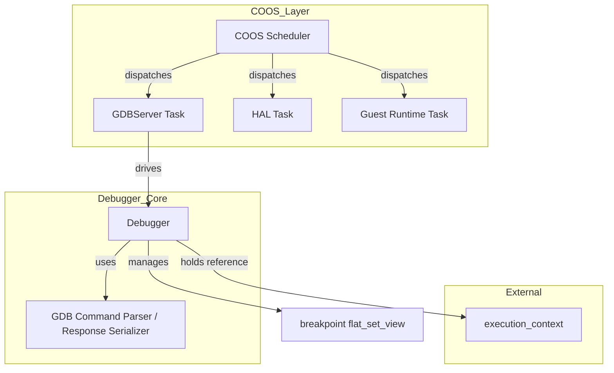
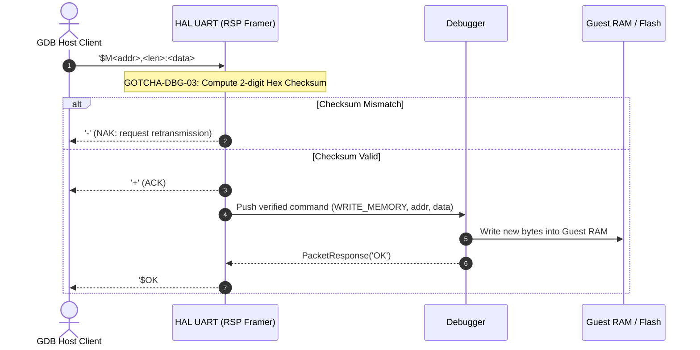
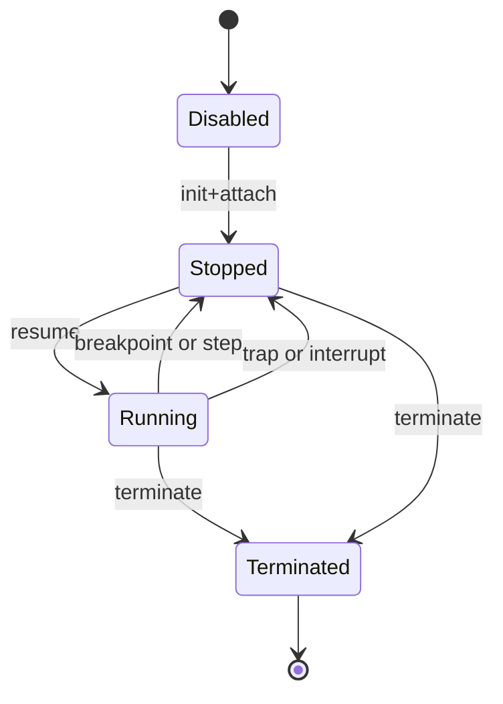
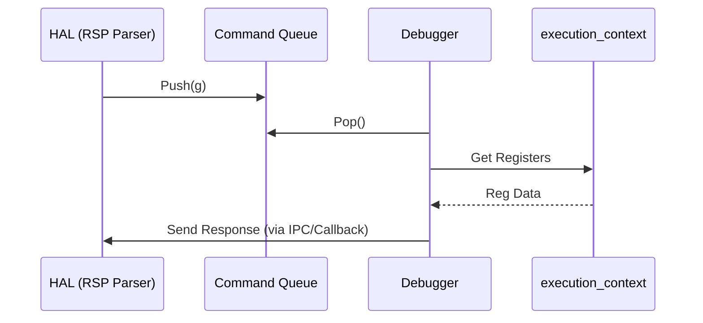

# Debugger プラグイン設計書 {VERIFY_LLM}
<!-- evidence:
     concept: concepts/debugger_concept.py
     test: docs/qa/tier3_plugins/debugger_test_spec.md
-->

## 1. コンセプト
<!-- traceability: {RSPMinimalSet} {DebuggerInterpreterComposition} {MemoryIsolation} {Debug_Standard_Env} {RSP_Transport_Selectable} -->
デバッガおよび GDB Server は、VSCode等の外部ツールからのデバッグを可能にするため、COOS 上の**独立した協調タスク（`gdbserver_task`）**として常駐し、GDB Remote Serial Protocol (RSP) に基づく非同期・協調的な実行制御を行う。標準環境として VSCode、UART、J-Link をサポートする。RSP パケットの送受信待ち時は COOS スケジューラへ `yield` することで、ゲストタスクや HAL タスクの実行を阻害しない。デバッグ実行のランタイム構成は起動時にインタープリタとデバッガへ固定し、アタッチ中は常にインタープリタだけを実行する。デバッガはJITキャッシュを管理しない。

## 2. アーキテクチャ分類
<!-- traceability: {META_3TierSeparation} {RSPMinimalSet} -->
本コンポーネントは **Tier 3 (プラグイン・リーフコンポーネント: Plugin Leaf Component)** に属し、Tier 2 の `ExecutionControl` 契約を実装する。デバッグ状態制御、ブレークポイント管理、および COOS 協調タスクとして稼働する GDB RSP 通信・コマンドディスパッチを担当する。RSPの物理バイト転送は、Tier 3 platform が提供する注入可能な `DebuggerSink`へ委譲する。具象的なプロトコル仕様は [gdb_rsp_protocol.md](docs/specs/gdb_rsp_protocol.md) を正本とする。

## 3. 静的モデル

### 3.1 データ構造
- **`GDBServerTask` / `Debugger`**: COOS 協調タスクとして動作し、GDB RSP プロトコル制御ロジック、デバッグ状態、およびブレークポイント管理をカプセル化した主要クラス。
- **`RspParser` / `RspSerializer`**: GDB RSP コマンドの構文解析（例: `g`, `m addr,len`, `Z0,addr,kind`）およびレスポンスペイロードの生成を行うクラス。
- **`debug_config`**: 最大ブレークポイント数やポート番号などの不変の設定。

### 3.2 内部ブロック図

### 3.3 主要なクラス・構造体・配列・定数

#### デバッガ（Debugger）クラス
<!-- traceability: {META_NoStdVector} {RSPMinimalSet} -->
依存関係（実行コンテキスト、HAL）と内部状態（ブレークポイント、現在状態）をカプセル化する。

| 項目名 | 機能と役割 | 型分類 | サイズ・制約 |
| :--- | :--- | :--- | :--- |
| 実行コンテキスト | 操作対象となるWASM実行状態への参照（プライベートメンバ）。 | 構造体への参照 | `execution_context` (非所有) |
| デバッガSink | RSPバイト列の送受信を担う、Tier 3 platformから注入された物理Sinkへの参照。 | 構造体への参照 | `DebuggerSink` (非所有) |
| `cmd_queue` | HALから供給されるコマンドキュー。 | 構造体への参照 | `debug_command_queue` |
| デバッグ状態 | デバッガの現在の動作モード（実行中、中断中など）。 | 列挙型 | `debug_state` |
| ブレークポイントリスト | 設定されているブレークポイントのアドレス一覧。昇順ソート済みの固定長配列（`FB_CONF_DEBUG_MAX_BREAKPOINTS` 件）として保持し、実行時の判定は `fireball::flat_set_view<address>` の `contains()` で行う。 | 固定長配列 + 集合ビュー | `{FlatViewNarrowing}` |
| RSPパケットバッファ | フレーミングされた 1 パケットの ASCII ペイロード | 固定長配列 | 256 Bytes (`FB_CONF_RSP_PACKET_MAX`) |
| `last_stop_reason` | 直近の停止要因。 | ID値 | 信号番号等 |

#### 仮想レジスタセット（virtual_register_set）
<!-- traceability: {RSPMinimalSet} -->
GDB等の外部クライアントに提示する WASM 仮想レジスタ番号マッピング（`0: pc`, `1: sp`, `2: fp`, `3: tos`, `4..19: local0..15`）は を正本とする。

## 4. 動的モデル

### 4.1 アルゴリズム
<!-- traceability: {DebuggerInterpreterComposition} {RSPMinimalSet} {GOTCHA-DBG-02} -->
1. **コマンド取得とチェックサム照合 (`GOTCHA-DBG-03`)**:
   - HAL層が `$`〜`#`のパケットフレーミングとチェックサム検証（一致時 ACK (`+`)、不一致時 NAK (`-`)）を完了させた上で供給する `debug_command` を、コマンドキューから取得する。
   **設計理由と不変条件**: GDB RSP はシリアル通信等の低信頼通信路での利用を想定しているため、パケット末尾の 2 桁の 16 進チェックサムを厳格に照合する。万一チェックサムが不一致であった場合は一切のコマンド解釈・実行を行わず、直ちに NAK（`-`）を返信してホスト側の GDB クライアントへ再送を要求する。
2. **コマンドディスパッチとゲストメモリ書き換え (`MemoryBoundaryCheck`)**:
   - 取得したコマンド（`?`, `g/G`, `m/M`, `c`, `s`, `Z0/z0` 等）の GDB コマンド構文を解析し、ディスパッチする。
   **設計理由と不変条件**: メモリ書き込みコマンド（`M` パケット）は、境界検査に成功した場合だけゲストリニアメモリを更新する。デバッガはJITキャッシュを保持せず、キャッシュの無効化や世代管理を担当しない。
3. **デバッグ構成でのインタープリタ専用実行 (`GOTCHA-DBG-02`)**:
   - デバッグ実行は `Interpreter + Debugger` の静的構成で生成し、JIT実行器を構成しない。アタッチ中の `step` と `continue` は同じインタープリタの命令意味論を通り、デバッグ専用ハンドラテーブルへの切替は行わない。
   **設計理由と不変条件**: JITをアタッチ時に停止・再開する動的モード切替を実行経路へ持ち込まず、デバッグ時の命令境界、ブレークポイント、および停止状態をインタープリタの境界で一貫して観測する。通常のJIT実行構成はデバッガを含まないため、通常実行のホットパスにもデバッグ分岐を追加しない。
4. **ステップ実行**:
   - インタープリタを「1命令実行」モードで呼び出し、実行後に `Stopped` 状態へ遷移して停止理由（SIGTRAP）を通知。
#### デバッガ・インタープリタ結合コンセプトコード (`concepts/debugger_concept.py`)
デバッガとインタープリタの結合、注入された物理Sinkを介したGDB RSP パケット処理、統一スタック検査の参照実装：
[`debugger_concept.py`](docs/components/tier3_plugins/concepts/debugger_concept.py)

#### GDB メモリ書き換え（責務シーケンス図）
<!-- traceability: {MemoryBoundaryCheck} {GOTCHA-DBG-03} {RSPChecksumVerify} -->
GDB ホストからのチェックサム検証付きパケット受信とゲストメモリ更新の責務連携を示す。

### 4.2 状態遷移図

### 4.3 内部シーケンス
#### デバッグコマンド処理シーケンス

## 5. インターフェース定義

### 5.1 公開API
外部から利用可能なオブジェクト指向APIを定義する。

#### デバッガ接続 (`attach`)

<!-- traceability: {Debug_Standard_Env} -->

| 項目 | 内容 |
| :--- | :--- |
| 機能概要 | 実行中のWASMエンジンに対してデバッグ機能を有効化し、初期停止状態（Stopped）へ移行させる。 |
| シグネチャ | `attach(exec_ctx: 可変参照, transport: 構造体への参照) -> 結果型` |
| 引数 | `exec_ctx`: 操作対象コンテキスト `transport`: 注入された`DebuggerSink` |
| 戻り値 | 結果型 |
| 期待する結果 | 正常：デバッガがコンテキストを掌握し、GDB等のツールによる操作が可能になる。 |

#### コマンド処理 (`poll_commands`)

<!-- traceability: {RSPMinimalSet} -->

| 項目 | 内容 |
| :--- | :--- |
| 機能概要 | HAL層から供給されたデバッグコマンドを一つ処理し、実行コンテキストを制御する。 |
| シグネチャ | `poll_commands() -> 結果型` |
| 戻り値 | 結果型 |
| 期待する結果 | 正常：保留中のコマンドが処理され、必要に応じて停止/継続が切り替わる。 |

#### 命令ステップ実行 (`step_instruction`)

| 項目 | 内容 |
| :--- | :--- |
| 機能概要 | 現在の停止位置からちょうど一命令だけをゲストに進ませる。 |
| シグネチャ | `step_instruction() -> void` |
| 期待する結果 | 正常：一命令実行後に再び `Stopped` 状態になる。 |

### 5.2 URI/IPCインターフェース
- **コマンド入力**: 注入された`DebuggerSink`から取得した生バイト列をDebuggerプラグインがRSPとして解析する。
- **レスポンス出力**: 解析結果を同じ`DebuggerSink`へ生バイト列として返却する。Sink実体はTCP、UART、J-Link、テスト用メモリなどから構成時に選択する。

## 6. 制約達成の方策

### 6.1 性能制約と方策
<!-- traceability: {DebuggerInterpreterComposition} -->
- **目標**: デバッグ実行中の命令意味論をインタープリタへ固定し、通常実行のJITホットパスへデバッグ分岐を追加しない。
- **方策**: デバッグ構成は `Interpreter + Debugger` として静的に合成する。通常構成はデバッガを含まず、アタッチ時のJIT切替やハンドラテーブル切替を行わない。

### 6.2 メモリ制約と方策
<!-- traceability: {MemoryIsolation} {META_NoStdVector} -->
- **目標**: 最小限のRAMでデバッグ機能を提供する。
- **方策**: デバッガ専用の独立バッファと配列を使用し、システム本体のメモリを圧迫しない。

### 6.3 安全性制約と方策
<!-- traceability: {MemoryBoundaryCheck} -->
- **目標**: デバッガによる不正なメモリアクセスを防止する。
- **方策**: デバッグコマンドによるメモリアクセスに対し、WASMリニアメモリの境界チェックを強制する。

## 7. 形式検証・テスト仕様との対応

### 7.1 デバッガとJITの同時構成拒否

デバッグ構成は `Interpreter + Debugger` に限定する。`RuntimeComposer` が `Debugger + JIT` の同時構成を受け取った場合は `assert` で拒否し、デバッガがJITキャッシュを操作する経路を持たない。

### 7.2 テスト仕様書との連携

GDB RSP、ブレークポイント、インタープリタ専用デバッグ構成、およびメモリ境界検査のテストケースは [`debugger_test_spec.md`](docs/qa/tier3_plugins/debugger_test_spec.md) を正本とする。

## 8. 設計判断と参考実装

デバッグ実行を `Interpreter + Debugger` に静的限定し、`Debugger + JIT` は構成時に拒否する。デバッガはJITキャッシュを所有せず、メモリ書き換え時のキャッシュ無効化も担当しない。参考実装は [`debugger_concept.py`](docs/components/tier3_plugins/concepts/debugger_concept.py) とする。
