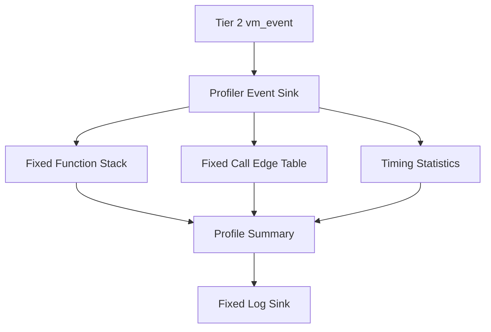

# ゲストプロファイラプラグイン設計書
<!-- evidence:
     contract-only: true
     test: docs/qa/tier3_plugins/guest_profiler_test_spec.md
-->

## 1. コンセプト
<!-- traceability: {META_3TierSeparation} {META_ContractImplSplit} {META_StaticDI} {GLOBAL_Policy_Memory} -->
本コンポーネントは、Tier 2 の [`runtime_observability.md`](docs/components/tier2_runtime/runtime_observability.md) が定義する VM イベントを受信し、ゲスト関数のコールグラフと実行時間を集計してログへ出力する Tier 3 プラグインである。

プロファイラは VM の実行状態を変更しない。停止、再開、ステップ、メモリ書込みは Debugger プラグインの責務であり、プロファイラは観測シンクとしてのみ Runtime へ接続する。

## 2. アーキテクチャ分類
<!-- traceability: {META_3TierSeparation} {META_ContractImplSplit} -->
本コンポーネントは **Tier 3 (プラグイン・リーフコンポーネント: Plugin Leaf Component)** に属する。固定長の観測状態、コールグラフ集計、時間計算、ログ搬送を担当する。VM のフック位置、イベントレコードの意味、実行方式の識別は Tier 2 の `runtime_observability.md` を正本とする。

## 3. 静的モデル

### 3.1 データ構造
- **`profiler_state`**: 関数スタック、呼出辺、自己時間、包括時間、欠落数を保持する固定容量状態である。
- **関数スタック**: `function_enter` から `function_exit` までの未完了呼出を保持する。再帰呼出は別フレームとして保持する。
- **呼出辺表**: 親関数識別子と子関数識別子の組をキーとする固定容量表である。再帰呼出は同じ辺のカウンタへ加算する。
- **時間統計表**: 関数識別子ごとの呼出回数、包括時間、自己時間、推定値フラグを保持する。
- **欠落統計**: 通常イベント、予約イベント、ログ搬送の欠落数を分離して保持する。

### 3.2 内部ブロック図

## 4. 動的モデル

### 4.1 時間意味論
ゲストプロファイラは `function_enter` と `function_exit` の対を基礎として時間を計算する。

- **包括時間**は、関数へ入ってから関数を離れるまでの時間である。子関数とホスト呼出の時間を含む。
- **自己時間**は、包括時間から、対応する子関数と明示的に除外したホスト呼出の時間を差し引いた時間である。
- **呼出辺**は、親関数識別子と子関数識別子の組で一意に識別する。再帰呼出は同じ辺のカウンタへ加算する。
- **JIT と Interpreter の区別**はイベントの状態フラグで行う。実行方式を別の関数としてコールグラフへ追加してはならない。
- **トラップまたは停止**で関数が終了した場合は、`function_exit` の終了理由を `trap` または `debug_stop` とし、未完了フレームを推定値として記録する。
- **イベント欠落**が発生した場合は、欠落以降の時間を厳密値と呼ばない。欠落数と推定値フラグをログへ出力する。

### 4.2 イベント受信と過負荷
イベント受信側は動的メモリ確保、ブロッキング、文字列整形、外部 I/O を行わない。固定長レコードを固定容量の状態へ反映する。

- 通常イベントは、容量不足時に破棄し、欠落カウンタを増加させる。
- `trap`、`debug_stop`、終了要約は通常イベントと別の予約容量を使用する。
- 搬送が遅い場合は既定で VM を停止しない。厳密計測が必要な構成だけが停止方針を選択できる。
- 欠落または集計表の容量超過が発生した場合、該当する統計値へ推定値フラグを設定する。

### 4.3 終了処理
Runtime が正常復帰、トラップ、デバッグ停止、構成エラーのいずれかへ遷移したとき、開いているフレームを終了理由付きで閉じる。未完了フレームは次のゲスト実行へ持ち越さない。

## 5. インターフェース定義

### 5.1 イベント受信
| 項目 | 内容 |
| :--- | :--- |
| 機能概要 | Tier 2 の `vm_event` を受信して固定容量のプロファイル状態へ反映する。 |
| 事前条件 | イベント種別、関数識別子、時刻、呼出相関が Tier 2 契約を満たしている。 |
| 期待する結果 | コールグラフ、時間統計、欠落統計のいずれかが更新される。 |
| 不変条件 | Runtime の PC、スタック、メモリ、停止状態を変更しない。 |
| エラー時の挙動 | 容量不足は欠落として記録し、Runtime の実行結果とは分離する。 |

### 5.2 プロファイル終了
| 項目 | 内容 |
| :--- | :--- |
| 機能概要 | 開いているフレームと欠落情報を確定し、固定形式のログ出力単位を生成する。 |
| 事前条件 | Runtime が完了理由を確定している。 |
| 期待する結果 | コールグラフ、包括時間、自己時間、欠落数、推定値フラグを出力できる。 |
| 事後条件 | 未完了フレームが終了理由付きで閉じられる。 |
| エラー時の挙動 | 搬送不能時は固定長の終了要約を保持し、通常ログの整形を中止する。 |

## 6. 制約達成の方策
<!-- traceability: {GLOBAL_Policy_Memory} {META_StaticDI} -->

### 6.1 性能制約と方策
- イベント受信時にコールグラフ探索やログ文字列生成を行わない。
- 観測無効時は NullObserver を静的結線し、プロファイラ状態を生成しない。
- 関数識別子と呼出相関だけでスタックと辺を更新し、ゲストメモリを参照しない。

### 6.2 メモリ制約と方策
- 関数スタック、呼出辺表、時間統計表、ログ搬送バッファを `SystemConfig` の観測予算へ登録する。
- すべての表を固定容量とし、無制限の動的配列や暗黙のヒープ確保を要求しない。
- プロファイラ状態と Runtime の実行スタックを別領域に配置する。

### 6.3 安全性制約と方策
- イベントへゲストメモリへのポインタを保存しない。
- 単調時計を使用し、時刻のラップアラウンドを明示的なオーバーフローとして処理する。
- プロファイラから `ExecutionControl` を参照できない構成にする。

## 7. 形式検証（pyModelChecking / 直交表）

### 7.1 検証対象の不変条件
| 不変条件 | 説明 | 範囲 | 検証方法 |
| :--- | :--- | :--- | :--- |
| 入退出対応 | 正常復帰、トラップ、停止のいずれでも開いたフレームが閉じる。 | イベント列 | TODO(未決): CTL 状態モデル |
| 時間分類 | 子関数の時間が親関数の自己時間へ二重計上されない。 | 集計結果 | TODO(未決): 直交表 |
| 欠落明示 | 欠落後の時間を厳密値として出力しない。 | プロファイル結果 | TODO(未決): 境界値検査 |
| 誤制御禁止 | プロファイラが観測処理から Runtime の実行制御を呼び出さない。 | 依存方向 | TODO(未決): DocGraph と静的検査 |

### 7.2 既知の制限や仮定
命令単位のトレーサ、サンプリング周期の補正、外部ログ形式の具体的な符号化は本仕様の必須機能ではない。イベント欠落が発生した区間の時間は推定値として扱う。
