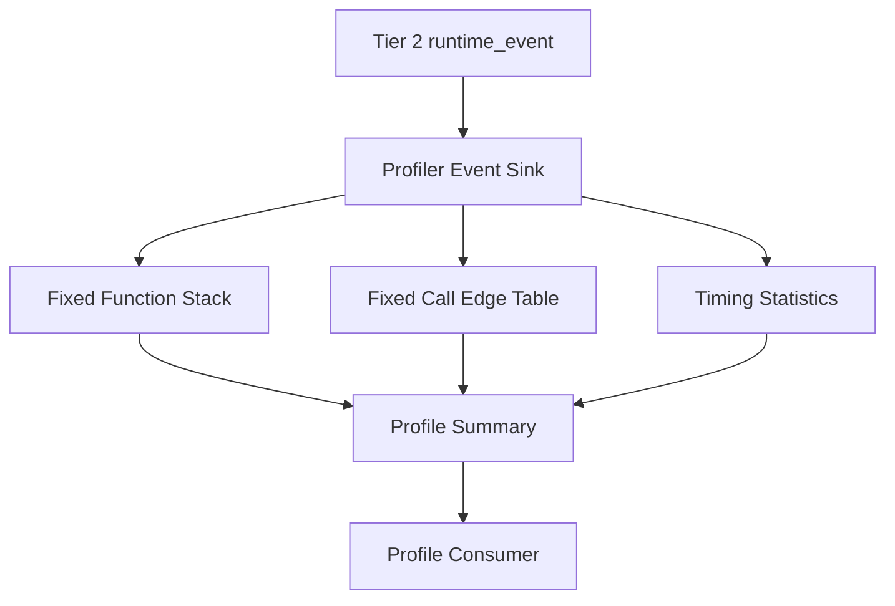

# ゲストプロファイラプラグイン設計書
<!-- evidence:
     formal: formal/guest_profiler_model.py
     test: docs/qa/tier3_plugins/guest_profiler_test_spec.md
-->

## 1. コンセプト
<!-- traceability: {META_3TierSeparation} {META_ContractImplSplit} {META_StaticDI} {GLOBAL_Policy_Memory} {RuntimeEventSink} -->
本コンポーネントは、Tier 2 の [`runtime_observability.md`](docs/components/tier2_runtime/runtime_observability.md) が定義する Runtime イベントを受信し、関数のコールグラフと実行時間を集計する Tier 3 プラグインである。Runtime Event Sink の履歴搬送、イベント変換、下流のプロファイル出力を担当する。

プロファイラは Runtime の実行状態を変更しない。停止、再開、ステップ、メモリ書込みは Debugger プラグインの責務であり、プロファイラは観測シンクとしてのみ Runtime へ接続する。

## 2. アーキテクチャ分類
<!-- traceability: {META_3TierSeparation} {META_ContractImplSplit} -->
本コンポーネントは **Tier 3 (プラグイン・リーフコンポーネント: Plugin Leaf Component)** に属する。固定長の観測状態、コールグラフ集計、時間計算、Runtimeイベントバッチの受信後処理を担当する。Runtimeのイベント生成、C++レコード、C++/Python転送ABIはTier 2の`runtime_observability.md`を正本とする。

## 3. 静的モデル

### 3.1 データ構造
- **`profiler_state`**: 関数スタック、呼出辺、自己時間、包括時間、欠落数を保持する固定容量状態である。
- **関数スタック**: `function_enter` から `function_exit` までの未完了呼出を保持する。再帰呼出は別フレームとして保持する。
- **呼出辺表**: 親関数識別子と子関数識別子の組をキーとする固定容量表である。再帰呼出は同じ辺のカウンタへ加算する。
- **時間統計表**: 関数識別子ごとの呼出回数、包括時間、自己時間、推定値フラグを保持する。
- **欠落統計**: Runtime Event Sink のバッチに含まれる累積 `dropped_count` と固定容量表の挿入失敗を欠落数として保持する。ログ搬送欠落との区別はしない。
- **スタック超過深度**: 固定スタックへ積めなかった再帰フレーム数を保持し、対応する終了イベントを消費して追跡中の親フレームを誤って閉じない。

### 3.2 内部ブロック図

```mermaid
graph TD
    Events[Tier 2 runtime_event] --> Sink[Profiler Event Sink]
    Sink --> Stack[Fixed Function Stack]
    Sink --> Edges[Fixed Call Edge Table]
    Sink --> Times[Timing Statistics]
    Stack --> Summary[Profile Summary]
    Edges --> Summary
    Times --> Summary
    Summary --> Caller[Profile Consumer]
```

## 4. 動的モデル

### 4.1 時間意味論
ゲストプロファイラは `function_enter` と `function_exit` の対を基礎として時間を計算する。

- **包括時間**は、関数へ入ってから関数を離れるまでの時間である。子関数とホスト呼出の時間を含む。
- **自己時間**は、包括時間から、対応する子関数と明示的に除外したホスト呼出の時間を差し引いた時間である。
- **呼出辺**は、親関数識別子と子関数識別子の組で一意に識別する。再帰呼出は同じ辺のカウンタへ加算する。
- **JIT と Interpreter の区別**はイベントの状態フラグで行う。実行方式を別の関数としてコールグラフへ追加してはならない。イベント生成側がフラグを提供しない場合、本実装は方式を推定しない。
- **トラップ**では `TRAP` の後にRuntimeが発行する各 `FUNCTION_EXIT` を内側から消費し、該当フレームを終了理由付きの推定値として記録する。`DEBUG_STOP` は停止位置の開いたフレームを推定値として扱う。
- **イベント欠落**が発生した場合は、欠落以降の時間を厳密値と呼ばない。欠落数と推定値フラグを集計状態へ記録する。

### 4.2 イベント受信と過負荷
イベント受信側は動的メモリ確保、ブロッキング、文字列整形、外部 I/O を行わない。固定長レコードを固定容量の状態へ反映する。

- Python Adapter は安全点で受け取ったバッチを値オブジェクトへ変換し、選択されたconsumerへ渡す。
- バッチの累積欠落数が前回値より増えた場合、欠落数と推定値フラグを更新する。
- Runtime実行中のPython callback、ログ出力、停止要求は行わない。
- 欠落または集計表の容量超過が発生した場合、該当する統計値へ推定値フラグを設定する。

### 4.3 終了処理
正常復帰時は対応する `FUNCTION_EXIT` でフレームを閉じる。`TRAP` は後続する関数離脱イベントの終了理由を推定値として扱う印として記録する。`DEBUG_STOP` は開いている全フレームを推定値として閉じる。Runtimeイベントバッチを受け取らずにRuntimeを破棄した場合の終了要約は生成しない。

## 5. インターフェース定義

### 5.1 イベント受信
| 項目 | 内容 |
| :--- | :--- |
| 機能概要 | Tier 2 の `runtime_event` を受信して固定容量のプロファイル状態へ反映する。 |
| 事前条件 | ABI検証済みバッチがPython値へ変換され、イベント識別子、時刻、呼出相関がTier 2契約を満たしている。 |
| 期待する結果 | コールグラフ、時間統計、欠落統計のいずれかが更新される。 |
| 不変条件 | Runtime の PC、スタック、メモリ、停止状態を変更しない。 |
| エラー時の挙動 | 容量不足は欠落として記録し、Runtime の実行結果とは分離する。 |

### 5.2 集計参照
| 項目 | 内容 |
| :--- | :--- |
| 機能概要 | 関数統計、呼出辺、開いたフレーム数、欠落数、推定イベント数を参照する。 |
| 事前条件 | 該当する関数または呼出辺を一度以上観測している。 |
| 期待する結果 | 集計した値を固定容量状態から返す。 |
| 事後条件 | 内部集計状態を変更しない。 |
| エラー時の挙動 | 未観測関数への `stats_for` は契約違反として `assert` する。 |

## 6. 制約達成の方策
<!-- traceability: {GLOBAL_Policy_Memory} {META_StaticDI} -->

### 6.1 性能制約と方策
- イベント受信時にコールグラフ探索やログ文字列生成を行わない。
- 観測無効時は Observer を静的結線せず、プロファイラ状態を生成しない。
- 関数識別子と呼出相関だけでスタックと辺を更新し、ゲストメモリを参照しない。

### 6.2 メモリ制約と方策
- 関数スタック、呼出辺表、時間統計表、Python Adapterの固定容量搬送バッファを `SystemConfig` の観測予算へ登録する。
- これらの表を固定容量とし、無制限の動的配列やRuntime実行中のログ搬送バッファを要求しない。
- プロファイラ状態と Runtime の実行スタックを別領域に配置する。

### 6.3 安全性制約と方策
- イベントへゲストメモリへのポインタを保存しない。
- 単調時計を使用し、時刻のラップアラウンドを明示的なオーバーフローとして処理する。
- プロファイラから `ExecutionControl` を参照できない構成にする。

## 7. 形式検証・テスト仕様との対応

### 7.1 形式検証（pyModelChecking / 直交表）

#### 7.1.1 検証対象の不変条件
| 不変条件 | 説明 | 範囲 | 検証方法 |
| :--- | :--- | :--- | :--- |
| 入退出対応 | トラップ・停止イベントで追跡中のフレームが閉じる。 | イベント列 | [`guest_profiler_model.py`](docs/components/tier3_plugins/formal/guest_profiler_model.py) `trap_eventually_closes_tracked_frames`、`test_trap_closes_open_frames_as_estimated` |
| 時間分類 | 子関数の時間を親関数の自己時間から差し引く。 | 集計結果 | `test_call_graph_and_time_accounting` |
| 欠落明示 | 欠落通知・表容量超過後の統計へ推定値を設定する。 | プロファイル結果 | `test_dropped_event_and_fixed_table_overflow_are_reported` |
| 再帰超過隔離 | 固定スタックへ積めない再帰フレームの exit で追跡中の親フレームを閉じない。 | イベント列 | [`guest_profiler_model.py`](docs/components/tier3_plugins/formal/guest_profiler_model.py) `overflowed_recursive_exit_preserves_parent_frame`、`test_recursive_stack_overflow_does_not_close_parent_frame_early` |
| 誤制御禁止 | プロファイラが Runtime の実行制御を保持・呼び出さない。 | 依存方向 | `GuestProfiler` の公開依存は `RuntimeEvent` と固定容量コンテナのみ |

#### 7.1.2 既知の制限や仮定
命令単位のトレーサ、サンプリング周期の補正、外部ログ形式の具体的な符号化は本仕様の必須機能ではない。イベント欠落が発生した区間の時間は推定値として扱う。

## 8. 設計判断と参考実装

特記すべき独立したADRはない。採用方針は本書の各契約節に記載する。
