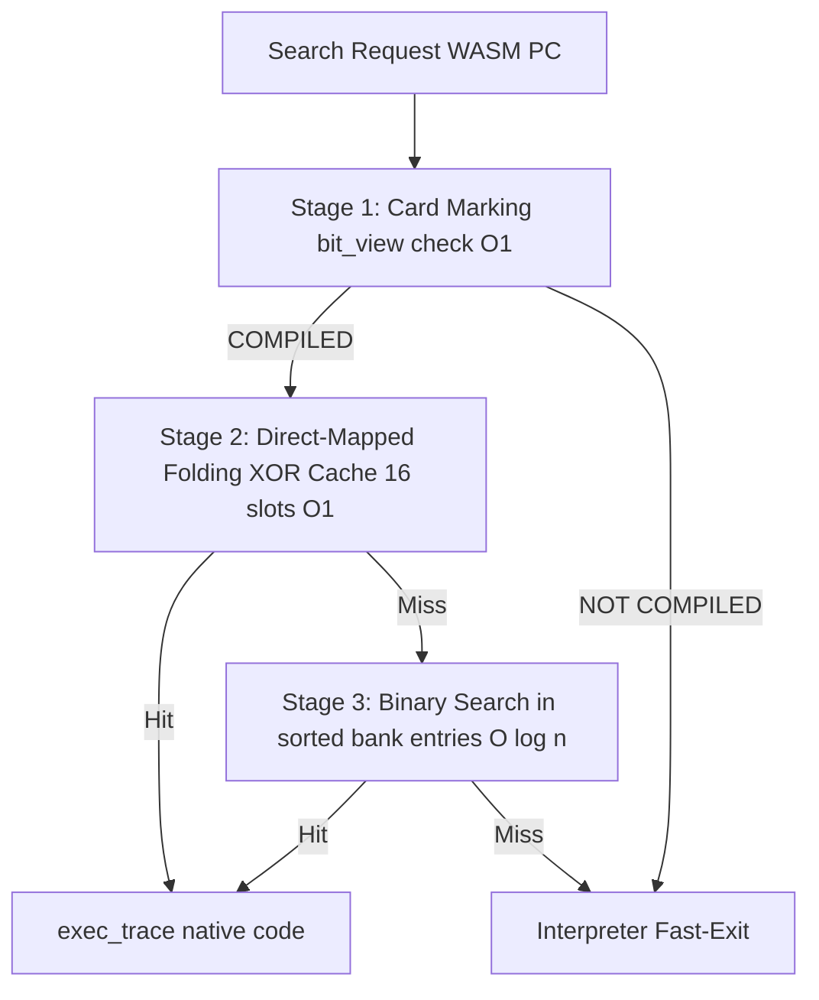
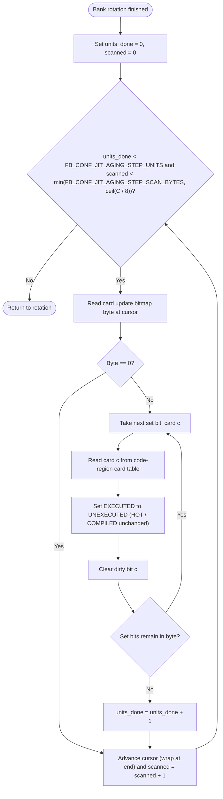
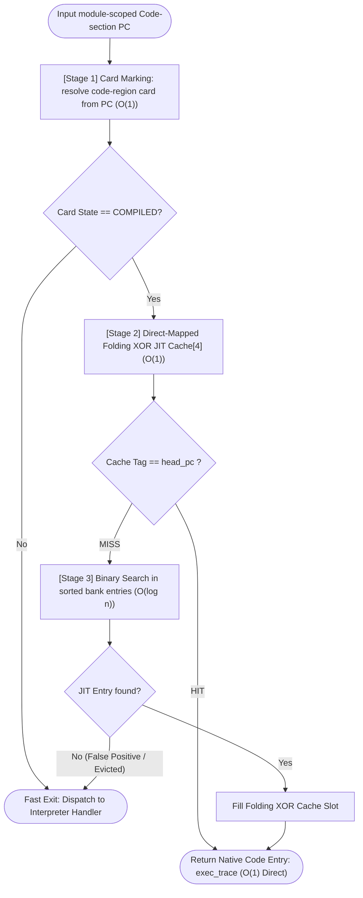
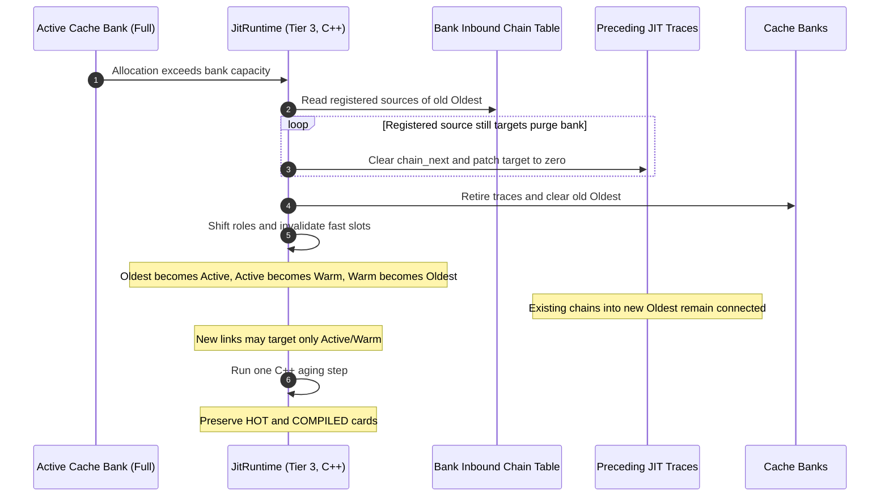
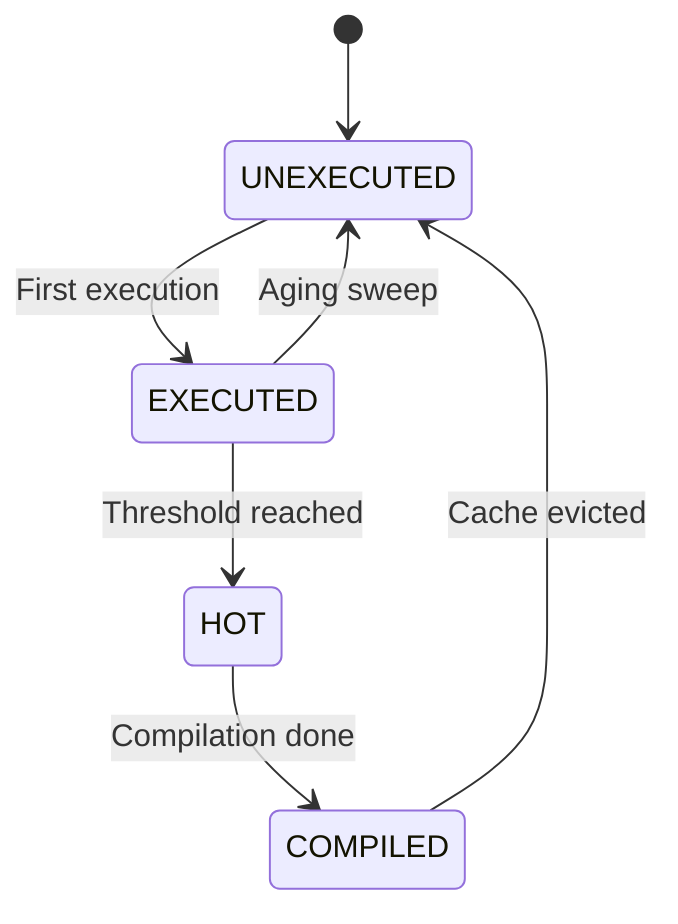
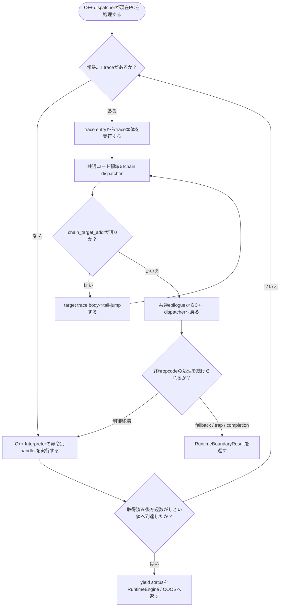

# JIT ランタイム管理 コンポーネント設計書 {VERIFY_FORMAL} {VERIFY_LLM} {VERIFY_BENCHMARK}
<!-- evidence:
     formal: formal/jit_cache_model.py
     formal: formal/jit_hotspot_model.py
     formal: formal/jit_trace_execution_model.py
     benchmark_spec: benchmarks/jit_runtime_bench_spec.md
     benchmark: ../../../experiments/pysim/benchmarks/jit/bench_jit.py
     benchmark_record: ../../../experiments/pysim/benchmarks/BENCHMARK_REPORT.md
     test: docs/qa/tier3_plugins/jit_runtime_test_spec.md
-->

## 1. コンセプト
<!-- traceability: {SimpleJITArchitecture} {JIT_MultiBuffer_Cache} {JIT_OldestOnly_Promote} {META_AccessDictionary} {META_BinarySearch} {LowLatencyJIT} {LowOverhead} {HistoryBuffer} {RuntimeHotspotProfiler} {GLOBAL_PeriodicTask} {DirectMappedJIT16} {Runtime_BumpAllocator} -->
JIT ランタイム管理は、Tier 2 Interpreterへ任意に接続するTier 3プラグインの実行拡張である。JIT拡張がホットスポット履歴、カード状態、コンパイル要求、ネイティブコード検索、3面キャッシュをまとめて所有する。Runtime Event Sinkとは別の内部経路で履歴を記録する。

Runtime と Interpreter は Tier 2 の実行基盤である。Debugger が有効な実行ではRuntimeは通常のInterpreter経路を使う。それ以外はTier 2 Runtimeの実行境界からJIT拡張へ処理を委譲する。JIT拡張は固定長dispatch snapshotをC++ Interpreterへ渡し、yieldやfallbackまでの実行、履歴分析、必要なコンパイル要求を一つのプラグイン内部で処理する。Tier 2 RuntimeやC++ InterpreterにJIT専用の状態オブジェクトや操作API群を追加しない。

インタープリタ実行ループ内の検索は3段で構成する。第1段はカードマーキング表 (`bit_view<2>`) による $O(1)$ 事前判定、第2段はDirect-Mapped Folding XORキャッシュ（16スロット）による $O(1)$ 検索、第3段は各バンクのソート済みJITエントリ配列に対する二分探索である。エントリ数が少ないためRadix表は設けず、補助索引のメモリと更新処理を持たない。

3面コードキャッシュはデータ用バンプアロケータとは別に管理する。x64参照構成では、実行可能バッファの書込権限と実行権限を同時に有効にしない。ARMv8-Mの物理配置と保護方式はTBDである。

## 2. アーキテクチャ分類
<!-- traceability: {META_3TierSeparation} {SimpleJITArchitecture} -->
本コンポーネントは **Tier 3 Plugin** に属し、Interpreterへ任意接続するJIT pluginの実行時検索、3面コードキャッシュ管理、局所アンリンク、ホットスポット検出を担当する。コード生成コアは同plugin内の [`jit_compiler.md`](docs/components/tier3_plugins/jit_compiler.md) が担当する。

### 2.1 JIT サブシステムのデコンポジション
<!-- traceability: {JIT_CopyAndPatch} {JIT_Encoder} {SimpleJITArchitecture} -->
JITサブシステムは、以下の2つの独立した設計書に責務を分離して構成される。
- **[jit_compiler.md](docs/components/tier3_plugins/jit_compiler.md)**: 命令テンプレートを用いたネイティブコード生成および静的命令エンコードを担当する。
- **[jit_runtime.md](docs/components/tier3_plugins/jit_runtime.md)**: ホットスポット履歴の記録・分析、カード更新・コンパイル要求、PCとネイティブコードの検索、3面キャッシュローテーションを担当する。 `SimpleJITArchitecture` `{JIT_MultiBuffer_Cache}`

### 2.2 実装責務と依存方向
<!-- traceability: {META_ContractImplSplit} {META_StaticDI} {META_3TierSeparation} -->
Tier 2 Runtime / Interpreter と Tier 3 JIT 拡張の境界は、任意の拡張接続と固定長 dispatch snapshot、および Interpreter のyield/fallback境界である。C++ Interpreter はsnapshot内のトレース記述子を参照し、候補PCの履歴を同じ呼出しの戻り値として返す。Tier 2のC++ Interpreterにカード表、コンパイル待ち列、JIT状態オブジェクト、JIT専用の操作APIを追加しない。

カード表、履歴リング、コンパイル待ち列、3面キャッシュ、実行可能領域、Oldest昇格、chain patch、および`JITTrace`は Tier 3 JIT 拡張が所有する。常駐トレースのsnapshotはキャッシュ世代が変わったときにTier 3のC++キャッシュ実装が生成する。Pythonの接続層はsnapshotの保存領域を用意し、候補表と履歴領域を結合する。C++ Interpreter との呼出し境界では固定長テーブルを一度渡し、実行中に Python へ戻らずに trace / handler を続ける。

Tier 3 の実装は次の責務に分ける。

| 実装 | 所有する責務 | 依存先 |
| :--- | :--- | :--- |
| Tier 3 JIT Runtime Manager | Loaderの借用コードとメタデータの登録、InterpreterのJIT実行境界、外部観測の通知 | Tier 2 Runtime / Interpreter、Loader |
| Tier 3 Native JitRuntime | 候補選択、履歴リングと分析、コンパイル待ち列と抑制、カード状態遷移とエイジング、ソート済み常駐索引、直接マップ検索、3面ローテーション、Oldest昇格、被チェイン元登録と解除、snapshot生成、コンパイル済み記述子と実行可能領域の所有 | Tier 2のdispatch記述子契約、Tier 3のコンパイラと共通コード |
| Tier 3 Native Trace Compiler | Loader所有のWASMコードを直接走査し、1回の呼出しで1 traceを生成 | Loaderの借用WASMコード、Tier 3の共通コード |
| Tier 2 Runtime / Interpreter | 通常のInterpreter境界と状態管理。接続時はTier 3拡張へ実行境界を委譲する | Tier 1、任意のTier 3 JIT拡張 |

Tier 3のC++クラス`fireball::JitRuntime`にキャッシュ管理の状態と処理を集約する。クラスの定義と実装は[`jit_runtime.cxx`](experiments/pysim/native/tier3_plugins/jit/jit_runtime.cxx)に置く。実装言語をC++にしてもTier 3のプラグイン責務を維持する。固定容量のC++オブジェクトを呼出し側が用意した保存領域へ構築する。履歴リング、コンパイル待ち列、コンパイル済み記述子と実行可能領域をC++オブジェクト内で保持する。LoaderのWASMコードとローカル幅は、登録境界で借用する。

実行境界ではC++が履歴を分析し、境界の種類と処理予算からコンパイル要求を処理するか判定する。判定値をPythonへ返して呼び直す経路を設けない。待ち列からコンパイラ、キャッシュ配置、再配置とヘッダpatchへはC++の関数を直接呼び出す。これらは同じネイティブライブラリに置く。履歴と待ち列の内部操作、機械語テンプレートの生成、中間コンパイル結果とトレース組立ては外部へ公開しない。Pythonへのcallbackは外部記述枠の寿命管理と、明示的に設定したコンパイル・実行回数の観測だけに用いる。通常のネイティブコンパイルと破棄ではPythonを呼び出さない。追い出しとローテーションの通知経路は設けない。callbackの契約違反は呼出し境界で即時に伝播する。

Pythonの`JitRuntimeBoundary`はC++所有者へ接続する境界アダプタである。参照表は、外部からトレース記述子を明示的に登録するときだけ確保し、その寿命を保持する。C++がコンパイルした記述子はネイティブ保存領域を参照する。外部から取得した記述子への参照は、そのトレースの削除またはキャッシュの破棄まで有効である。Pythonへ履歴レコードやバンク全体をコピーする経路を設けない。

Tier 3/JITのPythonファイルは、LoaderとInterpreterの接続、ctypesの型変換、および借用保存領域の寿命保持を担当する。共通機械語の生成、トレース再配置、物理ヘッダpatchは[`common_code.cxx`](experiments/pysim/native/tier3_plugins/jit/common_code.cxx)に置く。実行可能領域の確保・解放とW^X切り替えは[`executable_memory.cxx`](experiments/pysim/native/tier3_plugins/jit/executable_memory.cxx)に置く。カード操作と固定容量の履歴・待ち列の内部操作は[`profiling.cxx`](experiments/pysim/native/tier3_plugins/jit/profiling.cxx)に置く。Python側に対応するアルゴリズムを重複して保持しない。

ローテーションはC++内部でカードエイジングを1ステップ実行する。明示的なflushではエイジングを実行しない。エイジングの時間と回数、ローテーション数、常駐数・バイト数はC++内で集計する。測定側は集計値だけを取得する。Pythonへバンク、内部配列、fast cache枠、追い出しPC列を公開しない。

バンクの使用バイト数と次の書込み位置を分けて保持する。削除とOldest昇格で空いた中間領域を次の書込み位置として扱わない。次の書込み位置はバンクを消去したときに先頭へ戻す。既存PCの置換は同じ位置へ収まる場合に領域を再利用し、それ以外は未使用の末尾へ配置する。末尾にも収まらない置換は常駐状態を保って失敗を返す。

JIT拡張はインタープリタに対するプラグインに近い選択可能コンポーネントである。Interpreter はコンパイラ実装やキャッシュ状態を参照せず、実行境界で受け取ったsnapshotだけを使う。JIT 無効構成では snapshot 生成、履歴、コンパイラ、実行可能領域を合成しない。

本コンポーネントには独立した概念モデルを置かない。実行経路はネイティブランタイム、x64機械語実装、形式モデルおよび対応するテスト仕様で確認する。

## 3. 静的モデル

### 3.1 データ構造
<!-- traceability: {JIT_ReverseCompilationOrder} {WasmCodeSectionPC} {ADR_JitCompileScheduling} -->
- **WASMプログラムカウンタ (`UnifiedPC` / `wasm_pc_t`)**: 32ビットのモジュール内Code section payload相対オフセットであり、命令先頭バイトを指す。関数インデックスを上位ビットへ格納しない。Code section payload内の関数数、body size、locals宣言も座標に含む。異なるモジュール間のキーは`(module_id, pc)`とする。
- **`JitEntryIndex`**: WASMオフセットとネイティブコードの対応付け、および 4 段高速検索ロジックをカプセル化した主要クラスである。
- **カードマーキング表 (Card Marking Table)**: モジュールのCode section payload相対PC全体を 4 バイト単位のカードで分割管理する、単一の 2 ビット状態表である。カード番号は`pc >> card_shift`で求め、全関数が同じPC座標・カード領域を共有する。関数境界をまたぐカードも同じ状態を参照する。密ビュー `fireball::bit_view<2>` として参照する。
  - `0: UNEXECUTED` (未実行)
  - `1: EXECUTED` (実行済み)
  - `2: HOT` (コンパイル要求中)
  - `3: COMPILED` (コンパイル済み / オンデマンド許可)
- **コンパイル対象可否マスク (Trackable Mask)**: Tier 3 JIT拡張がコード領域全体に対して一枚だけ持つ、カードごとの 1 ビット状態表である。ロード時のブロックdescriptorは正確な候補head PCと静的適格性を保持する。実行時は制御処理で確定したブロック開始PCを保持し、コード領域マスクでカード単位の抑止を確認する。通常命令を実行したブロックだけを履歴へ記録する。`next_pc` を持ち、かつバイト長が `min_trace_bytes` 以上のブロックを対象とする。コンパイル失敗時はそのカードを解除し、同じカードに属する候補も外す。 `{TrackableBlockMask}` <!-- definition: {TrackableBlockMask} -->
- **カード更新表 (Card Update Bitmap)**: コード領域全体の各カードに対応する 1 ビットdirty表である。カードが `UNEXECUTED` から `EXECUTED` へ遷移した時だけ、そのカードのビットを立てる。密ビュー `fireball::bit_view<1>` として参照する。8カードを1バイトにまとめる。
- **エイジングカーソル**: カード更新表のバイト位置を保持する整数である。モジュール登録時に 0 で初期化し、表の末尾に達したら先頭へ戻る。
- **JITエントリ表**: モジュールごとの各バンクに `head_pc` 順で並ぶ固定容量配列である。異なるモジュールを一つの検索表へ入れる場合のキーは`(module_id, head_pc)`とする。検索は二分探索（$O(\log n)$）とし、削除済み枠は無効項目として扱う。新規キーは配列内のシフトで挿入し、削除はtombstone化する。同じキーの再挿入では無効項目を再利用する。配列容量と挿入量はバンク容量により制限される。エントリが少ないためRadix索引を設けない。
- **ネイティブトレースディスパッチ表**: JIT拡張がキャッシュ世代に応じて作る固定容量の`NativeTraceDispatchEntry`配列である。C++ Interpreter dispatcherはこのsnapshotを直接検索し、実行中にPythonへ戻らない。
  x64参照構成の記述枠は `JIT_CACHE_BANK_ENTRY_CAPACITY` により1バンク32件を上限とする。3面の上限は96件である。これはRAM予算の設定値であり、64バイトの既定コンストラクタ値や生成コードの平均サイズから導出しない。
  snapshotの容量は、ロード済み基本ブロック数と全バンクの記述枠上限の小さい方とする。同一PCの常駐トレースを重複生成しない。WarmまたはOldestに存在するPCを新規insertすると契約違反とする。Oldestの昇格は既存lookup経路を使う。
  コード領域または記述枠が満杯になれば、既存の3面ローテーションを行う。生成コードの長さは可変である。短いtraceでも記述枠の上限を超えて挿入しない。
  ホットスポット計測には既存のTrackable Maskを借用する。候補PC配列は確保しない。C++ dispatcherはIPからカードとbit位置を求めて履歴を記録する。
  同一カードの構造命令位置もbitが立つ。dispatcherは制御命令だけの区間ではtrace表を検索しない。関数入口または制御処理の完了を、新しいブロック候補の開始トリガーとする。そこで確定したPCを保持し、通常命令のあるブロックだけを計測する。制御命令だけの区間を履歴へ記録しない。履歴転送時にLoader索引を検索しない。メモリ操作のruntime委譲後は同じブロックの継続として扱い、次の制御境界までtrace検索と重複した履歴記録を行わない。外部呼出し・prefix委譲の完了は次ブロックの開始トリガーとする。単なるRuntime復帰や通常命令の出現を、新しい先頭の判定に使わない。trap・関数完了では開始待ち状態を解除する。
  通常命令の観測は候補ブロック入口の専用dispatchに限定する。最初のbody命令を観測した後は、観測処理を持たない通常dispatchへ直接末尾呼出しで移る。候補外と計測無効の経路には通常命令ごとの観測判定を追加しない。
  snapshotの記述表と履歴はモジュールごとの容量で確保する。世代更新時にも同じ容量のワークスペースを再利用する。
- **x64参照コード領域 (8KB)**: x64参照構成では4KBページ2枚分の領域を使う。先頭2KBは開始処理、終了処理、x64ヘルパー呼出しコード、chain dispatcher、および絶対アドレスプールを置く非エビクション領域とし、残る2KBずつを`Bank 0 (Active)`, `Bank 1 (Warm)`, `Bank 2 (Oldest)`に割り当てる。x64トレースヘッダはコード近傍に置き、生成コードと共通コードが読むchain/helper targetだけを保持する。共通コード領域はflushやバンクローテーションでも維持する。ARMv8-Mの領域容量、物理配置、保護方式、ヘッダ形式はすべてTBDである。
  x64参照共通領域内の固定オフセットは次のとおりである。オフセットはコード領域先頭からの値であり、トレースヘッダのフィールド位置とは別の値である。

  | 共通領域オフセット | 配置物 | 容量・用途 |
  | :--- | :--- | :--- |
  | `0x000` | x64参照開始処理 | 4つの論理引数を受けてトレース本体へ移行する |
  | `0x020` | x64参照終了処理 | 共有状態を同期して呼び出し元へ復帰する |
  | `0x030` | コンテキスト型ヘルパー入口 | トレースヘッダの関数アドレスを共通呼出しコードへ渡す |
  | `0x050` | 絶対アドレスプール | 256バイトの共通アドレス領域 |
  | `0x160` | x64 i32ヘルパー入口群 | 32バイト単位で4入口。2個の32ビット整数引数と結果領域ポインタで関数を呼び出し、終了処理へ戻る |
  | `0x200` | x64 wideヘルパー入口群 | 32バイト単位で11入口。ヘルパー契約ごとの引数を設定して関数を呼び出し、終了処理へ戻る |
  | `0x400` | x64共通chain dispatcher | 32バイト。Traceヘッダのchain targetを読み、次trace bodyへtail-jumpする。未接続時は共通終了処理へ戻る |

  chain dispatcherはopcode別の分岐handlerを共通化しない。分岐条件・control frame更新・後方分岐回数はC++ Interpreterの命令別handlerが処理する。handler実行後にC++ dispatcherが別traceを選ぶ遷移と、共通コードchain dispatcherがtarget bodyへtail-jumpするchainは別の経路である。C++ `constexpr` assemblerで生成した固定命令列をx64参照構成の共通領域へ一度だけ配置する。ARMv8-Mの呼出し入口、配置方式、命令列はTBDである。
- **オンデマンドコンパイルキュー (On-demand Compile Queue)**: Tier 3 JIT拡張内で`HOT`に達した命令オフセットを保持する固定容量LIFOキューである。Runtimeのidle hookは全タスクidle時と協調境界で拡張へ処理予算を渡す。通常の予算は成功コンパイル数ではなく、取り出して処理した候補数に適用する。コンパイル失敗と既存trace等によるスキップも1件に数える。固定キュー満杯時は通常予算の例外として、その場で全候補を処理してキューを空にする。処理件数の上限は固定キュー容量であり、実時間の上限は保証しない。先行ブロックより後続を先に常駐させ、直線後続chainを接続する。 `JIT_ReverseCompilationOrder` `{GLOBAL_Policy_Memory}`
- **バンク別被チェイン逆引きテーブル (Inbound Chain Index Table)**: 各キャッシュバンクへ向けたchain元のJITエントリを保持する固定長配列である。cache回転・promote時に共通chain dispatcherが参照するtarget addressを更新または解除する。
- **前方chainメタデータ**: 実行時cache metadataの`chain_next` / `next_pc`は直線後続traceの論理PCを保持する。x64物理ヘッダの`chain_target_addr`は共通chain dispatcherがtail-jumpするresident target bodyを保持する。後方branch linkは作らず、branch handlerへ制御を戻す。
- **実行履歴バッファ**: ホットスポット検出が有効なJIT拡張が所有する固定容量リングである。各レコードは`module_id`と`UnifiedPC`を持つ。容量は`JIT_HISTORY_CAPACITY`以下で指定する。待ち列容量は`JIT_COMPILE_QUEUE_CAPACITY`以下で指定する。Interpreter実行区間の終了時だけ履歴順に分析し、JIT trace/chainだけの区間では記録も分析もしない。 `{HistoryBuffer}`
- **トレース実行回数**: JIT拡張は各`JITTrace`に32ビット符号なしカウンタ`exec_count`を所有する。RuntimeのC++ dispatcherが実行した各trace bodyを1回と数える。直接chainの後続bodyも個別に数える。lookup、コンパイル、昇格、実行前の容量不足によるfallbackは数えない。通常のRuntime統計とホットスポット計測の有効・無効にかかわらず記録する。最大値`0xFFFF_FFFF`で飽和する。snapshotはカウンタへの借用ポインタを持ち、実行中はキャッシュの更新・破棄を行わない。昇格とsnapshot再生成では値を保持する。再コンパイルした別traceは0から始める。`reset_stats`は常駐traceの測定区間を0から始め直す。
  カウンタはtraceあたり4バイトである。x64 snapshot記述枠には8バイトのポインタを追加する。C++ dispatcherは実行後に常駐chainを走査して計数する。低水準の`JITTrace.execute`等によるdispatcher外の直接呼出しはこの計測の対象外である。
  キャッシュはrotate、flush、および既存traceの置換による破棄の直前に、任意の`on_trace_retire(head_pc, exec_count)`収集先を呼ぶ。収集先はJIT metadataへ再入しない。収集先未接続時は履歴を蓄積しない。記録からコンパイル抑制やキャッシュ方針を変更しない。
  記録入口は[`record_trace_execution.py`](experiments/pysim/benchmarks/jit/record_trace_execution.py)である。反復するhot関数と2回だけ呼ぶcold関数を混在させ、実行中にevictされたtraceと終了時にresidentなtraceを分けてJSONへ出力する。終了時のflushで未使用evictionを作らない。各関数の戻り値を期待値と照合する。再現コマンドは次のとおりである。

  ```bash
  uv run python experiments/pysim/benchmarks/jit/record_trace_execution.py --output /tmp/trace_execution.json
  ```

### 3.2 内部ブロック図


### 3.3 主要なクラス・構造体・配列・定数

#### JITエントリインデックス（JitEntryIndex）クラス
| 項目名 | 機能と役割 | 型分類 | サイズ・制約 |
| :--- | :--- | :--- | :--- |
| 高速スロット配列 | 4-bit スロット選択を行う Folding XOR Hash による Direct-Mapped キャッシュ | 固定長配列 | 16スロット (`{DirectMappedJIT16}`) <!-- definition: {DirectMappedJIT16} --> |
| エントリ配列 | `head_pc` 昇順のJITエントリを保持する | 固定長ソート配列 | 二分探索 $O(\log n)$。Radix索引なし |
| カードマーキング表 | カードごとの 2-bit 状態表 | 密ビュー | `fireball::bit_view<2>` |
| カード更新表 | 前回の巡回以降に `EXECUTED` へ遷移したカードの印 | 密ビュー | `fireball::bit_view<1>`、コード領域カード数ビット |
| 被チェイン逆引きテーブル | バンクごとの被チェイン元 JIT エントリインデックス配列 | 固定長配列の配列 | `FB_CONF_JIT_MAX_INBOUND_CHAINS_PER_BANK` |
| 履歴バッファ | Interpreterが記録した基本ブロック履歴 | 固定容量リング | `(module_id, unified_pc)` の8バイトレコード。Runtimeと同じ寿命 `{HistoryBuffer}` |

## 4. 動的モデル

### 4.1 アルゴリズム
<!-- traceability: {DirectMappedJIT16} -->
1. **カードマーキング確認 ($O(1)$)**: カードマーキング表 (`bit_view<2>`) を $O(1)$ で確認する。状態が `COMPILED` でなければ即座に終了する。
2. **Direct-Mapped Folding XOR キャッシュ確認 ($O(1)$)**:
   - `UnifiedPC` を 32→16→8→4 ビットと3回の XOR で折りたたむ。
   - `slot = temp & 0x0F` を計算して16スロットの高速テーブルを照合する。
   - スロットのタグが `head_pc` と一致（Hit）した場合、バンク検索をバイパスして $O(1)$ でトレースを返す。
3. **バンク内二分探索 ($O(\log n)$)**:
   - キャッシュミス時、Active / Warm / Oldest の順に各バンクの `head_pc` 昇順配列を二分探索する。JITエントリ数が少ないためRadix表は持たない。
   - 固定容量配列内のキーに一致するlive entryがあればトレースを得る。tombstoneまたはキー不一致なら次のバンクを検索する。
   - ヒットした場合はネイティブコードアドレス（`exec_trace`）を返す。
   - 次回用として高速スロットへ格納する。
5. **ホットスポット昇格判定**:
   - C++ Interpreterはブロック開始PCを保持する。候補マスクが立ち、Loaderが基本ブロックとして数える通常命令を実行した場合だけ、その開始PCを固定履歴バッファへ記録する。Tier 3 JIT拡張は境界で履歴を転送し、カード状態を更新する。JIT trace/chainだけの実行区間では記録しない。
   - 実行頻度が閾値に達したカードを`HOT`のままJIT拡張内のコンパイル待ち列へ登録する。Tier 3 JIT拡張が元のWASMコードをコンパイルし、コードcacheへの挿入まで成功した場合に`COMPILED`へ遷移する。
   - コンパイル失敗時は対象bitを解除し、そのブロックを再履歴・再コンパイル対象にしない。cache evictionまたは明示flushでは、対象bitを維持したままカードを`UNEXECUTED`へ戻し、次の閾値までhotnessを再計測する。eviction後に`EXECUTED`へ戻すと1回のtouchで再び`HOT`になり、持続的にホットでないコードでもコンパイルとevictionを繰り返すおそれがある。
6. **最小トレース長フィルタ**:
   - 推定サイズが 1 カード分未満のブロックは、履歴記録やコンパイル登録の対象外とする（TEST-JITR-06）。カードの2-bit状態は1つの追跡対象ブロックを表す。短いブロックの先頭が同じカードに入ると、互いのコンパイル状態やevictionを区別できない。
7. **3面世代交代ローテーションと局所アンリンク (`{GOTCHA-JITR-03}`, `{JIT_MultiBuffer_Cache}`, `{JIT_OldestOnly_Promote}`)**: <!-- definition: {GOTCHA-JITR-03} -->
   - Active バンク満杯時、`Oldest` バンクをパージして新 `Active` に再利用する。
   - パージ直前に、被チェイン逆引きテーブルに登録されたソースエントリ（$k$ 件）のみを参照する。
   - 新たにリンクするchain targetはActiveまたはWarmに限定する。ターゲットがWarmからOldestへ移っても、既存の`chain_next`と`chain_target_addr`を維持する。Oldestだけに存在する後続へ新たにリンクしない。
   - 昇格済みなら再チェイニングし、完全破棄なら復帰スタブへアンパッチする。全件走査は行わない。
   - `rotate()` および `flush_all()` 実行時には Folding XOR 高速キャッシュを無効化する。古いバンクへの誤参照を防止する（`{GOTCHA-JITR-05}`）。 <!-- definition: {GOTCHA-JITR-05} -->
   - ローテーションのたびに、エイジングスイープを 1 ステップ実行する（手順10）。`flush_all()` では実行しない。
   - 参照実装のバンク破棄は、破棄対象の$n$項目の消去と被チェイン元$k$件の照合を伴うため、実際の処理量は$O(n + k\log n)$である。固定容量$n_max$と被チェイン件数上限$k_max$により停止量は上限化されるが、$O(k)$とは表現しない。ターゲット実装はバンク破棄の方法を別途定義する。
8. **トレース昇格時のインバウンドソース付け替え (`{GOTCHA-JITR-02}`)**: <!-- definition: {GOTCHA-JITR-02} -->
   - Oldest バンクのトレースが再実行されて新 Active バンクへ昇格した際、被チェイン元のアドレスを新しい常駐アドレスへ更新する。
   - 逆引きテーブルの登録先も新バンクへ付け替える。古いバンクがパージされた後のダングリングジャンプを防止する。
9. **キュー処理時のキャッシュ再確認と二重コンパイル抑止 (`{GOTCHA-JITR-01}`)**: <!-- definition: {GOTCHA-JITR-01} -->
   - JIT拡張はコンパイル待ち列から取得したPCのカード状態を確認し、すでに`COMPILED`ならコンパイルを行わず次の要求へ進む。cacheへの手動挿入とコンパイル要求が重なる場合、同じ拡張内で常駐状態をカードへ同期する。
   - **設計理由**: 二重コンパイルによるキャッシュ容量の浪費と CPU 時間の損失を完全に防止する。
10. **エイジングスイープ (`{JIT_CardAgingSweep}`)**: <!-- definition: {JIT_CardAgingSweep} -->
   - 目的は、`EXECUTED` のまま長く残ったカードを `UNEXECUTED` へ戻すことである。時間的に離れた2回の実行が `HOT` を成立させる状況を防ぐ。
   - 契機は、3 面キャッシュのローテーション（`rotate()`）である。ローテーション 1 回につき 1 ステップを実行する。バンク満杯による自動ローテーションも含む。コンパイルの成否や `flush_all()` では実行しない。
   - ローテーションは、キャッシュ圧迫の直接の指標である。追い出しが起きない間は、エイジングも止めてよい。
   - 1 回の実行では、エイジングカーソルから 8 カード（1 バイト）単位でカード更新表を進める。
   - 値が 0 でないバイトを `FB_CONF_JIT_AGING_STEP_UNITS` 個処理した時点で、1 回の実行を終える。
   - 走査したバイトが `FB_CONF_JIT_AGING_STEP_SCAN_BYTES` 個に達した時点でも、1 回の実行を終える。値が 0 のバイトも走査数に数える。
   - 値が 0 のバイトは処理数に数えず、読み飛ばす。表を 1 周しても終了条件に達しない場合は、1 周した時点で終える。
   - 処理するバイトでは、ビットが立ったカードだけを扱う。
   - 処理するカードの状態が `EXECUTED` なら、そのカードを `UNEXECUTED` へ戻す。その後、当該dirtyビットを 0 にする。
   - `HOT` と `COMPILED` のカードには触れない。`HOT` はコンパイル待ち列と対応し、`COMPILED` は常駐トレースと対応するためである。
   - 走査後にカーソルを進める。表の末尾に達したら先頭へ戻る。
   - **ビットを立てる契機**: カードが `UNEXECUTED` から `EXECUTED` へ遷移した時点で、そのカードのdirtyビットを立てる。この遷移はカード状態の更新（touch）の中だけで起きる。
   - **設計理由**: `EXECUTED` へ遷移したカードだけを直接巡回し、コード領域全体のカード表を走査しない。
   - **上限**: コード領域のカード数を $C$、dirty表のバイト数を $D=\lceil C / 8 \rceil$ とする。1 回の実行で走査するバイトは最大 $\min(O, D)$ 個、処理するカードは最大 $8 \times U$ 個である（$U$: `FB_CONF_JIT_AGING_STEP_UNITS`、$O$: `FB_CONF_JIT_AGING_STEP_SCAN_BYTES`）。
   - **処理量**: 1 回の実行の最大処理量は $8 \times U$ 枚のカード状態確認に比例する。
   - **有限性**: dirtyビットが立ったカードは、高々 $\lceil D / O \rceil + \lceil D / U \rceil$ 回のローテーションの内に処理される。1 周に要するローテーションは、少なくとも $\lceil D / O \rceil$ 回である。
   - **保持期間**: カーソルが通過する直前に `EXECUTED` になったカードは、ほぼ直後に減衰する。1 周に要するローテーション数の下限は走査上限が決め、値が 0 でないバイトが多いほど 1 周は長くなる。減衰はコード領域カード単位で行う。`HOT` の閾値（2回の実行）はこの範囲で満たす必要がある。

#### エイジングスイープ手順（手順アクティビティ図）
<!-- traceability: {JIT_CardAgingSweep} {TrackableBlockMask} {GOTCHA-JITR-09} -->
ローテーションごとに実行する巡回手順を示す。



#### 3段高速検索パイプライン手順（手順アクティビティ図）
<!-- traceability: {JIT_MultiBuffer_Cache} {LowLatencyJIT} {DirectMappedJIT16} {META_BinarySearch} -->
実行時 PC からネイティブ `exec_trace` アドレスを特定する3段探索パイプラインを示す。



#### 3面世代交代ローテーションと被チェイン局所アンリンク（責務シーケンス図）
<!-- traceability: {GOTCHA-JITR-02} {GOTCHA-JITR-03} {JIT_MultiBuffer_Cache} {JIT_LazyChaining} {JIT_CardAgingSweep} -->
Active バンク満杯時の世代交代において、局所アンリンクと再チェイニングの連携シーケンスを示す。



### 4.2 状態遷移図
<!-- traceability: {GOTCHA-JITR-09} -->


キャッシュ破棄（Eviction）時は `EXECUTED` ではなく `UNEXECUTED` へリセットする（TEST-JITR-04）。

エイジングスイープが `UNEXECUTED` へ戻せる状態は `EXECUTED` だけである。`HOT` と `COMPILED` は変更しない。

コンパイル失敗時はカードを`COMPILED`にせず、独立したTrackable Maskの対象bitを解除する。これはカード状態の遷移ではなく再試行対象の除外であり、eviction後に候補性を保ったままhotnessを取り直す動作とは異なる。

### 4.3 トレース実行時の分岐解決とインタープリタ復帰
<!-- traceability: {JIT_RuntimeAPI_Fallback} {DirectBytecodeExecution} {GOTCHA-JITR-02} -->
制御フロー・コール境界のインタープリタ委譲不変条件を示す。ロード時の静的解析で各基本ブロックに付帯情報を持たせる。これにより実行時の分岐解決を定数時間で行う。

| 付帯情報 | 意味 |
| :--- | :--- |
| 後続アドレス | 分岐条件が不成立だった場合に続くブロックの先頭アドレス |
| 分岐先アドレス | 分岐条件が成立した場合に実際にジャンプする先のアドレス |
| フレーム深さ | 当該ブロック到達時に積まれているべき制御フレームの深さ |
| 命令列長 | 当該ブロック自身が占める命令バイト数（足切り判定用） |

命令列長は、後続アドレスから自分自身の先頭アドレスを引いて求めてはならない。後方分岐ブロックでは差分が負になる。その結果「短すぎる」と誤判定される。命令列長はブロック自身の命令バイト数から直接求める。

JIT trace終端の制御命令はC++ Interpreterの対応ハンドラで実行し、取得された後方分岐をそのハンドラ内で数える。C++ dispatcherは分岐後のPCから常駐トレースを検索し、JIT traceまたはC++ handlerを連続実行する。定義済みゲスト関数の呼出しもC++ handlerで処理し、呼出し先の適格ブロックを記録しながらdispatcher内で継続する。`FB_CONF_RUNTIME_YIELD_THRESHOLD`到達時にdispatcherがyield statusを返す。Tier 3 JIT拡張の境界処理は履歴を分析してRuntimeへ返し、Tier 2 RuntimeがCOOSへyieldを伝える。JITなしのInterpreter経路も同じdispatcher・カウンタ・しきい値を使う。後方分岐カウンタは時間ではなく取得した後方分岐の回数である。非対応命令、外部呼出し、trap、関数完了は必要な早期境界となる。

trace chainは直線後続traceが常駐する場合に限り、trace末尾から共通コード領域のchain dispatcherへ移り、dispatcherがTraceヘッダのtarget bodyへtail-jumpする経路を指す。未接続のtargetは0で表し、共通epilogueから実行境界へ戻る。opcode別handlerの呼出しや、C++ handler後にC++ dispatcherが別traceを選ぶ遷移はchainではない。chain dispatcherは命令を判定せず、分岐helperも持たない。

常駐trace表はキャッシュ世代または候補マスク世代が変わったときだけ構築する。候補マスクは既存ストレージを借用する。Tier 3 JIT拡張が固定長snapshotをC++ dispatcherへ渡し、制御handler実行後もしきい値到達まではC++内で次のtraceまたはhandlerを選ぶ。Interpreterは制御処理で確定した次ブロックのPCを保持する。通常命令が現れるまでtrace表を検索しない。借用マスクが立つブロックで通常命令を実行した場合だけ、保持した開始PCを固定長履歴へ記録する。Tier 3は履歴転送時にLoader索引を検索しない。Tier 3 JIT拡張はdispatch終了時に履歴を分析してカードを更新し、必要なコンパイル要求を処理する。Runtime Event Sinkはこの履歴を受け取らない。JIT無効構成はsnapshot、履歴、候補状態、コンパイラ、実行可能領域を持たない。デバッガ付き実行ではRuntimeがJIT拡張を迂回し、通常のInterpreter dispatcherを使う。

コンパイル待ち作業がないyield境界ではJIT拡張はコンパイル処理を起動しない。候補履歴が0件の実行区間では履歴を分析しない。これらの省略はyield理由、ゲスト状態、トレース選択を変更しない。

常駐trace descriptorと履歴は有界の実行時テーブルとして管理する。候補性は既存マスクを借用して判定する。C++ dispatcherは表の有効要素数とマスクのカード数を受け取り、直接参照する。テーブルはcache世代または候補mask世代が変化したときに再構築し、dispatcherの呼び出しごとに最大容量分をスタック上へ複製しない。テーブルの具体的な所有型はこの契約で規定しない。

#### コンパイル済みトレース実行後の遷移手順（アクティビティ図）


- **分岐条件の扱い**: `BR_IF` はJITトレースが残した条件値をC++ Interpreter handlerが消費する。`IF` も同じハンドラが条件を消費し、必要な制御frameを積む。
- **関数終了の定数時間解決 (`{GOTCHA-JITR-08}`)**: `RETURN` で終わるブロックでは命令列を再走査しない。トレースは戻り値を共有operand stackへ確定した後、C++ Interpreterのreturn handlerを通る。 <!-- definition: {GOTCHA-JITR-08} -->
- **制御フレームの整合 (`{GOTCHA-JITR-06}`)**: JIT trace bodyは制御終端命令（`RETURN`を含む）を実行しない。共通chain dispatcherからepilogue経由でC++ dispatcherへ戻った後、対応するC++ handlerを一度実行する。handlerが条件を消費し、制御frameを更新し、遷移先PCを決める。通常実行では同じC++ dispatcherが次PCをlookupし、後方分岐しきい値まで処理を続ける。 <!-- definition: {GOTCHA-JITR-06} -->
- **短小判定の符号 (`{GOTCHA-JITR-07}`)**: ブロックの足切り判定は自身の命令バイト数で行う。後続アドレスとの差分で代用すると、後方分岐ブロックで差分が負になり、高頻度ブロックが永久に除外されてしまう。 <!-- definition: {GOTCHA-JITR-07} -->
- **エイジングと常駐状態の分離 (`{GOTCHA-JITR-09}`)**: エイジングスイープは `EXECUTED` のカードだけを変更する。`COMPILED` まで戻すと、常駐トレースのカードが `UNEXECUTED` になり、lookup が常駐コードを見逃す。`HOT` まで戻すと、コンパイル待ち列の要求とカード状態が食い違う。常駐性の正本はキャッシュ、待ち列の正本は待ち列であり、スイープはどちらも書き換えない。 <!-- definition: {GOTCHA-JITR-09} -->
- **押し出し量の事前確認**: ランタイムは、トレースを呼ぶ前に、連鎖先を含む最大の `stack_words` が空き容量に収まることを確認する。収まらない場合はトレースを使わず、インタープリタが実行する。インタープリタは、容量超過を `assert` で停止する。JITだけが容量外へ書き込む状態を作らないためである。
- **連鎖の再リンク**: 昇格とローテーションの後も、非0のchain targetは常駐トレースbodyの有効なアドレスを指す。cache metadataとネイティブtrace headerの値は一致する。後続が退避された場合は`chain_target_addr`を0にし、共通chain dispatcherから共通epilogueへ戻す。制御終端はC++ Interpreter handlerが処理し、通常のlookupはC++ dispatcherが続ける。

## 5. インターフェース定義

### 5.1 公開API

#### Interpreter拡張境界
| 項目 | 内容 |
| :--- | :--- |
| 呼出 | JIT拡張は一つの境界呼出しでC++ Interpreterをyield、fallback、trap、または完了まで進め、継続状態と実行結果を受け取る。 |
| 内部処理 | snapshot検索、履歴分析、キャッシュ更新、コンパイル要求はTier 3拡張内部に閉じる。個別のC++ Runtime操作APIを追加しない。 |
| フォールバック | JITなし構成またはデバッガ付き実行では、Tier 2 Runtimeが通常のInterpreter経路を使う。 |
| 不変条件 | Tier 2 Runtimeはカード表、履歴リング、キュー、キャッシュ実装を参照しない。 |

## 6. 制約達成の方策

### 6.1 性能制約
- **方策**: カードマーキング表と16スロットFolding XORキャッシュの $O(1)$ 事前検索後、キャッシュミス時に少数のソート済みJITエントリを二分探索する（$O(\log n)$）。Radix索引は設けず、固定容量配列と二分探索を共通の検索契約とする。

### 6.2 メモリ制約
<!-- traceability: {JIT_MultiBuffer_Cache} {JIT_OldestOnly_Promote} -->
- **方策**: 3面循環バッファと Oldest ヒット限定昇格を採用する。Oldestのlookup hitは即時にActiveへ昇格し、Warmのhitは昇格させない。断片化を防ぎつつ、低頻度コードを自然に破棄させる。

## 7. 形式検証・テスト仕様との対応

### 7.1 検証対象の不変条件
<!-- traceability: {GOTCHA-JITR-09} -->
- **3面キャッシュ代謝の有界性**: 循環ローテーションによる Oldest パージと新 Active 再利用を検証する。
- **制御命令だけの区間の検索抑止**: 制御命令だけの区間ではtrace表検索と履歴記録を行わない。通常命令を実行したブロックは保持した開始PCを記録する。履歴転送がLoader索引を検索しないことを単体テストで検証する。検索と履歴記録の保護条件を形式モデルで検証する。
- **記述枠の容量境界**: コード領域に空きがあっても、記述枠が満杯なら新しいPCを挿入せずローテーションする。有限個の枠の使用数を形式モデルで検証する。短いtraceの容量境界は単体テストで検証する。
- **局所アンリンク安全性**: 被チェインソース$k$件だけを逆引き表から処理する。バンク再利用は全$n$項目の消去とバンク検索を伴い、$O(n + k\log n)$である。固定容量により有界だが$O(k)$のみとは主張しない。
- **カード状態の遷移規則**: 昇格は `UNEXECUTED`、`EXECUTED`、`HOT`、`COMPILED` の順だけで進む。`UNEXECUTED` へ戻す経路は、パージ時のリセットとエイジングスイープの2つに限る。
- **エイジング安全性**: エイジングスイープは `HOT` と `COMPILED` のカードを変更しない。`COMPILED` のカードは常駐トレースと対応し続ける。
- **更新表の包含性**: カード更新表のビットが 0 のカードは、`EXECUTED` 状態ではない。`EXECUTED` になる経路は `UNEXECUTED` からの遷移だけである。
- **エイジングの有限性**: カード更新表のビットが立ったカードは、有限回のローテーションの内に走査され、`EXECUTED` なら減衰するか、先行実行により `HOT` へ進む。

### 7.2 テスト仕様書との連携
本コンポーネントのテストケースは[`jit_runtime_test_spec.md`](docs/qa/tier3_plugins/jit_runtime_test_spec.md)を正本とする。キャッシュモデルは`formal/jit_cache_model.py`、履歴境界モデルは`formal/jit_hotspot_model.py`を参照する。

実行回数の抽象モデルは[`jit_trace_execution_model.py`](docs/components/tier3_plugins/formal/jit_trace_execution_model.py)を正本とする。実行対象外操作、chainの計数漏れ、飽和、および破棄時記録を検査する。`guards=False`では各違反を反証する。物理的なカウンタ寿命、uint32境界、および実際のC++ chain実行はTEST-JITR-76〜79で検査する。

## 8. 設計判断と参考実装

### 8.1 コンパイル時期と候補処理予算
<!-- traceability: {ADR_JitCompileScheduling} {JIT_ReverseCompilationOrder} -->

- **ステータス**: 採用。C++の待ち列処理は候補処理数で予算を消費する。
- **背景**: 全タスクidle時だけのコンパイルでは、継続的に実行可能なタスクがある構成で候補処理が進まない。固定キューの満杯時にも処理を進める必要がある。
- **選択肢**: 全タスクidle時だけ処理する方式と、協調境界でもidle hookを実行する方式を比較する。予算の単位は成功数と候補処理数を比較する。
- **結論**: 協調境界でも処理する。通常のidle hookは失敗・スキップを含む候補処理数で予算を消費する。満杯時は通常予算の例外として固定キュー容量ぶんをその場で全件処理する。
- **理由と影響**: 通常処理の仕事量を件数で制限し、満杯時は候補を失わずキューを空にする。満杯時には通常予算より多くの処理を行うため、コンパイルによる停止時間が増える。

### 8.2 キャッシュ代謝とスラッシング防止の未決事項
<!-- traceability: {Challenge_JITCacheEfficiency} {ADR_SafeQueuingOnHotMiss} -->

- **ステータス**: 3面ローテーションとOldest hit昇格は採用。スラッシング防止方策は未決である。
- **現行の暫定方策**: evictionでカードを`UNEXECUTED`へ戻す。再度hot判定を得たPCをコンパイル候補とする。この動作だけでスラッシングを防げるとは判定しない。
- **判断材料**: traceごとの実行回数、破棄時の実行回数、未使用のままevictされたtraceを記録する。計数契約は本書のトレース実行回数に従う。
- **未決事項**: 未使用evictionだけを対象にするか、実行回数が少なくコンパイル費用を回収できないtraceも対象にするかを決める。再コンパイルの抑止条件、適用範囲、および再許可する回復条件を測定結果から決める。
- **責務境界**: 記録の追加はコンパイル抑止やキャッシュ方策の採用を意味しない。Guest Profilerの変更は要求しない。
