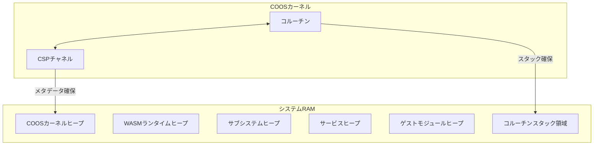

# アーキテクチャ

## システムレイヤー構成

| レイヤー | 構成要素 | 説明 |
| :--- | :--- | :--- |
| **ゲストアプリケーション** | WASMバイナリ | ユーザー提供のWASMバイナリアプリケーション。 |
| **サービス** | WASMプラグイン | システム機能を拡張するユーザー提供のWASMサービス。 |
| **vSoC** | インタープリタ, JIT, デバッガ、vMMIO | WASM実行環境と仮想ハードウェア抽象化を提供。 |
| **COOSカーネル** | スケジューラ, CSP, メモリ | 協調型マルチタスクと安全な通信の基盤。 |
| **サブシステム** | IPCルータ, HAL, ロギング | システムの共通機能とハードウェア抽象化層。 |
| **デバイスドライバ** | 各種ドライバ | UART, GPIO, I2C, Timer 等の物理デバイス制御。 |
| **ハードウェア** | CPU, 周辺機器 | ARM Cortex-M, RISC-V, x86 等の物理基盤。 |

## クリーンアーキテクチャと依存性の注入 (DI)

Fireballでは、コンポーネント間の結合度を下げ、移植性を向上させるためにクリーンアーキテクチャの原則を採用する。 `{CleanArchitecture}`

- **URIによる抽象化**: URI（例：`fireball://hal/uart`）をインターフェイスとして定義する。利用側（内側の層）は、具体的な実装の詳細を知ることなくURIを指定してサービスを検索（`lookup`）する。 `{URIAbstraction}`
- **IPCルータによるDI**: IPCルータがDIコンテナとして機能する。起動時に特定のURIに対してどのコンポーネントが登録（`register`）されるかによって、依存性が注入される。 `{IPCDI}`
- **コンフィグレーションによる制御**: どの実装を有効にし、どのURIに紐付けるかは、コンパイル時のコンフィグレーション（ヘッダファイルのマクロ）によって決定される。これにより、コードを変更せずにハードウェア依存部などの実装を差し替えることが可能となる。 `{StaticDI}`

## 協調型OS: COOS

COOSは最小限のカーネルで、コルーチンによる協調的マルチタスクとCSPチャネルによる通信を基盤とする。

### コルーチン

- C++20のスタックレスコルーチンを採用し (`{UseCpp20Coroutine}`)、コンテキストスイッチのオーバーヘッドを最小化する。 `{LowOverheadSwitch}`

### タスクスケジューリング

- ラウンドロビン方式によるタスク実行管理を採用し、公平性を確保する。 `{TaskScheduling}`

### CSPチャネル

- CSPモデルを採用し、データ競合なく安全な通信を実現する。 `{CSPChannel}`
- `co_value` による排他的なデータ所有権移譲を行う。 `{OwnershipTransfer}`
- タスク間のデータ共有は所有権の移譲を伴うメッセージパッシングによって行い、データ競合を原理的に排除する。 `{EliminateDataRace}`

### 割り込み連携アーキテクチャ

- **強制ウェイクアップ機構**
  - 割り込み発生時、HALはCOOSスケジューラに対し、関連するタスクの強制ウェイクアップを要求する。 `{InterruptWakeup}`
  - スケジューラは対象タスクを割り込み状態に遷移させ、次回の実行サイクルで優先的にスケジュールする。
- **割り込みハンドラ実行**
  - タスクが `INTERRUPTED` 状態から再開される際、通常のメイン処理ではなく、登録された「割り込みハンドラ」が実行される。
  - ハンドラはHALの割り込みフラグを確認し、必要なデータをタスク固有ヒープに書き込む。 `{TaskPollInterruptFlag}`
  - インタープリタコンテキストは割り込みフラグと割り込み要因を保持し、分岐時にチェックされる。 `{InterpreterContextInterruptManagement}`

### 安全性と隔離

- タスクごとに独立したヒープ領域を割り当てる。 `{IndependentHeap}`
- メモリ使用量を厳密に制限し (`{StrictMemoryLimit}`)、障害を隔離する。 `{FaultIsolation}`

## vSoC

### JITコンパイラ

- コンパイルレイテンシの最小化を最優先し、複雑な最適化を省いた事前定義テンプレートの連結方式（Copy-and-Patch）を採用する。 `{LowLatencyJIT}`
- WASMバイナリが生成時に最適化済みであることを活かし、実行時の解析コストを削減する。高速なコンパイルによりキャッシュの再生成コストが低下するため、小規模なコードキャッシュで効率的に動作し、プロファイラ等の複雑な機構を排除できる。 `{SimpleJITArchitecture}`
- JITコンパイラの出力バイナリはPIC (Position Independent Code) とし、コンテキストポインタをレジスタに保持する。 `{PositionIndependentCode}` `{ContextPointerRegister}`

## IPCルータ

IPCルータはコンポーネント間の通信をURIベースのルーティングとアクセス制御で担う。vSoCとサブシステムはIPCルータに登録され、CSPチャネル経由で型付きKey-Valueプロトコルを用いたIPC通信を行う。 `{IPCRouter}`

### ヒープパーティション

システムRAMを以下の6つの独立したヒープに分割する。

| パーティション名 | 目的 | 最小サイズ | 最大サイズ | メモリ確保失敗時の影響 |
|---|---|---|---|---|
| COOSカーネルヒープ | `co_sched`, `co_csp`, `co_mem`, `co_value`メタデータ | 2.0KB | 4.0KB | システムパニック |
| WASMランタイムヒープ | インタープリタ, モジュールローダ, 実行コンテキスト | 2.0KB | 8.0KB | システムパニック |
| サブシステムヒープ | IPCルータ, ロギング, HAL, デバッガ | 2.0KB | 8.0KB | IPC停止 + デバッグ喪失（機能継続） |
| Tier1サービスヒープ | その他サービス | 2.0KB | 8.0KB | サービスのみ終了 |
| ゲストモジュールヒープ | ゲストアプリケーション | 24KB | 残余 | ゲストのみ終了 |
| コルーチンスタック領域 | 8-16 コルーチンスタック（1KB/coro） | 8KB | 16KB | コルーチン数制限 |

各ヒープパーティションは、コンフィグファイルで定義されるマクロによってサイズが固定される。

## 設定方式

- ヘッダファイル形式のコンフィグファイルでシステムパラメータを定義し、コンパイル時に固定する。 `{ConfigurableSystem}`
