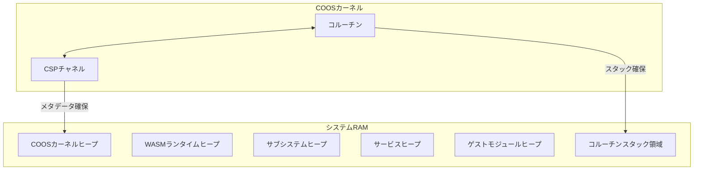

# アーキテクチャ

## システムレイヤー構成

- ゲストアプリケーション
  - ユーザー提供のWASMバイナリアプリケーション
- サービス (WASMプラグイン)
  - ユーザー提供のWASMサービス
- vSoC (Virtual System-on-Chip)
  - インタープリタ
  - MMIO
  - デバッガ
  - JITコンパイラ
- COOSカーネル
  - 協調的OSカーネル
- サブシステム
  - IPCルータ
  - HAL
  - ロギング
- デバイスドライバ
  - UART Driver, GPIO Driver, I2C Driver, Timer Driver 等
- ハードウェア
  - ARM Cortex-M/RISC-V/x86

## 協調型OS: COOS

COOSは最小限のカーネルで、コルーチンによる協調的マルチタスクとCSPチャネルによる通信を基盤とする。

### コルーチン

- C++20のスタックレスコルーチンを採用し (`{UseCpp20Coroutine}`)、コンテキストスイッチのオーバーヘッドを最小化する。 `{LowOverheadSwitch}`

### CSPチャネル

- CSPモデルを採用し、データ競合なく安全な通信を実現する。 `{CSPChannel}`
- `co_value` による排他的なデータ所有権移譲を行う。 `{OwnershipTransfer}`

### 割り込み連携アーキテクチャ

- **強制ウェイクアップ機構**
  - 割り込み発生時、HALはCOOSスケジューラに対し、関連するタスクの強制ウェイクアップを要求する。 `{InterruptWakeup}`
  - スケジューラは対象タスクを割り込み状態に遷移させ、次回の実行サイクルで優先的にスケジュールする。
- **割り込みハンドラ実行**
  - タスクが `INTERRUPTED` 状態から再開される際、通常のメイン処理ではなく、登録された「割り込みハンドラ」が実行される。
  - ハンドラはHALの割り込みフラグを確認し、必要なデータをタスク固有ヒープに書き込む。 `{TaskPollInterruptFlag}`

### 安全性と隔離

- タスクごとに独立したヒープ領域を割り当てる。 `{IndependentHeap}`
- メモリ使用量を厳密に制限し (`{StrictMemoryLimit}`)、障害を隔離する。 `{FaultIsolation}`

## IPCルータ

IPCルータはコンポーネント間の通信をURIベースのルーティングとアクセス制御で担う。vSoCとサブシステムはIPCルータに登録され、CSPチャネル経由で型付きKey-Valueプロトコルを用いたIPC通信を行う。

### ヒープパーティション

システムRAMを以下の6つの独立したヒープに分割する。

| パーティション名 | 目的 | 最小サイズ | 最大サイズ | メモリ確保失敗時の影響 |
|---|---|---|---|---|
| COOSカーネルヒープ | `co_sched`, `co_csp`, `co_mem`, `co_value`メタデータ | 2.0KB | 4.0KB | システムパニック |
| WASMランタイムヒープ | インタープリタ, モジュールローダ, 実行コンテキスト | 2.0KB | 8.0KB | システムパニック |
| サブシステムヒープ | IPCルータ, ロギング, HAL, デバッガ | 2.0KB | 8.0KB | IPC停止 + デバッグ喪失（機能継続） |
| Tier1サービスヒープ | その他サービス | 2.0KB | 8.0KB | サービスのみ終了 |
| ゲストモジュールヒープ | ゲストアプリケーション | 24KB | 残余 | ゲストのみ終了 |
| コルーチンスタック領域 | 8-16 コルーチンスタック（1KB/coro） | 8KB | 16KB | コルーチン数制限 |

各ヒープパーティションは、コンフィグファイルで定義されるマクロによってサイズが固定される。