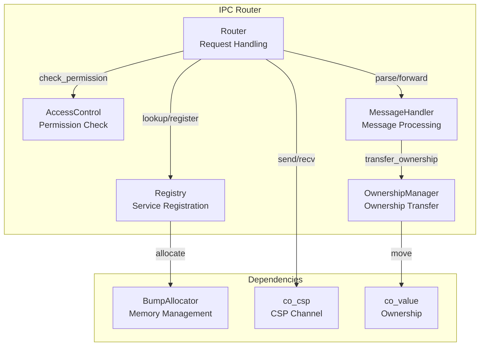
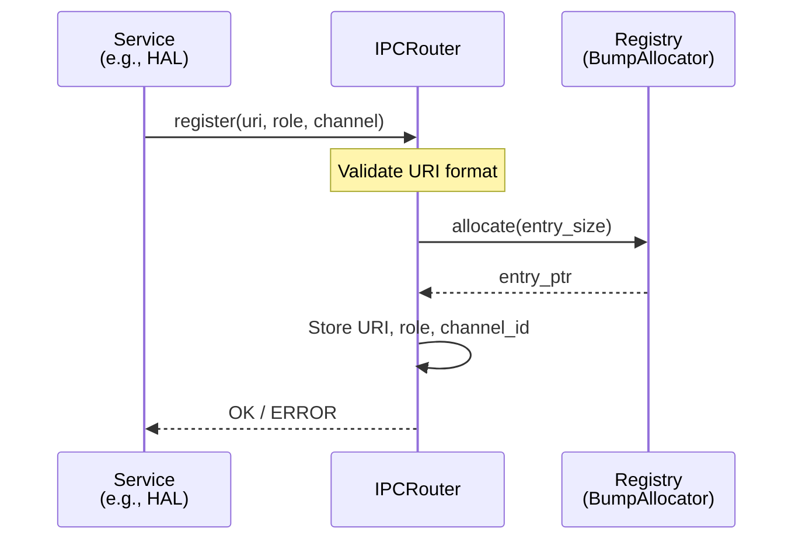
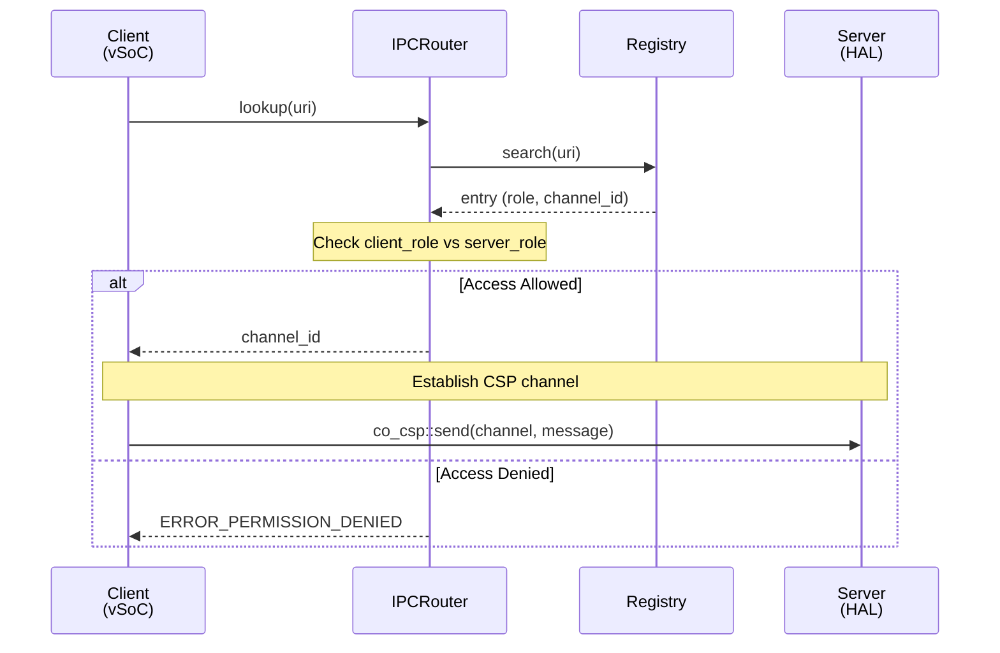
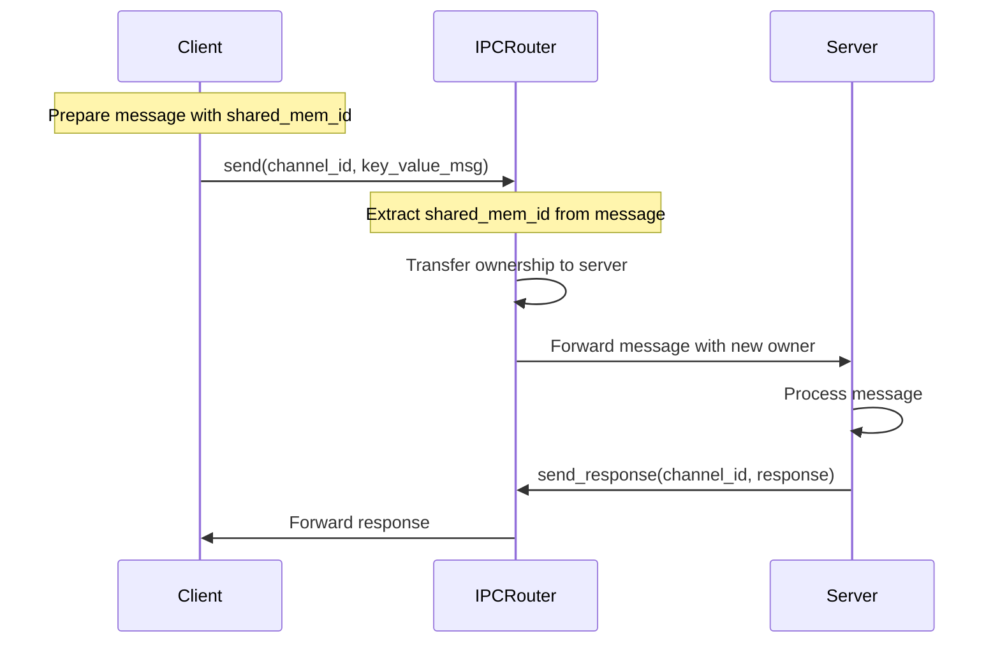

# IPCルータ

## コンセプト

IPCルータは、**URIベースのサービスディスカバリとロールベースのアクセス制御を備えたメッセージルーティング層**です。vSoC、HAL、ロギング、サービスなどのコンポーネント間の通信を仲介し、以下を実現します：

- **サービスディスカバリ**: URI形式（`fireball://<subsystem_id>/<stream>`）でサービスを検索。`{IPCRegistry}` `{ServiceDiscovery}`
- **アクセス制御**: ロールベースの認可（RBAC）により、通信許可/拒否を判定。`{RoleBasedAccessControl}`
- **型付きメッセージング**: Key-Valueプロトコルで型安全な通信を実現。`{TypeSafeMessaging}`
- **所有権管理**: 共有メモリの所有権をルータが管理し、安全なデータ移動を保証。`{OwnershipTransfer}`
- **依存性の注入 (DI)**: URIをインターフェイスとして扱い、実行時に具体的な実装（タスク）を紐付けることで、クリーンアーキテクチャにおけるDIコンテナの役割を果たす。 `{IPCDI}`

導出元：
- 要件: `{IPCRouter}` ([`docs/order/requires/list.md`](docs/order/requires/list.md) - システムコール、IPC経路管理) - システムコールはIPCで行われ、IPCの経路はIPCルータが管理する。
- アーキテクチャ: `{IPCRouter}` ([`docs/order/architecture/overview.md`](docs/order/architecture/overview.md) - URIベースルーティング、アクセス制御) - IPCルータはコンポーネント間の通信をURIベースのルーティングとアクセス制御で担う。
- 所有権管理: `{OwnershipTransfer}` ([`docs/order/architecture/overview.md`](docs/order/architecture/overview.md)) - `co_value` による排他的なデータ所有権移譲を行う。
- CSP通信: `{CSPCommunication}` ([`docs/order/requires/list.md`](docs/order/requires/list.md)) - COOSの並列処理の同期はホーアCSPで行う。

## 構成要素

IPCルータは以下の5つの構成要素で構成される。

### 1. Registry（レジストリ管理）

**責務**: URIベースのサービス登録・検索、チャンネルID・ロール情報の管理

**機能**:
- `register(uri, role, channel_id)`: サービスをURIで登録
- `lookup(uri)`: URIからサービス情報を検索
- `search(uri_pattern)`: パターンマッチングによる検索

**実装方式**:
- バンプアロケータで管理されるエントリ配列
- URIハッシュテーブルで O(1) 検索を実現
- エントリ構造: `{uri, role, channel_id, timestamp}`

**導出元**: `{IPCRegistry}` - IPCルータで接続する必要があるサブシステム、サービスは起動時にルータに自分のURIをレジストリに登録する。

### 2. AccessControl（アクセス制御）

**責務**: ロール定義の管理、クライアント・サーバ間の通信許可判定

**機能**:
- `check_permission(client_role, server_role)`: 通信許可判定
- `get_role(task_id)`: タスクのロール取得
- `validate_role(role)`: ロール値の妥当性検証

**実装方式**:
- 静的定義されたロール定義マトリックス（コンフィグファイル）
- 実行時チェックで許可判定を実施
- ロール定義は変更不可（イミュータブル）

**導出元**: `{RoleBasedAccessControl}` - グローバルなロールの定義はタスクから変更することはできない。

### 3. Router（ルーティング）

**責務**: クライアント要求の処理、サービス検索と接続の仲介

**機能**:
- `lookup(uri)`: クライアントのサービス検索要求を処理
- `route_message(channel_id, message)`: メッセージをサーバに転送
- `handle_request(client_id, request)`: クライアント要求の処理

**実装方式**:
- Registry と AccessControl を組み合わせて動作
- CSPチャネル経由でクライアント・サーバと通信
- エラーハンドリング（`ERROR_NOT_FOUND`, `ERROR_PERMISSION_DENIED` 等）

**導出元**: `{ServiceDiscovery}` `{RoleBasedAccessControl}` - クライアントはサーバのIDをURIを用いてIPCルータに問い合わせ、ルータが通信の許可、拒否の判定を行う。

### 4. MessageHandler（メッセージ処理）

**責務**: Key-Valueメッセージの解析、検証、転送

**機能**:
- `parse_message(raw_data)`: メッセージをパース
- `validate_message(message)`: メッセージ形式の検証
- `forward_message(target_channel, message)`: メッセージを転送
- `sort_keys(message)`: ソート済み配列インデックスを付加

**実装方式**:
- Key-Value値の型・スコープ検証
- 共有メモリIDの抽出と検証
- ソート済み配列インデックスの自動付加（stdlib.md に準じたアルゴリズム）

**導出元**: `{TypeSafeMessaging}` `{MessageRouting}` - Key-Valueプロトコルで型安全な通信を実現し、メッセージをサーバに転送する。

### 5. OwnershipManager（所有権管理）

**責務**: 共有メモリの所有権移譲、メモリ安全性の保証

**機能**:
- `transfer_ownership(shared_mem_id, from_task, to_task)`: 所有権を移譲
- `validate_ownership(shared_mem_id, task_id)`: 所有権の妥当性検証
- `cleanup_ownership(task_id)`: タスク終了時の所有権クリーンアップ

**実装方式**:
- `co_value` による排他的所有権管理
- メッセージ内の共有メモリIDを検出し、所有権を自動移譲
- データ競合を原理的に排除

**導出元**: `{OwnershipTransfer}` `{EliminateDataRace}` - 共有メモリには所有権が設定されているため、ルータが所有権を適切にサーバに渡す。

### 構成要素間の依存関係

**導出元**: [`docs/order/architecture/overview.md`](docs/order/architecture/overview.md) - IPCルータはコンポーネント間の通信をURIベースのルーティングとアクセス制御で担う。

## 提供する機能

| 機能 | 説明 | 導出元 |
|------|------|--------|
| **サービス登録** | コンポーネントがURIをレジストリに登録。`{IPCRegistry}` | [`docs/order/components/router.md`](docs/order/components/router.md) - IPCレジストリ |
| **サービス検索** | クライアントがURIからサーバのチャンネルIDを取得。`{ServiceDiscovery}` | [`docs/order/components/router.md`](docs/order/components/router.md) - ルータの通信プロトコル |
| **アクセス制御** | ロールに基づいて通信を許可/拒否。`{RoleBasedAccessControl}` | [`docs/order/components/router.md`](docs/order/components/router.md) - 通信の許可と拒否 |
| **メッセージルーティング** | Key-Valueメッセージをサーバに転送。`{MessageRouting}` | [`docs/order/components/router.md`](docs/order/components/router.md) - メッセージ形式 |
| **所有権移譲** | 共有メモリの所有権をクライアントからサーバに移譲。`{OwnershipTransfer}` | [`docs/order/architecture/overview.md`](docs/order/architecture/overview.md) - OwnershipTransfer |
| **辞書参照IPC** | constexprで定義された辞書を用いた効率的なキー参照。`{DictionaryBasedIPC}` | [`docs/order/components/router.md`](docs/order/components/router.md) - 辞書参照IPC |

## インターフェイス

### ルータの通信プロトコル

1. IPCルータはvSoCとサブシステム間の通信に用いられる。
2. クライアントはチャンネルIDをURIを用いてIPCルータに要求する。
  - URIは`fireball://<subsystem_id>/<stream>`形式。
3. IPCルータが通信の許可、拒否の判定を行い、許可であればチャンネルIDを返却する。
4. クライアントはサーバのチャンネルIDを用いてco_cspで通信を行う。

### メッセージ形式

- 一度に64ビットのKey-Value値を32個送ることができる。
- Key-Value値の内容は下記のとおりである。
  - 型およびスコープ (1 バイト)：上位 3 ビットで Scopeスコープ、下位 5 ビットでデータ型を表す。  
  - Key (3 バイト): スコープにより解釈が変わる。
  - Value (4 バイト): 32bitのデータ、ハンドル、または小さな即値。
- ソート済み配列インデックス
  - ルータが自動的に付加する。
  - アルゴリズムは @docs/order/patterns/stdlib.mdを参照すること。

### スコープ

- 機能的IPC
  - 値に対するキーとして機能する。  
- 辞書参照IPC
  - Keyは受信側が持つ辞書の文字列オフセットを示す。辞書にはNULL文字で連結された文字列が複数登録されている。

### データ型

- 符号付き整数: 32bit符号付き整数
- 符号なし整数: 32bit符号なし整数
- 単精度浮動小数点: 32bit浮動小数点
- 共有メモリID: メッセージで送ることができない大きなデータを渡すときはCOOSの共有メモリを使う。
  - 共有メモリには所有権が設定されているため、ルータが所有権を適切にサーバに渡す。

### 通信の許可と拒否

- 各タスクはシステムグローバルで定義されたロールを持つ。
- サーバのロールに接続許可するクライアントのロールはグローバルに定義されている。
- グローバルなロールの定義はタスクから変更することはできない。

## 機能制約達成のための方策

### IPCレジストリ

- IPCルータで接続する必要があるサブシステム、サービスは起動時にルータに自分のURIをレジストリに登録する。
- IPCルータのシャットダウン以外でレジストリのエントリが削除されることはない。レジストリは @docs/order/patterns/stdlib.md に準じ、バンプアロケータを用いる。

### 辞書参照IPC

- 辞書はconstexprの関数で定義される。
- 辞書のオフセットもconstexprの関数で定義され、送受信双方でヘッダファイルで共有される。

### サービス登録フロー

**導出元**: `{IPCRegistry}` - IPCルータで接続する必要があるサブシステム、サービスは起動時にルータに自分のURIをレジストリに登録する。

### サービス検索と接続フロー

**導出元**: `{ServiceDiscovery}` `{RoleBasedAccessControl}` `{CSPCommunication}` - クライアントはサーバのIDをURIを用いてIPCルータに問い合わせ、ルータが通信の許可、拒否の判定を行う。CSPチャネル経由で通信を行う。

### メッセージ送受信フロー（共有メモリ付き）

**導出元**: `{OwnershipTransfer}` `{MessageRouting}` `{EliminateDataRace}` - 共有メモリには所有権が設定されているため、ルータが所有権を適切にサーバに渡す。タスク間のデータ共有は所有権の移譲を伴うメッセージパッシングによって行い、データ競合を原理的に排除する。

## 非機能制約達成のための方策

### アクセス制御マトリックス

| クライアント | vSoC | HAL | Logging | Service |
|-------------|------|-----|---------|---------|
| **vSoC** | ✓ | ✓ | ✓ | ✓ |
| **HAL** | ✓ | ✗ | ✓ | ✗ |
| **Logging** | ✗ | ✗ | ✗ | ✗ |
| **Service** | ✗ | ✗ | ✓ | ✗ |

**導出元**: [`docs/order/components/router.md`](docs/order/components/router.md) - ロール定義（vSoC、HAL、ロギング）

### アクセス制御の実装方式

- **静的定義**: コンフィグファイルで許可マトリックスを定義。`{StaticRoleDefinition}` `{ConfigurableSystem}`
- **実行時チェック**: ルータが `lookup()` 時に許可判定を実施。`{RuntimeAccessControl}`
- **変更不可**: タスク実行中にロール定義を変更することはできない。`{ImmutableRoleDefinition}`

**導出元**: `{RoleBasedAccessControl}` - グローバルなロールの定義はタスクから変更することはできない。`{ConfigurableSystem}` ([`docs/order/requires/list.md`](docs/order/requires/list.md)) - ヘッダファイル形式のコンフィグファイルを定義しその中のマクロで容量などは固定する。

### 性能制約と方策

| 制約 | 方策 | 導出元 |
|------|------|--------|
| **低レイテンシ** | URIハッシュテーブルで O(1) 検索、バンプアロケータで高速登録。`{LowLatencyLookup}` | [`docs/order/architecture/overview.md`](docs/order/architecture/overview.md) - LowOverheadSwitch |
| **メモリ効率** | レジストリはバンプアロケータで管理、シャットダウン時に一括解放。`{EfficientMemoryManagement}` | [`docs/order/components/router.md`](docs/order/components/router.md) - バンプアロケータ使用 |
| **スケーラビリティ** | 最大サービス数をコンフィグで固定、静的メモリ割り当て。`{StaticScalability}` | [`docs/order/requires/list.md`](docs/order/requires/list.md) - ヘッダファイル形式のコンフィグ |

### メモリ制約と方策

| 制約 | 方策 | 導出元 |
|------|------|--------|
| **ヒープ枯渇対応** | バンプアロケータの枯渇時は `ERROR_OUT_OF_MEMORY` を返却。`{OutOfMemoryHandling}` | [`docs/order/architecture/overview.md`](docs/order/architecture/overview.md) - MemoryIsolation |
| **メモリ隔離** | ルータのメモリはサブシステムヒープから確保、他タスクに影響なし。`{MemoryIsolation}` `{FaultIsolation}` | [`docs/order/architecture/overview.md`](docs/order/architecture/overview.md) - IndependentHeap、FaultIsolation |

### 安全性制約と方策

| 制約 | 方策 | 導出元 |
|------|------|--------|
| **アクセス制御** | ロールベースの認可で不正アクセスを防止。`{RoleBasedAccessControl}` | [`docs/order/components/router.md`](docs/order/components/router.md) - 通信の許可と拒否 |
| **所有権管理** | `co_value` で共有メモリの所有権を厳密に管理。`{OwnershipTransfer}` `{EliminateDataRace}` | [`docs/order/architecture/overview.md`](docs/order/architecture/overview.md) - OwnershipTransfer、[`docs/order/requires/list.md`](docs/order/requires/list.md) - EliminateDataRace |
| **URI検証** | 登録時にURI形式を検証、不正なURIを拒否。`{URIValidation}` | [`docs/order/components/router.md`](docs/order/components/router.md) - URIは`fireball://<subsystem_id>/<stream>`形式 |
| **レジストリ整合性** | シャットダウン以外でエントリ削除なし、一貫性を保証。`{RegistryConsistency}` | [`docs/order/components/router.md`](docs/order/components/router.md) - IPCルータのシャットダウン以外でレジストリのエントリが削除されることはない |
