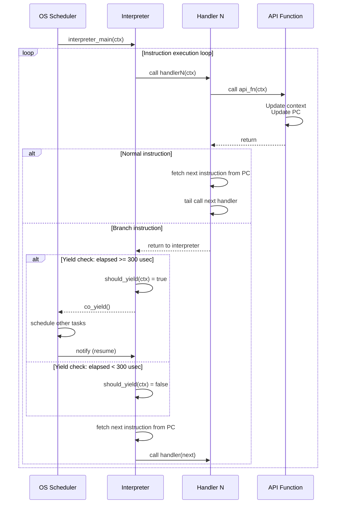

# ランタイム

## 概要

wasmローダ、インタープリタとランタイムAPIで構成される。

- wasmランタイムはwasmゲストと一対一で実行される。
  - wasmゲストごとにプロセスが立ち上がるイメージである。
- wasmローダはwasm32バイナリ以外はロードする必要はない。
- インタープリタは実行状態を保持する実行コンテキストを持つ。

実装すべき最小セットの命令・ランタイムAPI仕様は、clangが出力するwasm32のバイナリ仕様から導出し、別途リスト化する。

## wasmローダ

wasmバイナリをパースする。

- ひとつのランタイムに複数のwasmモジュールがロードできる。
- ハイパーバイザ組み込みのwasmモジュールをサービス (@docs/order/components/services.md)と呼ぶ。
- wasmバイナリはRAMに展開しない。ROM上でパースし、アクセスを効率化するための辞書を持つ。
- wasmバイナリの正当性を検証するベリファイアは簡易的なものにする。
- ローダで使用するメモリはモジュールが破棄されるまで解放されないのでバンプアロケータ (＠docs/order/patterns/stdlib.md) でメモリを確保する。

## ランタイムAPI

ランタイムAPIはwasm命令の抽象化を行わない。ランタイムの性能のポイントはインタープリタではなく最適化されたランタイムAPIにある。

- ランタイムAPIの機能は原則としてwasm命令と一対一で対応する。
- インタープリタでは算術演算命令以外は実行コンテキストを引数にランタイムAPIを呼び出すだけである。
- ランタイムAPIの関数の型はJITコンパイラの簡略化のためすべて同一である。

## インタープリタ

インタープリタはwasmバイナリを実行する。

- ハンドラを継続渡しで連鎖させるスレッドインタープリタとする。 `{ThreadedInterpreter}`
  - ハンドラではランタイムAPIをインライン展開して呼び出す。
  - ジャンプ、分岐命令は継続渡しをせずインタープリタに戻ってくる。
  - この仕組みでトレース単位で継続渡しでwasm命令が連続実行される。
- デバッガが動いている場合はテーブルのジャンプ先を入れ替える。 `{DebuggerLabelTableSwitch}`
- ジャンプ命令や関数呼び出し時にwasmゲストの連続実行時間が300usecを超えていた場合、co_yieldし、別のタスクに制御を渡す。 `{YieldOnTimeLimit}`
  - 30msecを計測するのにはタイマを用いず, 実行したトレースの数で超概算する。
  - トレースの平均実行時間を10usecとした場合、300msecは30000トレースを意味する。
- ジャンプ命令や関数呼び出し時にHALから割り込みフラグが立てられていた場合、さらに割り込み要因をチェックし、wasmゲストの割り込み処理を行う。 `{InterruptCheckOnBranch}`
- インタープリタの実行状態はコンテキスト構造体に保持され、PIC対応のJITコードと共有される。 `{InterpreterContextManagement}`
- 将来的なJITコンパイラの出力バイナリをPICとするため、インタープリタからアクセスする情報はコンテキストに集約する。

## 付録A: サポートするWASM命令セット

各命令は実装すべき最小セットとして選定されている。

### 制御フロー命令

プログラムの実行フローを制御する命令。

| 命令 | オペランド | 説明 |
|------|-----------|------|
| `block` | blocktype | ブロック開始 |
| `loop` | blocktype | ループ開始 |
| `if` | blocktype | 条件分岐開始 |
| `else` | - | else分岐 |
| `end` | - | ブロック/ループ/if終了 |
| `br` | labelidx | 無条件分岐 |
| `br_if` | labelidx | 条件付き分岐 |
| `br_table` | vec(labelidx), labelidx | テーブル分岐 |
| `return` | - | 関数から戻る |
| `call` | funcidx | 関数呼び出し |
| `call_indirect` | typeidx, tableidx | 間接関数呼び出し |

### メモリ命令

メモリへのアクセスを行う命令。

| 命令 | オペランド | 説明 |
|------|-----------|------|
| `i32.load` | memarg | メモリからi32をロード |
| `i32.load8_s` | memarg | メモリからi32をロード（符号拡張） |
| `i32.load8_u` | memarg | メモリからi32をロード（ゼロ拡張） |
| `i32.load16_s` | memarg | メモリからi32をロード（符号拡張） |
| `i32.load16_u` | memarg | メモリからi32をロード（ゼロ拡張） |
| `i32.store` | memarg | メモリにi32をストア |
| `i32.store8` | memarg | メモリにi32をストア（下位8ビット） |
| `i32.store16` | memarg | メモリにi32をストア（下位16ビット） |
| `memory.size` | - | メモリサイズを取得 |
| `memory.grow` | - | メモリを拡張 |

### 算術演算命令

整数演算を行う命令。

| 命令 | オペランド | 説明 |
|------|-----------|------|
| `i32.const` | i32 | 定数をプッシュ |
| `i32.add` | - | 加算 |
| `i32.sub` | - | 減算 |
| `i32.mul` | - | 乗算 |
| `i32.div_s` | - | 符号付き除算 |
| `i32.div_u` | - | 符号なし除算 |
| `i32.rem_s` | - | 符号付き剰余 |
| `i32.rem_u` | - | 符号なし剰余 |
| `i32.and` | - | ビット論理積 |
| `i32.or` | - | ビット論理和 |
| `i32.xor` | - | ビット排他的論理和 |
| `i32.shl` | - | 左シフト |
| `i32.shr_s` | - | 算術右シフト |
| `i32.shr_u` | - | 論理右シフト |
| `i32.rotl` | - | 左ローテート |
| `i32.rotr` | - | 右ローテート |

### 比較命令

値の比較を行う命令。

| 命令 | オペランド | 説明 |
|------|-----------|------|
| `i32.eqz` | - | ゼロ比較 |
| `i32.eq` | - | 等値比較 |
| `i32.ne` | - | 不等値比較 |
| `i32.lt_s` | - | 符号付き小なり比較 |
| `i32.lt_u` | - | 符号なし小なり比較 |
| `i32.le_s` | - | 符号付き小なり等しい比較 |
| `i32.le_u` | - | 符号なし小なり等しい比較 |
| `i32.gt_s` | - | 符号付き大なり比較 |
| `i32.gt_u` | - | 符号なし大なり比較 |
| `i32.ge_s` | - | 符号付き大なり等しい比較 |
| `i32.ge_u` | - | 符号なし大なり等しい比較 |

### スタック操作命令

スタック上の値を操作する命令。

| 命令 | オペランド | 説明 |
|------|-----------|------|
| `drop` | - | スタックトップを削除 |
| `select` | - | 条件付き選択 |
| `local.get` | localidx | ローカル変数を取得 |
| `local.set` | localidx | ローカル変数を設定 |
| `local.tee` | localidx | ローカル変数を設定（値を保持） |
| `global.get` | globalidx | グローバル変数を取得 |
| `global.set` | globalidx | グローバル変数を設定 |

### その他の命令

| 命令 | オペランド | 説明 |
|------|-----------|------|
| `unreachable` | - | 到達不可能 |
| `nop` | - | 何もしない |
