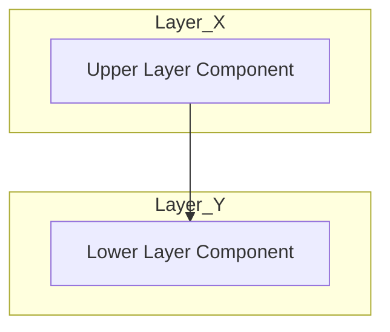
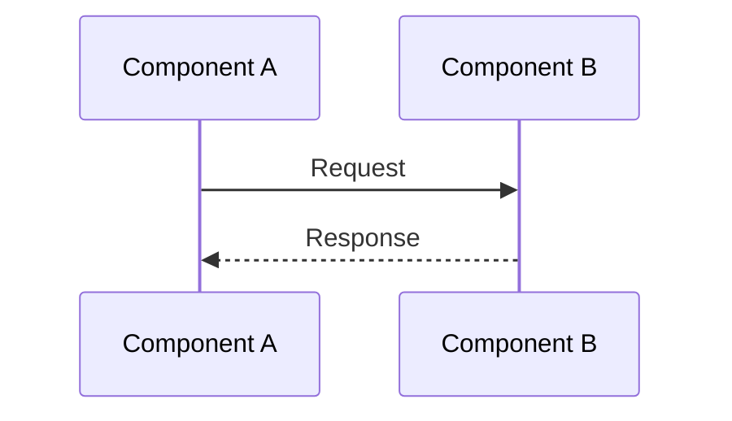

# アーキテクチャ設計フォーマット

このドキュメントは、システム全体の構造、主要なコンポーネント間の関係、および設計上の重要な決定事項を定義するための標準フォーマットである。

## 1. アーキテクチャコンセプト
システム全体を貫く設計思想（例：クリーンアーキテクチャ、DI、協調型マルチタスク）を記述する。

## 2. 静的構造 (Static Model)
システムの静的な構成要素とその依存関係を記述する。

ブロック図（俯瞰図）における矢印は、原則として**仕様の依存関係 (Dependency)** を示すものとする。

### 2.1 レイヤー構成
システムを構成する論理的な階層構造を定義する。

| レイヤー | 構成要素 | 説明 |
| :--- | :--- | :--- |
| **Layer Name** | Component A, B | レイヤーの役割と責務 |

### 2.2 コンポーネント俯瞰図
主要なコンポーネント間の接続関係をMermaid記法で記述する。
クリーンアーキテクチャ等の設計原則に基づき、依存関係の向き（矢印）が上位レイヤー（抽象）から下位レイヤー（詳細）に向かっていないことを確認できるように記述すること。

## 3. 動的構造 (Dynamic Model)
レイヤーやコンポーネントを跨ぐ主要な振る舞いを記述する。

### 3.1 主要シーケンス
システム全体の重要なユースケース（例：起動、タスク切り替え、IPC通信）の流れをMermaid記法で記述する。

## 4. 設計判断 (ADR: Architecture Decision Records)
なぜそのアーキテクチャを選択したか、どのようなトレードオフを考慮したかの記録。

- **決定事項**: `{Decision_Key}`
- **背景**: 解決すべき課題。
- **選択肢と評価**: 検討した他の案とそのメリット・デメリット。
- **結論**: 採用した案とその理由。

## 5. 設計完了チェックリスト（網羅性確認）
アーキテクチャ設計が完了したとみなすためのチェックリスト。

- [ ] システムレイヤー構成が定義され、各レイヤーの責務が明確か
- [ ] コンポーネント間の依存方向がアーキテクチャ原則（例：クリーンアーキテクチャ）に従っているか
- [ ] 主要な動的振る舞い（シーケンス）が定義されているか
- [ ] 重要な設計上のトレードオフ（性能 vs メモリ等）が ADR として記録されているか
- [ ] 共通ポリシー（エラー、メモリ、ログ）が定義されているか

## 6. 共通ポリシー
システム全体で統一すべきルール（エラーハンドリング、メモリ確保、ロギング等）。
