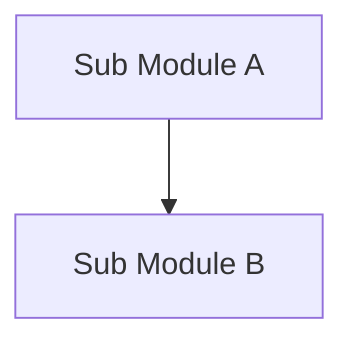
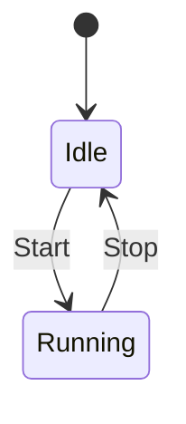
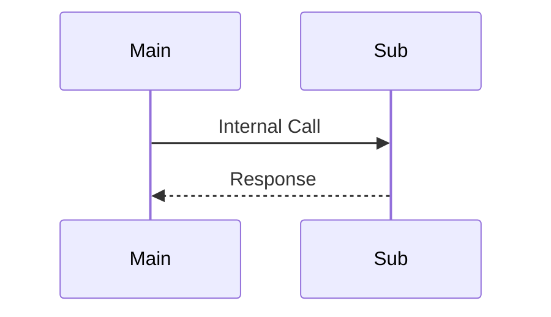

# コンポーネント設計フォーマット

このドキュメントは、個別のコンポーネント（vSoC, COOS, HAL等）の詳細仕様を定義するための標準フォーマットである。

## 1. コンセプト
コンポーネントの存在意義、主要な責務、および設計の核心となる考え方を記述する。

## 2. 静的モデル
コンポーネントの内部構造、アルゴリズム、およびデータ構造を記述する。

### 2.1 データ構造
主要なデータ構造（例：キュー、ツリー、ハッシュテーブル）とその選択理由を記述する。

### 2.2 内部ブロック図
内部モジュール間の関係をMermaid記法で記述する。

### 2.3 主要な構造体・クラス・定数
重要なデータ構造や定数を定義する。想定されるメンバ、ビットフィールド、定数を記述すること。

構造体・クラス・定数群ごとに独立したセクションを設け、以下の形式でテーブルを作成する。

#### `name_t` (対象名)
対象の役割と、データ構造の全体像（どのようなフィールドで構成され、どのようにメモリ上に配置されるか等）を文章で詳細に記述すること。

| メンバ名 | 型 | 説明 |
| :--- | :--- | :--- |
| `id` | `uint32_t` | オブジェクトを一意に識別するID |
| `flags` | `uint8_t` | 状態フラグ（bit0: 有効, bit1: 読み取り専用） |
| `buffer_ptr` | `void*` | データバッファへのポインタ |
| `buffer_size` | `size_t` | バッファの有効サイズ |

## 3. 動的モデル
コンポーネント内部の振る舞いや状態遷移を記述する。

### 3.1 アルゴリズム
主要な処理のアルゴリズム（例：スケジューリングアルゴリズム、JITコンパイル手順）を記述する。フローチャートや擬似コードを用いて詳細に記述すること。

### 3.2 状態遷移図
コンポーネントが持つ状態とその遷移条件をMermaid記法で記述する。

### 3.3 内部シーケンス
複雑な内部処理の流れをMermaid記法で記述する。

## 4. インターフェイス定義
外部から利用可能なAPIを定義する。メソッド名は英語で記述すること。

### 4.1 公開API
| メソッド名 | 引数 | 戻り値 | 説明 | 事前条件 | 事後条件 |
| :--- | :--- | :--- | :--- | :--- | :--- |
| `initialize` | `config_t*` | `status_t` | 初期化を行う | なし | 状態がReadyになる |

### 4.2 URI/IPCインターフェイス
IPCルータ経由で公開されるインターフェイス。

- **URI**: `fireball://component_name/service/instance_id`
- **メッセージ形式**: Key-Valueプロトコルの詳細定義。ビット配置や型情報を省略せずに記述すること。

## 5. 制約達成の方策
要求仕様で定義された制約を、どのように具体化して達成するかを記述する。

### 5.1 性能制約と方策
- **目標**: 具体的な数値目標。
- **方策**: `{Strategy_Key}` 具体的な実装手法。

### 5.2 メモリ制約と方策
- **目標**: 具体的な数値目標（RAM/ROM）。
- **方策**: `{Strategy_Key}` 具体的な実装手法。

### 5.3 安全性制約と方策
- **目標**: 具体的な安全目標。
- **方策**: `{Strategy_Key}` 具体的な実装手法。

## 6. 設計完了チェックリスト（網羅性確認）
- [ ] コンポーネントの責務が明確に定義されているか
- [ ] 内部設計（データ構造、ブロック図、クラス、アルゴリズム）が適切に定義されているか
- [ ] 内部ブロック図（静的）とシーケンス/状態遷移図（動的）がセットで定義されているか
- [ ] 公開APIのメソッド名が英語で記述され、事前/事後条件が明確か
- [ ] 非機能制約（性能、メモリ、安全性）に対する具体的な方策が明示されているか
- [ ] 設計の交差点（トレードオフ）が解消されているか
- [ ] 上位の要求 `{Keyword}` とのトレーサビリティが確保されているか
