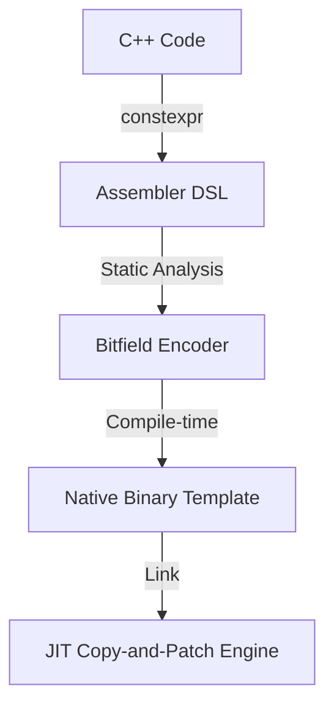

# コンポーネント設計：constexpr Assembler

## 1. コンセプト
constexpr Assembler は、C++のコンパイル時計算（`constexpr`）機能を活用し、ターゲットアーキテクチャの命令バイナリを型安全かつ効率的に生成するための DSL (Domain Specific Language) である。手動でのビット演算による命令生成を排除し、ビルド時に命令テンプレートを確定させることで、実行時のJITオーバーヘッドを「ゼロ」に近づけるとともに、不正なレジスタ指定や即値溢れをコンパイル時に検知する。 `{JIT_Encoder}` `{Static_Resolution}`

## 2. 静的モデル

### 2.1 データ構造
- **Instruction Format Structs**: R/I/S/B/U/J などの命令形式ごとにビットフィールドを定義した構造体。
- **Type-safe Enums**: 物理レジスタ (`reg::a0`, `reg::s1` 等) や命令コード (`opcode::load` 等) を型として定義。

### 2.2 内部ブロック図

### 2.3 主要なクラス・構造体・配列・定数

#### `rv32::i_type` (RISC-V I-type 形式：例)
即値演算やロード命令に使用される形式。

| 構成項目 | 機能と役割 | 備考 |
| :--- | :--- | :--- |
| `opcode` | 基本命令種別 (7 bit) | `field.opcode` |
| `rd` | ターゲットレジスタ (5 bit) | `field.rd` |
| `funct3` | 詳細演算定義 (3 bit) | `field.funct3` |
| `rs1` | ソースレジスタ (5 bit) | `field.rs1` |
| `imm11_0` | 即値 (12 bit) | `field.imm11_0` |

#### `v8m::add_imm` (ARMv8M Thumb-2 算術即値形式：例)
`ADD`, `SUB` などの即値演算（32ビット命令）で使用される形式。

| 構成項目 | 機能と役割 | 備考 |
| :--- | :--- | :--- |
| `opcode` | 命令および修飾子 (e.g. `0xF100`) | 16 bit |
| `rd` | ターゲットレジスタ (4 bit) | `field.rd` |
| `rn` | ソースレジスタ (4 bit) | `field.rn` |
| `imm12` | 分散配置された12ビット即値 | `field.i:field.imm3:field.imm8` |
| `S` | 状態フラグ更新ビット (1 bit) | `field.S` |

#### `x64::mov_ri` (x64 MOV 形式：例)
レジスタへの即値代入命令。x64では32ビット即値を直接埋め込めるため、RISC-V/ARMのようなリテラルプール（PC相対ロード）を介さずに定数をパッチ可能。

| 構成項目 | 機能と役割 | 備考 |
| :--- | :--- | :--- |
| `opcode` | 基本命令コード (`0xB8 + reg`) | 1 byte |
| `imm32` | 32ビット即値 (直接パッチ可能) | 4 bytes, Little Endian |
| `rex_w` | 64ビット拡張プレフィックス | 1 byte (Optional) |

## 3. 動的モデル

### 3.1 アルゴリズム

#### コンパイル時エンコード
1. プログラマが `constexpr` 関数や構造体として命令を記述する。
2. C++コンパイラがビットフィールドの詰め込み（Pack）を処理する。
3. `static_assert` により、即値が12ビットを超えていないか、レジスタ番号が有効か等がチェックされる。
4. 最終的な `uint32_t` のバイナリ値がソースコード内の定数として埋め込まれる。

### 3.2 状態遷移図
本コンポーネントはビルド時に完結するため、実行時の状態遷移は存在しない。

## 4. インターフェイス定義

### 4.1 公開API (C++ DSL)

#### Instruction Constructor
| 項目 | 内容 |
| :--- | :--- |
| 機能概要 | 命令を構築する。 |
| 引数と役割 | `op`, `rd`, `rs1`, `imm` 等 |
| 備考 | `constexpr` 修飾されており、定数式として評価可能。 |

## 5. 制約達成の方策

### 5.1 性能制約
- **方策**: `{Static_Resolution}` により、実行時のデコード・エンコード時間を完全に排除し、Copy-and-Patch 時は単なる `memcpy` 相当の処理を実現する。

### 5.2 安全性制約
- **方策**: C++の型システムと `static_assert` を利用し、アセンブラレベルのバグ（誤ったレジスタ使用等）を開発段階で完全に排除する。

## 6. 設計完了チェックリスト
- [x] constexpr を使った静的な命令生成の仕組みが記述されているか
- [x] ビットフィールドを用いたエンコード方法が具体例と共に示されているか
- [x] 要求キーワード `{JIT_Encoder}` `{Static_Resolution}` に紐づいているか
- [x] 手動エンコードと比較した安全性と性能の優位性が明確か
- [x] 生成されるテンプレートのアライメントが、JITオフセットのビットシフト仕様と整合しているか
