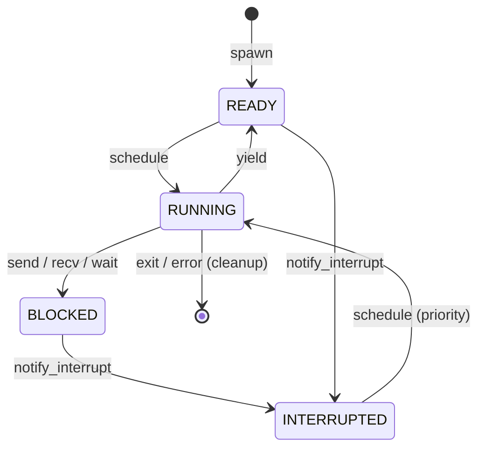
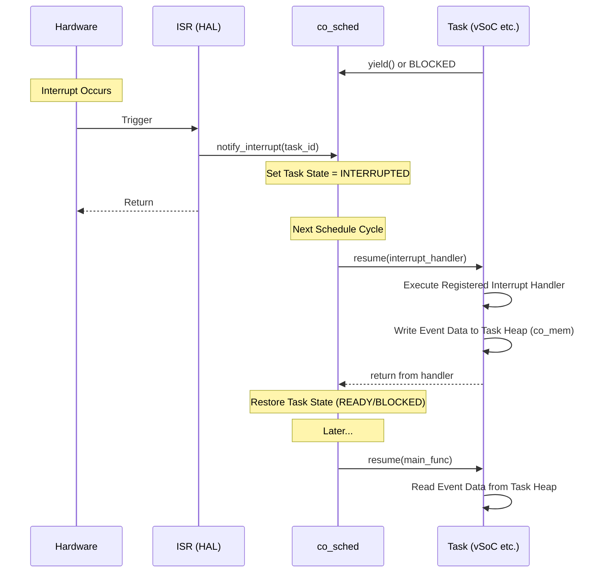

# 協調型OS COOS

## コンセプト

COOSは、シングルスレッド環境向けのホーアCSPベースのグリーンスレッドOSである。

- **協調的マルチタスク**: コルーチンを用いて実装され、タスクが自ら制御を譲ることで並行性を実現する。 `{CooperativeMultitasking}`
- **CSPベースの同期**: タスク間通信および同期はホーアのCSPモデルに基づき、共有メモリではなくメッセージパッシング（所有権移譲）で行う。 `{CSPCommunication}`
- **ハードウェア非依存**: カーネルは特定のハードウェア機能（サイクルカウンタ等）に依存せず、抽象化されたインターフェイスのみを使用する。 `{NotRTOS}`

## 構成要素

### co_sched
- タスク管理とラウンドロビンスケジューリングを担う。
- タスクごとに「メイン処理」と「割り込みハンドラ」の2つのエントリポイントを管理する。
- 割り込み発生時にタスクを `INTERRUPTED` 状態に遷移させ、優先的に割り込みハンドラを実行する。

### co_csp
- ホーアCSPに基づく同期オブジェクト。
- 通信バッファは1エントリのみのブロッキングI/O。

### co_mem
- タスクごとのスタック（コルーチンフレーム）およびヒープを管理。
- `new`/`delete`のポリシーをオーバーライドし、タスク固有のヒープから確保する。

### co_value
- 所有権（Ownership）を管理するスマートポインタ。
- ムーブセマンティクスにより、タスク間での安全なデータ移動を実現する。
- 必ずCOOSヒープから確保される。

## 提供する機能

- **タスクスケジューリング**: ラウンドロビン方式によるタスク実行管理。`READY`, `RUNNING`, `BLOCKED`, `INTERRUPTED` の状態を持つ。 `{TaskScheduling}`
- **CSPチャネル通信**: 型安全なメッセージパッシング。1エントリのバッファを持つブロッキング通信。 `{CSPChannel}`
- **メモリ隔離管理**: タスクごとの独立したヒープ領域の提供。タスク終了時に自動的に回収される。 `{MemoryIsolation}`
- **所有権管理**: `co_value`によるメモリブロックの排他的所有権移譲。RAIIによる自動解放を保証する。 `{OwnershipTransfer}`

## 割り込み連携

- **強制ウェイクアップ**: HALから割り込み通知を受け、関連タスクを `INTERRUPTED` 状態に遷移させる。 `{InterruptWakeup}`
- **割り込みハンドラ実行**: タスクが `INTERRUPTED` 状態から再開される際、通常のメイン処理ではなく登録された割り込みハンドラが実行される。 `{TaskPollInterruptFlag}`

## インターフェイス

### `co_sched` (スケジューラ)
- `spawn(main_func, interrupt_handler, heap_size)`: 新しいタスクを生成する。
- `yield()`: 現在のタスクの実行を中断し、スケジューラに制御を戻す。
- `exit()`: 現在のタスクを終了し、リソースを回収する。
- `notify_interrupt(task_id)`: 指定したタスクを `INTERRUPTED` 状態にする。

### `co_csp` (通信チャネル)
- `create_channel<T>()`: 型 `T` を扱うチャネルを生成する。
- `send(channel, co_value<T>&&)`: チャネルに値を送信する（ブロッキング）。
- `recv(channel)`: チャネルから値を受信する（ブロッキング）。

### `co_mem` (メモリ管理)
- `malloc(size)`: 現在のタスクのヒープからメモリを確保する。
- `free(ptr)`: メモリを解放する。
- `stats()`: 現在のタスクのメモリ使用状況を取得する。

### `co_value` (所有権管理)
- `make_value<T>(args...)`: 所有権管理された値を生成する。
- `move(value)`: 所有権を明示的に移譲する。

## 機能制約達成のための方策

- **C++20コルーチンの活用**: スタックレスコルーチンを用いてタスクを実装し、メモリ消費を抑える。 `{UseCpp20Coroutine}`
- **独立ヒープ**: `dlmalloc`をベースに、タスクごとに隔離されたメモリプールを割り当てる。 `{IndependentHeap}`

## 非機能制約達成のための方策

### 性能制約と方策
- **低オーバーヘッドなコンテキストスイッチ**: スタックレスコルーチンの採用により、レジスタ退避を最小限にする。 `{LowOverheadSwitch}`

### メモリ制約と方策
- **厳密なメモリ制限**: タスク起動時に指定されたサイズ以上のメモリ確保を禁止し、障害を隔離する。 `{StrictMemoryLimit}`

### 安全性制約と方策
- **データ競合の排除**: CSPモデルと所有権管理により、ミューテックスなしで安全なデータ共有を実現する。 `{EliminateDataRace}`
- **障害隔離**: リソースを完全に分離し、特定タスクの障害が他へ波及するのを防ぐ。 `{FaultIsolation}`
- **割り込みハンドラの安全性**: 割り込みハンドラとメイン処理間のデータ共有は、タスク固有ヒープ（`co_mem`）を介して行う。

## 動的モデル

### タスクライフサイクル

### 割り込みハンドラ実行シーケンス

