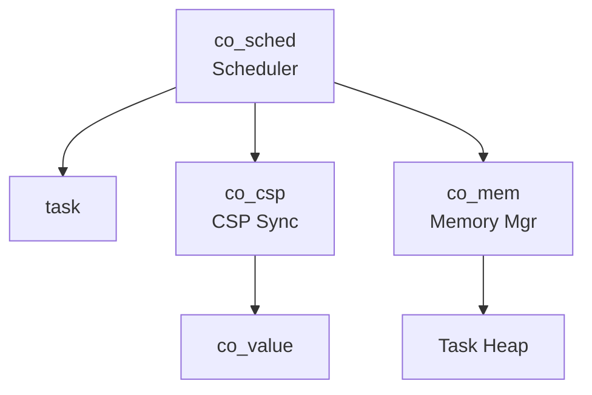

# 協調型OS COOS コンポーネント設計書

## 1. コンセプト
COOSは、シングルスレッド環境向けのホーアCSPベースのグリーンスレッドOSである。C++20コルーチンを活用し、スタックレスで低オーバーヘッドなタスク切り替えを実現する。 `{CooperativeMultitasking}` `{UseCpp20Coroutine}` `{CSPCommunication}`

本コンポーネントは、以下のサブコンポーネントで構成される：
- **[co_sched (Scheduler)](file:///n:/sources/fireball/docs/orders/components/scheduler.md)**: タスクのライフサイクルと実行順序の管理。
- **co_csp (Communication Engine)**: チャネルベースの同期と所有権移譲。
- **co_mem (Memory Manager)**: タスク独立ヒープの管理。

## 2. 静的モデル

### 2.1 データ構造
- **channel**: 1エントリのバッファを持つ同期オブジェクト。
- **co_value**: ムーブセマンティクスによる所有権管理スマートポインタ。

### 2.2 内部ブロック図

### 2.3 主要なクラス・構造体・配列・定数

#### `channel` (CSPチャネル)
タスク間の同期と通信を仲介する。

| 構成項目 | 機能と役割 | 備考（制約、型など） |
| :--- | :--- | :--- |
| `buffer` | 通信されるデータを保持する1エントリのバッファ。所有権移譲を伴う。 | `co_value` 型 |
| `sender_wait_queue` | バッファが満杯で送信を待機しているタスクの識別子。 | `task_id` |
| `receiver_wait_queue` | バッファが空で受信を待機しているタスクの識別子。 | `task_id` |

## 3. 動的モデル

### 3.1 アルゴリズム
- **CSP Handoff (直接スイッチ)**: `send`/`recv` 時に相手タスクが既に待機状態であった場合、スケジューラを介さず即座に相手タスクへ実行権を移譲する。これにより通信レイテンシを最小化する。 `{CSP_Handoff}` `{DirectContextSwitch}`
- **Memory Management**: タスク生成時に独立したヒープ領域を割り当て、実行時の動的確保をその範囲に限定する。 `{StrictMemoryLimit}` `{IndependentHeap}`

### 3.2 状態遷移図
スケジューラの状態遷移については **[scheduler.md](file:///n:/sources/fireball/docs/orders/components/scheduler.md#3.2-状態遷移図)** を参照。

## 4. 検証 (Verification) - Tier 3

### 4.1 直行表: CSP通信と状態遷移
チャネル通信時のタスク状態とスケジューラの挙動を検証する。

| ケース | 自タスク要求 | チャネル状態 | 相手状態 | 期待される動作 (自) | 期待される動作 (他) |
| :--- | :--- | :--- | :--- | :--- | :--- |
| 1 | SEND | Empty | - | BLOCKEDへ遷移 | (なし) |
| 2 | SEND | Full | - | BLOCKEDへ遷移 | (なし) |
| 3 | SEND | (待機RXあり) | BLOCKED | **READYへ遷移(直接)** | **READYへ遷移(直接)** |
| 4 | RECV | Full | - | **READYへ遷移** | (チャネル空へ) |
| 5 | RECV | Empty | - | BLOCKEDへ遷移 | (なし) |
| 6 | RECV | (待機TXあり) | BLOCKED | **READYへ遷移(直接)** | **READYへ遷移(直接)** |
| 7 | NOTIFY_INT | - | BLOCKED/READY | (継続) | **INTERRUPTEDへ遷移** |

## 5. インターフェイス定義
タスク操作に関する公開APIについては **[scheduler.md](file:///n:/sources/fireball/docs/orders/components/scheduler.md#4.1-公開API)** を参照。

### 4.2 URI/IPCインターフェイス
本コンポーネントはカーネル基盤のため、直接のURIインターフェイスは持たず、IPCルータの基盤として機能する。

## 6. 設計完了チェックリスト
- [x] コンポーネントの責務が明確に定義されているか
- [x] サブコンポーネントへの分解とリンクが適切か
- [x] CSP(Handoff)の振る舞いが定義されているか
- [x] 上位の要求 `{Keyword}` とのトレーサビリティが確保されているか
