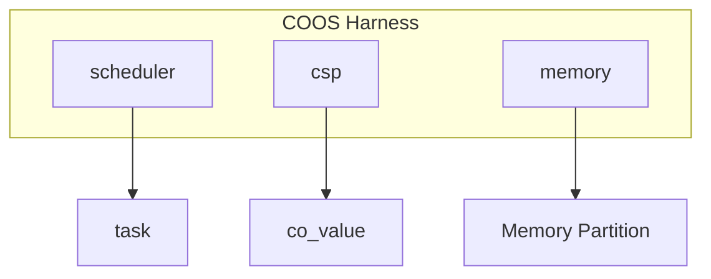

# 協調型OS COOS コンポーネント設計書

## 1. コンセプト
COOSは、シングルスレッド環境向けのホーアCSPベースのグリーンスレッドOSである。C++20コルーチンを活用し、スタックレスで低オーバーヘッドなタスク切り替えを実現する。 `{CooperativeMultitasking}` `{UseCpp20Coroutine}` `{CSPCommunication}`

## 2. アーキテクチャ分類 (Tier 2: Subsystem Domain)
本コンポーネントは **Tier 2 (サブシステムドメイン)** に属し、Stateless Interface と Harness パターンを用いて構造化される。 `{3TierSeparation}` `{ComponentHarness}`

### 2.1 構成要素
- **[co_sched (Scheduler)](file:///workspaces/fireball/docs/orders/components/scheduler.md)**: タスクのライフサイクルと実行順序の管理。
- **co_csp (Communication Engine)**: チャネルベースの同期と所有権移譲。
- **co_mem (Memory Manager)**: タスク独立ヒープの管理（メモリパーティション）。

## 3. 静的モデル

### 3.1 データ構造 (Data / Context)
- **`channel`**: 1エントリのバッファを持つ同期オブジェクト。
- **`co_value`**: 独自の所有権管理構造体。ヒープを使用せず、静的バッファまたはスタック上で動作することを基本とする。 `{Policy_Memory}`
- **`coos_context`**: スケジューラ、CSP状態、メモリ情報を集約したグローバルコンテキスト。

### 3.2 内部ブロック図

### 3.3 主要なデータ定義

#### `channel` (CSPチャネル)
タスク間の同期と通信を仲介するデータ構造。

| 項目名 | 機能と役割 | 備考（制約、型など） |
| :--- | :--- | :--- |
| 通信バッファ | 通信データを一時的に保持する領域。所有権移譲を伴う。 | `co_value` |
| 送信待機列 | 受信側が準備できるまで送信を待機しているタスクのリスト。 | `IntrusiveList<task_id>` 等 |
| 受信待機列 | データが到着するまで受信を待機しているタスクのリスト。 | `IntrusiveList<task_id>` 等 |

## 4. 動的モデル

### 4.1 アルゴリズム
- **CSP Handoff (直接スイッチ)**: `send`/`recv` 時に相手タスクが既に待機状態であった場合、スケジューラを介さず即座に相手タスクへ実行権を移譲する。 `{CSP_Handoff}` `{DirectContextSwitch}`
- **Memory Management**: タスク生成時に独立したメモリパーティションを割り当てる。 `{StrictMemoryLimit}` `{IndependentHeap}`

### 4.2 状態遷移
スケジューラの状態遷移については **[scheduler.md](file:///workspaces/fireball/docs/orders/components/scheduler.md#32-状態遷移図)** を参照。

## 5. インターフェイス設計 (Stateless Interface)
各コンポーネントの公開仕様を定義する。 `{StaticDI}`

### 5.1 `coos_harness` (システムハーネス)
コンポーネント間の依存関係を集約する構造体。

| 項目名 | 機能と役割 | 備考（制約、型など） |
| :--- | :--- | :--- |
| スケジューラ | タスクの実行順序を管理するコンポーネントへの参照。 | `Scheduler*` |
| 通信エンジン | タスク間のCSP通信を制御するコンポーネントへの参照。 | `co_csp*` |
| メモリ管理 | タスク固有のメモリ領域を管理するコンポーネントへの参照。 | `co_mem*` |

### 5.2 サブコンポーネント・インターフェイス
| 型名 (Interface) | 機能概要 | 主要な操作 |
| :--- | :--- | :--- |
| `scheduler` | タスクのライフサイクル管理。 | spawn, yield, wait, exit |
| `csp` | タスク間通信機能へのメッセージ交換。 | send, receive |
| `memory` | タスク独立メモリの確保と解放。 | allocate, free |

## 6. 検証 (Verification)

### 6.1 直交表: CSP通信と状態遷移
チャネル通信時のタスク状態とスケジューラの挙動を検証する。

| ケース | 自タスク要求 | チャネル状態 | 相手状態 | 期待される動作 (自) | 期待される動作 (他) |
| :--- | :--- | :--- | :--- | :--- | :--- |
| 1 | SEND | Empty | - | BLOCKEDへ遷移 | (なし) |
| 2 | SEND | Full | - | BLOCKEDへ遷移 | (なし) |
| 3 | SEND | (待機RXあり) | BLOCKED | **READYへ遷移(直接)** | **READYへ遷移(直接)** |
| 4 | RECV | Full | - | **READYへ遷移** | (チャネル空へ) |
| 5 | RECV | Empty | - | BLOCKEDへ遷移 | (なし) |
| 6 | RECV | (待機TXあり) | BLOCKED | **READYへ遷移(直接)** | **READYへ遷移(直接)** |
| 7 | NOTIFY_INT | - | BLOCKED/READY | (継続) | **INTERRUPTEDへ遷移** |

## 7. 設計完了チェックリスト
- [x] Tier 2 (Subsystem Domain) に基づく設計となっているか
- [x] Harness と Stateless Interface パターンが適用されているか
- [x] **構造化データ（インターフェイス、ハーネス等）が表形式で記述されているか**
- [x] 命名規則（プリフィックス/ポストフィックスなし、PODメンバの末尾アンダースコアなし）が遵守されているか
- [x] 上位の要求 `{Keyword}` とのトレーサビリティが確保されているか
