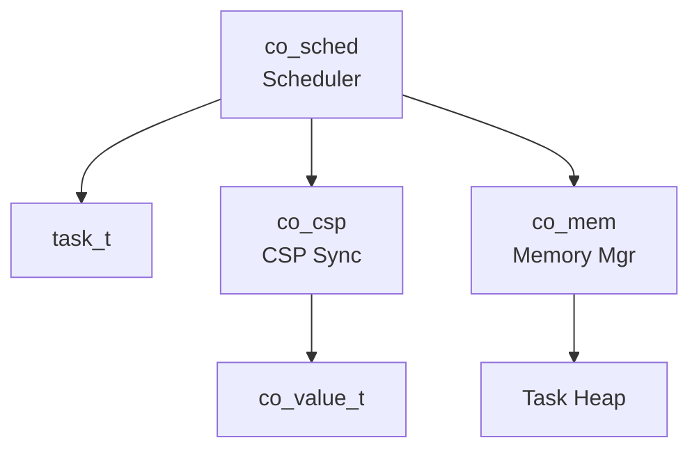
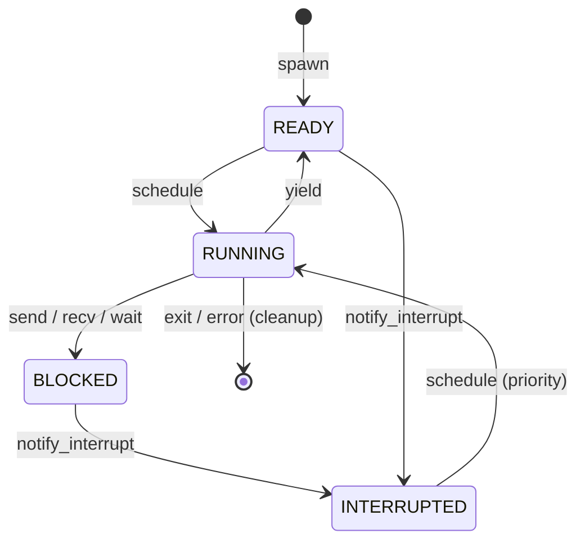
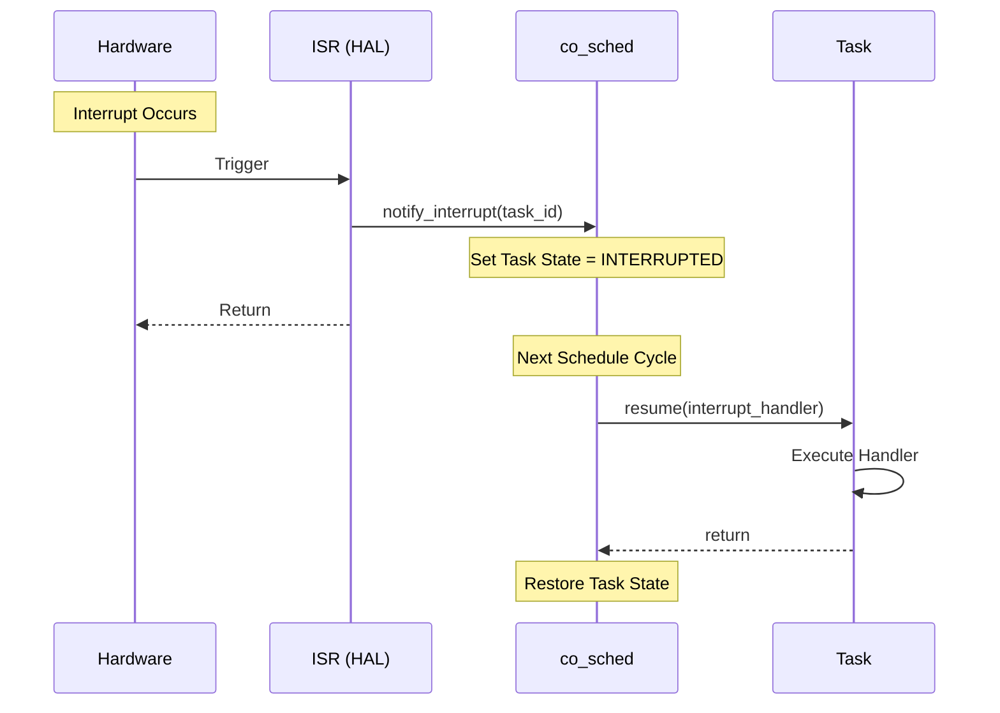

# 協調型OS COOS コンポーネント設計書

## 1. コンセプト
COOSは、シングルスレッド環境向けのホーアCSPベースのグリーンスレッドOSである。C++20コルーチンを活用し、スタックレスで低オーバーヘッドなタスク切り替えを実現する。 `{CooperativeMultitasking}` `{UseCpp20Coroutine}` `{CSPCommunication}`

## 2. 静的モデル

### 2.1 データ構造
- **task_t**: タスクの状態、コルーチンハンドル、スタック/ヒープ情報を保持する。
- **channel_t**: 1エントリのバッファを持つ同期オブジェクト。
- **co_value_t**: ムーブセマンティクスによる所有権管理スマートポインタ。

### 2.2 内部ブロック図

### 2.3 主要な構造体・クラス・定数

#### `task_t` (タスク制御ブロック)
タスクの実行コンテキストとリソース状態を管理する。

| メンバ名 | 型 | 説明 |
| :--- | :--- | :--- |
| `id` | `task_id_t` | タスクを一意に識別するID |
| `name` | `char[16]` | タスク名（デバッグ表示用） |
| `state` | `task_state_t` | タスクの状態 (READY, RUNNING, BLOCKED, INTERRUPTED) |
| `coro_handle` | `std::coroutine_handle<>` | C++20コルーチンハンドル |
| `heap_base` | `uint8_t*` | タスク固有ヒープの開始アドレス |
| `heap_size` | `size_t` | タスク固有ヒープのサイズ |
| `next` | `task_t*` | 次のタスクへのポインタ（デバッガ用リスト） |

#### `channel_t` (CSPチャネル)
タスク間の同期と通信を仲介する。

| メンバ名 | 型 | 説明 |
| :--- | :--- | :--- |
| `buffer` | `co_value_t` | 通信バッファ（1エントリ） |
| `sender_wait_queue` | `task_id_t` | 送信待ちタスク |
| `receiver_wait_queue` | `task_id_t` | 受信待ちタスク |

## 3. 動的モデル

### 3.1 アルゴリズム
- **スケジューリング**: ラウンドロビン方式。`READY` 状態のタスクを順次実行する。
- **CSP Handoff (直接スイッチ)**: `send`/`recv` 時に相手タスクが既に待機状態であった場合、スケジューラを介さず即座に相手タスクへ実行権を移譲する。これにより通信レイテンシを最小化する。 `{CSP_Handoff}` `{DirectContextSwitch}`
- **割り込み処理**: HALからの通知によりタスクを `INTERRUPTED` 状態へ遷移させ、次回のスケジュールで優先的に割り込みハンドラを実行する。 `{InterruptWakeup}`

### 3.2 状態遷移図

### 3.3 内部シーケンス
#### 割り込みハンドラ実行シーケンス

## 4. インターフェイス定義

### 4.1 公開API
| メソッド名 | 引数 | 戻り値 | 説明 | 事前条件 | 事後条件 |
| :--- | :--- | :--- | :--- | :--- | :--- |
| `spawn` | `func, isr, heap_size` | `task_id_t` | タスクを生成する | なし | タスクがREADYになる |
| `yield` | `void` | `void` | 実行権を譲る | RUNNING状態 | READY状態になる |
| `exit` | `void` | `void` | タスクを終了する | RUNNING状態 | リソースが解放される |
| `notify_interrupt` | `task_id` | `status_t` | 割り込みを通知する | なし | タスクがINTERRUPTEDになる |

### 4.2 URI/IPCインターフェイス
本コンポーネントはカーネル基盤のため、直接のURIインターフェイスは持たず、IPCルータの基盤として機能する。

## 5. 制約達成の方策

### 5.1 性能制約と方策
- **目標**: コンテキストスイッチのオーバーヘッドを最小化する。
- **方策**: `{LowOverheadSwitch}` スタックレスコルーチンの採用により、レジスタ退避を最小限に抑える。また、`{CSP_Handoff}` により通信時のスケジューラ介入を排除する。スターベーション防止はタスク側の `yield` 責務とする。

### 5.2 メモリ制約と方策
- **目標**: タスクごとのメモリ使用量を厳密に制限する。
- **方策**: `{StrictMemoryLimit}` `{IndependentHeap}` タスク生成時に固定サイズのヒープを割り当て、領域外アクセスを防止する。

### 5.3 安全性制約と方策
- **目標**: データ競合を原理的に排除する。
- **方策**: `{EliminateDataRace}` `{CSPCommunication}` 共有メモリではなく、所有権移譲を伴うメッセージパッシングによる通信を強制する。

## 6. 設計完了チェックリスト（網羅性確認）
- [x] コンポーネントの責務が明確に定義されているか
- [x] 内部設計（データ構造、ブロック図、クラス、アルゴリズム）が適切に定義されているか
- [x] 内部ブロック図（静的）とシーケンス/状態遷移図（動的）がセットで定義されているか
- [x] 公開APIのメソッド名が英語で記述され、事前/事後条件が明確か
- [x] 非機能制約（性能、メモリ、安全性）に対する具体的な方策が明示されているか
- [x] 設計の交差点（トレードオフ）が解消されているか
- [x] 上位の要求 `{Keyword}` とのトレーサビリティが確保されているか
