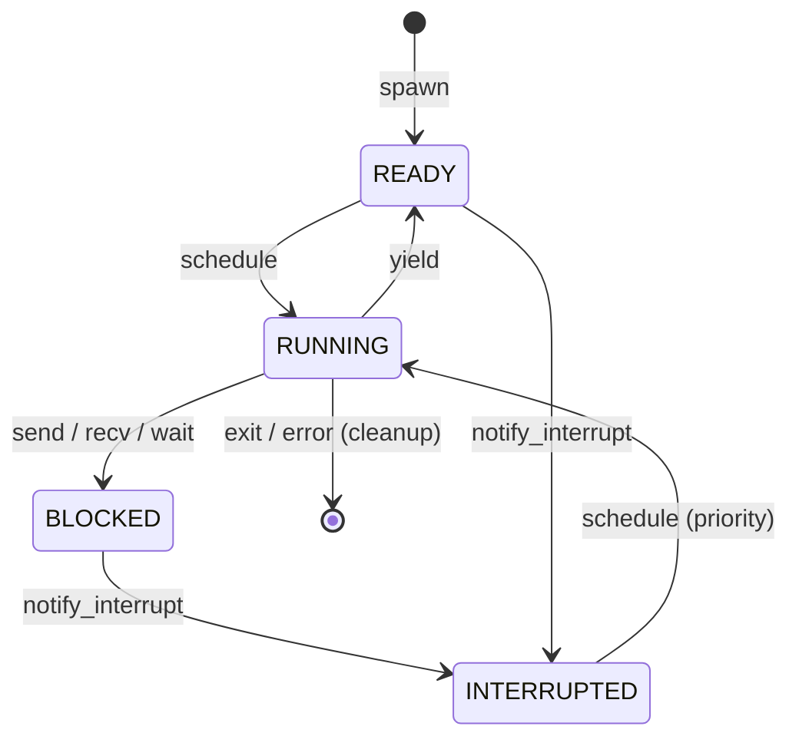
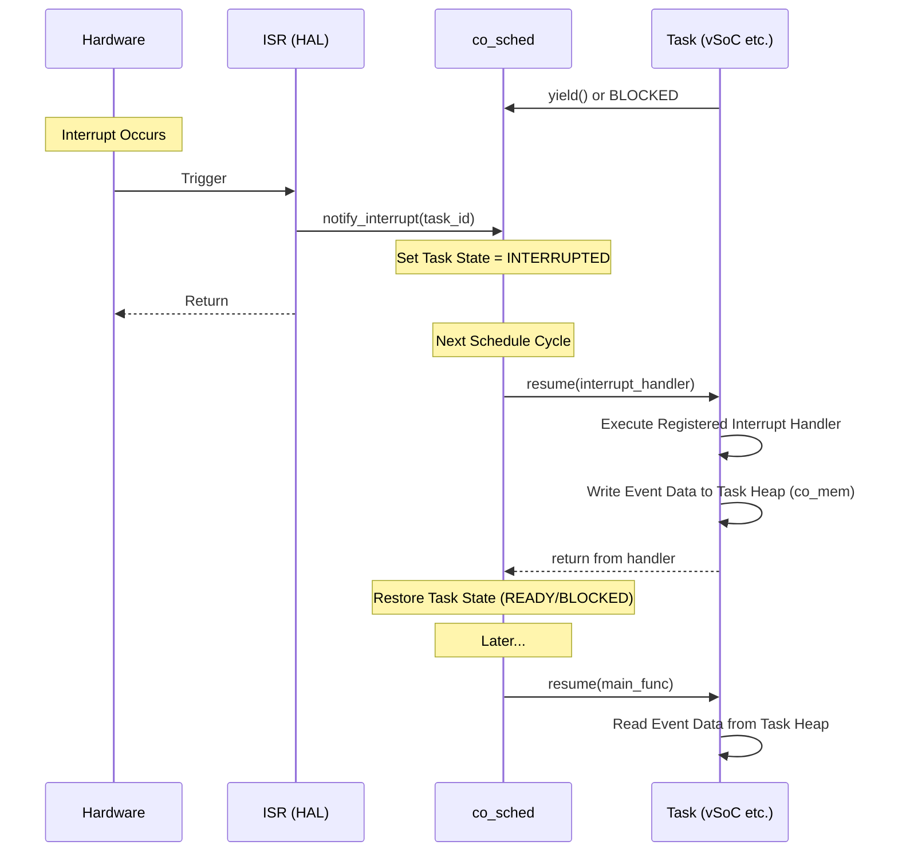

# 協調型OS COOS

## コンセプト

COOSは、シングルスレッド環境向けのホーアCSPベースのグリーンスレッドOSである。

- **協調的マルチタスク**
  - 概要: コルーチンを用いて実装され、タスクが自ら制御を譲ることで並行性を実現する。
  - 導出元: `{CooperativeMultitasking}` ([`docs/oders/requires/list.md`](docs/oders/requires/list.md))
- **CSPベースの同期**
  - 概要: タスク間通信および同期はホーアのCSPモデルに基づき、共有メモリではなくメッセージパッシング（所有権移譲）で行う。
  - 導出元: `{CSPCommunication}` ([`docs/oders/requires/list.md`](docs/oders/requires/list.md))
- **ハードウェア非依存**
  - 概要: カーネルは特定のハードウェア機能（サイクルカウンタ等）に依存せず、抽象化されたインターフェイスのみを使用する。
  - 導出元: `{NotRTOS}` ([`docs/oders/requires/list.md`](docs/oders/requires/list.md))

## 構成要素

### co_sched
- タスク管理とラウンドロビンスケジューリングを担う。
- タスクごとに「メイン処理」と「割り込みハンドラ」の2つのエントリポイントを管理する。
- 割り込み発生時にタスクを `INTERRUPTED` 状態に遷移させ、優先的に割り込みハンドラを実行する。

### co_csp
- ホーアCSPに基づく同期オブジェクト。
- 通信バッファは1エントリのみのブロッキングI/O。

### co_mem
- タスクごとのスタック（コルーチンフレーム）およびヒープを管理。
- `new`/`delete`のポリシーをオーバーライドし、タスク固有のヒープから確保する。

### co_value
- 所有権（Ownership）を管理するスマートポインタ。
- ムーブセマンティクスにより、タスク間での安全なデータ移動を実現する。

## 提供する機能

- **タスクスケジューリング**
  - 概要: ラウンドロビン方式によるタスク実行管理。`READY`, `RUNNING`, `BLOCKED`, `INTERRUPTED` の状態を持つ。
  - 導出元: `{TaskScheduling}` ([`docs/oders/requires/list.md`](docs/oders/requires/list.md))
- **CSPチャネル通信**
  - 概要: 型安全なメッセージパッシング。1エントリのバッファを持つブロッキング通信。
  - 導出元: `{CSPChannel}` ([`docs/oders/architecture/overview.md`](docs/oders/architecture/overview.md))
- **メモリ隔離管理**
  - 概要: タスクごとの独立したヒープ領域の提供。タスク終了時に自動的に回収される。
  - 導出元: `{MemoryIsolation}` ([`docs/oders/requires/list.md`](docs/oders/requires/list.md))
- **所有権管理**
  - 概要: `co_value`によるメモリブロックの排他的所有権移譲。RAIIによる自動解放を保証する。
  - 導出元: `{OwnershipTransfer}` ([`docs/oders/architecture/overview.md`](docs/oders/architecture/overview.md))

## 割り込み連携

- **強制ウェイクアップ**
  - 概要: HALから割り込み通知を受け、関連タスクを `INTERRUPTED` 状態に遷移させる。
  - 導出元: `{InterruptWakeup}` ([`docs/oders/requires/list.md`](docs/oders/requires/list.md))
- **割り込みハンドラ実行**
  - 概要: タスクが `INTERRUPTED` 状態から再開される際、通常のメイン処理ではなく登録された割り込みハンドラが実行される。
  - 導出元: `{TaskPollInterruptFlag}` ([`docs/oders/requires/list.md`](docs/oders/requires/list.md))

## インターフェイス

### `co_sched` (スケジューラ)
- `spawn(main_func, interrupt_handler, heap_size)`: 新しいタスクを生成する。メイン処理に加え、`INTERRUPTED` 状態時に実行される割り込みハンドラを登録する。
- `yield()`: 現在のタスクの実行を中断し、スケジューラに制御を戻す。
- `exit()`: 現在のタスクを終了し、スケジューラから削除してリソースを回収する。
- `notify_interrupt(task_id)`: 指定したタスクを `INTERRUPTED` 状態にする（主にHAL/ISRから呼ばれる）。

### `co_csp` (通信チャネル)
- `create_channel<T>()`: 型 `T` を扱うチャネルを生成する。
- `send(channel, co_value<T>&&)`: チャネルに値を送信する（ブロッキング）。
- `recv(channel)`: チャネルから値を受信する（ブロッキング）。

### `co_mem` (メモリ管理)
- `malloc(size)`: 現在のタスクのヒープからメモリを確保する。
- `free(ptr)`: メモリを解放する。
- `stats()`: 現在のタスクのメモリ使用状況を取得する。

### `co_value` (所有権管理)
- `make_value<T>(args...)`: 所有権管理された値を生成する。
- `move(value)`: 所有権を明示的に移譲する。

## 機能制約達成のための方策

- **C++20コルーチンの活用**
  - 概要: スタックレスコルーチンを用いてタスクを実装し、メモリ消費を抑える。
  - 導出元: `{UseCpp20Coroutine}` ([`docs/oders/architecture/overview.md`](docs/oders/architecture/overview.md))
- **独立ヒープ**
  - 概要: `dlmalloc`をベースに、タスクごとに隔離されたメモリプールを割り当てる。
  - 導出元: `{IndependentHeap}` ([`docs/oders/architecture/overview.md`](docs/oders/architecture/overview.md))

## 非機能制約達成のための方策

### 性能制約と方策
- **低オーバーヘッドなコンテキストスイッチ**
  - 概要: スタックレスコルーチンの採用により、レジスタ退避を最小限にする。
  - 導出元: `{LowOverheadSwitch}` ([`docs/oders/architecture/overview.md`](docs/oders/architecture/overview.md))

### メモリ制約と方策
- **厳密なメモリ制限**
  - 概要: タスク起動時に指定されたサイズ以上のメモリ確保を禁止する。枯渇時はタスクを異常終了させ、システム全体への波及を防ぐ。
  - 導出元: `{StrictMemoryLimit}` ([`docs/oders/architecture/overview.md`](docs/oders/architecture/overview.md))

### 安全性制約と方策
- **データ競合の排除**
  - 概要: CSPモデルと所有権管理により、ミューテックスなしで安全なデータ共有を実現する。
  - 導出元: `{EliminateDataRace}` ([`docs/oders/requires/list.md`](docs/oders/requires/list.md))
- **障害隔離**
  - 概要: 特定タスクのヒープ枯渇やクラッシュが他タスクやカーネルに影響しないよう、リソースを完全に分離する。
  - 導出元: `{FaultIsolation}` ([`docs/oders/architecture/overview.md`](docs/oders/architecture/overview.md))
- **割り込みハンドラの安全性**
  - 概要: 割り込みハンドラとメイン処理間のデータ共有は、タスク固有ヒープ（`co_mem`）を介して行う。シングルスレッド動作により、ハンドラ実行中にメイン処理が動くことはないため、データ競合は発生しない。

## 動的モデル

### タスクライフサイクル

### 割り込みハンドラ実行シーケンス

