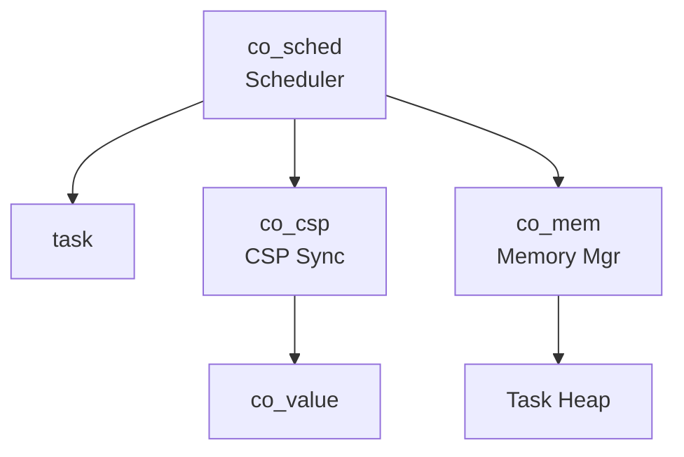
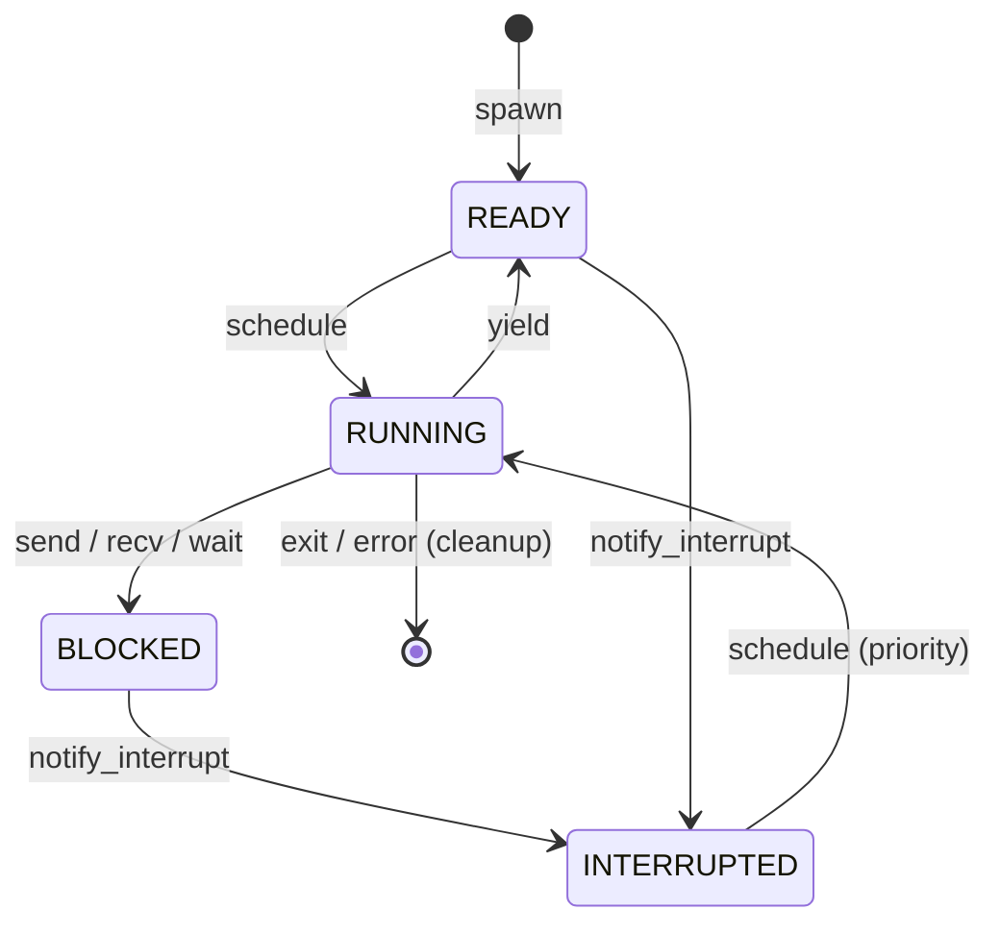
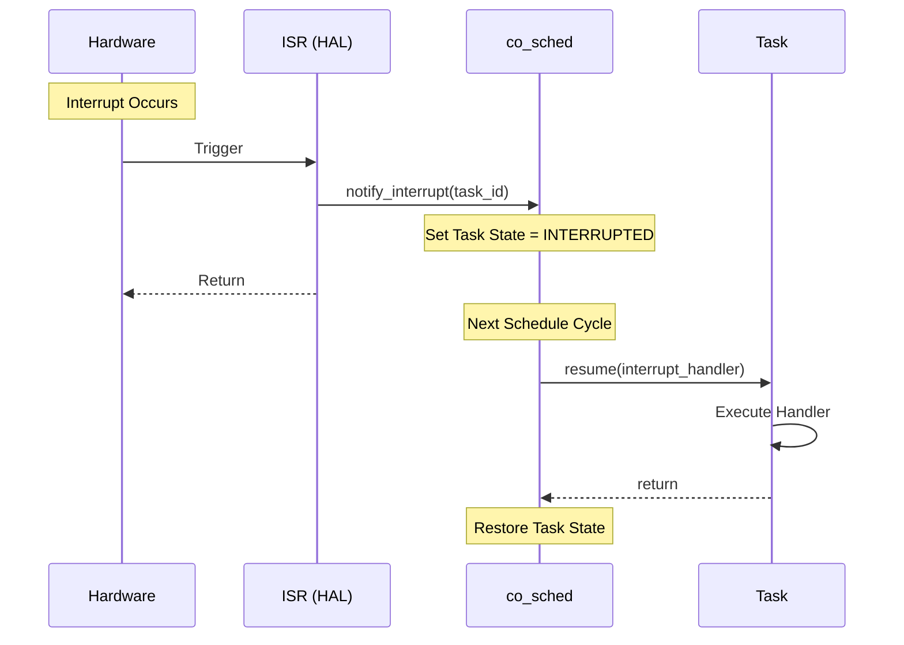

# 協調型OS COOS コンポーネント設計書

## 1. コンセプト
COOSは、シングルスレッド環境向けのホーアCSPベースのグリーンスレッドOSである。C++20コルーチンを活用し、スタックレスで低オーバーヘッドなタスク切り替えを実現する。 `{CooperativeMultitasking}` `{UseCpp20Coroutine}` `{CSPCommunication}`

## 2. 静的モデル

### 2.1 データ構造
- **task**: タスクの状態、コルーチンハンドル、スタック/ヒープ情報を保持する。
- **callback_task**: 一定周期で実行される、コルーチンを使用しない軽量な関数ポインタベースのタスク。
- **channel**: 1エントリのバッファを持つ同期オブジェクト。
- **co_value**: ムーブセマンティクスによる所有権管理スマートポインタ。

### 2.2 内部ブロック図

### 2.3 主要なクラス・構造体・配列・定数

#### `task` (タスク制御ブロック)
タスクの実行コンテキストとリソース状態を管理する。

| 構成項目 | 機能と役割 | 備考（制約、型など） |
| :--- | :--- | :--- |
| `id` | タスクを一意に識別するための不変なID。 | `task_id` 型 |
| `name` | デバッグやプロファイリング時に使用する人間が読める名前。 | `char[16]` |
| `state` | タスクの現在の動作状態（準備完了、実行中、ブロック、割り込み待機）。 | 列挙型 |
| `coro_handle` | C++20 のコルーチン制御を行うためのハンドル。 | `std::coroutine_handle<>` |
| `heap_base` | タスクに個別に割り当てられたヒープ/スタック領域の開始アドレス。 | ポインタ |
| `heap_size` | タスク固有ヒープの有効なサイズ。 | バイト数 |
| `next` | システム内の全タスクを連結するリスト用ポインタ。デバッガの可視化に使用。 | ポインタ |

#### `callback_task` (定期実行タスク)
コルーチンを使用せず、一定周期で実行される軽量なタスクを管理する。 `{PeriodicTask}`

| 構成項目 | 機能と役割 | 備考（制約、型など） |
| :--- | :--- | :--- |
| `id` | タスク識別子。 | `task_id` |
| `func` | 実行されるコールバック関数。 | `economic_function<void()>` |
| `interval_ticks` | 実行の間隔（システムティック単位）。 | 32bit値 |
| `next_run_tick` | 次回実行予定時刻。 | 64bit値 |

#### `channel` (CSPチャネル)
タスク間の同期と通信を仲介する。

| 構成項目 | 機能と役割 | 備考（制約、型など） |
| :--- | :--- | :--- |
| `buffer` | 通信されるデータを保持する1エントリのバッファ。所有権移譲を伴う。 | `co_value` 型 |
| `sender_wait_queue` | バッファが満杯で送信を待機しているタスクの識別子。 | `task_id` |
| `receiver_wait_queue` | バッファが空で受信を待機しているタスクの識別子。 | `task_id` |

## 3. 動的モデル

### 3.1 アルゴリズム
- **スケジューリング**: ラウンドロビン方式。`READY` 状態のコルーチンタスクを順次実行するとともに、各サイクルで `callback_task` の実行時刻をチェックし、期限が来たものを実行する。
- **Idle 状態の検知**: 全てのタスクが `BLOCKED` かつ保留中の `callback_task` が存在しない場合、システムは Idle 状態とみなされる。
- **Idle Hook**: Idle 状態を検知した際、登録された `idle_hook` を呼び出す。これにより、バックグラウンド処理（JIT等）や低電力モードへの移行を実現する。 `{IdleDetection}`
- **CSP Handoff (直接スイッチ)**: `send`/`recv` 時に相手タスクが既に待機状態であった場合、スケジューラを介さず即座に相手タスクへ実行権を移譲する。これにより通信レイテンシを最小化する。 `{CSP_Handoff}` `{DirectContextSwitch}`
- **割り込み処理**: HALからの通知によりタスクを `INTERRUPTED` 状態へ遷移させ、次回のスケジュールで優先的に割り込みハンドラを実行する。 `{InterruptWakeup}`

### 3.2 状態遷移図

### 3.3 内部シーケンス
#### 割り込みハンドラ実行シーケンス

## 4. 検証 (Verification) - Tier 3

### 4.1 直行表: CSP通信と状態遷移
チャネル通信時のタスク状態とスケジューラの挙動を検証する。

| ケース | 自タスク要求 | チャネル状態 | 相手状態 | 期待される動作 (自) | 期待される動作 (他) |
| :--- | :--- | :--- | :--- | :--- | :--- |
| 1 | SEND | Empty | - | BLOCKEDへ遷移 | (なし) |
| 2 | SEND | Full | - | BLOCKEDへ遷移 | (なし) |
| 3 | SEND | (待機RXあり) | BLOCKED | **READYへ遷移(直接)** | **READYへ遷移(直接)** |
| 4 | RECV | Full | - | **READYへ遷移** | (チャネル空へ) |
| 5 | RECV | Empty | - | BLOCKEDへ遷移 | (なし) |
| 6 | RECV | (待機TXあり) | BLOCKED | **READYへ遷移(直接)** | **READYへ遷移(直接)** |
| 7 | NOTIFY_INT | - | BLOCKED/READY | (継続) | **INTERRUPTEDへ遷移** |

### 4.2 内部コンポーネントのデコンポジション
COOSカーネルの責務を詳細化する。

- **co_sched (Scheduler)**:
  - **Task Manager**: TCBのライフサイクル（spawn/exit）管理。
  - **Ready Queue Manager**: ラウンドロビン待ち行列の維持。
  - **Interrupt Dispatcher**: HALからの通知を `INTERRUPTED` 状態へ反映。
- **co_csp (Communication Engine)**:
  - **Channel Manager**: チャネルの待機キュー管理。
  - **Handoff Optimizer**: 相手タスクへの直接コンテキストスイッチ（`DirectContextSwitch`）の実行。
- **co_mem (Memory Manager)**:
  - **Task Heap Allocator**: 独立したヒープパーティションの境界管理。

## 5. インターフェイス定義

### 4.1 公開API
外部から利用可能なオブジェクト指向APIを定義する。

#### タスクの生成 (spawn)
| 項目 | 内容 |
| :--- | :--- |
| 機能概要 | 新しい協調タスクを生成し、実行待ち行列に登録する。 |
| 引数と役割 | `func`: タスクのエントリポイント関数, `isr`: 割り込みハンドラ関数, `heap_size`: 割り当てるメモリサイズ。 |
| 期待する結果 | 正常：新しいタスクIDが割り当てられ、状態が READY になる。 |
| 事前条件 | システムのリソース（TCBスロット）に空きがあること。 |
| 事後条件 | タスクがスケジュール対象に含まれる。 |
| 不変条件 | すべてのタスクは独立したヒープ領域を持つこと。 |
| エラー時の挙動 | ID不足やメモリ確保失敗時は無効なIDを返す。 |
| 補足 | スタックレス設計のため、`heap_size` は主に動的アロケーションに使用される。 |

#### 実行権の放棄 (yield)
| 項目 | 内容 |
| :--- | :--- |
| 機能概要 | 現在実行中のタスクが自発的に実行権を返し、他のタスクに機会を与える。 |
| 引数と役割 | なし。 |
| 期待する結果 | 制御が即座にスケジューラに戻る。 |
| 事前条件 | 呼び出しタスクが RUNNING 状態であること。 |
| 事後条件 | タスクの状態が READY に戻り、キューの末尾に移動する。 |
| 不変条件 | スケジューラの状態が一貫していること。 |
| エラー時の挙動 | なし（常に成功）。 |
| 補足 | スターベーション防止のため、長時間処理を行うタスクは定期的に呼び出す必要がある。 |

#### タスクの終了 (exit)
| 項目 | 内容 |
| :--- | :--- |
| 機能概要 | 実行中のタスクを自発的に終了させ、リソースを解放する。 |
| 引数と役割 | なし。 |
| 期待する結果 | タスクがシステムから削除される。 |
| 事前条件 | 呼び出しタスクが RUNNING 状態であること。 |
| 事後条件 | 割り当てられていたヒープ、TCB等がすべて解放される。 |
| 不変条件 | 他のタスクへの影響がないこと。 |
| エラー時の挙動 | なし。 |
| 補足 | 終了したタスクへのメッセージ送信はエラーとなる。 |

#### 割り込み通知 (notify_interrupt)
| 項目 | 内容 |
| :--- | :--- |
| 機能概要 | 非同期イベント（割り込み）が発生したことを、関連するタスクに通知する。 |
| 引数と役割 | `id`: 通知対象のタスクID。 |
| 期待する結果 | 対象タスクが優先的にスケジュールされる状態（INTERRUPTED）になる。 |
| 事前条件 | 対象のタスクが存在すること。 |
| 事後条件 | 次回のスケジュールサイクルで、該当タスクの割り込みハンドラが実行される。 |
| 不変条件 | ISR（割り込みコンテキスト）から安全に呼び出せること。 |
| エラー時の挙動 | 無効なIDの場合はエラーを返す。 |
| 補足 | 実際のハンドラ実行はタスクコンテキストで行われるため、リエントラント性の問題が抑制される。 |

#### 定期実行タスクの登録 (register_periodic_callback)
| 項目 | 内容 |
| :--- | :--- |
| 機能概要 | 一定周期で実行される、スタックレスな軽量タスクを登録する。 |
| 引数と役割 | `func`: 実行関数, `interval_ticks`: 実行間隔。 |
| 期待する結果 | 正常：タスクIDが返り、以降指定周期で実行されるようになる。 |
| 事前条件 | スケジューラが初期化済みであること。 |
| 事後条件 | `callback_task` リストに追加される。 |
| 不変条件 | 実行関数は Run-to-Completion（途中で yield しない）であること。 |
| エラー時の挙動 | 空きスロットがない場合はエラーを返す。 |
| 補足 | JITコンパイルや定期的な監視タスクに使用される。 `{PeriodicTask}` |

#### アイドルフックの登録 (set_idle_hook)
| 項目 | 内容 |
| :--- | :--- |
| 機能概要 | システム全体がアイドル状態（実行可能なタスクがない状態）になった際に呼び出されるフックを設定する。 |
| 引数と役割 | `func`: アイドル時に実行する関数。 |
| 期待する結果 | システムがヒマになった際に、指定された関数が呼ばれる。 |
| 事前条件 | なし。 |
| 事後条件 | 以前のフックは上書きされる。 |
| 不変条件 | 実行関数は非ブロッキングであること。 |
| エラー時の挙動 | なし。 |
| 補足 | 電力管理や低優先度のバックグラウンドタスク（JITのバッチ処理等）に使用する。 `{IdleDetection}` |

### 4.2 URI/IPCインターフェイス
本コンポーネントはカーネル基盤のため、直接のURIインターフェイスは持たず、IPCルータの基盤として機能する。

## 5. 制約達成の方策

### 5.1 性能制約と方策
- **目標**: コンテキストスイッチのオーバーヘッドを最小化する。
- **方策**: `{LowOverheadSwitch}` スタックレスコルーチンの採用により、レジスタ退避を最小限に抑える。また、`{CSP_Handoff}` により通信時のスケジューラ介入を排除する。スターベーション防止はタスク側の `yield` 責務とする。

### 5.2 メモリ制約と方策
- **目標**: タスクごとのメモリ使用量を厳密に制限する。
- **方策**: `{StrictMemoryLimit}` `{IndependentHeap}` タスク生成時に固定サイズのヒープを割り当て、領域外アクセスを防止する。

### 5.3 安全性制約と方策
- **目標**: データ競合を原理的に排除する。
- **方策**: `{EliminateDataRace}` `{CSPCommunication}` 共有メモリではなく、所有権移譲を伴うメッセージパッシングによる通信を強制する。

## 6. 設計完了チェックリスト（網羅性確認）
- [x] コンポーネントの責務が明確に定義されているか
- [x] 内部設計（データ構造、ブロック図、クラス、アルゴリズム）が適切に定義されているか
- [x] 内部ブロック図（静的）とシーケンス/状態遷移図（動的）がセットで定義されているか
- [x] 公開APIのメソッド名が英語で記述され、事前/事後条件が明確か
- [x] 非機能制約（性能、メモリ、安全性）に対する具体的な方策が明示されているか
- [x] 設計の交差点（トレードオフ）が解消されているか
- [x] 上位の要求 `{Keyword}` とのトレーサビリティが確保されているか
