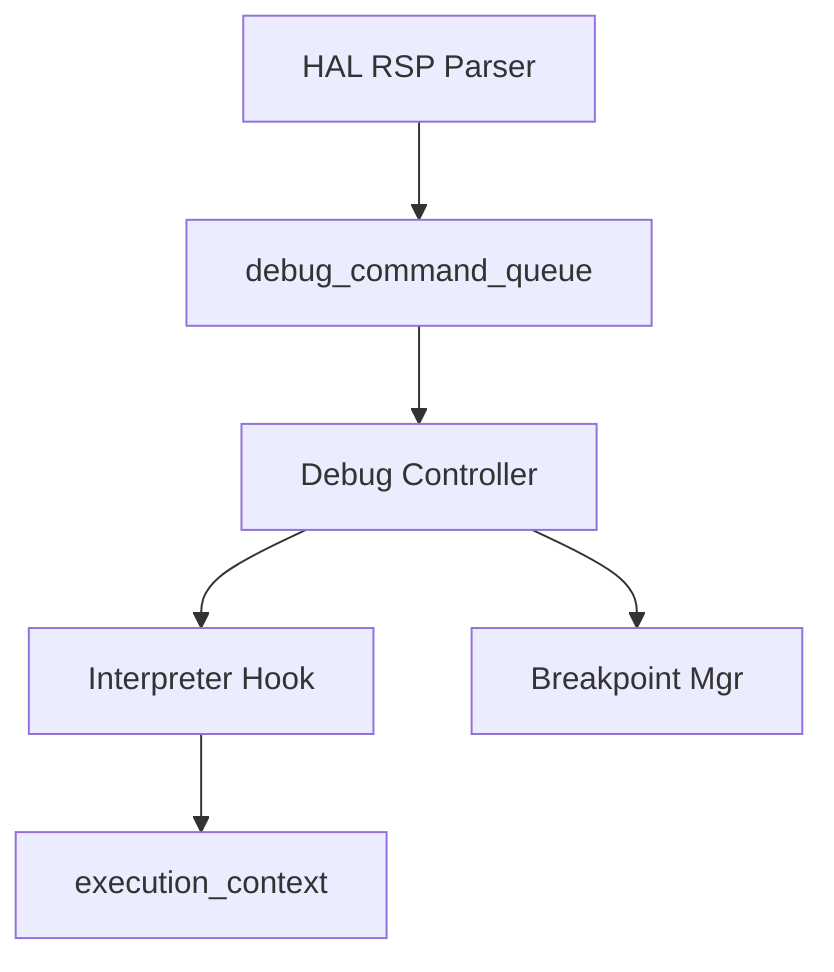
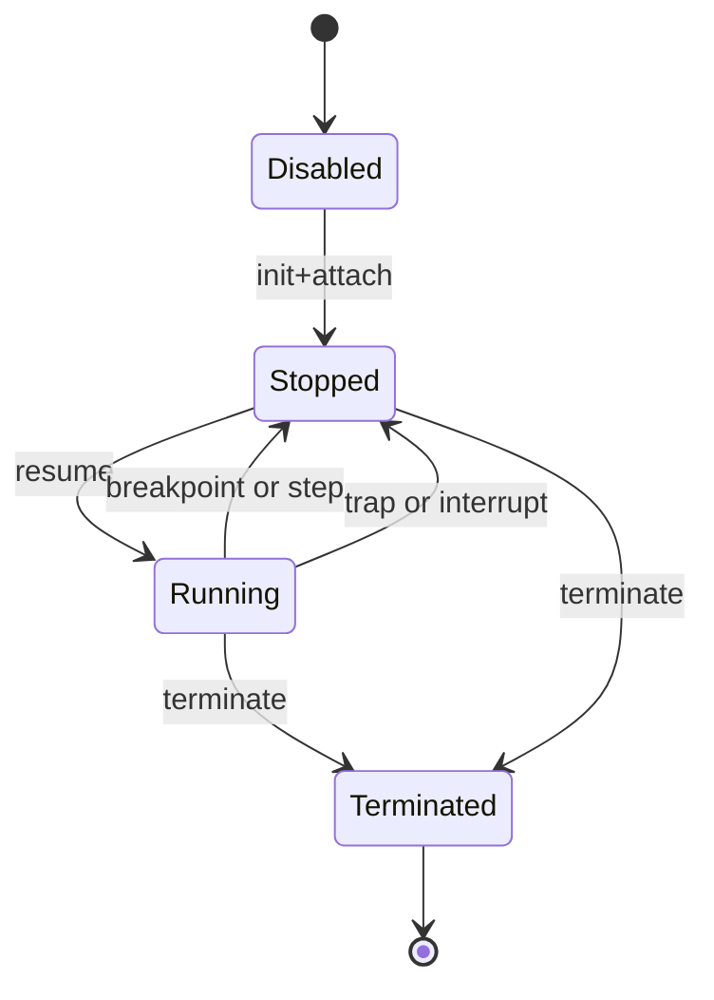

# デバッガ コンポーネント設計書

## 1. コンセプト
デバッガは、VSCode等の外部ツールからのデバッグを可能にするため、GDB Remote Serial Protocol (RSP) に基づく実行制御を行う。標準環境として VSCode, UART, J-Link をサポートする。RSPパケットの解析はHAL層で行われ、デバッガはHALから供給されるコマンドキューを消費して実行状態を制御する。リソース制約に対応するため、デバッグ中はJITを無効化し、インタープリタ実行にフォールバックする設計を採用する。 `{RSPMinimalSet}` `{DebuggerLabelTableSwitch}` `{MemoryIsolation}` `{Debug_Standard_Env}`

## 2. 静的モデル

### 2.1 データ構造
- **debug_command_queue**: HAL層のRSPパーサから供給される、解析済みデバッグコマンドのキュー。
- **breakpoint**: ソフトウェアブレークポイントを管理する固定長配列。 `{NoStdVector}`

### 2.2 内部ブロック図

### 2.3 主要なクラス・構造体・配列・定数

#### `debug_command` (デバッグコマンド)
HAL層からデバッガへ供給される、解析済みのRSPリクエスト。

| 構成項目 | 機能と役割 | 備考（制約、型など） |
| :--- | :--- | :--- |
| `type` | コマンドの種類（レジスタ読み出し、メモリ書き込み、実行継続、等）。 | 列挙型 |
| `address` | 操作対象となるWASM空間のアドレス。 | 32bit値 |
| `data` | メモリ書き込み時などのパラメータを保持するテンポラリバッファへの参照。 | メモリ範囲 (std::span相当) |

#### `breakpoint` (ブレークポイント情報)
命令実行を中断させるためのトラップ情報を保持する。

| 構成項目 | 機能と役割 | 備考（制約、型など） |
| :--- | :--- | :--- |
| `type` | 中断の種類（ソフトウェア、ハードウェア、等）。 | 列挙型 |
| `address` | 中断を発生させるWASMバイトコードのオフセット位置。 | 32bitオフセット |
| `enabled` | 現在このブレークポイントが有効であるかどうか。 | ブール値 |

#### `virtual_register_set` (仮想レジスタセット)
GDB等の外部クライアントに提示する仮想的なCPUレジスタ群。 `{RSPMinimalSet}`

| 構成項目 | 機能と役割 | 備考（制約、型など） |
| :--- | :--- | :--- |
| `PC (Reg 0)` | 現在の実行オフセット。 | `context.pc` に連動 |
| `LR (Reg 1)` | 呼び出し元の戻り先アドレス。 | `frame.return_pc` に連動 |
| `SP (Reg 2)` | オペランドスタックの頂点位置。 | `context.stack_ptr` に連動 |
| `FP (Reg 3)` | 現在のフレームの基点位置。 | `frame.frame_base` に連動 |

## 3. 動的モデル

### 3.1 アルゴリズム
- **コマンド消費**: `poll()` により `debug_command_queue` から解析済みコマンドを取り出し、実行コンテキスト（`execution_context`）に対して操作を行う。
- **ステップ実行**: インタープリタを「1命令実行」モードで呼び出し、実行後に `Stopped` 状態へ遷移し、HAL層へ停止理由を通知する。

### 3.2 状態遷移図

### 3.3 内部シーケンス
#### デバッグコマンド処理シーケンス

## 4. インターフェイス定義

### 4.1 公開API
外部から利用可能なオブジェクト指向APIを定義する。

#### コンテキストへの接続 (attach)
| 項目 | 内容 |
| :--- | :--- |
| 機能概要 | 実行中のWASMエンジンに対してデバッグ機能を有効化し、初期停止状態（Halt）へ移行させる。 |
| 引数と役割 | `context`: 操作対象となる実行状態および周辺リソース。 |
| 期待する結果 | 正常：デバッガがコンテキストを掌握し、GDB等のツールによる操作が可能になる。 |
| 事前条件 | インタープリタが初期化されており、`execution_context` が有効であること。 |
| 事後条件 | コンテキストのハンドラテーブルが `debug_handler_table` に切り替わる。 |
| 不変条件 | JITコンパイルが一時的に停止されること。 |
| エラー時の挙動 | すでに他のデバッガが接続されている場合は拒否する。 |
| 補足 | 接続後は最初の `poll` で GDB への接続を待機する。 |

#### コマンドのポーリング (poll)
| 項目 | 内容 |
| :--- | :--- |
| 機能概要 | HAL層から供給されたデバッグコマンドを一つ処理し、実行コンテキストを制御する。 |
| 引数と役割 | なし。 |
| 期待する結果 | 正常：保留中のコマンドが処理され、必要に応じて停止/継続が切り替わる。 |
| 事前条件 | なし。 |
| 事後条件 | `Stopped` 状態の場合は `Running` への遷移要求があるまでループする。 |
| 不変条件 | 処理中にゲストリニアメモリの境界を侵害しないこと。 |
| エラー時の挙動 | 不正なコマンドや書き込み失敗時は GDB へエラーパケットを通知する。 |
| 補足 | 非同期な割り込みやブレークポイント検出による自発的な停止もここで処理される。 |

#### ステップ実行 (step)
| 項目 | 内容 |
| :--- | :--- |
| 機能概要 | 現在の停止位置からちょうど一命令だけをゲストに進ませる。 |
| 引数と役割 | なし。 |
| 期待する結果 | 正常：一命令実行後に再び `Stopped` 状態になる。 |
| 事前条件 | デバッガが `Stopped` 状態であること。 |
| 事後条件 | PC（プログラムカウンタ）が命令の長さ分だけ進んでいること。 |
| 不変条件 | 命令実行に伴う副次的なブレークポイントも正常に検知されること。 |
| エラー時の挙動 | 命令実行中にトラップが発生した場合はトラップ原因を通知して停止する。 |
| 補足 | マルチタスク環境下では、他のタスクが動作しないようロックを検討する場合がある。 |

### 4.2 URI/IPCインターフェイス
- **コマンド入力**: HAL層からの内部関数呼び出し、または共有メモリ上のキュー経由。
- **レスポンス出力**: HAL層のRSPトランスポートへ解析結果を返却。

## 5. 制約達成の方策

### 5.1 性能制約と方策
- **目標**: デバッグ無効時のオーバーヘッドをゼロにする。
- **方策**: `{DebuggerLabelTableSwitch}` デバッガ無効時はインタープリタのハンドラテーブルを切り替えず、通常の高速実行を維持する。

### 5.2 メモリ制約と方策
- **目標**: 最小限のRAMでデバッグ機能を提供する。
- **方策**: `{MemoryIsolation}` `{NoStdVector}` デバッガ専用の固定長バッファと配列を使用し、動的メモリ確保を排除する。

### 5.3 安全性制約と方策
- **目標**: デバッガによる不正なメモリアクセスを防止する。
- **方策**: `{MemoryBoundaryCheck}` デバッグコマンドによるメモリアクセスに対し、WASMリニアメモリの境界チェックを強制する。

## 6. 設計完了チェックリスト（網羅性確認）
- [x] コンポーネントの責務が明確に定義されているか
- [x] 内部設計（データ構造、ブロック図、クラス、アルゴリズム）が適切に定義されているか
- [x] 内部ブロック図（静的）とシーケンス/状態遷移図（動的）がセットで定義されているか
- [x] 公開APIのメソッド名が英語で記述され、事前/事後条件が明確か
- [x] 非機能制約（性能、メモリ、安全性）に対する具体的な方策が明示されているか
- [x] 設計の交差点（トレードオフ）が解消されているか
- [x] 上位の要求 `{Keyword}` とのトレーサビリティが確保されているか
