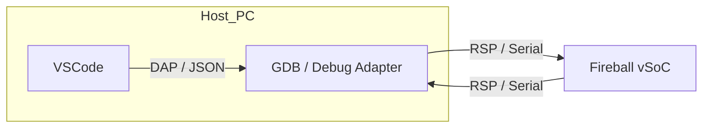
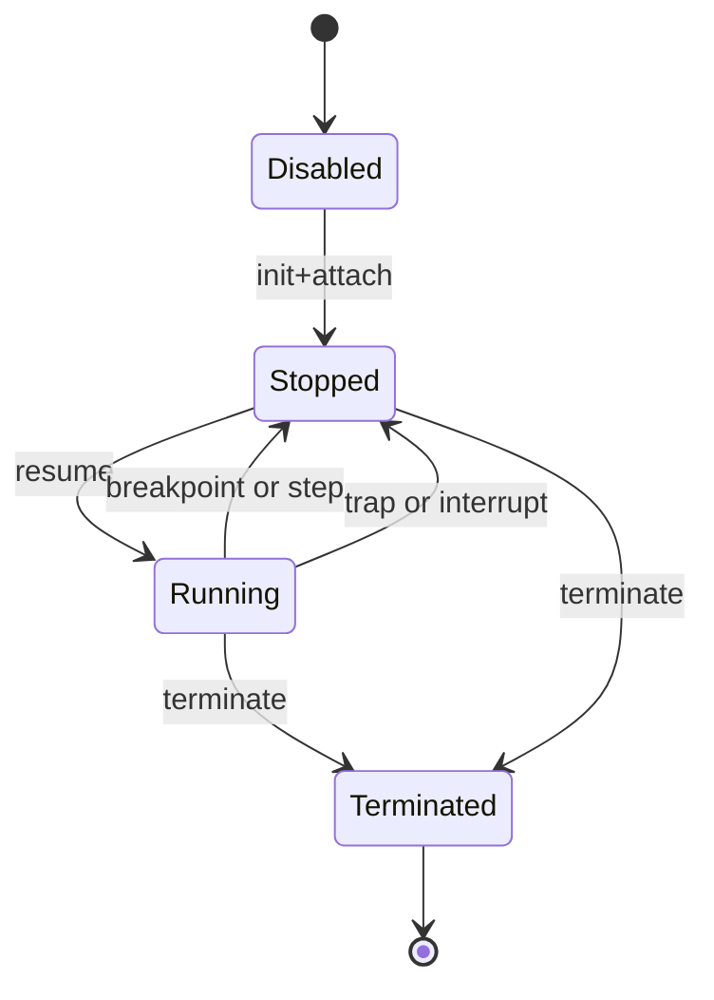

# デバッガ

## 概要
本ドキュメントは `docs/oders/components/vsoc.md` に基づき、デバッガの詳細仕様を定義する。

## コンセプト
- **RSP最小実装**: VSCodeのC/C++拡張が必要とする最小セットのGDB Remote Serial Protocol (RSP) を実装する。`{RSPMinimalSet}`
- **軽量・固定構成**: 組み込み向けにメモリを固定し、vSoCヒープ内で完結させる。`{ConfigurableSystem}` `{MemoryIsolation}`
- **インタープリタ連携**: デバッガ有効時はハンドラテーブルを切り替え、命令実行前後で停止条件を評価する。`{DebuggerLabelTableSwitch}`
- **JIT無効化**: 実装規模抑制のため、デバッガがアクティブな間はJITコンパイルおよびJIT実行を無効化し、インタープリタのみで動作する。
- **単一ゲスト前提**: 1ゲスト=1スレッドのRSPマッピングを基本とし、マルチゲストは将来拡張とする。`{SingleGuestThread}`

## プロトコル選定の根拠

Fireballでは、デバッグプロトコルとして **RSP (GDB Remote Serial Protocol)** を採用する。VSCodeのネイティブプロトコルである **DAP (Debug Adapter Protocol)** と比較し、以下の理由からRSPがプロジェクト要件に最適であると判断した。

### RSP vs DAP 比較

| 項目 | RSP | DAP |
|---|---|---|
| **リソース消費** | 極めて低い。数KBの固定バッファで動作。 | 高い。JSONパースに多大なRAMを消費。 |
| **実装規模** | 小さい。単純な文字列処理で完結。 | 大きい。JSON-RPCの実装が必要。 |
| **通信路** | UART等のシリアル通信で直接動作。 | 通常はTCP/IP等のソケットを想定。 |
| **標準サポート** | GDBのネイティブプロトコル。 | VSCodeのネイティブプロトコル。 |

### デバッグフロー

VSCodeからのデバッグは、ホスト側で動作するGDBまたはDebug AdapterがDAP-RSP翻訳を行うことで実現する。



## 構成要素
- **RSPトランスポート**: x64では標準出力、それ以外はUARTを使用する。`{DebuggerTransport}`
- **RSPパーサ**: RSPパケットの解析と応答の生成。
- **デバッガ制御**: 実行状態、停止理由、ブレークポイント管理、レジスタ/メモリ参照を提供。
- **インタープリタ連携**: 実行再開やステップ実行時にインタープリタを呼び出す。

## 提供する機能
| 機能 | 説明 | 導出元 |
|---|---|---|
| RSP最小コマンド対応 | `docs/oders/components/vsoc.md` 付録Bの最小セットを実装 | `{RSPMinimalSet}` |
| ブレークポイント管理 | `Z/z` の type0 を必須対応 | `{RSPCommandSet}` |
| レジスタ読み書き | `g/G/p/P` により仮想レジスタを取得/更新 | `{RSPCommandSet}` |
| メモリ読み書き | `m/M/X` によりWASMリニアメモリにアクセス | `{RSPCommandSet}` |
| 実行制御 | `c/s/vCont` により継続/ステップを制御 | `{RSPCommandSet}` |
| 停止理由通知 | `S/T/W/X` で停止理由を返却 | `{RSPResponseFormat}` |

## インターフェイス
本節ではデバッガの外部I/Fを定義する。

### 1. デバッガ制御インターフェイス
```cpp
namespace fireball::vsoc {

enum class DebugError : uint8_t {
    OK = 0,
    INVALID_COMMAND,
    INVALID_ARGUMENT,
    UNSUPPORTED,
    OUT_OF_MEMORY,
    INTERNAL_ERROR
};

enum class DebugState : uint8_t {
    DISABLED = 0,
    STOPPED,
    RUNNING,
    TERMINATED
};

enum class DebugStopReason : uint8_t {
    NONE = 0,
    BREAKPOINT,
    STEP_COMPLETE,
    TRAP,
    INTERRUPT,
    TERMINATED
};

struct DebugConfig {
    bool enabled;
    bool transport_stdout; // true: stdout, false: UART
    uint16_t max_packet_size;
    uint8_t max_breakpoints;
};

class Debugger {
public:
    DebugError init(const DebugConfig& config);
    DebugError attach(ExecutionContext* ctx);
    DebugError detach();

    DebugState state() const;
    DebugStopReason stop_reason() const;

    DebugError poll(); // RSP受信と応答処理
    DebugError resume();
    DebugError step();
    DebugError terminate();

private:
    ExecutionContext* ctx_;
    DebugState state_;
    DebugStopReason stop_reason_;
};

} // namespace fireball::vsoc
```

### 2. ブレークポイント管理インターフェイス
```cpp
namespace fireball::vsoc {

enum class BreakpointType : uint8_t {
    SOFTWARE = 0,
    HARDWARE = 1,
    WRITE_WATCH = 2,
    READ_WATCH = 3,
    ACCESS_WATCH = 4
};

struct Breakpoint {
    BreakpointType type;
    uint32_t address;
    uint32_t kind;
    bool enabled;
};

class Debugger {
public:
    DebugError set_breakpoint(const Breakpoint& bp);
    DebugError remove_breakpoint(const Breakpoint& bp);
};

} // namespace fireball::vsoc
```

## RSP最小コマンド仕様
本節は `docs/oders/components/vsoc.md` 付録Bに準拠する。未対応は `DebugError::UNSUPPORTED` を返す。

### セッション管理
- `?`, `c`, `C`, `s`, `S`, `k`

### メモリアクセス
- `m`, `M`, `X`

### レジスタアクセス
- `g`, `G`, `p`, `P`

### ブレークポイント
- `Z/z` は type0 を必須対応、type1-4は未対応

### スレッド情報
- `H`, `T` は単一ゲスト固定で常に thread-id=1 を返す

### 情報取得
- `qSupported`, `qTStatus`, `qOffsets`, `qSymbol`, `qfThreadInfo`, `qsThreadInfo`

### 実行制御
- `vCont` の `c/s/t/r` を受理するが `t/r` は未対応

## レジスタモデル
- 仮想レジスタ集合は `ExecutionContext` を基準とする。
- 例: `pc`, `stack_ptr`, `local_ptr`, `memory.size`

## 状態遷移


## ステップ実行のメカニズム

Fireball（ターゲット）はソースコードの構造を知らないため、ステップ実行は以下の責務分担で行われる。

- **RSPクライアント (GDB/VSCode)**: デバッグ情報 (DWARF) を用いて、ソース行とPC（オフセット）の対応を管理する。
- **RSPサーバ (Fireball)**: 「WASM命令を1つだけ実行して停止する」機能 (`s` コマンド) を提供する。

### ソースレベル・ステップの実現方法
クライアント側で以下のいずれかの制御を行うことで、ソースコード上の「次の行」への移動を実現する。

1. **逐次ステップ**: 行の範囲外のPCに到達するまで `s` コマンドを繰り返す。
2. **一時ブレークポイント**: 次の行の先頭PCを計算し、`Z0` (Software Breakpoint) を設置してから `c` (Continue) を送る。

## エラーコード
RSPの `ENN` 応答に対応する暫定コードを以下に定義する。汎用エラーコード体系策定時に統合する。

| コード | 意味 |
|---|---|
| E01 | INVALID_COMMAND |
| E02 | INVALID_ARGUMENT |
| E03 | UNSUPPORTED |
| E04 | OUT_OF_MEMORY |
| E05 | INTERNAL_ERROR |

## 性能制約と方策
- **低オーバーヘッド**: デバッガ無効時はハンドラテーブル切替を行わない。`{DebuggerLabelTableSwitch}`
- **固定長バッファ**: RSP受信バッファは固定長で確保する。`{ConfigurableSystem}`

## メモリ制約と方策
- **サブシステムヒープ使用**: デバッガはサブシステムヒープ内で完結する。`{MemoryIsolation}`
- **固定長構造**: ブレークポイント配列は固定長配列で管理する。`{NoStdVector}`
- **リソース競合への対策**: VSCode等のモダンなデバッガが要求するパケットバッファ（2KB）を確保しつつ、リソース制約下では `qSupported` 等で機能を最小限に絞り、クライアント側を基本コマンドにフォールバックさせることでメモリ消費を抑える。 `{Challenge_DebuggerResource}`

## 安全性制約と方策
- **境界チェック**: メモリアクセスは `ExecutionContext::memory` の範囲内に限定する。`{MemoryBoundaryCheck}`
- **不正コマンド拒否**: 未対応コマンドは `ENN` を返す。

## 仕様上の前提
- 1ゲスト=1スレッドでRSPにマッピングする。
- マルチゲストのRSP対応は将来拡張とする。
