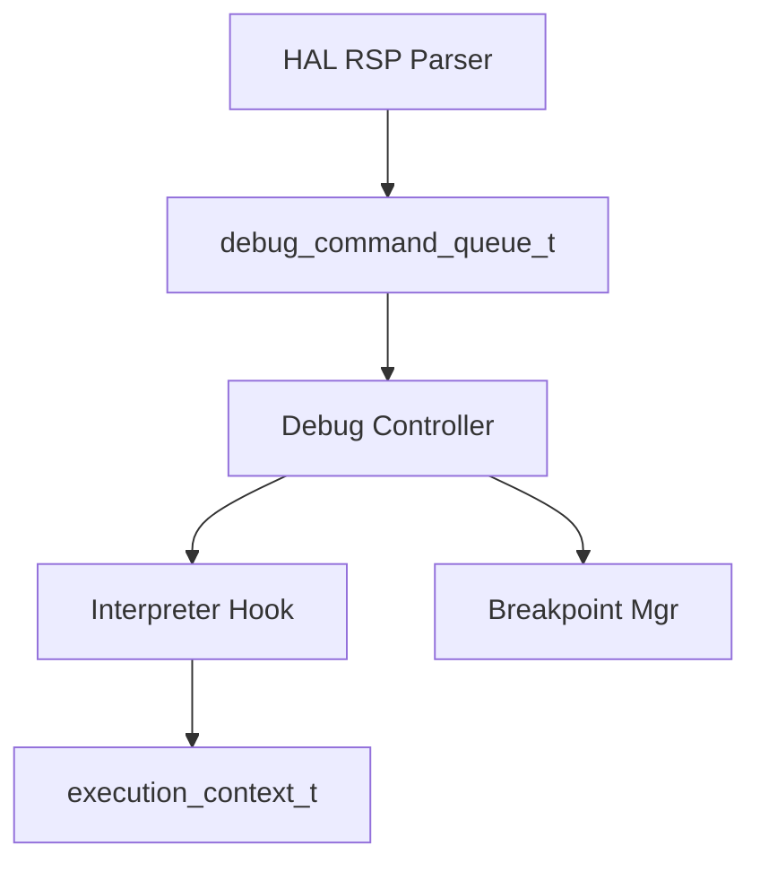
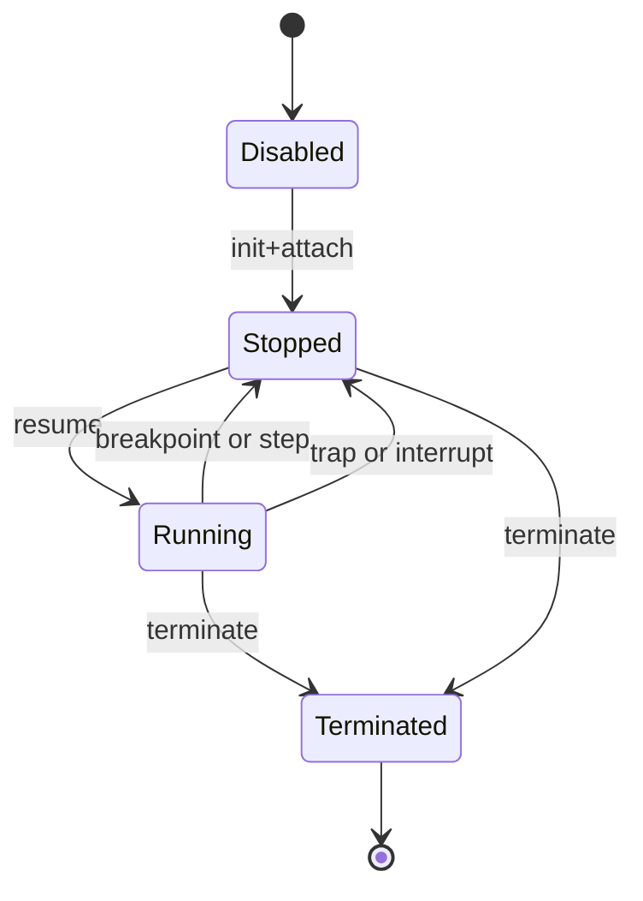
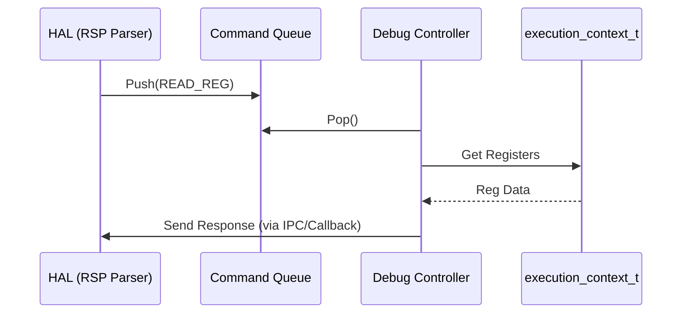

# デバッガ コンポーネント設計書

## 1. コンセプト
デバッガは、VSCode等の外部ツールからのデバッグを可能にするため、GDB Remote Serial Protocol (RSP) に基づく実行制御を行う。標準環境として VSCode, UART, J-Link をサポートする。RSPパケットの解析はHAL層で行われ、デバッガはHALから供給されるコマンドキューを消費して実行状態を制御する。リソース制約に対応するため、デバッグ中はJITを無効化し、インタープリタ実行にフォールバックする設計を採用する。 `{RSPMinimalSet}` `{DebuggerLabelTableSwitch}` `{MemoryIsolation}` `{Debug_Standard_Env}`

## 2. 静的モデル

### 2.1 データ構造
- **debug_command_queue_t**: HAL層のRSPパーサから供給される、解析済みデバッグコマンドのキュー。
- **breakpoint_t**: ソフトウェアブレークポイントを管理する固定長配列。 `{NoStdVector}`

### 2.2 内部ブロック図

### 2.3 主要な構造体・クラス・定数

#### `debug_command_t` (デバッグコマンド)
解析済みのRSPコマンドを表現する。

| メンバ名 | 型 | 説明 |
| :--- | :--- | :--- |
| `type` | `debug_cmd_type_t` | コマンド種別 (READ_REG, WRITE_MEM, CONTINUE, etc.) |
| `address` | `uint32_t` | 対象アドレス（メモリ/ブレークポイント用） |
| `data` | `std::span<uint8_t>` | 書き込みデータ等への参照 |

#### `breakpoint_t` (ブレークポイント情報)
ブレークポイントの状態と位置を管理する。

| メンバ名 | 型 | 説明 |
| :--- | :--- | :--- |
| `type` | `breakpoint_type_t` | 種類 (Software, Hardware, etc.) |
| `address` | `uint32_t` | WASM命令オフセット |
| `enabled` | `bool` | 有効/無効フラグ |

#### `virtual_register_set_t` (仮想レジスタセット)
GDB RSPに対して公開する仮想的なレジスタセット。 `{RSPMinimalSet}`

| レジスタ名 | 番号 | 対応する内部状態 | 説明 |
| :--- | :--- | :--- | :--- |
| `PC` | 0 | `execution_context_t.pc` | プログラムカウンタ（命令オフセット） |
| `LR` | 1 | `call_frame_t.return_address` | リンクレジスタ（戻り先アドレス） |
| `SP` | 2 | `execution_context_t.stack_ptr` | スタックポインタ（オペランドスタック） |
| `FP` | 3 | `call_frame_t.frame_base` | フレームポインタ（スタックフレーム基点） |

#### `J-Link RTOS Awareness` 用シンボル
J-Link GDB Serverプラグインがターゲットのメモリを解析するために必要なグローバルシンボル。

| シンボル名 | 型 | 説明 |
| :--- | :--- | :--- |
| `g_task_list` | `task_t*` | 全タスクのリストの先頭ポインタ |
| `g_current_task` | `task_t*` | 現在実行中のタスクへのポインタ |

## 3. 動的モデル

### 3.1 アルゴリズム
- **コマンド消費**: `poll()` により `debug_command_queue_t` から解析済みコマンドを取り出し、実行コンテキスト（`execution_context_t`）に対して操作を行う。
- **ステップ実行**: インタープリタを「1命令実行」モードで呼び出し、実行後に `Stopped` 状態へ遷移し、HAL層へ停止理由を通知する。

### 3.2 状態遷移図

### 3.3 内部シーケンス
#### デバッグコマンド処理シーケンス

## 4. インターフェイス定義

### 4.1 公開API
| メソッド名 | 引数 | 戻り値 | 説明 | 事前条件 | 事後条件 |
| :--- | :--- | :--- | :--- | :--- | :--- |
| `init` | `debug_config_t*` | `status_t` | デバッガを初期化する | なし | 状態がDisabledになる |
| `attach` | `execution_context_t*` | `status_t` | 実行コンテキストに接続 | Disabled状態 | 状態がStoppedになる |
| `poll` | `void` | `status_t` | コマンドキューを処理する | なし | 必要に応じて状態遷移 |
| `step` | `void` | `status_t` | 1命令実行する | Stopped状態 | 実行後Stoppedに戻る |

### 4.2 URI/IPCインターフェイス
- **コマンド入力**: HAL層からの内部関数呼び出し、または共有メモリ上のキュー経由。
- **レスポンス出力**: HAL層のRSPトランスポートへ解析結果を返却。

## 5. 制約達成の方策

### 5.1 性能制約と方策
- **目標**: デバッグ無効時のオーバーヘッドをゼロにする。
- **方策**: `{DebuggerLabelTableSwitch}` デバッガ無効時はインタープリタのハンドラテーブルを切り替えず、通常の高速実行を維持する。

### 5.2 メモリ制約と方策
- **目標**: 最小限のRAMでデバッグ機能を提供する。
- **方策**: `{MemoryIsolation}` `{NoStdVector}` デバッガ専用の固定長バッファと配列を使用し、動的メモリ確保を排除する。

### 5.3 安全性制約と方策
- **目標**: デバッガによる不正なメモリアクセスを防止する。
- **方策**: `{MemoryBoundaryCheck}` デバッグコマンドによるメモリアクセスに対し、WASMリニアメモリの境界チェックを強制する。

## 6. 設計完了チェックリスト（網羅性確認）
- [x] コンポーネントの責務が明確に定義されているか
- [x] 内部設計（データ構造、ブロック図、クラス、アルゴリズム）が適切に定義されているか
- [x] 内部ブロック図（静的）とシーケンス/状態遷移図（動的）がセットで定義されているか
- [x] 公開APIのメソッド名が英語で記述され、事前/事後条件が明確か
- [x] 非機能制約（性能、メモリ、安全性）に対する具体的な方策が明示されているか
- [x] 設計の交差点（トレードオフ）が解消されているか
- [x] 上位の要求 `{Keyword}` とのトレーサビリティが確保されているか
