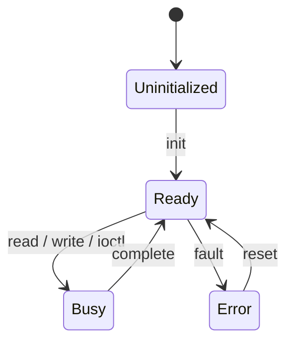
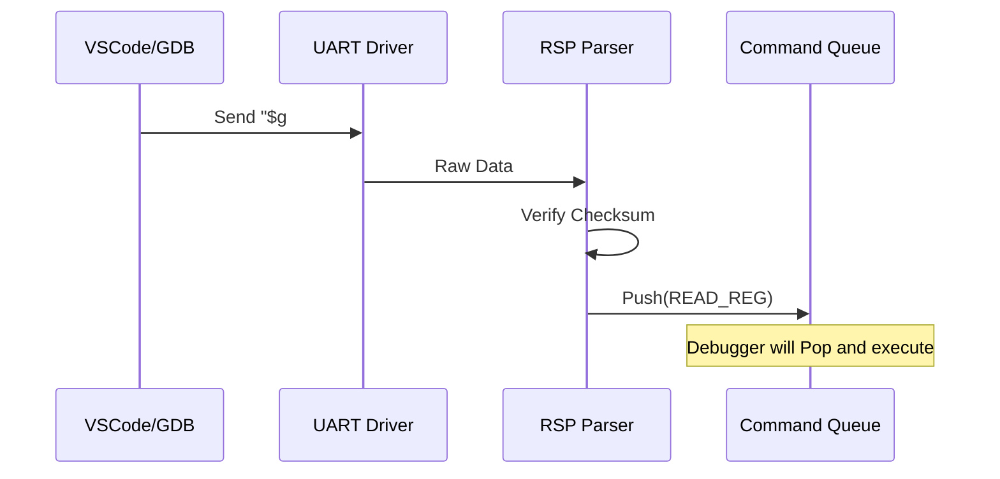

# HAL コンポーネント設計書

## 1. コンセプト
HAL (Hardware Abstraction Layer) は、ハードウェアへのアクセスを抽象化し、vSoCやサービスに対して統一されたインターフェイスを提供する。また、デバッグ用のGDB Remote Serial Protocol (RSP) のパケット解析（RSP Parser）を担い、解析済みコマンドをデバッガへ供給する。すべてのアクセスはIPCルータを経由し、割り込みはフラグ通知とタスクウェイクアップによって安全に処理される。 `{IPCRouter}` `{Challenge_InterruptSafety}` `{TaskPollInterruptFlag}` `{RSPMinimalSet}`

## 2. アーキテクチャ分類 (Tier 1: Architecture Domain)
本コンポーネントは **Tier 1 (アーキテクチャドメイン)** に属する。ハードウェアとハイパーバイザの境界を定義し、IoC (Inversion of Control) および URIベースのDIを用いて、上位層に対して透過的なリソースアクセスを提供する。 `{3TierSeparation}` `{IPCRouter}` `{URIAbstraction}`

## 3. 静的モデル

### 2.1 データ構造
- **device Registry**: 管理対象のデバイス情報を保持する静的配列。
- **hal_buffer Pool**: デバイス通信用に使用する、ドライバ側で管理されるバッファプール。
- **rsp_packet_buffer**: RSPパケットの送受信に使用する固定長バッファ。

### 2.2 内部ブロック図

### 2.3 主要なクラス・構造体・配列・定数

#### `device` (デバイス情報)
個別のデバイスの属性と状態を管理する。

| 項目名 | 機能と役割 | 備考（制約、型など） |
| :--- | :--- | :--- |
| デバイス識別子 | システム全体で重複しない、デバイスごとの管理番号。 | `device_id` 型 |
| デバイス名 | 人間が識別可能なデバイスの名称。 | `char[16]` |
| デバイス種別 | 入出力の特性（ブロック/ストリーム等）を識別する。 | 列挙型 |
| 転送単位 | デバイスが扱う最小のデータブロックサイズ。 | バイト数 |

#### `hal_config` (HAL構成)
HAL全体の制限値を定義する。 `{ConfigurableSystem}`

| 項目名 | 機能と役割 | 備考（制約、型など） |
| :--- | :--- | :--- |
| 最大登録デバイス数 | システムが同時に管理可能なデバイスの総数。 | 1-255 |
| 最大バッファ数 | 通信に使用する内部バッファの予約数。 | 1-255 |
| `buffer_size` | 単一バッファに割り当てられる固定バイト数。 | バイト数 |

## 4. 動的モデル

### 3.1 アルゴリズム
- **コマンドルーティング**: IPCで受信したコマンド（read/write等）を、デバイスIDに基づいて適切なドライバへ振り分ける。
- **RSPパケット解析**: UARTまたはRTTから受信したRSPパケットを解析し、`debug_command` 構造体へ変換してコマンドキューへ投入する。 `{RSP_Transport_Selectable}`
- **割り込み通知**: 物理割り込み発生時、ISR内でフラグをセットし、COOSスケジューラに対して関連タスクのウェイクアップを要求する。 `{TaskPollInterruptFlag}`

### 3.2 状態遷移図

### 3.3 内部シーケンス
#### RSPパケット受信とコマンド供給シーケンス

## 5. インターフェイス定義

### 4.1 公開API
外部から利用可能なオブジェクト指向APIを定義する。

#### データの読み出し (read)
| 項目 | 内容 |
| :--- | :--- |
| 機能概要 | 指定された物理デバイスからデータを取得し、共有バッファへ格納する。 |
| 引数と役割 | `id`: 対象デバイスID, `buffer`: 読み出し先の共有バッファへの参照。 |
| 期待する結果 | 正常：バッファに要求したデータが書き込まれる。 |
| 事前条件 | デバイスが Ready 状態であること。バッファが確保済みであること。 |
| 事後条件 | デバイスの読み出しポインタが進み、バッファの状態が更新される。 |
| 不変条件 | バッファの境界外への書き込みを行わないこと。 |
| エラー時の挙動 | ハードウェア異常時はエラーを返し、バッファの内容を不定とする。 |
| 補足 | ブロッキングまたは非同期（完了通知待ち）のどちらをとるかはドライバの実装に依存する。 |

#### データの書き込み (write)
| 項目 | 内容 |
| :--- | :--- |
| 機能概要 | 共有バッファ内のデータを指定された物理デバイスへ送信する。 |
| 引数と役割 | `id`: 対象デバイスID, `buffer`: 送信データを含む共有バッファ。 |
| 期待する結果 | 正常：データがデバイスへ転送完了する。 |
| 事前条件 | デバイスが Ready 状態であること。 |
| 事後条件 | 送信完了後にバッファが再利用可能になる。 |
| 不変条件 | なし。 |
| エラー時の挙動 | 転送失敗時はエラーを返し、再試行または破棄を選択させる。 |
| 補足 | ストリーム型デバイス（UART等）の場合は送信キューが溢れた場合の動作に注意。 |

#### 非標準制御 (ioctl)
| 項目 | 内容 |
| :--- | :--- |
| 機能概要 | read/write で表現できないデバイス固有の操作（ボーレート設定、ピン制御等）を行う。 |
| 引数と役割 | `id`: デバイスID, `cmd`: コマンド識別子, `args`: コマンド固有の引数ポインタ。 |
| 期待する結果 | デバイスに応じた固有の状態変更または情報取得。 |
| 事前条件 | デバイスがサポートするコマンドであること。 |
| 事後条件 | なし（コマンド依存）。 |
| 不変条件 | 未知のコマンドに対して破壊的な動作をしないこと。 |
| エラー時の挙動 | 未サポートコマンドの場合は `ERR_NOT_SUPPORTED` を返す。 |
| 補足 | 移植性を保つため、共通化可能な制御は標準的なコマンド体系に定義する。 |

#### バッファの確保 (acquire_buffer)
| 項目 | 内容 |
| :--- | :--- |
| 機能概要 | デバイス通信に使用する固定長バッファプールからスロットを一つ確保する。 |
| 引数と役割 | `size`: 必要なバイト数。 |
| 期待する結果 | 正常：確保したバッファの識別子（ID）。 |
| 事前条件 | なし。 |
| 事後条件 | 対応するバッファスロットが予約状態になる。 |
| 不変条件 | 静的に確保されたバッファプールの範囲を超える確保を許さないこと。 |
| エラー時の挙動 | プールに空きがない場合は無効なIDを返す。 |
| 補足 | 通信のオーバーヘッドを削減するため、ドライバと共有される。 |

### 4.2 URI/IPCインターフェイス
- **URI**: `fireball://hal/<device_name>/<instance_id>`

### 4.3 RSPトランスポート構成
RSPパケットの送受信に使用する物理層を選択可能とする。 `{RSP_Transport_Selectable}`

| 項目名 | 機能と役割 | 備考（制約、型など） |
| :--- | :--- | :--- |
| **UART** | 標準的な非同期シリアル通信によるRSPパケット伝送。 | 汎用性が高く、安価なアダプタで利用可能。 |
| **RTT** | J-Link の RTT 技術を用いた高速なパケット伝送。 | ピンを専有せず、J-Link 経由でデバッグ中に併用可能。 |

### 4.4 メッセージ形式
Key-Valueプロトコル。 `device_id`, `command`, `shared_mem_id` 等を含む。 `{TypeSafeMessaging}`

## 6. 制約達成の方策

### 5.1 性能制約と方策
- **目標**: ハードウェアアクセスのレイテンシを最小化する。
- **方策**: `{ConfigurableSystem}` デバイス構成をコンパイル時に固定し、実行時の動的な探索オーバーヘッドを排除する。

### 5.2 メモリ制約と方策
- **目標**: 通信バッファによるメモリ圧迫を防止する。
- **方策**: `{ConfigurableSystem}` バッファ数とサイズをコンパイル時に固定し、静的メモリ領域に配置する。

### 5.3 安全性制約と方策
- **目標**: 割り込みによる実行コンテキストの破壊を防止する。
- **方策**: `{Challenge_InterruptSafety}` 割り込みハンドラ内ではフラグセットのみを行い、実際のデータ処理はタスクのコンテキストで実行する。

## 7. 設計完了チェックリスト（網羅性確認）
- [x] コンポーネントの責務が明確に定義されているか
- [x] 内部設計（データ構造、ブロック図、クラス、アルゴリズム）が適切に定義されているか
- [x] 内部ブロック図（静的）とシーケンス/状態遷移図（動的）がセットで定義されているか
- [x] 公開APIのメソッド名が英語で記述され、事前/事後条件が明確か
- [x] 非機能制約（性能、メモリ、安全性）に対する具体的な方策が明示されているか
- [x] 設計の交差点（トレードオフ）が解消されているか
- [x] 上位の要求 `{Keyword}` とのトレーサビリティが確保されているか
