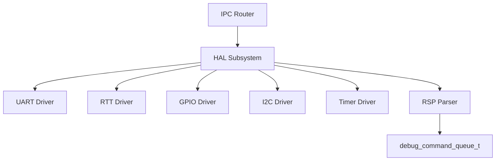
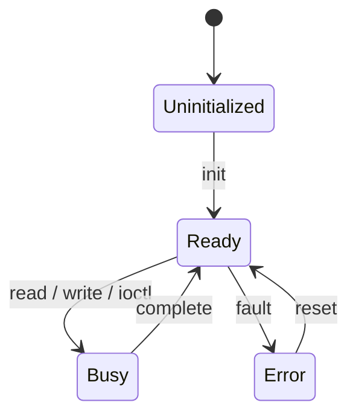
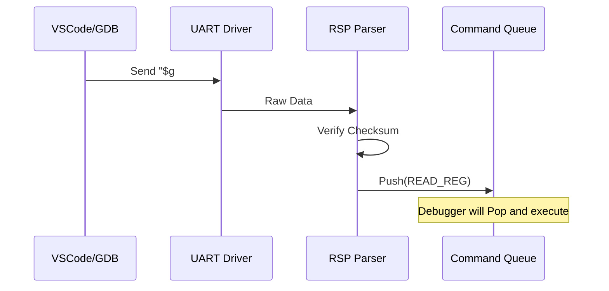

# HAL コンポーネント設計書

## 1. コンセプト
HAL (Hardware Abstraction Layer) は、ハードウェアへのアクセスを抽象化し、vSoCやサービスに対して統一されたインターフェイスを提供する。また、デバッグ用のGDB Remote Serial Protocol (RSP) のパケット解析（RSP Parser）を担い、解析済みコマンドをデバッガへ供給する。すべてのアクセスはIPCルータを経由し、割り込みはフラグ通知とタスクウェイクアップによって安全に処理される。 `{IPCRouter}` `{Challenge_InterruptSafety}` `{TaskPollInterruptFlag}` `{RSPMinimalSet}`

## 2. 静的モデル

### 2.1 データ構造
- **device_t Registry**: 管理対象のデバイス情報を保持する静的配列。
- **hal_buffer_t Pool**: デバイス通信用に使用する、ドライバ側で管理されるバッファプール。
- **rsp_packet_buffer_t**: RSPパケットの送受信に使用する固定長バッファ。

### 2.2 内部ブロック図

### 2.3 主要な構造体・クラス・定数

#### `device_t` (デバイス情報)
個別のデバイスの属性と状態を管理する。

| メンバ名 | 型 | 説明 |
| :--- | :--- | :--- |
| `id` | `device_id_t` | デバイスを一意に識別するID |
| `name` | `char[16]` | デバイス名 |
| `type` | `device_type_t` | デバイス種別 (BLOCK, STREAM) |
| `block_size` | `size_t` | 最小転送単位 |

#### `hal_config_t` (HAL構成)
HAL全体の制限値を定義する。 `{ConfigurableSystem}`

| メンバ名 | 型 | 説明 |
| :--- | :--- | :--- |
| `max_devices` | `uint8_t` | 管理可能な最大デバイス数 |
| `max_buffers` | `uint8_t` | 通信バッファの最大数 |
| `buffer_size` | `size_t` | 各バッファのサイズ |

## 3. 動的モデル (Dynamic Model)

### 3.1 アルゴリズム
- **コマンドルーティング**: IPCで受信したコマンド（read/write等）を、デバイスIDに基づいて適切なドライバへ振り分ける。
- **RSPパケット解析**: UARTまたはRTTから受信したRSPパケットを解析し、`debug_command_t` 構造体へ変換してコマンドキューへ投入する。 `{RSP_Transport_Selectable}`
- **割り込み通知**: 物理割り込み発生時、ISR内でフラグをセットし、COOSスケジューラに対して関連タスクのウェイクアップを要求する。 `{TaskPollInterruptFlag}`

### 3.2 状態遷移図

### 3.3 内部シーケンス
#### RSPパケット受信とコマンド供給シーケンス

## 4. インターフェイス定義

### 4.1 公開API
| メソッド名 | 引数 | 戻り値 | 説明 | 事前条件 | 事後条件 |
| :--- | :--- | :--- | :--- | :--- | :--- |
| `read` | `device_id, buffer` | `status_t` | データを読み出す | Ready状態 | 完了またはエラー |
| `write` | `device_id, buffer` | `status_t` | データを書き込む | Ready状態 | 完了またはエラー |
| `ioctl` | `device_id, cmd, args` | `status_t` | 制御コマンドを実行 | なし | デバイス依存 |
| `acquire_buffer` | `size` | `buffer_id_t` | 通信バッファを確保 | なし | バッファが確保される |

### 4.2 URI/IPCインターフェイス
- **URI**: `fireball://hal/<device_name>/<instance_id>`

### 4.3 RSPトランスポート構成
RSPパケットの送受信に使用する物理層を選択可能とする。 `{RSP_Transport_Selectable}`

| トランスポート | 説明 | メリット |
| :--- | :--- | :--- |
| **UART** | 標準的なシリアル通信 | 汎用性が高い |
| **RTT** | J-Link Real Time Transfer | 高速、ピン節約、J-Link経由で直接デバッグ可能 |
- **メッセージ形式**: Key-Valueプロトコル。 `device_id`, `command`, `shared_mem_id` 等を含む。 `{TypeSafeMessaging}`

## 5. 制約達成の方策

### 5.1 性能制約と方策
- **目標**: ハードウェアアクセスのレイテンシを最小化する。
- **方策**: `{ConfigurableSystem}` デバイス構成をコンパイル時に固定し、実行時の動的な探索オーバーヘッドを排除する。

### 5.2 メモリ制約と方策
- **目標**: 通信バッファによるメモリ圧迫を防止する。
- **方策**: `{ConfigurableSystem}` バッファ数とサイズをコンパイル時に固定し、静的メモリ領域に配置する。

### 5.3 安全性制約と方策
- **目標**: 割り込みによる実行コンテキストの破壊を防止する。
- **方策**: `{Challenge_InterruptSafety}` 割り込みハンドラ内ではフラグセットのみを行い、実際のデータ処理はタスクのコンテキストで実行する。

## 6. 設計完了チェックリスト（網羅性確認）
- [x] コンポーネントの責務が明確に定義されているか
- [x] 内部設計（データ構造、ブロック図、クラス、アルゴリズム）が適切に定義されているか
- [x] 内部ブロック図（静的）とシーケンス/状態遷移図（動的）がセットで定義されているか
- [x] 公開APIのメソッド名が英語で記述され、事前/事後条件が明確か
- [x] 非機能制約（性能、メモリ、安全性）に対する具体的な方策が明示されているか
- [x] 設計の交差点（トレードオフ）が解消されているか
- [x] 上位の要求 `{Keyword}` とのトレーサビリティが確保されているか
