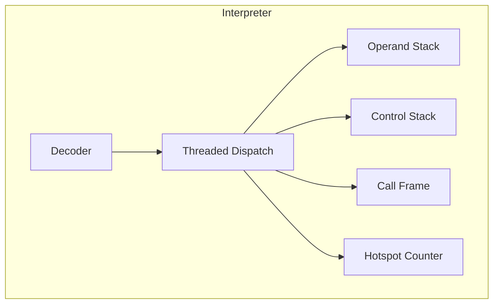
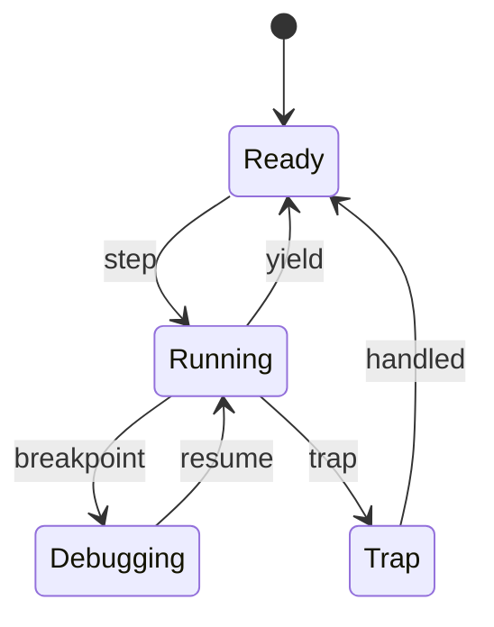
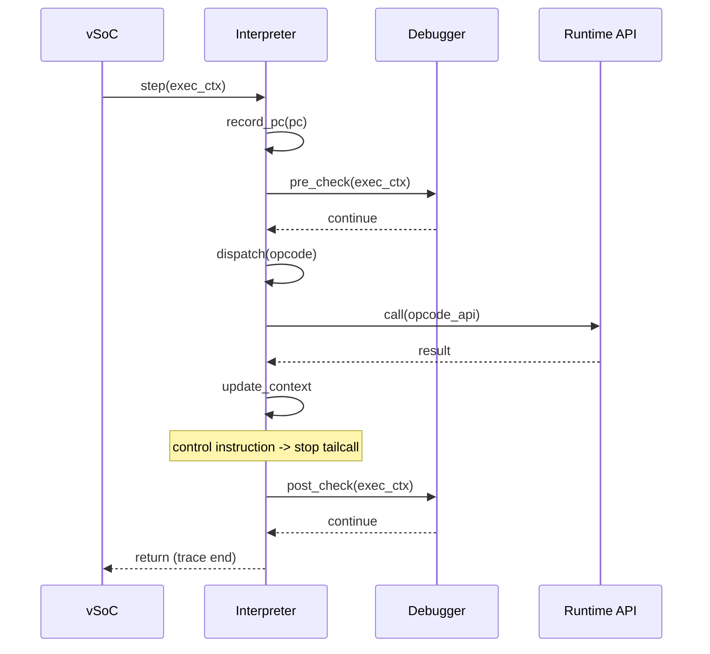

# Interpreter コンポーネント設計書

## 1. コンセプト
Interpreter は、WASM命令をスレッドインタープリタ方式で実行し、低レイテンシかつ小フットプリントでゲストを動作させる。`execution_context_t` を仮想CPUレジスタセットとして定義し、周辺コンポーネントへの参照は Environment Pointer (`env`) を介して階層化することで、実行ループの認知負荷を低減する。 `{ThreadedInterpreter}` `{LowLatencyJIT}` `{InterpreterContextStackless}` `{EnvironmentPointer}`

## 2. 静的モデル

### 2.1 データ構造
- **execution_context_t**: 仮想CPU状態。JITとインタープリタが共用する最小の実行状態を保持する。
- **call_frame_t**: 関数呼び出しごとのフレーム。WASMのローカルとオペランドスタックを参照する。
- **control_frame_t**: `block/loop/if` の制御構造を管理するフレームスタック。ジャンプ先の実行エントリ（`exec_trace`）を保持する。
- **interp_config_t**: インタープリタの動作パラメータ（スタックサイズ、yield閾値など）を保持する。
- **opcode_handler_t**: 命令ハンドラの関数型。ランタイムAPIと同一の `void __fastcall (PC, StackTop, Context)` を採用する。
- **opcode_handler_table**: 命令ハンドラの配列。WASM命令と1対1対応する。
- **debug_handler_table**: デバッグ時に使用する命令ハンドラ配列。ブレークポイント判定や計測を内蔵する。

### 2.2 内部ブロック図

### 2.3 主要な構造体・クラス・定数

#### `execution_context_t` (実行コンテキスト)
WASMゲストの全実行状態を管理する。JIT/Interpreter 共通の仮想CPUレジスタ群として設計する。前提となるアドレス型は **専用の型別名**（例: `wasm_addr_t`）で表現し、将来の拡張時に型変更を局所化する。 `{PositionIndependentCode}` `{ContextPointerRegister}`

| メンバ名 | 型 | 説明 |
| :--- | :--- | :--- |
| `pc` | `uint32_t` | 命令ポインタ（バイトコードオフセット） |
| `stack_ptr` | `uint32_t*` | オペランドスタックポインタ |
| `stack_base` | `uint32_t*` | オペランドスタック底面 |
| `memory_base` | `uint8_t*` | リニアメモリ開始アドレス |
| `memory_size` | `uint32_t` | リニアメモリサイズ |
| `active_handlers` | `opcode_handler_table*` | 現在使用中の命令ハンドラ配列への参照（通常/デバッグ切替） |
| `frame_ptr` | `call_frame_t*` | 現在のコールフレーム |
| `control_ptr` | `control_frame_t*` | 現在の制御フレーム |
| `env` | `vsoc_runtime_t*` | Environment Pointer (周辺コンポーネントへの参照) `{EnvironmentPointer}` |

#### `call_frame_t` (コールフレーム)
関数呼び出しごとの実行状態を保持する。WAMR の `WASMInterpFrame` を参考に最小化し、JIT復帰に必要な情報のみを残す。

| メンバ名 | 型 | 説明 |
| :--- | :--- | :--- |
| `prev_frame` | `call_frame_t*` | 呼び出し元フレーム |
| `return_pc` | `uint32_t` | 戻り先のバイトコードオフセット |
| `frame_base` | `uint32_t*` | ローカル基点（lp） |
| `func_idx` | `uint32_t` | 関数インデックス |
| `sp_boundary` | `uint32_t*` | スタック境界（オーバーフロー判定） |

#### `control_frame_t` (制御フレーム)
`block/loop/if` 命令による制御構造を管理する。ジャンプ先のPCと実行エントリを保持し、高速な分岐を実現する。

| メンバ名 | 型 | 説明 |
| :--- | :--- | :--- |
| `label_pc` | `uint32_t` | ジャンプ先のバイトコードオフセット |
| `exec_trace` | `exec_trace_t` | 実行エントリ（JITコードまたはインタープリタ） |
| `stack_ptr` | `uint32_t*` | ブロック開始時のスタックポインタ（復元用） |
| `is_loop` | `bool` | ループ構造かどうかのフラグ |

#### `interp_config_t` (インタープリタ構成)
インタープリタの動作パラメータを定義する。 `{ConfigurableSystem}`

| メンバ名 | 型 | 説明 |
| :--- | :--- | :--- |
| `stack_size` | `uint32_t` | オペランドスタックサイズ |
| `control_stack_size` | `uint32_t` | 制御スタックサイズ |
| `yield_threshold` | `uint32_t` | yield判定のトレース数しきい値 |

#### `opcode_handler_t` / `exec_trace_t` (実行エントリ型)
命令ハンドラおよびJITトレースの実行エントリは、ランタイムAPIと同一の関数型を採用する。 `{JIT_RuntimeAPI_Fallback}`

| 要素 | 型 | 説明 |
| :--- | :--- | :--- |
| `signature` | `void __fastcall (uint32_t pc, uint32_t stacktop, execution_context_t* ctx)` | `pc`, `stacktop`, `ctx` をレジスタ経由で受け取り、実行を継続する。 |

#### `opcode_handler_table` (命令ハンドラ配列)
WASM命令と1対1対応する命令ハンドラ配列。デバッグ時は専用の配列に切り替える。

| 要素 | 型 | 説明 |
| :--- | :--- | :--- |
| `handlers[]` | `opcode_handler_t` | opcodeに対応する命令ハンドラ配列 |

#### `debug_handler_table` (デバッグ用ハンドラテーブル)
デバッグモード時に `opcode_handler_table` から切り替えて使用する。各ハンドラは命令実行前後のブレークポイント判定と計測フックを含む。

| 要素 | 型 | 説明 |
| :--- | :--- | :--- |
| `handlers[]` | `opcode_handler_t` | デバッグ用命令ハンドラ配列（`void(PC, StackTop, Context)`） |

## 3. 動的モデル

### 3.1 アルゴリズム
- **Threaded Dispatch**: 命令ハンドラを連鎖させるテーブルディスパッチ方式で分岐コストを削減する。 `{ThreadedInterpreter}`
- **WASM命令とRuntime APIの1対1対応**: 各命令ハンドラは対応する `void __fastcall (PC, StackTop, Context)` ランタイムAPIを呼び出し、結果は `Context` に書き込まれる。 `{JIT_RuntimeAPI_Fallback}`
- **継続渡しトレース実行**: 命令ハンドラは継続渡しで次ハンドラへ遷移する。clang前提の `[[clang::musttail]]` を使用し、**非制御命令のみ**末尾呼び出しを行う。
- **ジャンプの高速化 (exec_trace)**: 制御命令（`br`, `br_if` 等）によるジャンプ先を `control_frame_t` 内の `exec_trace` に保持する。
    - `exec_trace` は初期状態ではインタープリタのディスパッチャを指すが、JITコンパイル後はJITコードのエントリポイントを指すように動的に切り替わる。
    - `br` 命令ハンドラは、ターゲットフレームの `exec_trace` を `[[clang::musttail]]` で呼び出すことで、インタープリタとJITの境界を意識せずに高速な遷移を実現する。
- **JIT更新戦略 (案C採用)**: JITコンパイルが完了しても、既存の制御スタック上の `exec_trace` は書き換えない。
    - 新しく `block`/`loop`/`if` 命令を実行して制御フレームを積む際に、最新の `exec_trace`（JIT済みならそのアドレス、未ならインタープリタ）を取得して保持する。
    - これにより、実装の複雑さを抑えつつ、次回のループ進入時から高速化の恩恵を受けることができる。
- **Fireballにおけるトレースの定義**: 一般的なJITにおける「基本ブロックの連鎖」ではなく、**「単一の基本ブロック（制御命令で終了する命令列）」**をトレースの単位とする。
- **次命令取得の責務**: 次の命令のオペコード取得は各命令ハンドラ内で行い、`opcode_handler_table` から次ハンドラを取得して末尾呼び出しする。
- **Hotspot検知**: トレース開始時のPCを履歴バッファに記録する。実際のホットスポット判定とJITコンパイル要求は、`co_yield` 時のアイドル時間に一括して行われる。 `{LowLatencyJIT}` `{SimpleJITArchitecture}`
- **概算Yield**: トレース実行数ベースで `co_yield` を発行し、協調型マルチタスクに整合させる。 `{Challenge_ApproximateYield}`
- **デバッグフック**: 命令実行前後でブレークポイント判定を行い、Debugger に制御を委譲する。 `{Debug_Integrated}`
- **デバッグ時のテーブル切替**: デバッグ状態に遷移した場合、通常の命令ハンドラ配列を `debug_handler_table` に切り替える。復帰時に通常配列へ戻す。

### 3.2 状態遷移図

### 3.3 内部シーケンス
#### Interpreter 実行シーケンス

## 4. インターフェイス定義

### 4.1 公開API
| メソッド名 | 引数 | 戻り値 | 説明 | 事前条件 | 事後条件 |
| :--- | :--- | :--- | :--- | :--- | :--- |
| `initialize` | `interp_config_t*` | `status_t` | インタープリタを初期化 | なし | Ready状態になる |
| `attach_context` | `execution_context_t*` | `status_t` | 実行コンテキストを接続 | Ready状態 | コンテキストが関連付く |
| `step` | `execution_context_t*` | `status_t` | 命令を実行 | コンテキスト接続済み | yield/trap/readyに遷移 |
| `notify_interrupt` | `execution_context_t*, irq_id` | `void` | 割り込み通知を反映 | なし | フラグが更新される |

### 4.2 URI/IPCインターフェイス
本コンポーネントは vSoC の内部ライブラリとして利用され、直接のIPCインターフェイスは持たない。

### 4.3 関連コンポーネントとの連携
| コンポーネント | 連携内容 | 参照データ構造 |
| :--- | :--- | :--- |
| **WASM Loader** | WASMバイナリの索引情報（関数、命令、即値）の提供 | `module_view_t` |
| **JIT Compiler** | ホットスポット情報の共有と実行エンジンの切り替え | `execution_context_t`, 履歴バッファ |
| **Debugger** | ブレークポイント判定と実行状態の可視化 | `debug_handler_table`, `execution_context_t` |
| **vSoC** | 実行制御（step）と協調型マルチタスク（yield）の管理 | `execution_context_t` |

## 5. 制約達成の方策

### 5.1 性能制約と方策
- **目標**: WAMRインタープリタを上回る実行速度。
- **方策**: `{ThreadedInterpreter}` による分岐削減と、ホットスポット検知による JIT 移行を組み合わせる。

### 5.2 メモリ制約と方策
- **目標**: 64KB RAM環境で動作。
- **方策**: `execution_context_t` と `call_frame_t` を最小化し、スタック領域を固定サイズ化する。

### 5.3 安全性制約と方策
- **目標**: ゲストの暴走を隔離。
- **方策**: `sp_boundary` と `memory_size` による境界チェック、`interrupt_flags` による安全な割り込み処理。

## 6. 設計完了チェックリスト（網羅性確認）
- [x] コンポーネントの責務が明確に定義されているか
- [x] 内部設計（データ構造、ブロック図、クラス、アルゴリズム）が適切に定義されているか
- [x] 内部ブロック図（静的）とシーケンス/状態遷移図（動的）がセットで定義されているか
- [x] 公開APIのメソッド名が英語で記述され、事前/事後条件が明確か
- [x] 非機能制約（性能、メモリ、安全性）に対する具体的な方策が明示されているか
- [x] 設計の交差点（トレードオフ）が解消されているか
- [x] 上位の要求 `{Keyword}` とのトレーサビリティが確保されているか
