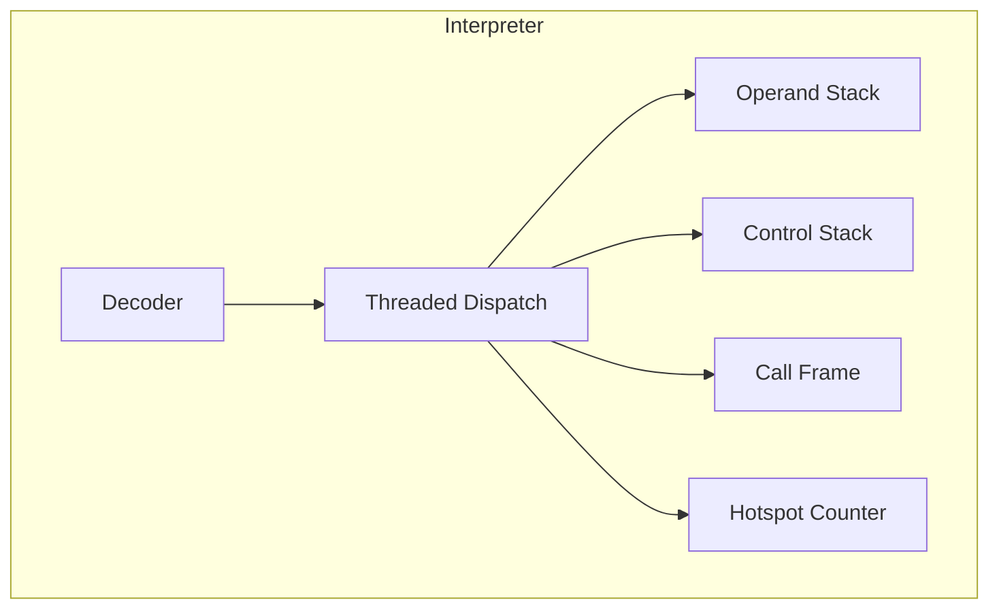
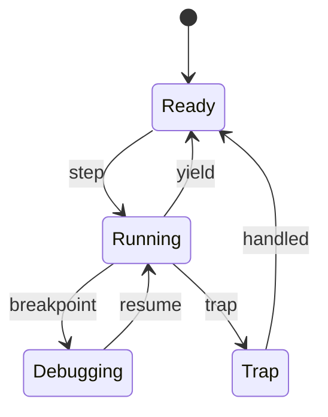
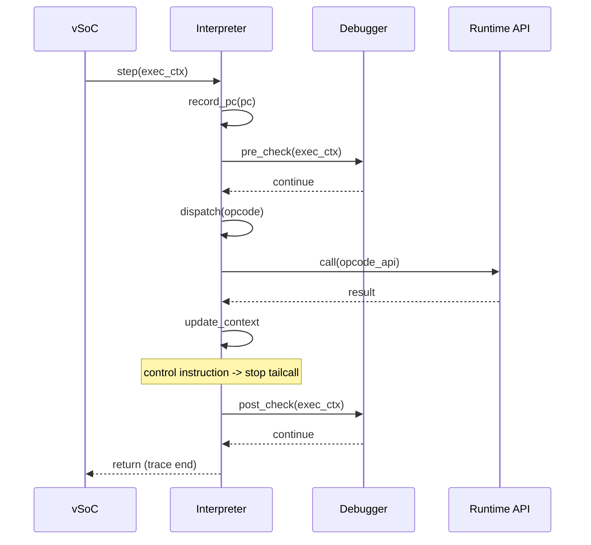

# Interpreter コンポーネント設計書

## 1. コンセプト
Interpreter は、WASM命令をスレッドインタープリタ方式で実行し、低レイテンシかつ小フットプリントでゲストを動作させる。`execution_context` を仮想CPUレジスタセットとして定義し、周辺コンポーネントへの参照は Environment Pointer (`env`) を介して階層化することで、実行ループの認知負荷を低減する。 `{ThreadedInterpreter}` `{LowLatencyJIT}` `{InterpreterContextStackless}` `{EnvironmentPointer}`

## 2. 静的モデル

### 2.1 データ構造
- **execution_context**: 仮想CPU状態。JITとインタープリタが共用する最小の実行状態を保持する。
- **call_frame**: 関数呼び出しごとのフレーム。WASMのローカルとオペランドスタックを参照する。
- **control_frame**: `block/loop/if` の制御構造を管理するフレームスタック。ジャンプ先の実行エントリ（`exec_trace`）を保持する。
- **interp_config**: インタープリタの動作パラメータ（スタックサイズ、yield閾値など）を保持する。
- **opcode_handler**: 命令ハンドラの関数型。ランタイムAPIと同一の `void __fastcall (PC, StackTop, Context)` を採用する。
- **opcode_handler_table**: 命令ハンドラの配列。WASM命令と1対1対応する。
- **debug_handler_table**: デバッグ時に使用する命令ハンドラ配列。ブレークポイント判定や計測を内蔵する。

### 2.2 内部ブロック図

### 2.3 主要なクラス・構造体・配列・定数

#### `execution_context` (実行コンテキスト)
WASMゲストの全実行状態を管理する。JIT/Interpreter 共通の仮想CPUレジスタ群として設計する。 `{PositionIndependentCode}` `{ContextPointerRegister}`

| 構成項目 | 機能と役割 | 備考（制約、型など） |
| :--- | :--- | :--- |
| `pc` | 現在実行中の命令を指し示すプログラムカウンタ（WASMバイトコードオフセット）。 | 32bitオフセット |
| `stack_ptr` | オペランドスタックの現在の頂点を指すポインタ。 | ポインタ |
| `stack_base` | オペランドスタックのメモリ領域の基点。 | ポインタ |
| `memory_base` | ゲストリニアメモリの開始アドレス。 | ポインタ |
| `memory_size` | ゲストリニアメモリの有効サイズ。境界チェックに使用。 | バイト数 |
| `active_handlers` | 現在有効な命令ハンドラテーブル（通常用またはデバッグ用）への参照。 | テーブルへのポインタ |
| `frame_ptr` | 現在実行中の関数に対応するコールフレームの頂点。 | ポインタ |
| `control_ptr` | 現在のブロック構造（loop/if等）を管理する制御フレームの頂点。 | ポインタ |
| `env` | vSoCランタイム等の周辺コンポーネントへアクセスするための環境ポインタ。 `{EnvironmentPointer}` | ポインタ |

#### `call_frame` (コールフレーム)
関数呼び出しごとのローカル変数や戻り先情報を保持する。

| 構成項目 | 機能と役割 | 備考（制約、型など） |
| :--- | :--- | :--- |
| `prev_frame` | 呼び出し元（親）のコールフレームへのポインタ。 | リスト構造 |
| `return_pc` | 関数終了後に戻るべきWASMバイトコードのオフセット。 | 32bitオフセット |
| `frame_base` | WASMローカル変数が格納されているスタック上の基点アドレス。 | ポインタ |
| `func_idx` | 現在の関数のインデックス。デバッグやプロファイリングで使用。 | インデックス |
| `sp_boundary` | 呼び出し時に計算されたスタックの最大許容レベル。オーバーフロー検知に使用。 | ポインタ |

#### `control_frame` (制御フレーム)
`block/loop/if` 命令によるネスト構造とジャンプ先を管理する。

| 構成項目 | 機能と役割 | 備考（制約、型など） |
| :--- | :--- | :--- |
| `label_pc` | ブロックを抜ける際、またはループの先頭に戻る際のジャンプ先バイトコード位置。 | 32bitオフセット |
| `exec_trace` | ジャンプ先の実行エントリ（JITコードまたはインタープリタハンドラ）。 | 関数ポインタ |
| `stack_ptr` | ブロック開始時点のオペランドスタックポインタ。ブロック脱出時のスタック復元に使用。 | ポインタ |
| `is_loop` | 現在の構造がループ（先頭へ戻る）かブロック（末尾へ抜ける）かを示すフラグ。 | ブール値 |

#### `interp_config` (インタープリタ構成)
インタープリタの動作パラメータを定義する。 `{ConfigurableSystem}`

| 構成項目 | 機能と役割 | 備考（制約、型など） |
| :--- | :--- | :--- |
| `stack_size` | オペランドスタックとして確保する総バイト数。 | バイト数 |
| `control_stack_size` | 制御フレームのネストを許容する最大数。 | エントリ数 |
| `yield_threshold` | 自発的に yield するまでのトレース実行数。同時に、ホットスポット検知用の実行履歴バッファ（History Buffer）のサイズもこの値に等しくなる。 | 回数 |

#### `opcode_handler` / `exec_trace` (実行エントリ)
命令ハンドラおよびJITトレースの共通実行シグネチャ。 `{JIT_RuntimeAPI_Fallback}`

| 構成項目 | 機能と役割 | 備考（制約、型など） |
| :--- | :--- | :--- |
| `signature` | PC, StackTop, Context をレジスタ経由で受け取り、実行を行う関数インターフェイス。 | `__fastcall` 推奨 |

## 3. 動的モデル

### 3.1 アルゴリズム
- **Threaded Dispatch**: 命令ハンドラを連鎖させるテーブルディスパッチ方式で分岐コストを削減する。 `{ThreadedInterpreter}`
- **WASM命令とRuntime APIの1対1対応**: 各命令ハンドラは対応する `void __fastcall (PC, StackTop, Context)` ランタイムAPIを呼び出し、結果は `Context` に書き込まれる。 `{JIT_RuntimeAPI_Fallback}`
- **継続渡しトレース実行**: 命令ハンドラは継続渡しで次ハンドラへ遷移する。clang前提の `[[clang::musttail]]` を使用し、**非制御命令のみ**末尾呼び出しを行う。
- **ジャンプの高速化 (exec_trace)**: 制御命令（`br`, `br_if` 等）によるジャンプ先を `control_frame` 内の `exec_trace` に保持する。
- **JIT更新戦略**: 新しく `block`/`loop`/`if` 命令を実行して制御フレームを積む際に、最新の `exec_trace`（JIT済みならそのアドレス、未ならインタープリタ）を取得して保持する。
- **Hotspot検知**: トレース開始時のPCを履歴バッファに記録する。このバッファは `step` 実行中にのみスタック等に一時保持される揮発的なデータであり、判定終了とともに自動的に破棄される。 `{LowLatencyJIT}` `{SimpleJITArchitecture}`
- **概算Yield**: トレース実行数ベースで `co_yield` を発行し、協調型マルチタスクに整合させる。 `{Challenge_ApproximateYield}`
- **デバッグフック**: 命令実行前後でブレークポイント判定を行い、Debugger に制御を委譲する。 `{Debug_Integrated}`

### 3.2 状態遷移図

### 3.3 内部シーケンス
#### Interpreter 実行シーケンス

## 4. インターフェイス定義

### 4.1 公開API
外部から利用可能なオブジェクト指向APIを定義する。

#### インタープリタの初期化
| 項目 | 内容 |
| :--- | :--- |
| 機能概要 | 命令ハンドラテーブルのセットアップやスタック領域の確保等、実行エンジンの初期状態を構築する。 |
| 引数と役割 | `config`: スタックサイズやyield閾値等の設定パラメータ。 |
| 期待する結果 | 正常：エンジンがReady状態になる。 |
| 事前条件 | 設定値がシステム制限（メモリサイズ等）に適合していること。 |
| 事後条件 | `opcode_handler_table` が正しく配置される。 |
| 不変条件 | 初期化後に設定値を変更できないこと。 |
| エラー時の挙動 | メモリ確保失敗時は初期化を中断し、エラー値を返す。 |
| 補足 | デバッグモードが指定された場合は `debug_handler_table` を使用するように構成する。 |

#### 命令の実行 (step)
| 項目 | 内容 |
| :--- | :--- |
| 機能概要 | 指定された実行コンテキストを用いてWASM命令を1トレース分（基本ブロック）実行する。 |
| 引数と役割 | `context`: WASM仮想レジスタやリソース参照を保持する実行状態。 |
| 期待する結果 | 正常：命令が実行され、制御命令またはyieldポイントで停止する。 |
| 事前条件 | コンテキストがロード済みのモジュールに紐付けられていること。 |
| 事後条件 | `context` 内の PC, SP 等の状態が最新の実行結果を反映していること。 |
| 不変条件 | スタックポインタが割り当て領域を逸脱しないこと。 |
| エラー時の挙動 | 不正命令（unreachable等）実行時はトラップを発生させる。 |
| 補足 | 実行中にJIT済みトレースに遭遇した場合は、透過的にネイティブ実行へ移行する。 |

#### 割り込み状態の同期
| 項目 | 内容 |
| :--- | :--- |
| 機能概要 | 外部から通知された割り込みフラグを、実行コンテキストの仮想レジスタに反映する。 |
| 引数と役割 | `context`: 対象の実行コンテキスト, `irq_id`: 割り込み識別子。 |
| 期待する結果 | `context` 内の `interrupt_flags` が更新され、次回のyield機会で反映される。 |
| 事前条件 | なし。 |
| 事後条件 | フラグがアトミックに書き込まれる。 |
| 不変条件 | 実行中の命令ハンドラから安全に参照可能であること。 |
| エラー時の挙動 | なし。 |
| 補足 | vSoC からの通知を仲介する役割を持つ。 |

### 4.2 URI/IPCインターフェイス
本コンポーネントは vSoC の内部ライブラリとして利用され、直接のIPCインターフェイスは持たない。

### 4.3 関連コンポーネントとの連携
| コンポーネント | 連携内容 | 参照データ構造 |
| :--- | :--- | :--- |
| **WASM Loader** | WASMバイナリの索引情報（関数、命令、即値）の提供 | `module_view_t` |
| **JIT Compiler** | ホットスポット情報の共有と実行エンジンの切り替え | `execution_context`, 履歴バッファ |
| **Debugger** | ブレークポイント判定と実行状態の可視化 | `debug_handler_table`, `execution_context` |
| **vSoC** | 実行制御（step）と協調型マルチタスク（yield）の管理 | `execution_context` |

## 5. 制約達成の方策

### 5.1 性能制約と方策
- **目標**: WAMRインタープリタを上回る実行速度。
- **方策**: `{ThreadedInterpreter}` による分岐削減と、ホットスポット検知による JIT 移行を組み合わせる。

### 5.2 メモリ制約と方策
- **目標**: 64KB RAM環境で動作。
- **方策**: `execution_context` と `call_frame` を最小化し、スタック領域を固定サイズ化する。

### 5.3 安全性制約と方策
- **目標**: ゲストの暴走を隔離。
- **方策**: `sp_boundary` と `memory_size` による境界チェック、`interrupt_flags` による安全な割り込み処理。

## 6. 設計完了チェックリスト（網羅性確認）
- [x] コンポーネントの責務が明確に定義されているか
- [x] 内部設計（データ構造、ブロック図、クラス、アルゴリズム）が適切に定義されているか
- [x] 内部ブロック図（静的）とシーケンス/状態遷移図（動的）がセットで定義されているか
- [x] 公開APIのメソッド名が英語で記述され、事前/事後条件が明確か
- [x] 非機能制約（性能、メモリ、安全性）に対する具体的な方策が明示されているか
- [x] 設計の交差点（トレードオフ）が解消されているか
- [x] 上位の要求 `{Keyword}` とのトレーサビリティが確保されているか
