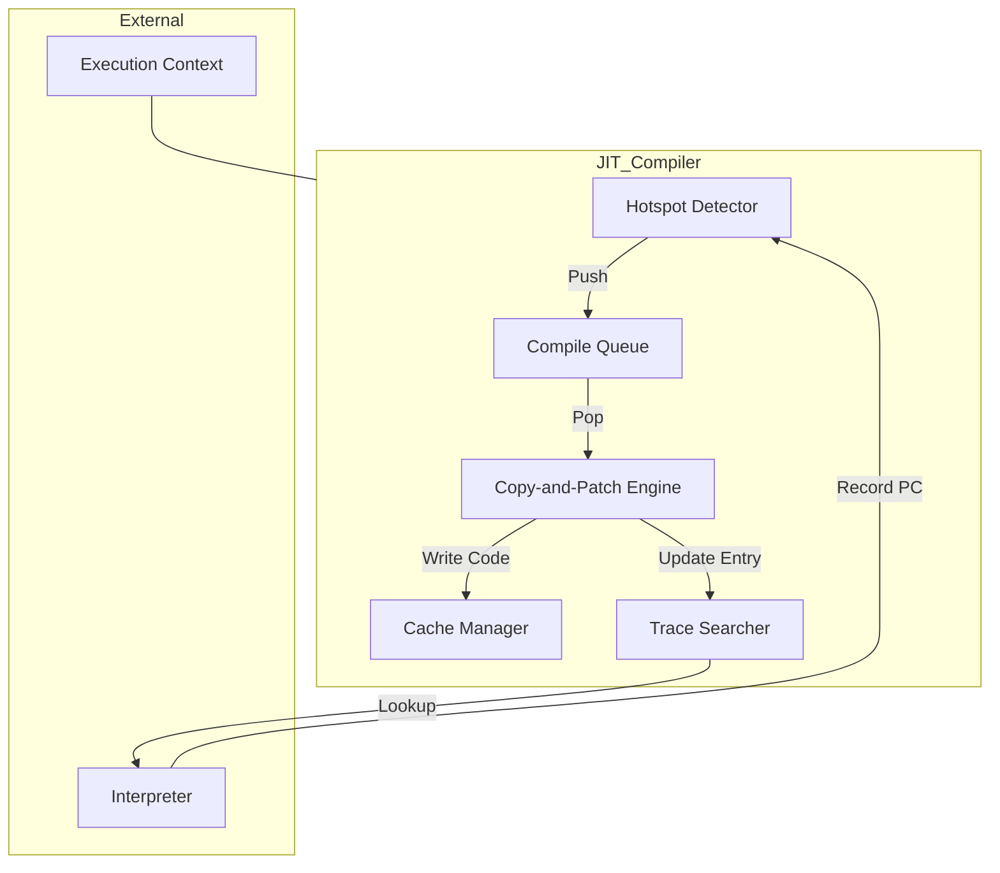
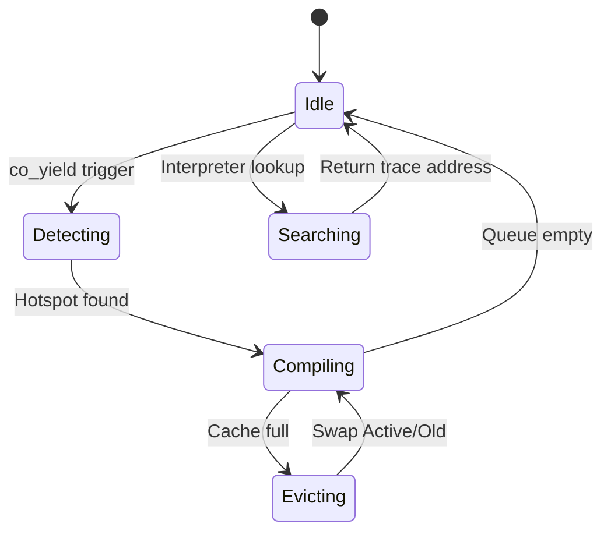
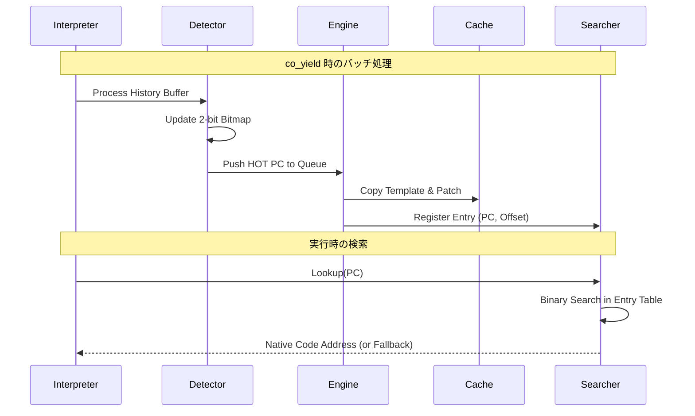

# JIT Compiler コンポーネント設計書

## 1. コンセプト
JIT Compiler は、WASMバイトコードを実行時にネイティブコードへ変換し、実行速度を向上させる。極小リソース環境（RAM 64KB）において、コンパイルコストを極小化する「Zero Compile Cost 定理」に基づき、最適化を省いた高速な **Copy-and-Patch** 方式を採用する。インタープリタと実行コンテキストを共有し、`co_yield` 時のアイドル時間を利用してホットスポットの判定とコンパイルを行うことで、実行時のオーバーヘッドを最小化する。 `{LowLatencyJIT}` `{JIT_CopyAndPatch}` `{JIT_ZeroCompileCostTheorem}` `{SimpleJITArchitecture}`

## 2. 静的モデル

### 2.1 データ構造
- **JIT Cache (Active/Old)**: ネイティブコードを保持するダブルバッファ。Copy-GC方式により、フラグメンテーションを回避しつつ効率的にメモリを再利用する。 `{JIT_DoubleBuffer_Cache}`
- **JIT Entry Table**: WASM PCとキャッシュ内のコードオフセットを紐付ける管理テーブル。カードマーキングと二分探索を組み合わせ、高速な検索を実現する。 `{SimpleJITArchitecture}`
- **Card Group Index**: 指定されたカード数（例：1024）をグループ単位（例：16カードごと）で管理するインデックステーブル。検索範囲の絞り込みに使用する。
- **Hotspot Bitmap (2-bit)**: 各コードブロックの実行頻度を管理する。0:未実行, 1:実行済み, 2:HOT の状態を持ち、2に達したブロックをコンパイル対象とする。
- **Compile Queue**: コンパイル待ちのWASM PCを保持するFIFO。

### 2.2 内部ブロック図

### 2.3 主要な構造体・クラス・定数

#### `jit_entry_t` (JITエントリ)
WASMバイトコードのオフセットと、対応するネイティブコードのキャッシュ内位置を紐付ける。メモリ節約のため `__attribute__((packed))` を使用する。

| メンバ名 | 型 | 説明 |
| :--- | :--- | :--- |
| `pc` | `uint32_t` | WASMバイトコードオフセット |
| `code_offset` | `uint16_t` | キャッシュ先頭からのオフセット（`JIT_CODE_ALIGN_SHIFT` 分のシフト済み値） |

#### `jit_cache_partition_t` (キャッシュパーティション)
Active/Old の各領域を管理する構造体。

| メンバ名 | 型 | 説明 |
| :--- | :--- | :--- |
| `base_addr` | `uint8_t*` | パーティションの開始アドレス |
| `used_size` | `uint32_t` | 現在の使用量 |
| `entries` | `jit_entry_t*` | エントリ配列へのポインタ |
| `entry_count` | `uint16_t` | 現在のエントリ数 |
| `group_index` | `uint16_t*` | カードグループインデックス配列へのポインタ |

#### `jit_config_t` (JIT構成)
JITコンパイラの動作パラメータ。システム構成に応じてコンパイル時に決定される。 `{ConfigurableSystem}`

| メンバ名 | 型 | 説明 |
| :--- | :--- | :--- |
| `cache_size_per_side` | `uint32_t` | 片側キャッシュサイズ（デフォルト 2KB） |
| `max_entries` | `uint16_t` | 最大エントリ数 |
| `history_buffer_size` | `uint16_t` | 履歴バッファサイズ（デフォルト 128） |
| `num_cards` | `uint16_t` | カードマーキングの総数（デフォルト 1024） |
| `cards_per_group` | `uint8_t` | 1グループあたりのカード数（デフォルト 16） |
| `code_align_shift` | `uint8_t` | コードアライメントのシフト量（デフォルト 3 = 8バイト境界） |

## 3. 動的モデル

### 3.1 アルゴリズム

#### Copy-and-Patch コンパイル手順
1. **テンプレート選択**: WASM命令に対応する事前定義済みのネイティブコードテンプレートを選択する。
2. **コードコピー**: テンプレートを Active Cache の `base_addr + used_size` へコピーする。
3. **パッチ適用 (Hole Filling)**: 
    - 即値（定数）をプレースホルダに書き込む。
    - ランタイムAPIのアドレスを書き込む。
    - 相対ジャンプ先を計算して書き込む。
4. **エントリ登録**: `jit_entry_t` を作成し、`pc` 順を維持するようにエントリ配列に挿入する。同時に `group_index` を更新する。

#### JITトレース検索アルゴリズム
1. **事前フィルタ**: ホットスポットビットマップを確認し、該当PCのカードが `HOT` でない場合は即座に終了（インタープリタ継続）。
2. **範囲絞り込み**: `pc` からカードIDを計算し、`group_index[card_id / cards_per_group]` を用いて探索対象のインデックス範囲を特定する。
3. **二分探索**: 絞り込まれた範囲内を `pc` で二分探索する。
4. **ヒット時**: `base_addr + (code_offset << code_align_shift)` を実行アドレスとして返す。

#### ホットスポット判定 (co_yield 時)
1. **履歴走査**: インタープリタが記録した履歴バッファを走査する。
2. **状態更新**: 2-bit ビットマップの該当PCの状態をインクリメントする。
3. **キュー投入**: 状態が `HOT` (2) に達し、かつ未コンパイルのPCを `Compile Queue` に投入する。
4. **バッチコンパイル**: キュー内のPCを順次コンパイルし、キャッシュへ書き込む。

### 3.2 状態遷移図

### 3.3 内部シーケンス
#### JITコンパイルおよび検索シーケンス

## 4. インターフェイス定義

### 4.1 公開API
| メソッド名 | 引数 | 戻り値 | 説明 | 事前条件 | 事後条件 |
| :--- | :--- | :--- | :--- | :--- | :--- |
| `initialize` | `jit_config_t*` | `status_t` | JITエンジンを初期化 | なし | Ready状態 |
| `lookup_trace` | `uint32_t pc` | `void*` | PCに対応するJITコードを検索 | Ready状態 | ヒットすればアドレス、未ならNULL |
| `process_hotspots` | `uint32_t* history, size_t len` | `void` | ホットスポット判定とコンパイルを実行 | `co_yield` 時 | キューが空になるまでコンパイル |
| `clear_cache` | `void` | `void` | キャッシュを全クリア | なし | 全エントリ無効化 |

### 4.2 URI/IPCインターフェイス
本コンポーネントは vSoC の内部ライブラリであり、直接のIPCインターフェイスは持たない。

## 5. 制約達成の方策

### 5.1 性能制約と方策
- **目標**: コンパイルレイテンシを最小化し、WAMRインタープリタを上回る実行速度を実現。
- **方策**: 
    - `{JIT_CopyAndPatch}`: 複雑な最適化を省き、テンプレートコピーのみでコンパイルを完了。
    - `{JIT_RegisterMapping}`: `Context`, `StackTop`, `WASM_PC` を物理レジスタに固定し、メモリアクセスを削減。
    - `Card Marking + Binary Search`: 検索範囲を限定し、対数時間での検索を実現。

### 5.2 メモリ制約と方策
- **目標**: RAM 64KB環境で動作（JITキャッシュ合計 4KB以内）。
- **方策**: 
    - `{JIT_DoubleBuffer_Cache}`: Active/Old 方式により、最小限のメモリでワーキングセットを維持。
    - `Packed Entry`: 1エントリ 6バイトに抑え、メタデータ領域を節約。
    - `Configurable Alignment`: `code_align_shift` により、ターゲットアーキテクチャに最適なアライメントとアドレス表現範囲を選択可能。

### 5.3 安全性制約と方策
- **目標**: 不正なコード実行の防止。
- **方策**: 
    - `{PositionIndependentCode}`: 生成コードを位置独立とし、配置場所の自由度を確保。
    - `Boundary Check`: コンパイル時にキャッシュ溢れを厳密にチェックし、溢れた場合は Old 領域を破棄して再利用。

## 6. 設計完了チェックリスト（網羅性確認）
- [x] コンポーネントの責務が明確に定義されているか
- [x] 内部設計（データ構造、ブロック図、クラス、アルゴリズム）が適切に定義されているか
- [x] 内部ブロック図（静的）とシーケンス/状態遷移図（動的）がセットで定義されているか
- [x] 公開APIのメソッド名が英語で記述され、事前/事後条件が明確か
- [x] 非機能制約（性能、メモリ、安全性）に対する具体的な方策が明示されているか
- [x] 設計の交差点（トレードオフ）が解消されているか
- [x] 上位の要求 `{Keyword}` とのトレーサビリティが確保されているか
