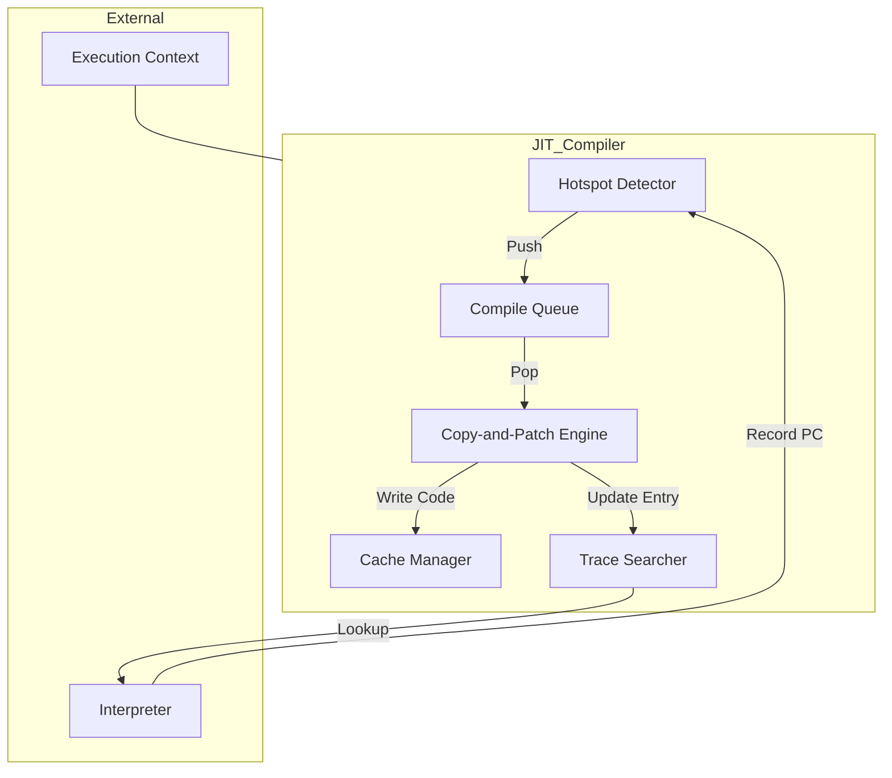
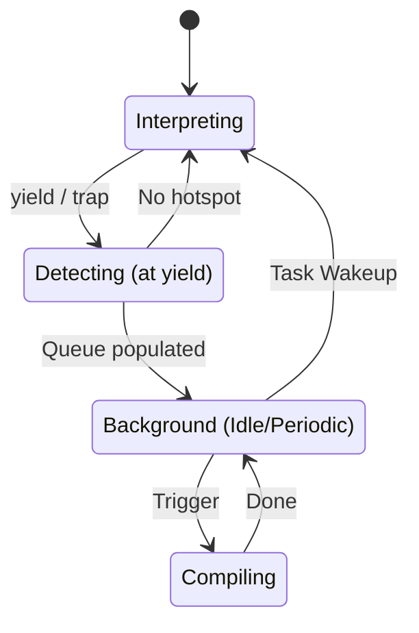
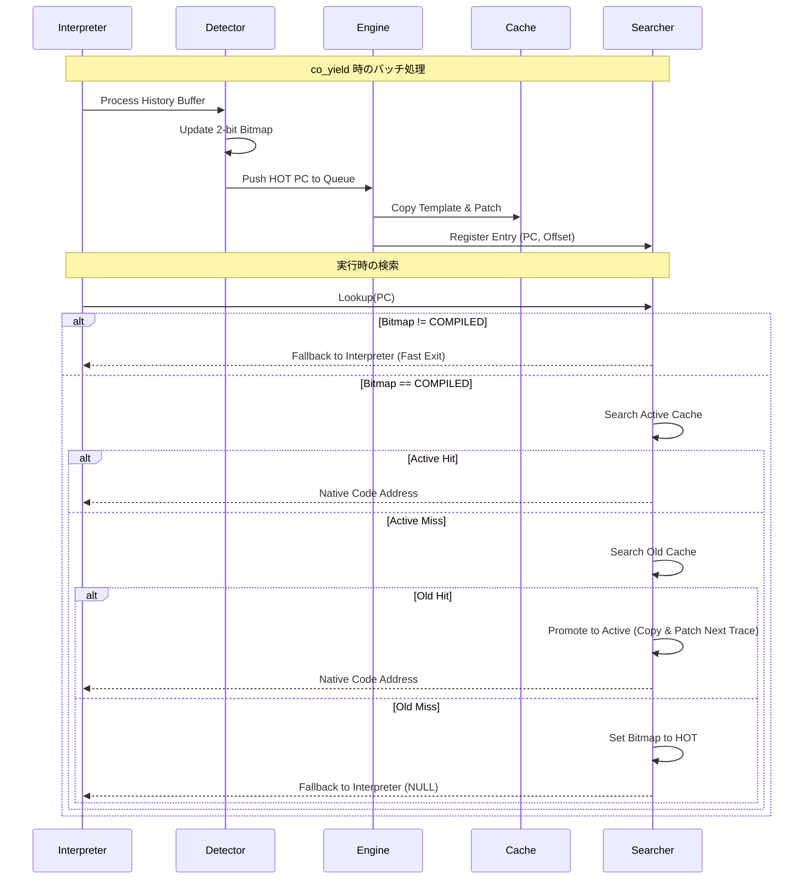

## 1. コンセプト
JIT Compiler は、WASMバイトコードを実行時にネイティブコードへ変換し、実行速度を向上させる。極小リソース環境（RAM 64KB）において、コンパイルコストを極小化する「Zero Compile Cost 定理」に基づき、最適化を省いた高速な **Copy-and-Patch** 方式を採用する。インタープリタと実行コンテキストを共有し、COOSの定期実行タスク（Callback Task）や **Idle Hook** による「隙間時間」を活用して、実行時のオーバーヘッドを最小化する。 `{LowLatencyJIT}` `{JIT_CopyAndPatch}` `{JIT_ZeroCompileCostTheorem}` `{SimpleJITArchitecture}` `{PeriodicTask}` `{IdleDetection}`

## 2. 静的モデル

### 2.1 データ構造
- **JIT Cache (Active/Old)**: ネイティブコードを保持するダブルバッファ。Copy-GC方式により、フラグメンテーションを回避しつつ効率的にメモリを再利用する。 `{JIT_DoubleBuffer_Cache}`
- **JIT Entry Table**: WASM PCとキャッシュ内のコードオフセットを紐付ける管理テーブル。カードマーキングと二分探索を組み合わせ、高速な検索を実現する。 `{SimpleJITArchitecture}`
- **Card Group Index**: 指定されたカード数をグループ単位で管理するインデックステーブル。検索範囲の絞り込みに使用する。高速化のため、カード数およびグループサイズは2のべき乗（シフト量）で管理される。
- **Hotspot Bitmap (2-bit)**: 各コードブロックの実行頻度とコンパイル状態を管理する。
    - `0: UNEXECUTED` (未実行)
    - `1: EXECUTED` (実行済み)
    - `2: HOT` (コンパイル要求中)
    - `3: COMPILED` (コンパイル済み/JIT実行可能)
- **Compile Queue (Stack behavior)**: コンパイル待ちのWASM PCを保持する。即時チェイニングを最大化するため、**後入れ先出し (LIFO)** または **履歴の逆順** で処理される。

### 2.2 内部ブロック図

### 2.3 主要なクラス・構造体・配列・定数

#### `jit_entry` (JITエントリ)
WASMバイトコードのオフセットと、対応するネイティブコードのキャッシュ内位置を紐付ける。

| 構成項目 | 機能と役割 | 備考（制約、型など） |
| :--- | :--- | :--- |
| `pc` | コンパイルされたトレースの開始位置を示すWASMバイトコードオフセット。 | 32bitオフセット |
| `code_offset` | キャッシュ（Active領域）の先頭からの相対的な命令開始位置。 | 16bit値（アライメント考慮済み） |

#### `jit_cache_partition` (キャッシュパーティション)
JITコンパイル済みのコードおよび管理索引を保持するメモリ領域。

| 構成項目 | 機能と役割 | 備考（制約、型のみ） |
| :--- | :--- | :--- |
| `base_addr` | パーティション（Active/Old）のメモリアドレスの起点。 | ポインタ |
| `used_size` | 現在この領域に書き込まれているネイティブコードの総バイト数。 | 32bitサイズ |
| `entries` | `jit_entry` 構造体の配列。PC順にソートされて保持される。 | 配列へのポインタ |
| `entry_count` | 現在このパーティションに登録されている有効なエントリ数。 | 16bit数 |
| `group_index` | 範囲を絞り込むためのカードグループインデックスへの参照。 | 配列ポインタ |

#### `jit_config` (JIT構成)
JITエンジンの挙動を制御する性能パラメータ。 `{ConfigurableSystem}`

| 構成項目 | 機能と役割 | 備考（制約、型など） |
| :--- | :--- | :--- |
| `cache_size_per_side` | 片方のキャッシュ（ActiveまたはOld）に割り当てる領域サイズ。 | バイト数（2のべき乗推奨） |
| `max_entries` | 単一パーティションに登録可能な最大トレース数。 | エントリ数 |
| `card_size_shift` | 検索を高速化するための「カード」一枚がカバーするWASMコードの範囲（2のべき乗）。 | シフト量 (6=64B等) |
| `code_align_shift` | 生成するネイティブコードの命令アライメント。 | シフト量 (3=8B等) |

## 3. 動的モデル

### 3.1 アルゴリズム

#### Copy-and-Patch コンパイル手順
1. **テンプレート選択**: WASM命令に対応する事前定義済みのネイティブコードテンプレートを選択する。
2. **コードコピー**: テンプレートを Active Cache の `base_addr + used_size` へコピーする。
3. **パッチ適用 (Hole Filling)**: 
    - 即値（定数）をプレースホルダに書き込む。
    - ランタイムAPIのアドレスを書き込む。
    - 相対ジャンプ先を計算して書き込む。
4. **エントリ登録**: `jit_entry` を作成し、`pc` 順を維持するようにエントリ配列に挿入する。同時に `group_index` を更新する。

#### JITトレース検索アルゴリズム
1. **事前フィルタ**: ホットスポットビットマップを確認し、該当PCの状態が `COMPILED (3)` でない場合は即座に終了（インタープリタ継続）。 `{SimpleJITArchitecture}`
2. **Active領域検索**:
    - `group_index` を用いてActive領域の探索範囲を絞り込み、`pc` で二分探索を行う。
    - ヒットした場合は、そのネイティブコードのアドレスを返して終了。
3. **Old領域検索と昇格 (Promotion)**:
    - Active領域でミスした場合、同様にOld領域を検索する。
    - Old領域でヒットした場合、そのトレースをActive領域へコピー（昇格）し、Active領域のエントリテーブルと `group_index` を更新する。
    - 昇格時にActive領域が溢れた場合は、ダブルバッファの入れ替え（Swap/Eviction）が発生する。
4. **結果の返却**:
    - ヒット（または昇格成功）時はネイティブコードのアドレスを返す。
    - いずれの領域でもミスした場合は、ビットマップ状態を `HOT (2)` に戻して NULL を返し、インタープリタ実行を継続する。

#### トレース・チェイニング（連鎖実行）
検索オーバーヘッドを排除するため、ネイティブコード同士を直接接続（チェイニング）する。
1. **トレース構造**: 各トレースの末尾に、次に実行すべきネイティブアドレスを保持する「チェイニング・スロット（`chain_next`）」を設ける。
2. **デフォルト状態**: スロットは初期状態で **Dispatcher Stub**（JIT検索エンジンを呼び出すスタック）を指す。
3. **連結（Linking）タイミング**:
    - **新規コンパイル時**: 生成したトレースから次に遷移するPCが既に Active 領域にあれば、スロットをそのアドレスへ書き換える。
    - **昇格（Promotion）時**: Old から Active へコピーされる際、リンクを再評価する。常に **Active 領域内のアドレス**、または **Stub** へリンクを行う。
4. **再配置の安全性**: 昇格（コピー）時に必ず新しい Active 領域のアドレスでリンク情報を再書き込みするため、Old 領域の古いアドレスへ飛ぶ（Dangling Pointer）ことはない。

#### ホットスポット判定 (yield 時)
1. **履歴走査**: インタープリタのタイムスライス開始時に一時的に確保されたトレース履歴バッファ（サイズは `yield_threshold`）を走査する。
2. **状態更新**: 2-bit ビットマップの状態が `HOT` に達したPCを `Compile Queue` に投入する。

#### バッチコンパイル (周期実行またはアイドル時)
1. **キューの取得**: `Compile Queue` からコンパイル待ちのPCを**逆順（LIFO）**で取り出す。 `{JIT_ReverseCompilationOrder}`
2. **コンパイル実行**: 後続のトレースを先にコンパイルすることで、先行するトレースのリンク時（Patching 時）にターゲットが既にキャッシュ内に存在する確率を上げ、即時チェイニングを実現する。
3. **補足**: COOSの `register_periodic_callback` または `set_idle_hook` により実行される。これにより、実行スレッドのブロッキング時間を抑える。 `{PeriodicTask}` `{IdleDetection}`

### 3.2 状態遷移図

### 3.3 内部シーケンス
#### JITコンパイルおよび検索シーケンス

## 4. 検証 (Verification) - Tier 3

### 4.1 直行表: 検索・昇格・GC
JITトレース検索時の内部状態と期待される挙動を検証する。

| ケース | ホットスポットBitmap | Active Cache | Old Cache | 期待される動作 |
| :--- | :--- | :--- | :--- | :--- |
| 1 | UNEXECUTED (0) | miss | miss | インタープリタ実行継続 |
| 2 | EXECUTED (1) | miss | miss | インタープリタ実行継続 |
| 3 | HOT (2) | miss | miss | インタープリタ継続 + キュー投入検討 |
| 4 | COMPILED (3) | **hit** | - | **JITコード実行** |
| 5 | COMPILED (3) | miss | **hit** | **Activeへ昇格(Copy)** + JIT実行 |
| 6 | COMPILED (3) | miss | miss | BitmapをHOT(2)へ戻す + インタープリタ |
| 7 | (昇格時) | Active満杯 | Old hit | **Old破棄 -> ActiveをOldへ -> 新Active** |

### 4.2 内部コンポーネントのデコンポジション
JITエンジンの責務を詳細化する。

- **Hotspot Detector**:
  - `yield` 時に履歴バッファを走査し、ビットマップを更新。
  - 閾値超えのPCを `Compile Queue` へプッシュ。
- **Copy-and-Patch Engine**:
  - **Template Resolver**: WASM命令に対応する符号化済みバイナリテンプレートを検索。
  - **Patch Applicator**: テンプレート内のプレースホルダ（即値、API、相対ジャンプ）を解決。
  - **Code Writer**: Active領域へ書き込み、アラインメントを調整。
- **Searcher / Entry Table Manager**:
  - `jit_entry` のソート済み挿入。
  - `group_index` (Card Group) の更新と二分探索の実行。

## 5. インターフェイス定義

### 4.1 公開API
外部から利用可能なオブジェクト指向APIを定義する。

#### エンジンの初期化
| 項目 | 内容 |
| :--- | :--- |
| 機能概要 | コードキャッシュ領域、管理テーブル、およびホットスポットビットマップの初期化を行う。 |
| 引数と役割 | `config`: キャッシュサイズや検索アルゴリズムに関係する各種閾値の設定。 |
| 期待する結果 | 正常：JITコンパイラがReady状態になり、検索およびコンパイルが可能な状態になる。 |
| 事前条件 | 設定パラメータが一貫しており、静的に確保されたメモリの範囲を超えていないこと。 |
| 事後条件 | ビットマップがクリアされ、キャッシュが空の状態になる。 |
| 不変条件 | 実行中に `config` の値を変更してはならない。 |
| エラー時の挙動 | メモリ割り当ての不備がある場合はエラーを返す。 |
| 補足 | `{ConfigurableSystem}` の方針に基づき、基本的にはブート時に一度だけ呼び出される。 |

#### トレースの検索 (Lookup)
| 項目 | 内容 |
| :--- | :--- |
| 機能概要 | 指定されたWASMプログラムカウンタ(PC)に対応する、コンパイル済みのネイティブコードの実行アドレスを高速に検索する。 |
| 引数と役割 | `pc`: WASMバイトコードオフセット。 |
| 期待する結果 | 正常：JITコードのアドレス。未コンパイル、あるいはJIT無効時はNULL。 |
| 事前条件 | JITコンパイラが初期化済みであること。 |
| 事後条件 | なし。 |
| 不変条件 | 検索は O(log N) またはカードインデックスによる高速な定数時間（概算）で終了すること。 |
| エラー時の挙動 | 検索中に境界例外が発生した場合は、安全のためNULLを返しインタープリタへフォールバックさせる。 |
| 補足 | インタープリタの主要なループ内で呼び出されるため、極めて高い実行効率が要求される。 |

#### ホットスポットの処理 (Batch Compile)
| 項目 | 内容 |
| :--- | :--- |
| 機能概要 | インタープリタが収集した実行履歴を分析し、頻繁に実行される（HOTな）ブロックをネイティブコードへコンパイルする。 |
| 引数と役割 | `history`: PCの配列、`len`: 配列の長さ。 |
| 期待する結果 | HOT判定されたブロックがすべてキャッシュに書き込まれ、索引が更新される。 |
| 事前条件 | `co_yield` によるアイドル時間中に呼び出されること。 |
| 事後条件 | `history` で示された履歴が処理済みとしてビットマップに反映される。 |
| 不変条件 | キャッシュが溢れた場合は、適切な追い出し（Eviction/GC）アルゴリズムを起動すること。 |
| エラー時の挙動 | コンパイルに失敗したブロックはスキップされ、インタープリタ実行対象として維持される。 |
| 補足 | `{SimpleJITArchitecture}` に従い、コンパイル中の並行実行は行わない（バッチ処理）。 |

### 4.2 URI/IPCインターフェイス
本コンポーネントは vSoC の内部ライブラリであり、直接のIPCインターフェイスは持たない。

## 5. 制約達成の方策

### 5.1 性能制約と方策
- **目標**: コンパイルレイテンシを最小化し、WAMRインタープリタを上回る実行速度を実現。
- **方策**: 
    - `{JIT_CopyAndPatch}`: 複雑な最適化を省き、テンプレートコピーのみでコンパイルを完了。
    - `{JIT_RegisterMapping}`: `Context`, `StackTop`, `WASM_PC` を物理レジスタに固定し、メモリアクセスを削減。
    - `Card Marking + Binary Search`: 検索範囲を限定し、対数時間での検索を実現。

### 5.2 安全性制約と方策
- **目標**: 不正なコード実行の防止。
- **方策**: 
    - `{PositionIndependentCode}`: 生成コードを位置独立とし、配置場所の自由度を確保。
    - `Boundary Check`: コンパイル時にキャッシュ溢れを厳密にチェックし、溢れた場合は Old 領域を破棄して再利用。

## 6. 設計完了チェックリスト（網羅性確認）
- [x] コンポーネントの責務が明確に定義されているか
- [x] 内部設計（データ構造、ブロック図、クラス、アルゴリズム）が適切に定義されているか
- [x] 内部ブロック図（静的）とシーケンス/状態遷移図（動的）がセットで定義されているか
- [x] 公開APIのメソッド名が英語で記述され、事前/事後条件が明確か
- [x] 非機能制約（性能、メモリ、安全性）に対する具体的な方策が明示されているか
- [x] 設計の交差点（トレードオフ）が解消されているか
- [x] 上位の要求 `{Keyword}` とのトレーサビリティが確保されているか
