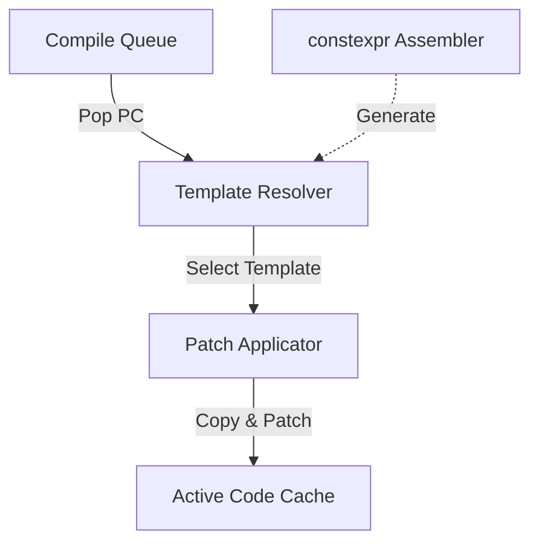
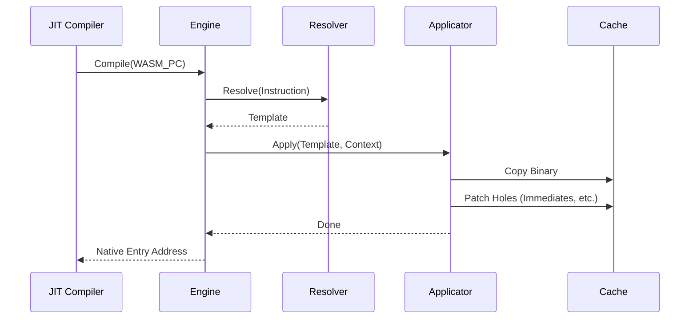

# コンポーネント設計：Copy-and-Patch Engine

## 1. コンセプト
Copy-and-Patch Engine は、WASM 命令に対応する事前生成されたネイティブコードテンプレートを結合・修正することで、ネイティブ実行バイナリを高速に生成する JIT コンパイラの核心部である。レジスタ割り当てや命令選択などの計算コストの高い最適化をビルド時にオフロードし、実行時は単純なメモリコピーと特定箇所への定数書き込み（パッチ）のみを行うことで、「Zero Compile Cost」を目指す。 `{JIT_CopyAndPatch}` `{JIT_ZeroCompileCostTheorem}` `{LowLatencyJIT}`

## 2. 静的モデル

### 2.1 データ構造
- **Instruction Template**: constexprアセンブラによって生成された、パッチ用の「穴（Hole）」を含むネイティブ命令列。
- **Patch Info**: テンプレート内のどのオフセットに何を（即値、APIアドレス等）書き込むかのメタデータ。

### 2.2 内部ブロック図

### 2.3 主要なクラス・構造体・配列・定数

#### `jit_template` (命令テンプレート)
WASM命令に対応するネイティブバイナリの雛形。

| 構成項目 | 機能と役割 | 備考 |
| :--- | :--- | :--- |
| `binary` | ネイティブ命令列のバイナリデータ。 | `uint32_t` 配列等 |
| `patch_count` | テンプレート内のパッチが必要な箇所の数。 | |
| `patches` | パッチ情報の配列（オフセット、パッチ種別）。 | |

## 3. 動的モデル

### 3.1 アルゴリズム

#### トレースコンパイル手順
1. **フェッチ**: WASM PCから命令をフェッチする。
2. **テンプレート選択**: WASM命令に対応する `jit_template` を取得する。
3. **コピー**: キャッシュの利用可能領域にテンプレートの `binary` をコピーする。
4. **パッチ適用 (Hole Filling)**:
   - WASM命令の即値（定数）をテンプレート内の指定オフセットに書き込む。
   - `Context` ポインタやランタイムAPIのアドレスをパッチする。
   - 分岐命令の相対オフセットを計算してパッチする。
5. **ポインタ更新**: キャッシュの `used_size` を更新する。

### 3.2 状態遷移図
本コンポーネントはステートレスなプロセッサとして動作するため、状態遷移は省略する。

### 3.3 内部シーケンス

## 4. インターフェイス定義

### 4.1 公開API

#### compile_trace
| 項目 | 内容 |
| :--- | :--- |
| 機能概要 | 指定されたWASMトレースをネイティブコードへ変換し、キャッシュへ書き込む。 |
| 引数と役割 | `pc`: コンパイル開始位置, `dest`: 書き込み先アドレス |
| 期待する結果 | 書き込まれた命令のサイズ、または失敗。 |
| 事前条件 | 書き込み先キャッシュに十分な空き容量があること。 |

## 5. 制約達成の方策

### 5.1 性能制約
- **方策**: `{JIT_CopyAndPatch}` により、コンパイル時間を最適化理論の限界まで短縮する。
- **方策**: ランタイムAPIフォールバック `{JIT_RuntimeAPI_Fallback}` により、複雑なエッジケースを簡素化する。

## 6. 設計完了チェックリスト
- [x] Copy-and-Patch の原理が記述されているか
- [x] パッチ適用のプロセスが明確か
- [x] 要求キーワード `{JIT_CopyAndPatch}` に紐づいているか
