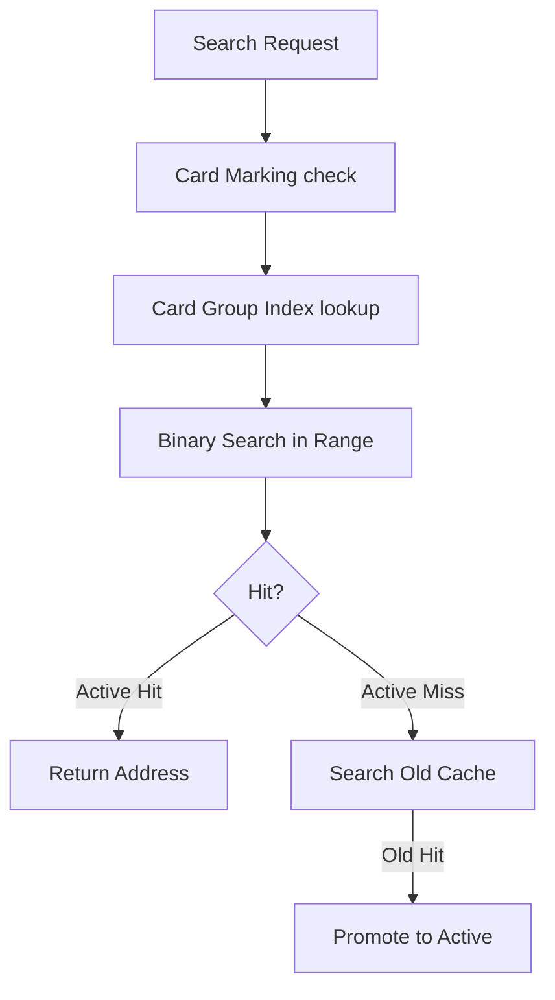
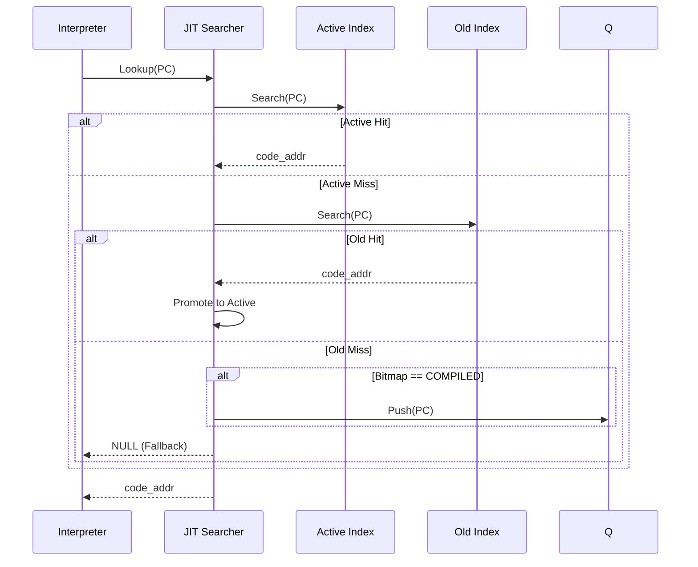

# コンポーネント設計：JIT Entry Index

## 1. コンセプト
JIT Entry Index は、WASM 命令オフセット（PC） とそれに対応するネイティブコードのアドレスの紐付けを管理する。
インタープリタの実行ループ内という極めてクリティカルなパスで呼び出されるため、**カードマーキング**（コンパイル状態の高速判定）と**カードグループ索引**（二分探索の範囲絞り込み）を組み合わせた高速な検索アルゴリズムを提供する。また、アクティブ・バックアップ領域（Active/Old）ダブルバッファ間のトレース昇格（Promotion）を制御し、限られたメモリ内での動的キャッシュ代謝を実現する。 `{SimpleJITArchitecture}` `{JIT_DoubleBuffer_Cache}`

## 2. アーキテクチャ分類 (Tier 3: Implementation Domain)
本コンポーネントは **Tier 3 (実装ドメイン)** に属する。JITコンパイラの内部データ構造管理に特化したモジュールであり、特定アルゴリズム（二分探索+Card Marking）の実装を担う。 `{3TierSeparation}` `{SimpleJITArchitecture}`

## 3. 静的モデル

### 2.1 データ構造
- **JITエントリ表 (`jit_entry` Table)**: 命令オフセット（WASMオフセット）と生成コード位置（キャッシュ内オフセット）のペアをオフセット昇順で保持する配列。
- **カードグループ索引 (Card Group Index)**: 複数のカードをグループ化し、各グループの最初の `jit_entry` の開始インデックスを保持する。検索範囲の絞り込みに使用する。

### 2.2 内部ブロック図

### 2.3 主要なクラス・構造体・配列・定数

#### `jit_entry`
PCとコードアドレスの対応。

| 項目名 | 機能と役割 | 備考（制約、型など） |
| :--- | :--- | :--- |
| バイトコードオフセット | 元のWASMバイナリにおける命令の位置。 | 32bit |
| 生成コード相対位置 | キャッシュ先頭からのオフセット。アライメント分だけ圧縮して保持。 | 16bit値 |

#### `card_group_index`
検索範囲を絞り込むためのインデックス。

| 項目名 | 機能と役割 | 備考（制約、型など） |
| :--- | :--- | :--- |
| グループ先頭索引 | 該当する「カードグループ」範囲内の最初の実行エントリへの番号。 | 16bit |

## 4. 動的モデル

### 3.1 アルゴリズム

#### 高速検索 (Lookup)
1. **カードマーキング確認**: カード単位でコンパイル状態を保持する「実行履歴マップ（ホットスポット・ビットマップ）」を確認し、状態が「コンパイル完了」でなければ即座に終了する。
    - ※ カード単位の管理であるため、コンパイルされていないオフセットでも同じカード内の他オフセットの影響でパスする場合がある（後に二分探索で厳密にチェックされる）。
2. **カードグループ検索**: 検索対象の命令オフセットを右シフトし、対応するカードグループ索引を取得する。これにより二分探索の範囲 `[low, high]` を限定する。
3. **二分探索**: `jit_entry` 配列の限定された範囲から対象の命令オフセットを検索する。
4. **オンデマンド・キューイング**: アクティブ・バックアップ領域の両キャッシュでミスし、かつ実行履歴マップの状態が「コンパイル完了」である場合は、対象の命令オフセットを「コンパイル待ち列」へ登録し、インタープリタ実行を継続する。

### 3.2 状態遷移図
本コンポーネントは管理情報の更新と検索を行うため、明確な内部状態（ステートマシン）は持たないが、エントリの `Valid/Invalid` を管理する。

### 3.3 内部シーケンス

## 5. インターフェイス定義

### 4.1 公開API

#### `lookup`
| 項目 | 内容 |
| :--- | :--- |
| 機能概要 | 指定された命令オフセット（PC）に対応するネイティブコードアドレスを返す。 |
| 引数と役割 | `ctx`: 実行コンテキスト, `pc`: WASM 命令オフセット (PC) |
| 期待する結果 | ネイティブアドレス、または NULL。 |

#### `register_entry`
| 項目 | 内容 |
| :--- | :--- |
| 機能概要 | 新しい命令オフセットとコードアドレスのペアを登録する。 |
| 引数と役割 | `ctx`: 実行コンテキスト, `pc`: WASM 命令オフセット (PC), `offset`: コード相対位置 |
| 事前条件 | 命令オフセット順を維持して挿入する必要がある（または挿入後にソート）。 |

## 6. 制約達成の方策

### 5.1 性能制約
- **方策**: カードグループインデックスによる範囲絞り込みと、二分探索の組み合わせにより、多数のトレースが存在しても高速な検索を維持する。

### 5.2 メモリ制約
- **方策**: `{JIT_DoubleBuffer_Cache}` による Copy-GC 方式により、断片化を防ぎつつ、実行頻度の低いコードを自然に破棄（代謝）させる。

## 7. 設計完了チェックリスト
- [x] Tier 3 (Implementation Domain) に基づき設計となっているか
- [x] 検索アルゴリズムが記述されているか
- [x] カードインデックスの役割が明確か
- [x] 要求キーワード `{JIT_DoubleBuffer_Cache}` と紐づいているか
- [x] `code_offset` のスケーラビリティ（ビットシフト）が明記されているか
