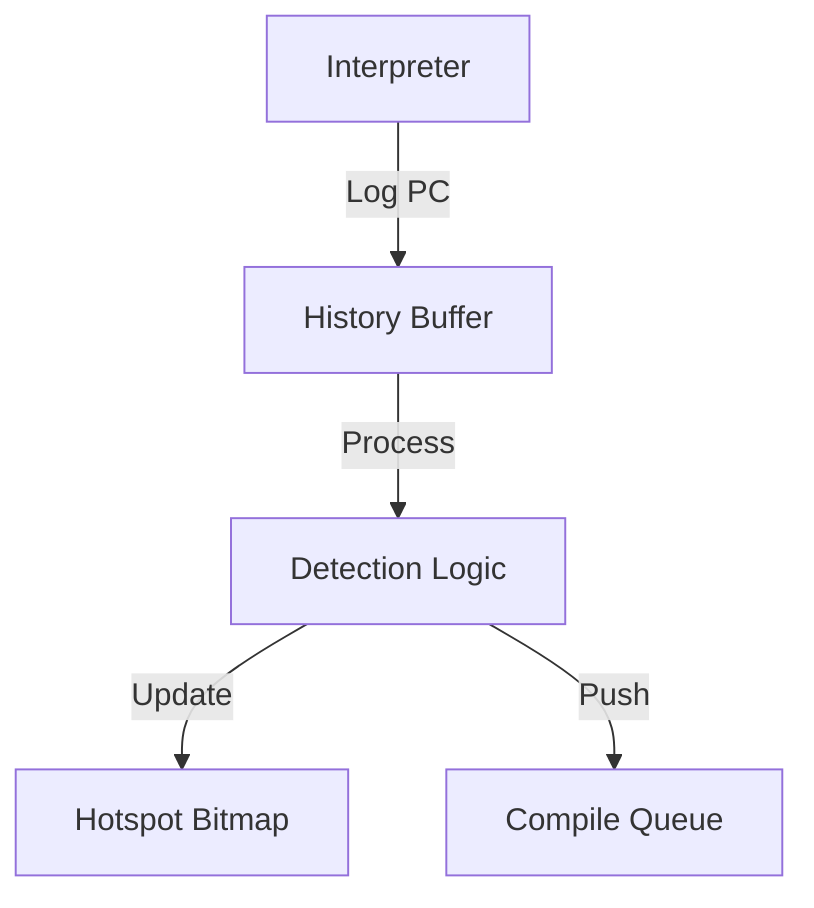
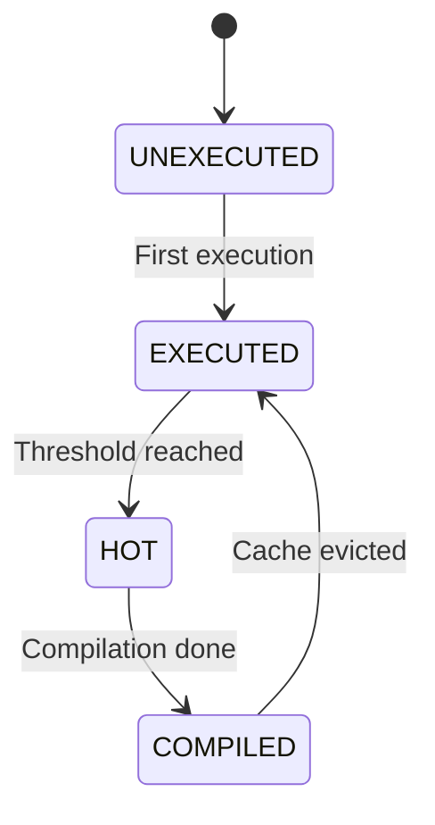

# コンポーネント設計：JIT Hotspot Detector

## 1. コンセプト
JIT Hotspot Detector は、インタープリタが実行したWASM命令の頻度を監視し、ネイティブコードへの転送（コンパイル）が必要な「ホットスポット」を特定する役割を担う。リソース制約の厳しい環境において、JITコンパイル対象を絞り込むことで、キャッシュ効率とコンパイルオーバーヘッドのバランスを最適化する。 `{LowLatencyJIT}` `{SimpleJITArchitecture}`

## 2. 静的モデル

### 2.1 データ構造
- **Hotspot Bitmap (2-bit)**: 各WASM PCの状態を管理する。メモリ節約のため2ビットで1ブロックを表現する。
- **History Buffer**: インタープリタのタイムスライス中に実行されたPCを一時的に保持するリングバッファまたはスタック。

### 2.2 内部ブロック図

### 2.3 主要なクラス・構造体・配列・定数

#### Hotspot Bitmap
WASM PCに対応する2ビットの状態。

| 構成項目 | 機能と役割 | 備考（制約、型など） |
| :--- | :--- | :--- |
| `UNEXECUTED (0)` | 未実行。 | 初期状態 |
| `EXECUTED (1)` | 実行済み。一度でも実行されたことを示す。 | |
| `HOT (2)` | コンパイル要求中。実行頻度が閾値を超えた。 | キュー投入対象 |
| `COMPILED (3)` | コンパイル済み。JIT実行が可能。 | JIT Searcherが参照 |

## 3. 動的モデル

### 3.1 アルゴリズム

#### ホットスポット判定 (Process History)
1. `yield` 時（またはトラップ時）に呼び出される。
2. History Buffer に蓄積された各PCを走査する。
3. ビットマップ状態を更新する：
   - `UNEXECUTED` -> `EXECUTED`
   - `EXECUTED` -> `HOT`
4. 状態が `HOT` に遷移したPCを `Compile Queue` へプッシュする。

### 3.2 状態遷移図

## 4. インターフェイス定義

### 4.1 公開API

#### record_execution
| 項目 | 内容 |
| :--- | :--- |
| 機能概要 | インタープリタ実行中に、現在のPCを実行履歴に記録する。 |
| 引数と役割 | `pc`: WASM PC |
| 期待する結果 | History Buffer への追加。 |
| 事前条件 | なし。 |

#### process_history
| 項目 | 内容 |
| :--- | :--- |
| 機能概要 | 履歴バッファを走査し、ビットマップの更新とコンパイルキューへの投入を行う。 |
| 引数と役割 | なし。 |
| 期待する結果 | ホットスポットが特定され、コンパイル待ち行列に追加される。 |
| 補足 | `co_yield` 時に呼び出す。 |

## 5. 制約達成の方策

### 5.1 性能制約
- **方策**: 2-bitビットマップにより、高速な状態遷移とメモリ節約を両立する。

## 6. 設計完了チェックリスト
- [x] コンポーネントの責務が明確か
- [x] 状態遷移図が定義されているか
- [x] トラセビリティ `{LowLatencyJIT}` があるか
