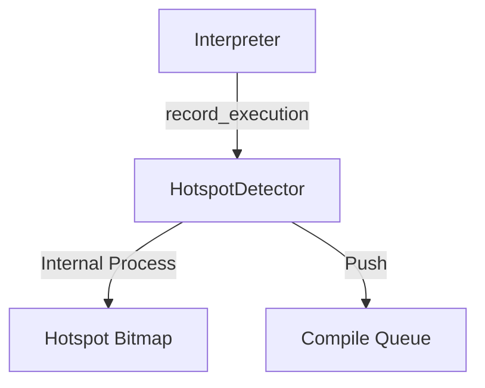
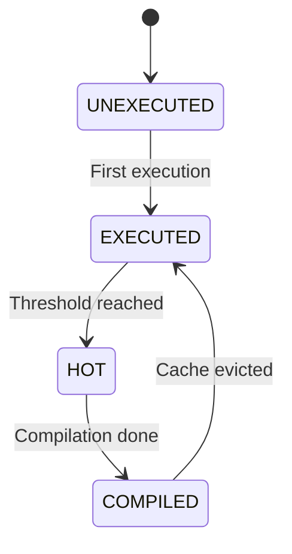

# コンポーネント設計：JIT Hotspot Detector

## 1. コンセプト
JIT Hotspot Detector は、インタープリタが実行したWASM命令の頻度を監視し、ネイティブコードへの転送（コンパイル）が必要な「ホットスポット」を特定する役割を担う。リソース制約の厳しい環境において、JITコンパイル対象を絞り込むことで、キャッシュ効率とコンパイルオーバーヘッドのバランスを最適化する。 `{LowLatencyJIT}` `{SimpleJITArchitecture}`

## 2. アーキテクチャ分類 (Tier 3: Implementation Domain)
本コンポーネントは **Tier 3 (実装ドメイン)** に属する。JITコンパイラの内部コンポーネントであり、統計情報の管理とコンパイル要否の判定に特化したアルゴリズムを実装する。 `{3TierSeparation}` `{SimpleJITArchitecture}`

## 3. 静的モデル

### 3.1 データ構造 (Natural OO)
- **`HotspotDetector` (Class)**: 実行頻度の監視、状態管理、およびコンパイル対象の特定を一括して行う主要クラス。
- **ホットスポット・ビットマップ (Bitmap)**: WASMコード領域を分割管理する2ビットの状態配列（プライベートメンバ）。
- **実行履歴バッファ (History Buffer)**: 短期間の実行履歴を一時的に保持するスタックまたはリングバッファ。

### 3.2 内部ブロック図

#### `HotspotDetector` クラス
統計情報の管理と判定ロジックをカプセル化する。

| 項目名 | 機能と役割 | 備考（制約、型など） |
| :--- | :--- | :--- |
| ビットマップ | WASM カードごとの実行状態（未実行/実行済/頻出/完了）。 | 固定長配列等 |
| 履歴バッファ | 判定契機（yield等）までの一時的な実行記録。 | 固定長配列等 |

## 4. 動的モデル

### 4.1 アルゴリズム

#### ホットスポット判定 (履歴処理)
1. 実行権放棄（`yield`）時、または例外発生時に呼び出される。
2. 実行履歴バッファに蓄積された各命令オフセット（PC）を走査する。
3. 命令オフセットを右シフトして対応する「カード」を特定し、実行履歴マップ（ビットマップ）の状態を更新する：
   - 「未実行」 -> 「実行済」
   - 「実行済」 -> 「頻出」
4. 状態が「頻出」に遷移したカード（およびその契機となったオフセット）を「コンパイル待ち列」へ登録し、状態を「コンパイル完了」に更新する。
   - ※ 以降、このカード内の他オフセットが実行された際は、JITエントリ索引（検索側）がコンパイル済みであることを検知する。

### 4.2 状態遷移図

## 5. インターフェイス定義

### 5.1 公開API

#### `record_execution`
| 項目 | 内容 |
| :--- | :--- |
| 機能概要 | 命令オフセット（PC）を履歴バッファに追記する。 |
| 引数と役割 | `pc`: WASM 命令オフセット |

#### `process_history`
| 項目 | 内容 |
| :--- | :--- |
| 機能概要 | 蓄積された履歴を基にビットマップの状態を更新し、ホットスポットを特定する。 |
| 補足 | 実行権放棄（`yield`）時に呼び出す。 |

## 6. 制約達成の方策

### 6.1 性能制約
- **方策**: 2-bitビットマップにより、高速な状態遷移とメモリ節約を両立する。

## 7. 設計完了チェックリスト
- [x] Tier 3 (Implementation Domain) に基づき設計となっているか
- [x] コンポーネントの責務が明確か
- [x] 状態遷移図が定義されているか
- [x] トラセビリティ `{LowLatencyJIT}` があるか
