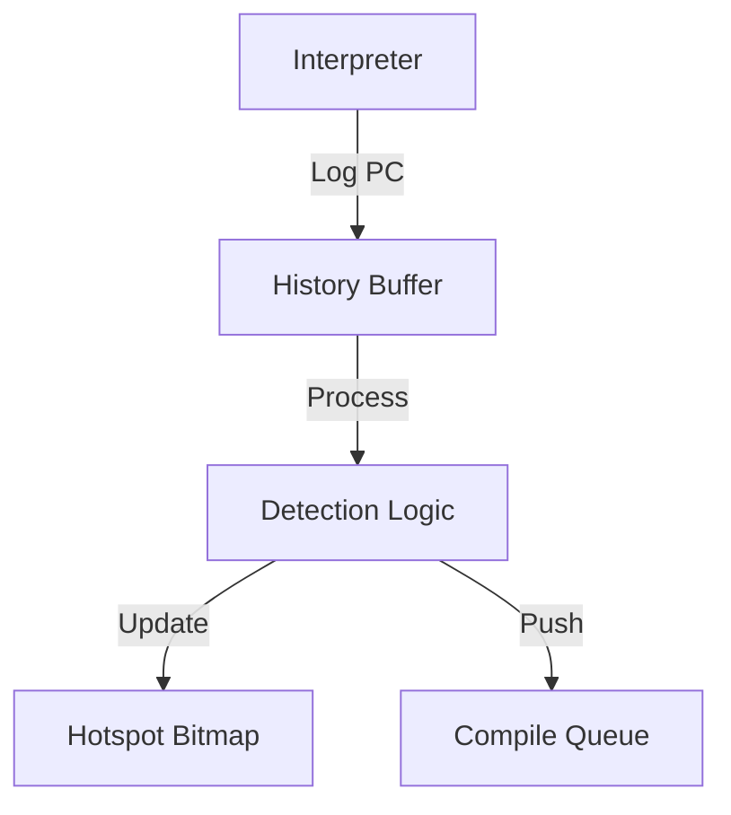
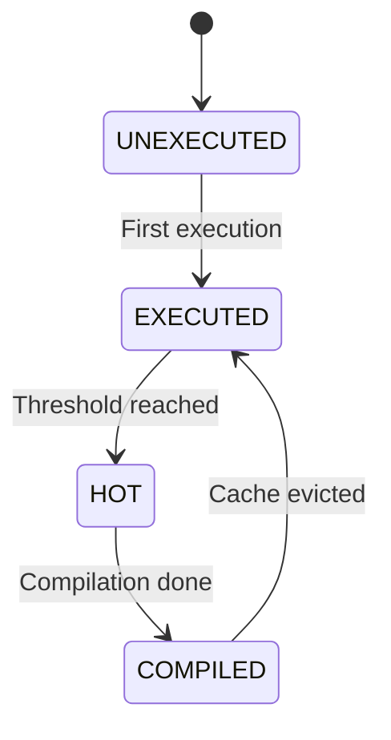

# コンポーネント設計：JIT Hotspot Detector

## 1. コンセプト
JIT Hotspot Detector は、インタープリタが実行したWASM命令の頻度を監視し、ネイティブコードへの転送（コンパイル）が必要な「ホットスポット」を特定する役割を担う。リソース制約の厳しい環境において、JITコンパイル対象を絞り込むことで、キャッシュ効率とコンパイルオーバーヘッドのバランスを最適化する。 `{LowLatencyJIT}` `{SimpleJITArchitecture}`

## 2. アーキテクチャ分類 (Tier 3: Implementation Domain)
本コンポーネントは **Tier 3 (実装ドメイン)** に属する。JITコンパイラの内部コンポーネントであり、統計情報の管理とコンパイル要否の判定に特化したアルゴリズムを実装する。 `{3TierSeparation}` `{SimpleJITArchitecture}`

## 3. 静的モデル

### 2.1 データ構造
- **Hotspot Bitmap (2-bit / Card Marking)**: WASMコード領域を一定サイズ（カード）で分割し、カード単位の実行頻度と状態を管理する。メモリ節約のため、個別のPCではなくカード単位でステータスを共有する「近似的な判定」を行う。
- **実行履歴バッファ (History Buffer)**: インタープリタのタイムスライス中に実行された命令オフセットを一時的に保持するリングバッファ。

### 2.2 内部ブロック図

### 2.3 主要なクラス・構造体・配列・定数

#### 実行履歴マップ (ホットスポット・ビットマップ)
WASM カード（領域）に対応する2ビットの状態。

| 項目名 | 機能と役割 | 備考（制約、型など） |
| :--- | :--- | :--- |
| 未実行 (0) | 一度も実行されていない初期状態。 | 初期状態 |
| 実行済 (1) | 最低一度は実行された。履歴バッファへの記録対象となる。 | |
| 頻出 (2) | 実行頻度が閾値を超え、コンパイルが必要な状態。 | キュー投入対象 |
| コンパイル完了 (3) | すでにJITコードが生成されており、ネイティブ実行が可能。 | JIT Searcherが参照 |

## 4. 動的モデル

### 3.1 アルゴリズム

#### ホットスポット判定 (履歴処理)
1. 実行権放棄（`yield`）時、または例外発生時に呼び出される。
2. 実行履歴バッファに蓄積された各命令オフセット（PC）を走査する。
3. 命令オフセットを右シフトして対応する「カード」を特定し、実行履歴マップ（ビットマップ）の状態を更新する：
   - 「未実行」 -> 「実行済」
   - 「実行済」 -> 「頻出」
4. 状態が「頻出」に遷移したカード（およびその契機となったオフセット）を「コンパイル待ち列」へ登録し、状態を「コンパイル完了」に更新する。
   - ※ 以降、このカード内の他オフセットが実行された際は、JITエントリ索引（検索側）がコンパイル済みであることを検知する。

### 3.2 状態遷移図

## 5. インターフェイス定義

### 4.1 公開API

#### `record_execution`
| 項目 | 内容 |
| :--- | :--- |
| 機能概要 | インタープリタ実行中に、現在のPCを実行履歴に記録する。 |
| 引数と役割 | `ctx`: 実行コンテキスト, `pc`: WASM 命令オフセット (PC) |
| 期待する結果 | 実行履歴バッファへの追加。 |

#### `process_history`
| 項目 | 内容 |
| :--- | :--- |
| 機能概要 | 実行履歴バッファを走査し、ビットマップの更新とコンパイル待ち列への投入を行う。 |
| 引数と役割 | `ctx`: 実行コンテキスト, `harness`: ハーネス参照 |
| 期待する結果 | ホットスポットが特定され、コンパイル待ち列に追加される。 |
| 補足 | 実行権放棄（`yield`）時に呼び出す。 |

## 6. 制約達成の方策

### 5.1 性能制約
- **方策**: 2-bitビットマップにより、高速な状態遷移とメモリ節約を両立する。

## 7. 設計完了チェックリスト
- [x] Tier 3 (Implementation Domain) に基づき設計となっているか
- [x] コンポーネントの責務が明確か
- [x] 状態遷移図が定義されているか
- [x] トラセビリティ `{LowLatencyJIT}` があるか
