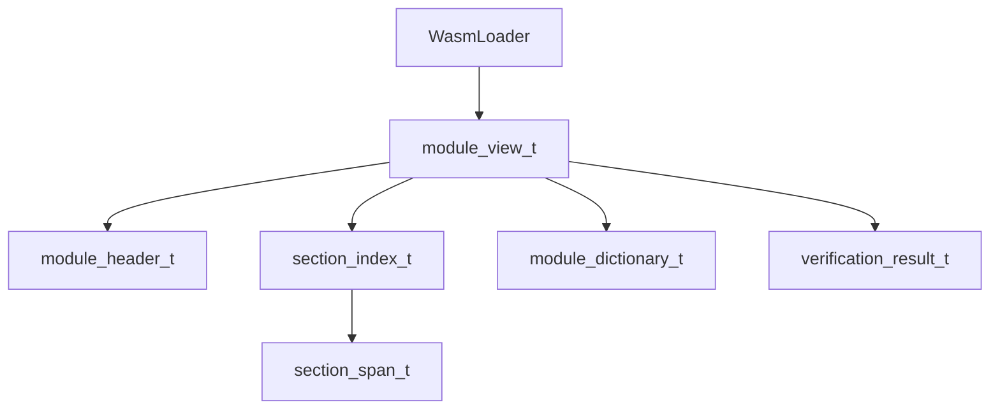
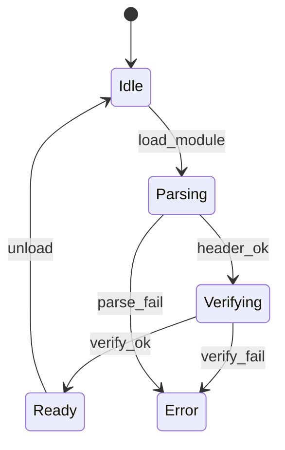

# WASMローダ コンポーネント設計書

## 1. コンセプト
WASMローダは、ROM上のWASM32バイナリをパースし、実行環境が参照しやすい索引構造（ModuleView）を生成する。RAMへの全展開を避け、ROM上のデータを直接参照することでメモリ消費を極小化する。 `{ROMParsing}` `{AccessDictionary}` `{BumpAllocator}`

## 2. 静的モデル

### 2.1 データ構造
- **module_view_t**: ROM上のバイナリへの参照と、インタープリタ向けの高速アクセス索引群を保持するルート構造体。
- **module_registry_t**: ロード済みのモジュールを名前で管理する静的辞書。 `{MultiModule_Support}`
- **section_index_t**: 各WASMセクションの開始位置とサイズを保持する索引。
- **module_dictionary_t**: 関数、型、エクスポート名などの高速検索用辞書。 `{AccessDictionary}`

### 2.2 内部ブロック図

### 2.3 主要な構造体・クラス・定数

#### `section_span_t` (セクション範囲)
ROM上のセクションの位置とサイズを定義する。

| メンバ名 | 型 | 説明 |
| :--- | :--- | :--- |
| `section_id` | `uint8_t` | WASMセクション識別子 |
| `offset` | `uint32_t` | ROM上の開始オフセット |
| `size` | `uint32_t` | ペイロードのサイズ |

#### `verification_result_t` (検証結果)
バイナリ検証の結果を保持する。 `{LightweightVerifier}`

| メンバ名 | 型 | 説明 |
| :--- | :--- | :--- |
| `is_ok` | `bool` | 検証成功フラグ |
| `error_code` | `uint8_t` | 失敗理由コード |
| `error_offset` | `uint32_t` | 失敗箇所のオフセット |

## 3. 動的モデル

### 3.1 アルゴリズム
- **バイナリパース**: ROM上のデータを `std::span` でラップし、境界チェックを行いながら順次読み取る。
- **module_view_t 構築**: 関数ボディやエクスポート名を抽出し、ソート済みインデックス付き配列として構築する。検索には二分探索を用いる。 `{AccessDictionary}`
- **依存関係解決**: インポートセクションをスキャンし、必要なモジュールが未ロードの場合は `module_reader` を介して再帰的にロードを試みる。 `{MultiModule_Support}`

### 3.2 状態遷移図

### 3.3 内部シーケンス
#### モジュールロードシーケンス

## 4. インターフェイス定義

### 4.1 公開API
| メソッド名 | 引数 | 戻り値 | 説明 | 事前条件 | 事後条件 |
| :--- | :--- | :--- | :--- | :--- | :--- |
| `load_module` | `name, binary_ptr, size` | `module_view_t*` | モジュールをロードし登録 | なし | ModuleViewが生成・登録される |
| `find_module` | `name` | `module_view_t*` | 登録済みモジュールを検索 | なし | 見つかればポインタを返す |
| `get_section` | `module_view, id` | `section_span_t` | セクション範囲を取得 | ロード済み | 指定セクションの範囲 |
| `lookup_export` | `module_view, name` | `uint32_t` | エクスポートを検索 | ロード済み | 関数インデックス等 |
| `set_module_reader` | `reader_fn` | `void` | モジュール読み込み関数を設定 | なし | コールバックが登録される |

### 4.2 URI/IPCインターフェイス
本コンポーネントは vSoC 内部で使用されるライブラリであり、直接のIPCインターフェイスは持たない。

## 5. 制約達成の方策

### 5.1 性能制約と方策
- **目標**: モジュールロード時間を最小化する。
- **方策**: `{ROMParsing}` `{AccessDictionary}` RAMへのコピーを排除し、主要な要素を索引化することで、実行時の探索コストを抑える。

### 5.2 メモリ制約と方策
- **目標**: ロード時のRAM消費を極小化する。
- **方策**: `{BumpAllocator}` `{NoStdVector}` バンプアロケータを使用し、断片化を防止しつつ、固定長配列による索引管理を行う。

### 5.3 安全性制約と方策
- **目標**: 不正なWASMバイナリによるクラッシュを防止する。
- **方策**: `{LightweightVerifier}` `{Wasm32Only}` ロード時にマジック値、バージョン、セクション境界の整合性を検証し、不正なバイナリを拒否する。

## 6. 設計完了チェックリスト（網羅性確認）
- [x] コンポーネントの責務が明確に定義されているか
- [x] 内部設計（データ構造、ブロック図、クラス、アルゴリズム）が適切に定義されているか
- [x] 内部ブロック図（静的）とシーケンス/状態遷移図（動的）がセットで定義されているか
- [x] 公開APIのメソッド名が英語で記述され、事前/事後条件が明確か
- [x] 非機能制約（性能、メモリ、安全性）に対する具体的な方策が明示されているか
- [x] 設計の交差点（トレードオフ）が解消されているか
- [x] 上位の要求 `{Keyword}` とのトレーサビリティが確保されているか
