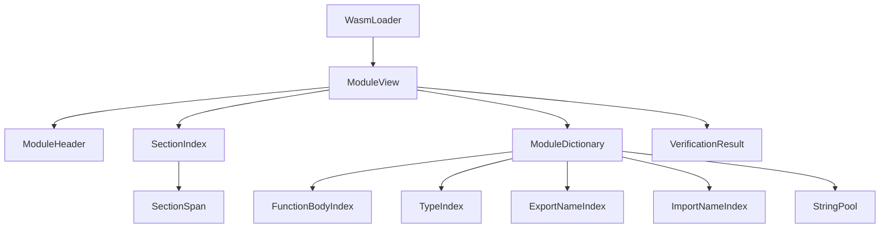

# wasmローダ

## コンセプト

wasmローダは、ROM上のwasm32バイナリをパースし、インタープリタおよびランタイムAPIが参照しやすい**モジュール参照構造**を生成する。RAMへ全展開は行わず、バイナリへのアクセスは`std::span`で境界を定義した上で行う。ローダ用メモリはモジュール破棄まで解放されないため、バンプアロケータを用いる。`{BumpAllocator}` `{ConfigurableSystem}` `{MemoryIsolation}`

目的:
- ROM上のwasm32バイナリを**オフセット参照**で扱う。`{ROMParsing}`
- 主要セクションの境界を索引化し、アクセスを効率化する**辞書**を保持する。`{AccessDictionary}`
- 簡易ベリファイアの検証結果を保持し、実行前チェックを明確化する。`{LightweightVerifier}`

導出元:
- wasmローダの要件: [`docs/oders/components/runtime.md`](docs/oders/components/runtime.md:1)
- ヒープ分割: [`docs/oders/architecture/overview.md`](docs/oders/architecture/overview.md:57)
- 設定方式: [`docs/oders/requires/list.md`](docs/oders/requires/list.md:59)
- バイナリアクセス指針: [`docs/oders/patterns/stdlib.md`](docs/oders/patterns/stdlib.md:28)

### 用語

- **ModuleView**: ROM上のバイナリを参照する読み取り専用ビュー。
- **SectionSpan**: セクションのオフセットと長さを保持する範囲情報。
- **SectionIndex**: 主要セクションの索引。
- **ModuleDictionary**: アクセス効率化のための付加索引群。
- **VerificationResult**: 簡易検証の結果とエラー理由。

## 構成要素

wasmローダは以下の5つの構成要素で構成される。

### 1. ModuleHeader

**責務**: バイナリ種別とバージョンの識別、参照範囲の提示

**機能**:
- `magic`: `\0asm` のマジック値を保持
- `version`: wasmバージョンを保持
- `binary_span`: バイナリ全体の`std::span`を保持

**実装方式**:
- 参照のみ保持し、ROM上のバイナリはコピーしない

| 項目 | 説明 | 導出元 |
|---|---|---|
| magic | `\0asm` のマジック値 | wasm32必須: [`docs/oders/components/runtime.md`](docs/oders/components/runtime.md:9) |
| version | wasmバージョン | wasm32必須: [`docs/oders/components/runtime.md`](docs/oders/components/runtime.md:9) |
| binary_span | バイナリ全体の`std::span` | バイナリアクセス: [`docs/oders/patterns/stdlib.md`](docs/oders/patterns/stdlib.md:28) |

**導出元**: `{ROMParsing}` - ROM上のwasm32バイナリをオフセット参照で扱う。

### 2. SectionSpan

**責務**: セクションの位置とサイズを保持し、境界付き参照を提供

**機能**:
- `section_id`: wasmセクション識別子の保持
- `offset`, `size`: ROM上の開始位置とペイロード長の保持
- `payload_span`: ペイロード範囲の`std::span`提供

**実装方式**:
- オフセットとサイズのみ保持し、ROM上のデータを参照する

| 項目 | 説明 | 導出元 |
|---|---|---|
| section_id | wasmセクション識別子 | wasm32必須: [`docs/oders/components/runtime.md`](docs/oders/components/runtime.md:9) |
| offset | ROM上の開始位置 | ROMパース: [`docs/oders/components/runtime.md`](docs/oders/components/runtime.md:20) |
| size | ペイロード長 | ROMパース: [`docs/oders/components/runtime.md`](docs/oders/components/runtime.md:20) |
| payload_span | `std::span`で定義したペイロード | バイナリアクセス: [`docs/oders/patterns/stdlib.md`](docs/oders/patterns/stdlib.md:28) |

**導出元**: `{ROMParsing}` - ROM上のバイナリをパースする。

### 3. SectionIndex

**責務**: 主要セクションの境界を索引化し、参照を高速化

**機能**:
- 主要セクションを順序付きで保持
- 存在しないセクションは空`span`を保持

**実装方式**:
- wasmバイナリの登場順に一致させた固定長構造

| 項目 | 説明 | 導出元 |
|---|---|---|
| type | 型セクションの`SectionSpan` | wasm32必須: [`docs/oders/components/runtime.md`](docs/oders/components/runtime.md:9) |
| import | importセクションの`SectionSpan` | wasm32必須: [`docs/oders/components/runtime.md`](docs/oders/components/runtime.md:9) |
| function | functionセクションの`SectionSpan` | wasm32必須: [`docs/oders/components/runtime.md`](docs/oders/components/runtime.md:9) |
| table | tableセクションの`SectionSpan` | wasm32必須: [`docs/oders/components/runtime.md`](docs/oders/components/runtime.md:9) |
| memory | memoryセクションの`SectionSpan` | wasm32必須: [`docs/oders/components/runtime.md`](docs/oders/components/runtime.md:9) |
| global | globalセクションの`SectionSpan` | wasm32必須: [`docs/oders/components/runtime.md`](docs/oders/components/runtime.md:9) |
| export | exportセクションの`SectionSpan` | wasm32必須: [`docs/oders/components/runtime.md`](docs/oders/components/runtime.md:9) |
| start | startセクションの`SectionSpan` | wasm32必須: [`docs/oders/components/runtime.md`](docs/oders/components/runtime.md:9) |
| element | elementセクションの`SectionSpan` | wasm32必須: [`docs/oders/components/runtime.md`](docs/oders/components/runtime.md:9) |
| code | codeセクションの`SectionSpan` | wasm32必須: [`docs/oders/components/runtime.md`](docs/oders/components/runtime.md:9) |
| data | dataセクションの`SectionSpan` | wasm32必須: [`docs/oders/components/runtime.md`](docs/oders/components/runtime.md:9) |
| custom | customセクションの`SectionSpan` | ROMパース: [`docs/oders/components/runtime.md`](docs/oders/components/runtime.md:20) |

**導出元**: `{AccessDictionary}` - 主要セクションの境界を索引化する。

### 4. ModuleDictionary

**責務**: ROM上のアクセスを効率化するための辞書群を提供

**機能**:
- 関数ボディ、型、export/import名の参照を高速化
- 文字列プールによる名前解決の共通化

**実装方式**:
- 全てバンプアロケータから確保し、`std::array`と`std::span`で管理する。`{AccessDictionary}` `{BumpAllocator}`
- 辞書の検索は [`docs/oders/patterns/stdlib.md`](docs/oders/patterns/stdlib.md:37) の**ソート済みインデックス付き配列**による二分探索（`std::lower_bound`）を用いる。

| 辞書 | 目的 | 格納内容 | 導出元 |
|---|---|---|---|
| function_body_index | 関数ボディのランダムアクセス | `funcidx -> SectionSpan` | ROMパース: [`docs/oders/components/runtime.md`](docs/oders/components/runtime.md:20) |
| type_index | 関数型の参照を高速化 | `typeidx -> SectionSpan` | wasm32必須: [`docs/oders/components/runtime.md`](docs/oders/components/runtime.md:9) |
| export_name_index | export名から対象を参照 | `name_offset -> export_entry` | 辞書保持: [`docs/oders/components/runtime.md`](docs/oders/components/runtime.md:20) |
| import_name_index | import名から対象を参照 | `name_offset -> import_entry` | 辞書保持: [`docs/oders/components/runtime.md`](docs/oders/components/runtime.md:20) |
| string_pool | 文字列の集約領域 | NULL終端連結の文字列群 | 辞書保持: [`docs/oders/components/runtime.md`](docs/oders/components/runtime.md:20) |

補足:
- `name_offset`は`string_pool`内のオフセット。
- 文字列コピーは行わず、ROMの範囲を`string_pool`として扱う設計を優先する。

**導出元**: `{AccessDictionary}` - ROM上のアクセスを効率化するための辞書を保持する。

### 5. VerificationResult

**責務**: 簡易ベリファイアの検証結果を保持

**機能**:
- バイナリ検証の成否と失敗位置を記録
- 検証済みセクションの範囲を記録

**実装方式**:
- 仕様は最小限とし、詳細な命令検証は行わない。`{LightweightVerifier}`

| 項目 | 説明 | 導出元 |
|---|---|---|
| ok | 検証成功フラグ | 簡易検証: [`docs/oders/components/runtime.md`](docs/oders/components/runtime.md:21) |
| error_code | 失敗理由（例: magic不一致、範囲外アクセス） | 簡易検証: [`docs/oders/components/runtime.md`](docs/oders/components/runtime.md:21) |
| error_offset | 失敗位置のROMオフセット | 簡易検証: [`docs/oders/components/runtime.md`](docs/oders/components/runtime.md:21) |
| verified_sections | どのセクションを検証したかのビット集合 | wasm32必須: [`docs/oders/components/runtime.md`](docs/oders/components/runtime.md:9) |

**導出元**: `{LightweightVerifier}` - 簡易ベリファイアの検証結果を保持する。

### 構成要素間の依存関係

## 提供する機能

| 機能 | 説明 | 導出元 |
|------|------|--------|
| **ROMオフセット参照** | ROM上のバイナリを`std::span`で境界付き参照し、RAM展開を行わない。`{ROMParsing}` | [`docs/oders/components/runtime.md`](docs/oders/components/runtime.md:20) - ROM上でパースする |
| **セクション索引化** | 主要セクションの境界を索引化し、高速にアクセスする。`{AccessDictionary}` | [`docs/oders/components/runtime.md`](docs/oders/components/runtime.md:20) - アクセスを効率化するための辞書 |
| **名前解決辞書** | export/import名や型参照を辞書で高速化する。`{AccessDictionary}` | [`docs/oders/components/runtime.md`](docs/oders/components/runtime.md:20) - 辞書保持 |
| **簡易ベリファイア結果保持** | バイナリ検証の成否と位置を保持する。`{LightweightVerifier}` | [`docs/oders/components/runtime.md`](docs/oders/components/runtime.md:21) - 簡易検証 |

## インターフェイス

### モジュール参照構造

- `ModuleView` から `ModuleHeader` / `SectionIndex` / `ModuleDictionary` / `VerificationResult` を参照できる。
- `SectionSpan` は各セクションの境界付き`std::span`を提供する。

### データ構造の関係

## 機能制約達成のための方策

### ROMパースと参照方式

- バイナリへのアクセスは`std::span`で境界を定義し、ROMを直接参照する。`{ROMParsing}`
- RAMへの全展開は行わない。

### 辞書の検索方式

- 辞書検索は**ソート済みインデックス付き配列**の二分探索（`std::lower_bound`）を用いる。`{AccessDictionary}`
- 文字列コピーは行わず、ROMの範囲を`string_pool`として扱う設計を優先する。

### 簡易ベリファイア

- 詳細な命令検証は行わず、必要最低限の検証結果を保持する。`{LightweightVerifier}`

## 非機能制約達成のための方策

### 性能制約と方策

| 制約 | 方策 | 導出元 |
|------|------|--------|
| **アクセス効率** | セクション索引と辞書を用いてROM参照を高速化する。`{AccessDictionary}` | [`docs/oders/components/runtime.md`](docs/oders/components/runtime.md:20) - 辞書保持 |
| **検索効率** | ソート済みインデックス付き配列の二分探索を採用する。`{AccessDictionary}` | [`docs/oders/patterns/stdlib.md`](docs/oders/patterns/stdlib.md:37) - 二分探索 |

### メモリ制約と方策

| 制約 | 方策 | 導出元 |
|------|------|--------|
| **ヒープ隔離** | ローダ用メモリは**WASMランタイムヒープ**から確保し、他タスクと隔離する。`{IndependentHeap}` | [`docs/oders/architecture/overview.md`](docs/oders/architecture/overview.md:57) - ヒープ分割 |
| **解放タイミング** | モジュール破棄まで解放されないため、バンプアロケータを用いる。`{BumpAllocator}` | [`docs/oders/patterns/stdlib.md`](docs/oders/patterns/stdlib.md:48) - バンプアロケータ |
| **固定長管理** | 配列は`std::array`と`std::span`で固定長管理する。`{NoStdVector}` | [`docs/oders/patterns/stdlib.md`](docs/oders/patterns/stdlib.md:32) - std::vector禁止 |

### 安全性制約と方策

| 制約 | 方策 | 導出元 |
|------|------|--------|
| **簡易検証** | magic不一致や範囲外アクセスを検知し、検証結果を保持する。`{LightweightVerifier}` | [`docs/oders/components/runtime.md`](docs/oders/components/runtime.md:21) - 簡易検証 |
| **対象限定** | wasm32のみを対象とし、浮動小数点命令は実装しない。`{Wasm32Only}` | [`docs/oders/components/runtime.md`](docs/oders/components/runtime.md:9) - wasm32限定 |

### 仕様上の前提

- wasm32のみを対象とする。浮動小数点命令は実装しない。`{Wasm32Only}`
- 具体的な命令セットはclang出力に基づく別リストで定義する。`{InstructionSubsetFromClang}`

導出元:
- wasm32限定: [`docs/oders/components/runtime.md`](docs/oders/components/runtime.md:9)
- 命令セット導出: [`docs/oders/components/runtime.md`](docs/oders/components/runtime.md:12)
