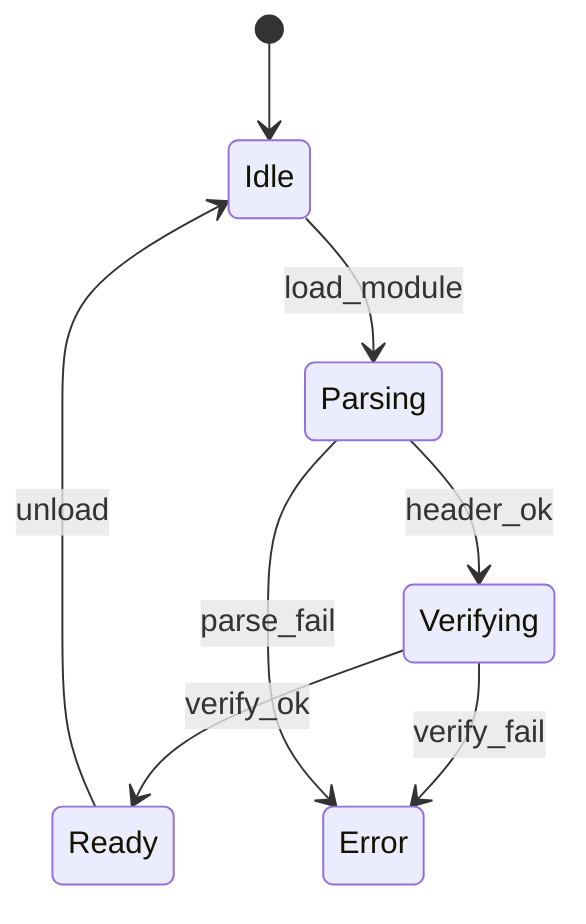
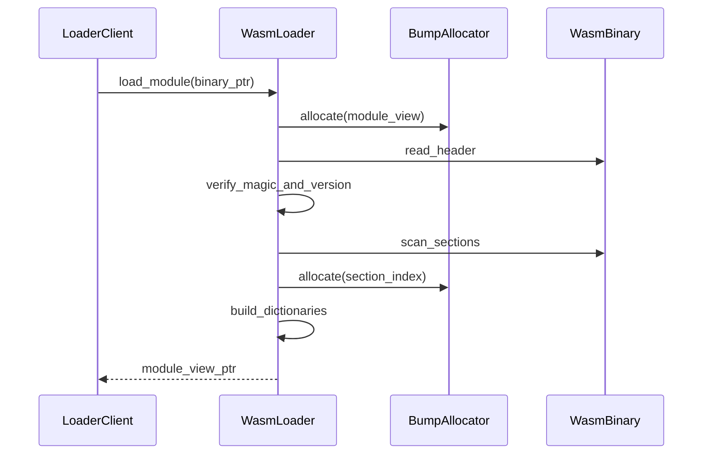

# WASMローダ コンポーネント設計書

## 1. コンセプト
WASMローダは、ROM上のWASM32バイナリをパースし、実行環境が参照しやすい索引構造（ModuleView）を生成する。RAMへの全展開を避け、ROM上のデータを直接参照することでメモリ消費を極小化する。 `{ROMParsing}` `{AccessDictionary}` `{BumpAllocator}`

## 2. 静的モデル

### 2.1 データ構造
- **module_view**: ROM上のバイナリへの参照と、インタープリタ向けの高速アクセス索引群を保持するルート構造体。
- **module_registry**: ロード済みのモジュールを名前で管理する静的辞書。 `{MultiModule_Support}`
- **section_index**: 各WASMセクションの開始位置とサイズを保持する索引。
- **module_dictionary**: 関数、型、エクスポート名などの高速検索用辞書。 `{AccessDictionary}`

### 2.2 内部ブロック図

### 2.3 主要なクラス・構造体・配列・定数

#### `section_span` (セクション範囲)
ROM上のセクションの範囲を定義する。

| 構成項目 | 機能と役割 | 備考（制約、型など） |
| :--- | :--- | :--- |
| `section_id` | WASM仕様に基づいたセクション識別子（Code, Data, Export等）。 | 8bitインデックス |
| `span` | ROM上の開始オフセットとサイズを抽象化したデータ範囲。 | ポインタ+サイズ (std::span相当) |

#### `verification_result` (検証結果)
バイナリ検証の結果と、不備があった場合の情報を保持する。 `{LightweightVerifier}`

| 構成項目 | 機能と役割 | 備考（制約、型など） |
| :--- | :--- | :--- |
| `is_ok` | 検証がすべてパスしたかどうかを示すフラグ。 | ブール値 |
| `error_span` | 検証が失敗したバイナリ上の位置と範囲。デバッグ用。 | データ範囲 |

## 3. 動的モデル

### 3.1 アルゴリズム
- **バイナリパース**: ROM上のデータを `std::span` でラップし、境界チェックを行いながら順次読み取る。
- **module_view 構築**: 関数ボディやエクスポート名を抽出し、ソート済みインデックス付き配列として構築する。検索には二分探索を用いる。 `{AccessDictionary}`
- **依存関係解決**: インポートセクションをスキャンし、必要なモジュールが未ロードの場合は `module_reader` を介して再帰的にロードを試みる。 `{MultiModule_Support}`

### 3.2 状態遷移図

### 3.3 内部シーケンス
#### モジュールロードシーケンス

## 4. インターフェイス定義

### 4.1 公開API
外部から利用可能なオブジェクト指向APIを定義する。

#### モジュールのロード
| 項目 | 内容 |
| :--- | :--- |
| 機能概要 | ROM上のWASMバイナリをパースし、システムに登録して実行可能なビューを取得する。 |
| 引数と役割 | `name`: 登録名, `binary_ptr`: バイナリ先頭, `size`: データサイズ。 |
| 期待する結果 | 正常：索引構築済みの `module_view` ポインタ。異常：NULL（検証失敗時）。 |
| 事前条件 | 与えられたメモリ範囲が有効であること。 |
| 事後条件 | 内部のモジュールレジストリに登録され、他からの参照が可能になる。 |
| 不変条件 | ROM上のバイナリデータが変更されないこと（読み取り専用）。 |
| エラー時の挙動 | マジック値やバージョンが不正確な場合は即座に中断し、エラーを記録する。 |
| 補足 | メモリ節約のため、コードセクション自体は展開せずROMを直接指し示す。 |

#### モジュールの検索
| 項目 | 内容 |
| :--- | :--- |
| 機能概要 | 登録済みのモジュールを名前で検索し、そのビューを取得する。 |
| 引数と役割 | `name`: 検索するモジュール名。 |
| 期待する結果 | 正常：該当するビューのポインタ。異常：NULL。 |
| 事前条件 | なし。 |
| 事後条件 | なし。 |
| 不変条件 | なし。 |
| エラー時の挙動 | 未登録の場合はNULLを返す。 |
| 補足 | 動的リンク（Import解決）時に主に使用される。 |

#### セクションの取得
| 項目 | 内容 |
| :--- | :--- |
| 機能概要 | 指定されたモジュール内の特定のWASMセクションの範囲情報を取得する。 |
| 引数と役割 | `view`: モジュールビュー, `id`: セクション識別子。 |
| 期待する結果 | 正常：ROM上の範囲を示す `section_span`。 |
| 事前条件 | `view` が有効、かつロード済みであること。 |
| 事後条件 | なし。 |
| 不変条件 | 範囲外アクセスが発生しないこと。 |
| エラー時の挙動 | 存在しないセクションの場合はサイズ0の範囲を返す。 |
| 補足 | インタープリタやJITが命令を読み出す際に使用する。 |

#### エクスポートの検索 (Lookup)
| 項目 | 内容 |
| :--- | :--- |
| 機能概要 | モジュールが公開している関数やグローバル変数を名前で検索し、そのインデックスを取得する。 |
| 引数と役割 | `view`: モジュールビュー, `name`: エクスポート名。 |
| 期待する結果 | 正常：WASMインデックス値。異常：エラーID。 |
| 事前条件 | `view` のエクスポート辞書が構築済みであること。 |
| 事後条件 | なし。 |
| 不変条件 | 検索は `constexpr` に準じた高速な方式で行われること。 |
| エラー時の挙動 | 見つからない場合は無効値を返す。 |
| 補足 | 二分探索により O(log N) の性能を実現する。 |

### 4.2 URI/IPCインターフェイス
本コンポーネントは vSoC 内部で使用されるライブラリであり、直接のIPCインターフェイスは持たない。

## 5. 制約達成の方策

### 5.1 性能制約と方策
- **目標**: モジュールロード時間を最小化する。
- **方策**: `{ROMParsing}` `{AccessDictionary}` RAMへのコピーを排除し、主要な要素を索引化することで、実行時の探索コストを抑える。

### 5.2 メモリ制約と方策
- **目標**: ロード時のRAM消費を極小化する。
- **方策**: `{BumpAllocator}` `{NoStdVector}` バンプアロケータを使用し、断片化を防止しつつ、固定長配列による索引管理を行う。

### 5.3 安全性制約と方策
- **目標**: 不正なWASMバイナリによるクラッシュを防止する。
- **方策**: `{LightweightVerifier}` `{Wasm32Only}` ロード時にマジック値、バージョン、セクション境界の整合性を検証し、不正なバイナリを拒否する。

## 6. 設計完了チェックリスト（網羅性確認）
- [x] コンポーネントの責務が明確に定義されているか
- [x] 内部設計（データ構造、ブロック図、クラス、アルゴリズム）が適切に定義されているか
- [x] 内部ブロック図（静的）とシーケンス/状態遷移図（動的）がセットで定義されているか
- [x] 公開APIのメソッド名が英語で記述され、事前/事後条件が明確か
- [x] 非機能制約（性能、メモリ、安全性）に対する具体的な方策が明示されているか
- [x] 設計の交差点（トレードオフ）が解消されているか
- [x] 上位の要求 `{Keyword}` とのトレーサビリティが確保されているか
