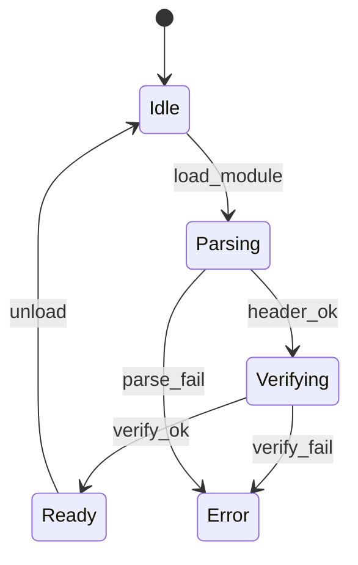
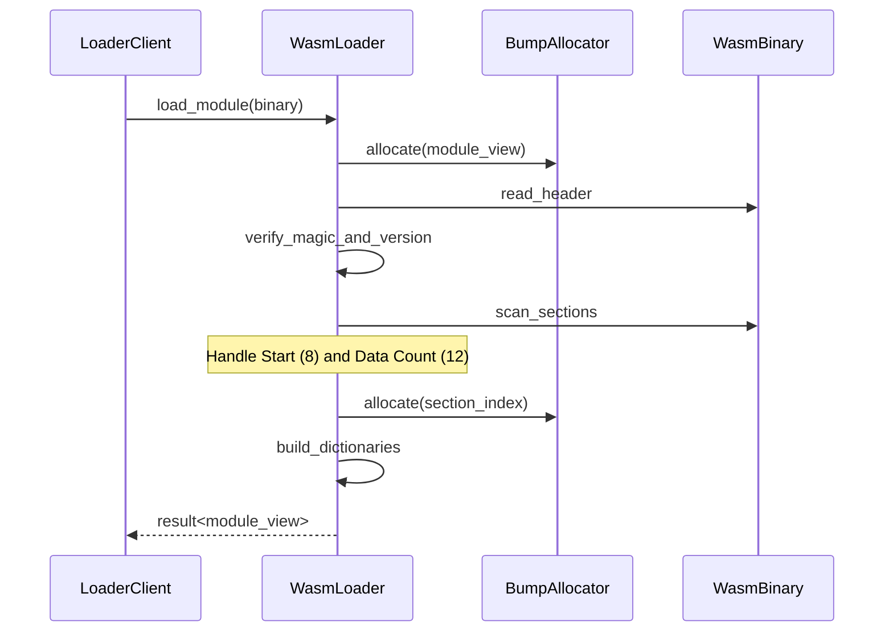

# WASMローダ コンポーネント設計書

## 1. コンセプト
WASMローダは、ROM上のWASM32バイナリをパースし、実行環境が参照しやすい索引構造（ModuleView）を生成する。RAMへの全展開を避け、ROM上のデータを直接参照することでメモリ消費を極小化する。 `{ROMParsing}` `{AccessDictionary}` `{BumpAllocator}`

## 2. アーキテクチャ分類 (Tier 3: Implementation Domain)
本コンポーネントは **Tier 3 (実装ドメイン)** に属する。WASMバイナリの解析と索引構築に特化した単一責務のモジュールとして設計する。 `{3TierSeparation}`

## 3. 静的モデル

### 3.1 データ構造 (Natural OO)
- **`WasmLoader` (Class)**: WASMバイナリのパース、検証、およびロード済みモジュールの管理を一括して行う主要クラス。
- **`module_view` (View)**: ROM上のバイナリデータへの参照と、構築された索引群を保持する読み取り専用の構造体。
- **`module_registry` (Internal)**: ロード済みの `module_view` を名前で管理するための内部リスト。 `{MultiModule_Support}`

### 3.2 内部ブロック図
```mermaid
    subgraph Loader_Layer
        Loader[WasmLoader Engine]
        Registry[Internal Registry]
    end

    subgraph Memory
        ROM[Wasm ROM Binary]
        Alloc[bump_allocator]
    end

    Loader -- holds reference --> Alloc
    Loader -- manages --> Registry
    Registry -- holds --> View[module_view]
    View -- refers to --> ROM
```

### 3.3 主要なクラス・構造体・配列・定数

#### `WasmLoader` クラス
依存関係（アロケータ等）と内部レジストリをカプセル化する。

| 項目名 | 機能と役割 | 型分類 | サイズ・制約 |
| :--- | :--- | :--- | :--- |
| 作業用アロケータ | 索引構築時のメモリ割り当てに使用する（プライベートメンバ） | 構造体への参照 | [`bump_allocator`](stdlib.md) (非所有) |
| モジュール索引 | ロード済みモジュールを名前で引くための内部管理リスト | アクセス辞書 | `module_registry` |

#### `module_view` (モジュールビュー)
ROM上のバイナリデータに対する「窓」として機能する。
データをRAM上に展開するのではなく、必要な時に必要な情報へアクセスするためのアクセサを提供する。

| 項目名 | 機能と役割 | 型分類 | 備考 |
| :--- | :--- | :--- | :--- |
| バイナリ参照 | ROM上のWASMバイナリ全体への参照 | `std::span` | - |
| セクション索引 | 各セクション（Type, Code等）の開始位置とサイズ | 配列 | 検索高速化用 |
| スタート関数 | 起動時に自動実行される関数のインデックス | オプショナル値 | Section ID 8 |
| データセグメント数 | Data Section に含まれるセグメントの数 | オプショナル値 | Section ID 12 (Data Count) |

これらにより、RAM消費を最小限（オフセット配列のみ）に抑えつつ、クライアントに対しては型安全なインターフェイスを提供する。 `{ROMParsing}`

#### `function_accessor` (関数アクセサ)
関数の詳細情報へアクセスするための一時的なプロキシオブジェクト。
メソッド呼び出し時にROM上のデータをデコードして値を返す。

| 項目名（プロパティ） | 機能と役割 | 型分類 | サイズ・制約 |
| :--- | :--- | :--- | :--- |
| シグネチャ索引 | 関数の型定義へのインデックス | デコードメソッド | 戻り値: 関数インデックス |
| ローカル変数定義 | 関数のローカル変数定義のイテレータ | デコードメソッド | 戻り値: `local_iterator` |
| コード開始点 | 関数の実行本体（バイトコード）の開始位置 | デコードメソッド | 戻り値: オフセット |
| コード長 | 命令列全体のバイトサイズ | デコードメソッド | 戻り値: バイト数 |

#### `global_accessor` (グローバルアクセサ)
グローバル変数の定義情報へアクセスするための一時的なプロキシオブジェクト。

| 項目名（プロパティ） | 機能と役割 | 型分類 | サイズ・制約 |
| :--- | :--- | :--- | :--- |
| データ型 | グローバル変数の値の種類 | デコードメソッド | 戻り値: `wasm_type` |
| 書き込み可否 | 実行中に値を変更可能かどうかを示す | デコードメソッド | 戻り値: ブール値 |
| 初期化定数 | 起動時に設定される初期値 | デコードメソッド | 戻り値: `wasm_value` |

#### `verification_result` (検証結果)
バイナリ検証の結果と、不備があった場合の情報を保持する。 `{LightweightVerifier}`

| 項目名 | 機能と役割 | 型分類 | サイズ・制約 |
| :--- | :--- | :--- | :--- |
| 検証成功フラグ | すべての形式・意味検証をパスしたか | ブール値 | - |
| 異常箇所特定 | 検証失敗時のバイナリ内オフセットと範囲 | データ範囲 | `std::span<const uint8_t>` |

## 4. 動的モデル

### 4.1 アルゴリズム
- **バイナリパース**: ROM上のデータを `binary_view` でラップし、境界チェックを行いながら順次読み取る。
- **module_view 構築**: 関数ボディやエクスポート名を抽出し、ソート済みインデックス付き配列として構築する。検索には二分探索を用いる。 `{AccessDictionary}`
- **依存関係解決**: インポートセクションをスキャンし、必要なモジュールが未ロードの場合は `module_registry` を介して再帰的にロードを試みる。 `{MultiModule_Support}`

### 4.2 状態遷移図


### 4.3 内部シーケンス
#### モジュールロードシーケンス


## 5. インターフェイス定義

### 5.1 公開API
外部から利用可能なオブジェクト指向APIを定義する。

#### `load`

| 項目 | 内容 |
| :--- | :--- |
| 機能概要 | ROM上のWASMバイナリをパースし、内部レジストリに登録してビューを取得する。 |
| シグネチャ | `load(binary: バイナリビュー) -> 結果型` |
| 引数 | `binary`: WASMバイナリデータ (ROM直接参照) |
| 戻り値 | 結果型 (成功時は `module_view` への参照、失敗時はエラー情報) |
| 事前条件 | システムが初期化済みであること。 |
| 事後条件 | 成功時、内部レジストリにモジュールが登録される。 |
| エラー時の挙動 | 不正なバイナリの場合はロードを拒否し、エラーを返す。 |

#### `lookup`

| 項目 | 内容 |
| :--- | :--- |
| 機能概要 | 登録済みのモジュールを名前で検索し、そのビューを取得する。 |
| シグネチャ | `lookup(name: 文字列ビュー) -> オプショナル値` |
| 引数 | `name`: 検索するモジュール名 |
| 戻り値 | オプショナル値 (成功時は `module_view` への参照、失敗時は空) |

#### `get_section`

| 項目 | 内容 |
| :--- | :--- |
| 機能概要 | 指定されたモジュール内の特定のWASMセクションの範囲情報を取得する。 |
| シグネチャ | `get_section(view: const参照, id: セクションID) -> バイナリビュー` |
| 引数 | `view`: モジュールビュー (`module_view`) への読取専用参照<br>`id`: セクション識別子 (uint8_t) |
| 戻り値 | バイナリビュー (該当セクションのROM上の範囲、存在しない場合は空) |
| 事前条件 | `view` が有効、かつロード済みであること。 |
| 不変条件 | 範囲外アクセスが発生しないこと。 |
| 補足 | インタープリタやJITが命令を読み出す際に使用する。 |

#### `lookup_export`

| 項目 | 内容 |
| :--- | :--- |
| 機能概要 | モジュールが公開している関数やグローバル変数を名前で検索し、そのインデックスを取得する。 |
| シグネチャ | `lookup_export(view: const参照, name: 文字列ビュー) -> オプショナル値` |
| 引数 | `view`: モジュールビュー (`module_view`) への読取専用参照<br>`name`: エクスポート名 |
| 戻り値 | オプショナル値 (成功時はWASMインデックス、失敗時は空) |
| 不変条件 | 検索は二分探索により O(log N) で行われること。 |

### 5.2 URI/IPCインターフェイス
本コンポーネントは vSoC 内部で使用されるライブラリであり、直接のIPCインターフェイスは持たない。

## 6. 制約達成の方策

### 6.1 性能制約と方策
- **目標**: モジュールロード時間を最小化する。
- **方策**: `{ROMParsing}` `{AccessDictionary}` RAMへのコピーを排除し、主要な要素を索引化することで、実行時の探索コストを抑える。

### 6.2 メモリ制約と方策
- **目標**: ロード時のRAM消費を極小化する。
- **方策**: `{BumpAllocator}` `{NoStdVector}` バンプアロケータを使用し、断片化を防止しつつ、固定長配列による索引管理を行う。

### 6.3 安全性制約と方策
- **目標**: 不正なWASMバイナリによるクラッシュを防止する。
- **方策**: `{LightweightVerifier}` `{Wasm32Only}` ロード時にマジック値、バージョン、セクション境界の整合性を検証し、不正なバイナリを拒否する。

## 7. 設計完了チェックリスト（網羅性確認）
- [x] Tier 3 (Implementation Domain) に基づき設計となっているか
- [x] ローダの責務が明確に定義されているか
- [x] コンポーネントの責務が明確に定義されているか
- [x] 内部設計（データ構造、ブロック図、クラス、アルゴリズム）が適切に定義されているか
- [x] 内部ブロック図（静的）とシーケンス/状態遷移図（動的）がセットで定義されているか
- [x] 公開APIのメソッド名が英語で記述され、事前/事後条件が明確か
- [x] 非機能制約（性能、メモリ、安全性）に対する具体的な方策が明示されているか
- [x] 設計の交差点（トレードオフ）が解消されているか
- [x] 上位の要求 `{Keyword}` とのトレーサビリティが確保されているか
